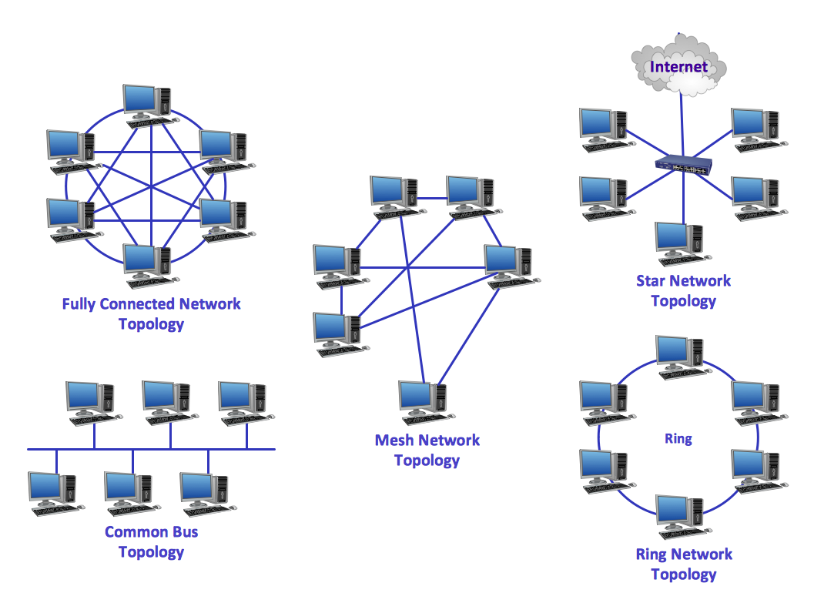
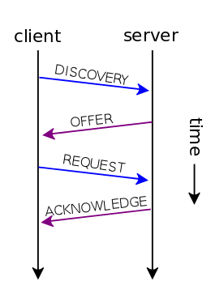
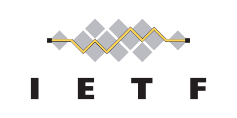
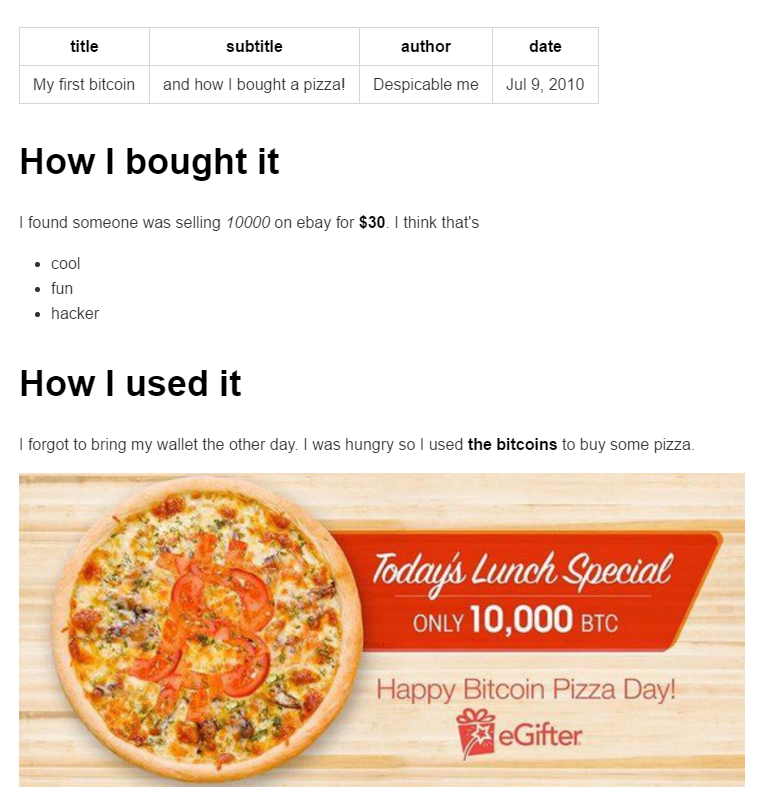

```{r setup, include=FALSE}
library(tidyverse)
library(shiny)
knitr::opts_chunk$set(echo = FALSE, fig.align="center", collapse = TRUE)
chunk <- "```"
inline <- function(x = "") paste0("`` `r ", x, "` ``")
```

# Where does this course stands on?
* It's about "Data science"
- Data -> Model -> Application

```{r, echo = FALSE, out.width = "75%"}
knitr::include_graphics("imgs/data-science-explore.png")
```

# Where does this course stands on? (updated in 2018)
New version in 2018.

```{r, echo = FALSE, out.width = "100%"}

```

# Where does this course stands on?
- TidyVerse with a finance flavour
- Reference book

```{r, echo = FALSE, out.width = "60%"}

```

# Where does this course stands on?
- Our course

```{r, echo = FALSE, out.width = "60%"}

```

# Objective
1. Know the way of Internet: the network, the cloud and the application.
2. Use data manipulation and data visualization to do exploratory data analysis.
3. To do option valuation, and trading strategy performance analysis.
4. Build real-world data-driven reports and dashboard, data visualization.
5. Latest technology in cryptocurrency and payment system like Bitcoin and Blockchain.

# What does it take?
* Programming is our tool
    - Intermidiate level R
    - R is a system that has been designed to process data.
    - Use R in other MFE courses
    - Later in career you will learn Python, Julia, Hadoop. The principle and idea is the same.
      Since you have practiced the full pipeline, easier to master the idea.
* Take a habit of good analyst - Use notebook-style research, reproducible
* Take a mind of data exploration
* Take a mind of analysis - answer is not fixed but open-ended. You need to draw conclusion and make suggestion.
* Take a mind of strategy thinking

# Course Outline: Week 1-3
- Week 1:
    * What's Internet? What's Web?
    * Launch into the Cloud: AWS
    * R Markdown and Shiny/1: layout
- Week 2:
    * Intermediate R Programming
    * Shiny/2: R Web Framework
    * Data Manipulation and Exploratory Data Analysis/1
- Week 3:
    * Data Manipulation and Exploratory Data Analysis/2

# Course Outline: Week 4-6
- Week 4
    * Data Visualization
    * Shiny/3: Advanced
- Week 5
    * Build Applications
- Week 6:
    * Further topics on Blockchain
    
# Assingments
- Week 1: A static website. A front page, a about page and a description page. (due by week 2)
- Week 2: Shiny application. (due by week 3)
- Week 3: Data analysis (due by week 4)
- Week 4: Data visualization (due by week 5)
- Week 6: Group project
- You can submit your assignment with me by Dropbox/Google drive. My account: leafyoung@gmail.com (Google/Dropbox)
- Please organize your assignments into directories.

```{r, echo = FALSE, out.width = "70%"}

```

# Keep calm and code on
```{r, echo = FALSE, out.width = "40%"}
knitr::include_graphics("imgs/keep-calm-code-on.jpg")
```

# Lecture 1: What's Internet? What's Web?
- Network
- Internet
- HTTP/HTML/Web

# Network
```{r, echo = FALSE, out.width = "50%"}
knitr::include_graphics("imgs/Internet_map_1024.jpg")
```

# Network is to connect the dots
```{r, echo = FALSE, out.width = "40%"}
knitr::include_graphics("imgs/dot-to-dot-connect-the-dots.jpg")
```

# Network is to connect the devices
<center>{width=55%}</center>

# Building network
* There are many ways to connect the devices: Network topology

```{r, echo = FALSE, out.width = "55%"}

```

* Which network topology is our home Wi-Fi?

# Building network
- Different network topology takes different way of communications.
- Fully-connected network is the most costly and robust. Ring is the cheapest but vulnerable.

# Network talks
What runs inside the cables?

```{r, echo = FALSE, out.width = "62%"}

```

# Network talks with Network Protocol
1. Information turns to *packet* according to protocol speicification
2. Protocol also specifies the process
3. Infrastructure is to route the *packets* to the destination.

# Packet
1. Information turns to packet
<center>{width=75%}</center>

# Protocol
2. Protocol designs the packet and process

TCP Session

```{r, echo = FALSE, out.width = "26%"}

```

DHCP Session

```{r, echo = FALSE, out.width = "18%"}

```

# Routing/Gateway
3. Infrastructure helps to transmit and route the packets to the destination.
<center>{width=85%}</center>

# TCP/IP and Internet
- The Defense Advanced Research Projects Agency (DARPA) created the TCP/IP model in the 1970s to build ARPANET.
- ARPANET is a wide area network that preceded the internet.

# What does TCP/IP gives?
A family of protocols but what's most famous/"fundamental" is IP and TCP.
1. IP (Internet Protocol)
    - IP address.
```{r, echo = FALSE, out.height = "30%"}
knitr::include_graphics("imgs/internet-partial.png")
```

2. TCP (Transmission Control Protocol) / UDP (User Datagram Protocol)
    - TCP provides reliable, ordered, and error-checked delivery of a stream
    - UDP provides real-time transmission which can accept failure.

# TCP/IP
* Four Layers

<center>{width=32%}</center>

* Application layer runs many protocols
```{r, echo = FALSE, out.width = "25%"}
knitr::include_graphics("imgs/tcp-ip.png")
```

# This is why and how Internet growed in size
A well-defined network protocles.
```{r, echo = FALSE, out.width = "75%"}
knitr::include_graphics("imgs/internet-host-count.png")
```

IETF (Internet Engineering Task Force) maintains and still gets new protocol approved.
```{r, echo = FALSE, out.width = "30%"}

```

# What happens after ~~plugging cable~~, turning on Wi-Fi?
* We have talked about what runs inside the cable?
* Every network device has a hardware address
* Dynamic Host Configuration Protocol (DHCP) protocol:
    * DHCP client, a component of the operating system sends out a DHCP request and recieves an offer from a DHCP server running on the router.
* Device accepts the IP address and uses it to label for itself. Router also knows where to send the packet.

# When it wants to visit someone on the network? 1/2
* Domain Name System:
    - We don't use 123.456.789.012 but www.google.com.
    - DNS is the directory service for internet.
    - Your device also receives One or more DNS server addresses so the computer knows where to send DNS requests.
    - DNS server would return the actual IP address of the domain name.
    - One kind of attack to Internet is to hijack/brings down Root Domain Servers for Global (8 of them) or a country's root DNS.
    - Demo with nslookup.

```{r, echo = FALSE, out.width = "14%"}

```

# When it wants to visit someone on the network? 2/2
* Then, your device creates and send the packet "request". Wait for response.
* Router and gateway will relay the packets to the receiver.
```{r, echo = FALSE, out.width = "57%"}
knitr::include_graphics("imgs/India_Post_Letter_Box.jpg")
```

# HTTP/HTML
- Now we shall have an idea of how Internet works, let's move on to Web.
- Initiated by Tim Berners-Lee at CERN (where big collison happens in "The Large Hadron Collider") in 1989.
- HTML was also invented by Tim, "HTML tags"

# HTTP Request/Response

* Request

        GET /index.html HTTP/1.1
        Host: www.example.com

* Response

        HTTP/1.1 200 OK
        Date: Mon, 23 May 2005 22:38:34 GMT
        Content-Type: text/html; charset=UTF-8
        Content-Encoding: UTF-8
        Content-Length: 138
        Last-Modified: Wed, 08 Jan 2003 23:11:55 GMT
        Server: Apache/1.3.3.7 (Unix) (Red-Hat/Linux)
        ETag: "3f80f-1b6-3e1cb03b"
        Accept-Ranges: bytes
        Connection: close
        <html>
        <head>
            <title>An Example Page</title>
        </head>
        <body>
            Hello World, this is a very simple HTML document.
        </body>
        </html>

# HTTP/HTML
- Hypertext Transfer Protocol (HTTP) but obviously, it does file, music, anything else now.
- It's a clear text protocol. That's why we need to use HTTPS (HTTP on SSL) to secure the communication.
- In browser, you can see the green lock in address bar. This is about digital certificate, associated with crytography and authentication. Another topic.

```{r, echo = FALSE, out.width = "35%"}
knitr::include_graphics("imgs/Wikimedia_donation_page_with_extended_validation_certificate_in_firefox.png")
```

# Web
When you have HTML and URL (Uniform Resource Locator), Web is born.

- Website: https://en.wikipedia.org/
- Document: https://en.wikipedia.org/wiki/World_Wide_Web
- Resource: https://en.wikipedia.org/wiki/World_Wide_Web#/media/File:Web_Index.svg

How this resource is used in the document.

        <div class="thumbinner" style="width:302px;">
            <a href="/wiki/File:Web_Index.svg" class="image">
            
            </a>
        </div>

# Web Browser
First generation

```{r, echo = FALSE, out.width = "75%"}
knitr::include_graphics("imgs/mosaic-browser.jpg")
```

# Web application
- Static v.s. Dynamic
- Dynamic website display content based on user input.
- Supported by HTML/CSS/JavaScript. HTML 5, CSS 3 and JavaScript 7 .
- App also uses HTML/CSS/JS.
```{r, echo = FALSE, out.width = "55%"}
knitr::include_graphics("imgs/HTML5_CSS_JavaScript.png")
```

# Web application
- Why it is important?
    + Needless to say. It is not 1995 anymore.
    + Easy to deploy: no copy needed
    + Runs fast: every browser is optimized
    + Easy to develop: less effort than App and cross-platform.

```{r, echo = FALSE, out.width = "25%"}
knitr::include_graphics("imgs/heisencat.png")
```

# To recap
## Why the Internet succeeded?
- Information flows by packet.
    + IP protocol sets the address for the device
    + TCP protocol transmits the packet reliably
    + UDP protocol does real-time transmission which can accept failure.
- Local device just needs to send the packet
- Nework routers/gateways does the route/transmission to the destination.
- Scalable and Efficient

# To recap
## Web application
- Browser => HTML/CSS/JavaScript => HTTP => TCP => IP => Network physical.

- We will write in R Shiny, which subsequently output HTML/CSS/JavaScript to be run in browser.

# Lecture 2: Amazon Web Services: Launch into the Cloud
- Sign-up for AWS Account
- Setup AWS for EC2
- Launch EC2
- Running R

# Lecture 3: R Markdown and Shiny/1: layout
## Introduction
- *Markdown* is a format that is easy to read and can be converted to other formats, HTML, PDF, Word, Slides.
- R Studio extends it further to create R notebook, interactive document and web application, which is *R Markdown*.
- Shiny is a web programming framework in R. We use it extensively in this course. We begin with the layout part.

# Markup and Markdown
- Document stores information.
- Web is a superset of interlinked documents.
- HTML is a markup language, built for machines.
- Markdown is for humans to write doc, with minimal added to decorate it, created by John Gruber in collaboration with Aaron Swartz in 2004.


        A Markdown-formatted document should be publishable as-is, as plain text,
        without looking like it's been marked up with tags or formatting instructions. - John Gruber

```{r, echo = FALSE, out.width = "15%"}
knitr::include_graphics("imgs/Markdown-mark.svg.png")
```

# Markdown example

```{r echo = FALSE, comment = ""}
cat(htmltools::includeText("example/markdown-example.md"))
```

# Markdown Output example
```{r, echo = FALSE, out.width = "47%"}

```

# Markdown: Header and Code

## Headers

More hashtag, deeper level.

```{r echo = FALSE, comment = ""}
cat("# Header1\n## Header2\n### Header3\n")
```

## Code

Give four spaces before it

```{r echo = FALSE, comment = ""}
cat("    if (a > 0) {\n      print(a)\n    }\n")
```

    if (a > 0) {
      print(a)
    }

# Markdown: List

    * First paragraph.
    Continued.

    * Second paragraph. With a code block, which must be indented
    eight spaces:

            { code }

```{r, echo = FALSE, out.width = "9%"}

```

* First paragraph.
Continued.

* Second paragraph. With a code block, which must be indented eight spaces:

# Markdown: Multi-level lists
Put four more spaces for each level.

    * fruits
        + apples
            - macintosh
            - red delicious
        + pears
    * vegetables
        + broccoli

* fruits
    + apples
        - macintosh
        - red delicious
    + pears
* vegetables
    + broccoli

# Markdown: Ordered Lists

Put 4 more spaces for each level.

    #. Chapter 1
        #. Section 1.1
        #. Section 1.2
    #. Chapter 2
    #. Chapter 3

```{r, echo = FALSE, out.width = "9%"}
knitr::include_graphics("imgs/gangnamtocat.png")
```

#. Chapter 1
    #. Section 1.1
    #. Section 1.2
#. Chapter 2
#. Chapter 3

# Table

    | Tables        | Are           | Cool  |
    | ------------- |:-------------:| -----:|
    | col 3 is      | right-aligned | $1600 |
    | col 2 is      | centered      |   $12 |
    | zebra stripes | are neat      |    $1 |

```{r, echo = FALSE, out.width = "12%"}

```

| Tables        | Are           | Cool  |
| ------------- |:-------------:| -----:|
| col 3 is      | right-aligned | $1600 |
| col 2 is      | centered      |   $12 |
| zebra stripes | are neat      |    $1 |

# Markdown: Inline formatting

## Emphasis

To emphasize some text, surround it with *s or _, like this:

    This text is \_emphasized with underscores\_, and this
    is \*emphasized with asterisks\*.
    Double * or _ produces strong emphasis:

    This is \*\*strong emphasis\*\* and \_\_with underscores\_\_.

```{r, echo = FALSE, out.width = "7%"}
knitr::include_graphics("imgs/megacat-2.png")
```

This text is _emphasized with underscores_, and this is *emphasized with asterisks*.
Double * or _ produces strong emphasis.

This is **strong emphasis** and __with underscores__.
A * or _ character surrounded by spaces, or backslash-escaped, will not trigger emphasis.

# Markdown: Inline formatting

## Strikthrough

This \~\~is deleted text.\~\~  This ~~is deleted text.~~

## Superscripts and subscripts

H\~2\~O is a liquid.  2\^10\^ is 1024. H~2~O is a liquid.  2^10^ is 1024.

## Verbatim. inline code

Use backtick \`. What is the difference between \`>>=\` and \`>>\`?  What is the difference between `>>=` and `>>`?

Note:

* If the verbatim text includes a backtick, use two backticks.
* Use \\ to turn off \\~~, \\^.

# Markdown: Links

    <http://google.com>

```{r, echo = FALSE, out.width = "9%"}

```

<http://google.com>

# Images

A link immediately preceded by a ! will be treated as an image. The link text will be used as the image’s alt text:

    

```{r, echo = FALSE, out.width = "9%"}
knitr::include_graphics("imgs/ski-octo.png")
```

{width=40%}

# Formula
MathJax. Use laTex syntax. There are many online references.

## Inline with text

    $x = {-b \pm \sqrt{b^2-4ac} \over 2a}$

$x = {-b \pm \sqrt{b^2-4ac} \over 2a}$

## Centered

    $$\sum_{i=1}^n X_i$$

$$\sum_{i=1}^n X_i$$

# R Markdown

## Reference in R Studio

- R Markdown Cheat Sheet: Help > Cheatsheets > R Markdown Cheat Sheet,
- R Markdown Reference Guide: Help > Cheatsheets > R Markdown Reference Guide.

## Create it via File > New File > R Markdown.

- Document
- Presentation
- Shiny

# R Markdown Document example
```{r echo = FALSE, comment = ""}
cat(htmltools::includeText("example/rmd-example-doc.Rmd"))
```

# R Markdown Document Output
In the header, you can change the output to other types:

- html_document
- pdf_document
- word_document

- Ctrl+Shift+K or “Knitr”

# Code block for R Markdown
* R Markdown is a extension to Markdown that you can execute code among the code.
If you name the file as __.Rmd__ and _knit_ in R Studio.

        `r chunk`{r Calculate_7}
        a <- 3
        b <- 4
        print(a + b)
        `r chunk`

  ```{r chunk_name}
  a <- 3
  b <- 4
  print(a + b)
  ```

* Calculate_7 is the chunk name. It's optional to give a chunk name. If included, each code chunk needs a distinct name.
It’s usually best to give each code chunk a name, for easier debug.

* R code can also be inline. For example, to generate a random number everytime, include this \`runif(1, 0, 1)\`, `r runif(1, 0, 1)`.

# Chunk options

* _echo_ is to decide whether to display code, default is FALSE.
* _results_ is to decide whether to display result, default is "markup", set to "hide" to hide.
* _include_ is to hide both code and result, default is FALSE.

        `r chunk`{r cars, echo = TRUE}
        a <- runif(100, 0, 1)
        `r chunk`

        `r chunk`{r plot}
        plot(a)
        `r chunk`

```{r plot, echo = FALSE, out.width = "40%"}
a <- runif(100, 0, 1)
plot(a)
```

# R Markdown example: Table

    `r chunk`{r kable}
    knitr::kable(
      mtcars[1:5, ], 
      caption = "A knitr kable."
    )
    `r chunk`

```{r kable}
knitr::kable(
  mtcars[1:5, ], 
  caption = "A knitr kable."
)
```

# R Markdown example: Plot

    `r chunk`{r plot1, echo = FALSE}
    a <- filter(cars, speed > 4)
    plot(a)
    `r chunk`

```{r plot1, echo = FALSE, out.width = "40%"}
a <- filter(cars, speed > 4)
plot(a)
```

# R Markdown: Practice

# R Shiny
- To start, use R Studio.
- File > New File > Shiny Web App...
- Choose single file
- Give a name and folder 
- Ctrl+Shift+S or “Run App”

# UI First
I removed everything in functions `server` and `ui`. This is the minimal Shiny. (shiny-1-empty.R)

```{r echo = FALSE, comment = ""}
cat(htmltools::includeText("example/shiny-1-empty.R"))
```

# Sidebar Layout
Let's add a minimal sidebarLayout (shiny-2-sidebar.R)

```{r echo = FALSE, comment = ""}
cat(htmltools::includeText("example/shiny-2-sidebar.R"))
```

# `fluidPage`
- fluidPage means to place the controls from left-right, top-down order.
- `fluidPage` function can take any number of input parameters.


        fluidPage(sidebarLayout(
            sidebarPanel(),
            mainPanel()
        ))

# Add some items
- `titlePanel("Hello Shiny!")`, `h1("Introduction to Layout")`, `h2("Sidebar Layout")` (shiny-3-sidebar-min.R)

```{r echo = FALSE, comment = ""}
cat(htmltools::includeText("example/shiny-3-sidebar-min.R"))
```

# Sidebar layout with bar on the right

    fluidPage(
        sidebarLayout(position = "right",
        sidebarPanel(),
        mainPanel()
        )
    )

# More tags
Sidebar with more tags (shiny-3-sidebar.R)
```{r echo = FALSE, comment = ""}
cat(htmltools::includeText("example/shiny-3-sidebar.R"))
```

# Each tag is a function.

    h1("A header")
    p("some text as a paragraph")
    a("A link to Google", href="http://www.google.com")
    img(src = "p19-Hero-Image-796x398.jpg", width = "100%")
    tags$ul("title", tags$li("Item 1"), tags$li("Item 2"))
    tags$ol("Step", tags$li("Item 1"), tags$li("Item 2"))

Note:

* For image, you need to create a sub-directory `www` together with the R source file. Place the file under it.
* tags is a list of functions. To avoid name conflict, I prefer to use `tags$img()`, even `img()` is available to use.

# Panels
`titlePanel()` and `wellPanel()` (shiny-4-wellPanel.R)

```{r echo = FALSE, comment = ""}
cat(htmltools::includeText("example/shiny-4-wellPanel.R"))
```

# Navlist panel (shiny-5-navPanel.R)

```{r echo = FALSE, comment = ""} 
cat(htmltools::includeText("example/shiny-5-navPanel.R"))
```


# tabPanel (shiny-6-tabPanel.R)

```{r echo = FALSE, comment = ""}
cat(htmltools::includeText("example/shiny-6-tabPanel.R"))
```

# navBar (shiny-7-navbar.R)

```{r echo = FALSE, comment = ""}
cat(htmltools::includeText("example/shiny-7-navbar.R"))
```

# Column-based layout (shiny-8-column.R)
- Caveat: There is fluidRow, but no fluidColumn.
- Column counts always add up to 12 = 4 + 6 + 2; otherwise, it will appear in the next line.

```{r echo = FALSE, comment = ""}
cat(htmltools::includeText("example/shiny-8-column.R"))
```

# Composition layout: Top and Down (shiny-10-composite.R)

```{r echo = FALSE, comment = ""}
cat(htmltools::includeText("example/shiny-10-composite.R"))
```

# R Markdown can also contain Shiny (shiny-mfe-example.Rmd)

```{r echo = FALSE, comment = ""}
cat(htmltools::includeText("example/shiny-mfe-example.Rmd"))
```

```{r, echo = FALSE}
wellPanel("Inputs",
          numericInput("fav_num", "What's your favorite number?", 3))
```

This is interactive document.

# Assignments
- (Optional) Setup AWS and run EC2.
- Create a website with Shiny using navBar layout
    - You are starting a company to offer.
    - Decide what you want to do
    - Create three pages. Name the pages depending on what you want to do. e.g. Product, About Us and Contact Us
    - Use different layouts for the pages: sideBar, column-based layout, Navlist.
    - Be creative!

# 
```{r, echo = FALSE, out.width = "75%"}
knitr::include_graphics("imgs/runchee.png")
```

