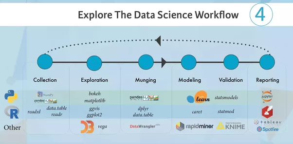

```{r setup, include=FALSE}
library(fOptions)
library(tidyverse)
library(lubridate)
library(bizdays)
library(ggplot2)
library(ggthemes)
library(gridExtra)
library(maps)
library(knitr)
library(kableExtra)
library(shiny)
knitr::opts_chunk$set(echo = FALSE, fig.align="center", collapse = TRUE, cache = TRUE)
chunk <- "```"
inline <- function(x = "") paste0("`` `r ", x, "` ``")
bank <- read.csv("https://goo.gl/PBQnBt", sep = ";")
```

<style type="text/css">
code.r{ /* Code block */
    font-size: 20px;
}
pre { /* Code block - determines code spacing between lines */
    font-size: 17px;
}
</style>

# Lecture 8: Data Visualization and EDA

- `library(ggplot)`, author Hadley Wickham. First release on June 10, 2007.
- gg stands for "Grammar of Graphics"

<https://qz.com/1007328/all-hail-ggplot2-the-code-powering-all-those-excellent-charts-is-10-years-old/>


```{r, echo = FALSE, out.width = "55%"}
knitr::include_graphics("imgs/ggplot2-10.png")
```

# ggplot2 Examples

```{r, echo = FALSE, out.width = "75%"}

```

# Why do we need ggplot?
It's part of the exploration of the data via visualization.

```{r, echo = FALSE, out.width = "75%"}

```

# ggplot system

```{r, echo = TRUE}
# library(ggplot2)
ggplot(airquality, aes(Temp, Ozone)) + 
        geom_point() + 
        geom_smooth(method = "loess", se = FALSE)
```

# Syntax of ggplot
- Definition of data + Definitions of layers

        ggplot(data = <DATA>, ...) + 
          <GEOM_FUNCTION>(mapping = aes(<MAPPINGS>))

```{r, echo = FALSE, out.width = "53%"}

```

# Syntax of ggplot

- For example, `geom_point()` is for points, `geom_line()` is for line, `geom_smooth()` for smoothed line.
- The definition of data will pass down to the layers. But layers can have its own data.
- Put the + sign in the end of the line, not the beginning of the line.

        ggplot(data = d1, ...) +
          geom_point() + # this would get data = d1
          geom_point(data = d2, ...) # this would get data = d2

- Below would result in error

        ggplot(data = <DATA>, ...)
        + <GEOM_FUNCTION>(mapping = aes(<MAPPINGS>))

# Simply plot x and y

    ggplot(bank, aes(age, balance)) + geom_point()


```{r, echo = FALSE, fig.width=10, fig.height=5}
ggplot(bank, aes(age, balance)) + geom_point()
```

# `aes` and `aes_string`

If you don't know the column name, use `aes_string` to pass variable name as string/character.

    ggplot(bank, aes_string("age", "balance", color = "job")) + geom_point()

Example of `aes_string`

```{r, include = FALSE}
bank <- read.csv("https://goo.gl/PBQnBt", sep = ";")
ggplot(bank, aes(age, balance)) + geom_point()

plot_bank <- function(x, y) {
  ggplot(bank, aes_string(x, y)) + geom_point()
}

plot_bank("age", "duration")
```

```{r eval = FALSE, include = TRUE, echo = TRUE}
# in a Shiny app
selectInput("column", "col", choices = c("balance", "duration"))
plot_bank("age", input$col)
```

```{r, include = TRUE}
ggplot(data = filter(bank, job == "entrepreneur"),
       aes(age, duration)) + geom_point() +
  geom_smooth(method = "lm") + facet_grid(. ~ job)
```

# For non-numeric data: default and age

    ggplot(bank, aes(default, age)) + geom_point()
    ggplot(bank, aes(age, default)) + geom_point()
    ggplot(bank, aes(job, age)) + geom_point()

```{r, echo = TRUE}
ggplot(bank, aes(default, age)) + geom_point()
```

# For non-numeric data: age and default (make it landscape)
```{r, echo = TRUE}
ggplot(bank, aes(age, default)) + geom_point()
```

```{r, echo = FALSE, eval = FALSE}
df_ys <-
  group_by(bank, round(age / 10)) %>%
  summarise(y = sum(default == "yes"), total = n()) %>%
  mutate(n = total - y) %>%
  rename(age = `round(age/10)`) %>%
  mutate(age = age * 10 + 5)

ggplot(bank, aes(age, default)) +
  geom_point(aes(age, default, color = paste0(round(age / 10) * 10, "s"))) +
  geom_text(data = select(df_ys, age, n) %>% filter(n > 0), aes(x = age, y = 1.2, label = n)) +
  geom_text(data = select(df_ys, age, y) %>% filter(y > 0), aes(x = age, y = 2.2, label = y))

View(df_ys)
```

# For non-numeric data: job and age
```{r, echo = TRUE}
ggplot(bank, aes(job, age)) + geom_point()
```

# Add 2nd geometry 

    ggplot(bank, aes(age, balance)) + geom_point() + geom_smooth()
    ggplot(bank, aes(age, balance, color = job)) + geom_point() + geom_smooth()

```{r, echo = FALSE, fig.width=10, fig.height = 4}
p1 <- ggplot(bank, aes(age, balance)) + geom_point() + geom_smooth()
p2 <- ggplot(bank, aes(age, balance, color = job)) + geom_point() + geom_smooth()
grid.arrange(p1, p2, ncol = 2, widths = c(1.35,2))
```

# Pass `aes` down
`geom_*` functions has a default parameter of `inherit.aes = T`.
```{r, echo = TRUE}
ggplot(bank, aes(x = age, y = duration)) +
geom_smooth() + # same as geom_smooth(aes(x = age, y = duration))
geom_point() # same as geom_point(aes(x = age, y = duration))
```

# Pass `aes` down
```{r, echo = TRUE}
# This is equivalent to below. But this is a bit repeating.
ggplot(bank) +
geom_point(aes(x = age, y = duration)) +
geom_smooth(aes(x = age, y = duration))
```

# Pass `aes` down
```{r, echo = T, fig.height=3}
# But repeating is useful sometimes.
# we can do specify different data and aes for different geom_* functions.
ggplot(bank) +
geom_point(aes(x = age, y = duration)) +
geom_smooth(data = dplyr::filter(bank, job == "entrepreneur"),
            aes(x = age, y = duration), color = "green") +
geom_smooth(data = dplyr::filter(bank, job == "blue-collar"),
            aes(x = age, y = duration), color = "blue") +
geom_smooth(data = dplyr::filter(bank, job != "entrepreneur"),
            aes(x = age, y = duration), color = "orange")
```

# Adjustment: legend bottom
```{r, echo = TRUE}
# adjust legend position
ggplot(bank, aes(x = age, y = duration, color = job)) +
geom_point() +
theme(legend.position="bottom")
```

# Adjustment: legend left
```{r, echo = TRUE}
# legend to the left
ggplot(bank, aes(x = age, y = duration, color = job)) +
geom_point() +
theme(legend.position="left")
```

# Adjustment: coordinate flip
```{r, echo = TRUE}
# Flip the x and y axis
# Different feeling?
ggplot(bank, aes(x = age, y = duration, color = job)) +
geom_point() +
theme(legend.position="left") + 
coord_flip()
```

# Adjustment: log scale
```{r, echo = TRUE}
# Make y as log scaled.
# Note that before flip, x is y, so we use scale_y_log10()
ggplot(bank, aes(x = age, y = duration, color = job)) +
geom_point() +
theme(legend.position="left") + 
coord_flip() +
scale_y_log10()
```

# Each `+` is a layer

    # Nearly empty chart.
    g <- ggplot(bank, aes(x = age, y = duration))
    # This is almost empty
    g <- ggplot(bank)
    # This is really empty.
    g <- ggplot()

```{r, echo = FALSE, fig.width=10, fig.height = 4}
# Nearly empty chart.
g1 <- ggplot(bank, aes(x = age, y = duration))
g2 <- ggplot(bank)
g3 <- ggplot()
grid.arrange(g1, g2, g3, ncol = 3)
```

# Combine `g` with layers

    ggplot(bank, aes(x = age, y = duration)) + 
      geom_point() + geom_smooth()


```{r, echo = TRUE}
# This is equivalent to above
g <- ggplot(bank, aes(x = age, y = duration))
g + geom_point() + geom_smooth()
```

# `g` can be re-used.
- `g` can be re-used. It's good to be used when we want to exploratory data and try to plot many figures.
- Fixed a few variables in `g <- ggplot(data, aes(...))`.
- Use `g + geom_XXX()` to find the best representation for the relationship.

        g + geom_point() + geom_smooth(method = "lm") + facet_grid(. ~ job)
        g + geom_point(color = "steelblue", size = 4, alpha = 1/2)
        g + geom_point(aes(color = job), size = 4, alpha = 1/2)
        g + geom_point() + geom_point(aes(color = job), size = 4, alpha = 1/2) 

# `g`: mix and match: which figure?

    g + geom_point() + geom_smooth(method = "lm") + facet_grid(. ~ job)
    g + geom_point(color = "steelblue", size = 4, alpha = 1/2)
    g + geom_point(aes(color = job), size = 4, alpha = 1/2)
    g + geom_point() + geom_point(aes(color = job), size = 4, alpha = 1/2) 


```{r, echo = FALSE}
g + geom_point(aes(color = job), size = 4, alpha = 1/2)
```

# `g`: mix and match: which figure?

    g + geom_point() + geom_smooth(method = "lm") + facet_grid(. ~ job)
    g + geom_point(color = "steelblue", size = 4, alpha = 1/2)
    g + geom_point(aes(color = job), size = 4, alpha = 1/2)
    g + geom_point() + geom_point(aes(color = job), size = 4, alpha = 1/2) 

```{r, echo = FALSE}
g + geom_point() + geom_point(aes(color = job), size = 4, alpha = 1/2) 
```

# `g`: mix and match: which figure?

    g + geom_point() + geom_smooth(method = "lm") + facet_grid(. ~ job)
    g + geom_point(color = "steelblue", size = 4, alpha = 1/2)
    g + geom_point(aes(color = job), size = 4, alpha = 1/2)
    g + geom_point() + geom_point(aes(color = job), size = 4, alpha = 1/2) 

```{r, echo = FALSE}
g + geom_point(color = "steelblue", size = 4, alpha = 1/2)
```

# `g`: mix and match: which figure?

    g + geom_point() + geom_smooth(method = "lm") + facet_grid(. ~ job)
    g + geom_point(color = "steelblue", size = 4, alpha = 1/2)
    g + geom_point(aes(color = job), size = 4, alpha = 1/2)
    g + geom_point() + geom_point(aes(color = job), size = 4, alpha = 1/2) 

```{r, echo = FALSE}
g + geom_point() + geom_smooth(method = "lm") + facet_grid(. ~ job)
```

# Differentiate groups - `shape`

```{r, echo = TRUE}
# Use shape
ggplot(bank) +
  geom_point(aes(age, duration, shape = contact))
```

# Differentiate groups - `color`
```{r, echo = TRUE}
# Use color
ggplot(bank) +
  geom_point(aes(age, duration, color = contact))
```

# Differentiate groups - `size`
```{r, echo = TRUE}
# Use size
ggplot(bank) +
  geom_point(aes(age, duration, size = contact))
```

# Differentiate groups - `alpha`
```{r, echo = TRUE}
# Use alpha - transparency
ggplot(bank) +
  geom_point(aes(age, duration, alpha = contact))
```

# Differentiate groups - `group`
```{r, echo = TRUE}
# Use group.
ggplot(bank) +
  geom_point(aes(age, duration, group = contact))
```

# Enforce color, put things outside `aes`

```{r, echo = TRUE}
## you can also enforce color, put things outside aes
ggplot(bank) +
  geom_point(aes(age, duration), color = "blue", size = 10, alpha = 0.4)
```

# What's inside Bank? Things to consider

- Which variables in data are categorical?

- Which variables are continuous?

- bio:
    + age
    + job
    + marital
    + education
- financial
    + default
    + balance
    + housing
    + loan

# What's inside Bank? Things to consider 2
    
- communication
    + contact: celluar v.s. telephone v.s. unknown
    + day/month: maybe good to ignore?
    + duration:
    + campaign:
    + pdays:
    + previous:
    + poutcome:

# Categorical/Continuous variable

- numeric -> continuous data
- string -> discrete data

For different type of variables, the scale is also different

- Reverse a categorical (discrete) variable, we use `scale_y_discrete(limit = rev(levels(...)))`.
- Reverse a continuous numerical variable, we use `scale_x_reverse()`.

# Exercise
1. What does this figure mean?
```{r, echo = TRUE}
ggplot(bank, aes(age, job)) +
geom_point() +
scale_y_discrete(limit = rev(levels(bank$job)))
```

# Exercise 
```{r, echo = TRUE}
# y labels without sort.
ggplot(bank, aes(age, job)) + geom_point()
```

# Exercise 
2. I tried to plot between job, loan and age. Any better idea? 
```{r, echo = TRUE}
ggplot(bank, aes(age, job, color = loan)) + geom_point()
```

```{r, echo = FALSE, fig.show = "hide"}
ggplot(bank, aes(age, job, color = loan, size = loan)) + geom_point()
```

# Other geoms
- geom_boxplot()
- geom_density()
- geom_histogram()
- geom_bar()

# Boxplot: job and duration
```{r, echo = TRUE}
ggplot(bank, aes(job, duration)) + geom_boxplot()
```

# Boxplot: job and age
```{r, echo = TRUE}
ggplot(bank, aes(job, age)) + geom_boxplot()
```

# Density: balance and job
```{r, echo = TRUE}
ggplot(bank, aes(balance, color = job)) + geom_density()
```

# Density: balance and job with fill
```{r, echo = TRUE}
ggplot(bank, aes(duration, fill = job)) + geom_density()
```

# Density: age and job with alpha
```{r, echo = TRUE}
ggplot(bank, aes(age, color = job, alpha = 0.3)) + geom_density()
```

# Density: age and job with alpha and fill and color
```{r, echo = TRUE}
# Which is better?
ggplot(bank, aes(age, color = job, fill = job, alpha = 0.3)) + geom_density()
```

# histogram: duration and job and binwidth = 2
```{r, echo = TRUE}
ggplot(data = bank, mapping = aes(x = duration, fill = job)) + geom_histogram(binwidth = 2)
```

# histogram: duration and job and binwidth = 100
```{r, echo = TRUE}
ggplot(data = bank, mapping = aes(x = duration, fill = job)) + geom_histogram(binwidth = 100)
```

# histogram: age and job and fill
```{r, echo = TRUE}
ggplot(data = bank, mapping = aes(x = age, fill = job)) + geom_histogram(binwidth = 10)
```

# histogram: age and job and colour
```{r, echo = TRUE}
ggplot(data = bank, mapping = aes(x = age, colour = job)) + geom_freqpoly(binwidth = 10)
```

# geom_bar
- `bar` is a statistical function: It counts.
```{r, echo = T, fig.show = "hide"}
# First input parameter to geom_bar is mapping, so we can skip it.
ggplot(bank) + geom_bar(mapping = aes(x = age))
```

```{r, echo = TRUE}
# We can skip mapping
ggplot(bank) + geom_bar(aes(x = age))
```

# geom_bar with fill: job
```{r, echo = TRUE}
# comparing to colour, for Bar, we better use fill
# ggplot(data = bank, ) + geom_bar(aes(x = age, colour = job))
ggplot(bank) + geom_bar(mapping = aes(x = age, fill = job))
```

# geom_bar with fill: age

    ggplot(bank) +
      geom_bar(mapping = aes(x = job))
    # Color doesn't work, because age is a continous variable.
    ggplot(bank) +
      geom_bar(mapping = aes(x = job, fill = age)) 

```{r, echo = FALSE, fig.height=5, fig.width=10}
p1 <- ggplot(bank) + geom_bar(mapping = aes(x = job))
p2 <- ggplot(bank) + geom_bar(mapping = aes(x = job, fill = age)) 
grid.arrange(p1, p2, ncol = 2, widths = c(2, 2))
```

# Position for bar
```{r, echo = TRUE}
ggplot(bank) + geom_bar(mapping = aes(x = age, fill = job))
```

# Position for bar: fill
```{r, echo = TRUE}
# fill to 100%
ggplot(bank) + geom_bar(mapping = aes(x = age, fill = job),
                        position = "fill")
```

# Position for bar: dodge
```{r, echo = TRUE}
# dodge means "adaptive width of the bar"
ggplot(bank) + geom_bar(mapping = aes(x = age, fill = job),
                        position = "dodge")
```

# Variations: coord_flip
```{r, echo = TRUE}
# Switch x and y axis.
# Note any adjustment on x or y axis is effective on the original name.
ggplot(bank) +
geom_bar(mapping = aes(x = age, fill = job), position = "fill") +
coord_flip()
```

# Variations: coord_polar
```{r, echo = TRUE}
ggplot(bank) +
geom_bar(mapping = aes(x = age, fill = job), position = "fill") +
coord_polar()
```

# Variations: scale_x_reverse
```{r, echo = TRUE}
# scale_x_reverse works on continous variable (numeric, date, etc.). Make it big to small.
ggplot(bank) +
geom_bar(mapping = aes(x = age, fill = job), position = "fill") +
coord_flip() +
scale_x_reverse()
```

# geom_bar: better serves for categorical data
```{r, echo = TRUE}
ggplot(data = bank, mapping = aes(x = job, fill = education)) +
  geom_bar() +
  theme(axis.text.x = element_text(angle = 90, hjust = 1))
```

# geom_bar: coord_flip
```{r, echo = TRUE}
ggplot(data = bank, mapping = aes(x = job, fill = education)) +
  geom_bar() + coord_flip()
```

# geom_bar: sort job by mean age
```{r, echo = TRUE}
ggplot(data = bank, mapping = aes(x = reorder(job, age, FUN = mean),
       fill = education)) +
  geom_bar() + coord_flip()
```

# geom_bar: sort job by alphabetical order
```{r, echo = TRUE}
# If we want to order job according to alphabetical order.
# use rev(levels(...))
ggplot(data = bank, mapping = aes(x = reorder(job, age, FUN = median),
       fill = education)) +
  geom_bar() +
  scale_x_discrete(limit = rev(levels(bank$job))) +
  coord_flip()
```

# Bar with composite data
```{r, echo = T, fig.show = "hide"}
ggplot(data = bank, mapping = aes(x = reorder(job, age, FUN = median),
       fill = education)) +
  # layer 1
  geom_bar() +
  # If we want to sort the job acccording to median age
  scale_x_discrete(limit =
    rev(levels(reorder(bank$job, bank$age, FUN = median)))) +
  # And also add age range and median age.
  geom_line(aes(x = job, y = age)) +
  geom_point(data = group_by(bank, job) %>%
               summarize(age = median(age)) %>% ungroup,
            aes(x = job, y = age), inherit.aes = FALSE) +
  xlab("Job sorted according to\nMedian age\n(Top - younger)") +
  coord_flip()
```

# Bar with composite data: plot
```{r, echo = FALSE}
ggplot(data = bank, mapping = aes(x = reorder(job, age, FUN = median), fill = education)) +
  geom_bar() +
  # If we want to sort the job acccording to median age
  scale_x_discrete(limit = rev(levels(reorder(bank$job, bank$age, FUN = median)))) +
  geom_line(aes(x = job, y = age)) +
  # And also add age range and median age.
  geom_point(data = group_by(bank, job) %>% summarize(age = median(age)) %>% ungroup,
            aes(x = job, y = age), inherit.aes = FALSE) +
  xlab("Job sorted according to\nMedian age\n(Top - younger)") +
  coord_flip()
```

# Data with statistical
```{r, echo = TRUE}
ggplot(data = bank) + 
  stat_summary(
    mapping = aes(x = age, y = balance),
    fun.ymin = min,
    fun.ymax = max,
    fun.y = median
  )
```

# Facets
- Create invidual figures.
- `facet_grid`: basic
- `facet_wrap`: you can control number of rows and cols

```{r, echo = T, fig.heght=3}
ggplot(data = bank) + 
  geom_point(mapping = aes(x = age, y = duration)) + 
  facet_grid( ~ education)
```

# Facets - facet_wrap
```{r, echo = TRUE}
ggplot(data = bank) + 
  geom_point(mapping = aes(x = age, y = duration)) + 
  facet_wrap(~ education, nrow = 2)
```

# Facets - facet_wrap multi-dimension

```{r, echo = TRUE}
ggplot(data = bank) + 
  geom_point(mapping = aes(x = age, y = duration)) + 
  facet_wrap(loan ~ education ~ housing, nrow = 2)
  # or we can use, facet_grid(loan ~ education ~ housing)
```

# Facets - finding the best
```{r, echo = TRUE}
# doesn't look great because we have so many jobs.
ggplot(bank, aes(pdays)) + geom_histogram() + facet_grid(job ~ .)
```

# Facets - finding the best. still trying.
```{r, echo = TRUE}
# Not a good choice, neither
ggplot(bank, aes(pdays)) + geom_histogram() + facet_grid(. ~ job)
```

# Facets - finding the best. better
```{r, echo = TRUE}
# Can we do better?
ggplot(bank, aes(campaign)) + geom_histogram() + facet_grid(. ~ job)
```

# Facets - finding the best. try another
```{r, echo = TRUE}
ggplot(bank, aes(duration)) + geom_histogram(aes(color = job)) +
  facet_grid(. ~ job)
```

# Facets - finding the best. Try points
```{r, echo = TRUE}
# facet with points is good
ggplot(bank, aes(balance, age)) + geom_point() + facet_grid(. ~ job)
```

# Facets - finding the best. Better with color
```{r, echo = TRUE}
# do better
ggplot(bank, aes(balance, age)) + geom_point(aes(color = job)) +
  facet_grid(. ~ job)
```

# Facets - finding the best. Try Points
```{r, echo = TRUE}
# Can we apply points between age and balance?
ggplot(bank, aes(age, balance, color = job)) +
  geom_point() + geom_smooth() +
  facet_grid(. ~ job)
```

# Facets - finding the best. Try Smoothie
```{r, echo = TRUE}
# Smooth line is mixed with points
ggplot(bank, aes(age, balance)) + geom_point(aes(color = job)) +
  geom_smooth() +
  facet_grid(. ~ job)
```

# With facets or without facets?
```{r, echo = TRUE}
ggplot(bank, aes(previous)) + geom_histogram() + facet_grid(. ~ job)
```

# With facets or without facets?
facets with color
```{r, echo = TRUE}
ggplot(bank, aes(previous)) + geom_histogram(aes(fill = job)) +
  facet_grid(. ~ job)
```

# With facets or without facets?
Use density/color on one figure
```{r, echo = TRUE}
ggplot(bank, aes(previous)) + geom_density(aes(fill = job))
```

# With facets or without facets - Case 2
```{r, echo = TRUE}
ggplot(bank, aes(previous)) + geom_histogram() +
  facet_grid(. ~ marital)
```

# With facets or without facets: density and fill
```{r, echo = TRUE}
ggplot(bank, aes(previous)) + geom_density(aes(fill = marital))
```

# With facets or without facets: xlim
```{r, echo = TRUE}
ggplot(bank, aes(previous)) +
  geom_density(aes(fill = marital), alpha = 0.7) +
  xlim(1, 10)
```

# Facets in full power
```{r, echo = T, fig.show = "hide"}
# Levels gives more control to the layer and style.
cutpoints <- quantile(bank$age, seq(0, 1, length = 4), na.rm = TRUE)
# The age_group variable is now a categorical factor variable containing
# 3 levels, indicating the ranges of age.
bank$age_group <- cut(bank$age, cutpoints)
levels(bank$age_group)
# Use facet_wrap to specify nrow/ncol.
ggplot(bank, aes(age, duration)) +
  geom_point(alpha = 1/3) + 
  facet_wrap(job ~ age_group, nrow = 2) +
  geom_smooth(method="lm", se=FALSE, col="steelblue") + 
  theme_bw(base_size = 10) + 
  labs(x = "age", y = expression("log " * Duration)) + 
  scale_y_log10() +
  labs(title = "Bank Clients")  
```

# Facets in full power: plot
```{r, echo = FALSE, fig.height=6, fig.width=10}
# Levels gives more control to the layer and style.
cutpoints <- quantile(bank$age, seq(0, 1, length = 4), na.rm = TRUE)
# The age_group variable is now a categorical factor variable
# containing 3 levels, indicating the ranges of age.
bank$age_group <- cut(bank$age, cutpoints)
# Use facet_wrap to specify nrow/ncol.
ggplot(bank, aes(age, duration)) +
  geom_point(alpha = 1/3) + 
  facet_wrap(job ~ age_group, nrow = 2) +
  geom_smooth(method="lm", se=FALSE, col="steelblue") + 
  theme_bw(base_size = 10) + 
  labs(x = "age", y = expression("log " * Duration)) + 
  scale_y_log10() +
  labs(title = "Bank Clients")  
```

# Add theme
default theme is theme_gray()

    g <- ggplot(bank, aes(x = age, y = log10(duration)))
    g + geom_point(aes(color = job), size = 4, alpha = 1/2) + theme_bw()
    g + geom_point(aes(color = job), size = 4, alpha = 1/2) + theme_void()
    
    g + geom_point(aes(color = job), size = 4, alpha = 1/2) + theme_minimal() +
        labs(title = "Duration is longer with age",
            subtitle = "some random plot",
            caption = "from MFE") +
        labs(x = "age", y = expression("log " * Duration))

# Add theme: result

```{r, echo = FALSE, fig.height = 6, fig.width=10}
g <- ggplot(bank, aes(x = age, y = log10(duration)))
p1 <- g + geom_point(aes(color = job), size = 4, alpha = 1/2) + theme_bw()
p2 <- g + geom_point(aes(color = job), size = 4, alpha = 1/2) + theme_void()

p3 <- g + geom_point(aes(color = job), size = 4, alpha = 1/2) + theme_minimal() +
    labs(title = "Duration is longer with age",
        subtitle = "some random plot",
        caption = "from MFE") +
    labs(x = "age", y = expression("log " * Duration))
grid.arrange(p1,p2,p3,ncol=3)
```

# ggthemes
- package `ggthemes` provides many other themes.

```{r, echo = TRUE}
library(ggthemes)
## [1] "theme_base" "theme_calc"
## [3] "theme_economist" "theme_economist_white"
## [5] "theme_excel" "theme_few"
## [7] "theme_fivethirtyeight" "theme_foundation"
## [9] "theme_gdocs" "theme_hc"
## [11] "theme_igray" "theme_map"
## [13] "theme_pander" "theme_par"
## [15] "theme_solarized" "theme_solarized_2"
## [17] "theme_solid" "theme_stata"
## [19] "theme_tufte" "theme_wsj"
```

# ggplot summary

    ggplot(data = <DATA>) + 
      <GEOM_FUNCTION>(
         mapping = aes(<MAPPINGS>),
         stat = <STAT>, 
         position = <POSITION>
      ) +
      <COORDINATE_FUNCTION> +
      <FACET_FUNCTION>

# ggplot: one more thing: nz
```{r echo = T}
# install.packages("maps")
library(maps)
nz <- map_data("nz")
ggplot(nz, aes(long, lat, group = group)) +
  geom_polygon(fill = "white", colour = "black") +
  coord_quickmap()
```

# ggplot: one more thing - world
```{r echo = T}
world <- map_data("world")
ggplot(world, aes(long, lat, group = group)) +
  geom_polygon(fill = "white", colour = "black") +
  coord_quickmap()
```

# Assignment
- In an R Markdown document (output: html), produce 10 data insights.
    + Each with a figure and a data story.
    + You can re-use about existing examples, up to 5.

# Lecture 9: Shiny/3: Advanced

# Review: Display output with `render*()` functions

- `render*()` arguments are code used to build and rebuild object
- `render*()` function re-runs the code with every change in the input

# Review: render/output pair

* Static table from df, mat, etc.s
    + renderTable()/tableOutput()
* Interactive table from data frame, matrix or other table-like structure
    + renderDataTable()/dataTableOutput() 
* Plot
    + renderPlot()/plotOutput()
* Get continous output
    + renderPrint()/verbatimTextOutput() or textOutput()
* Get last result
    + renderText()verbatimTextOutput() or textOutput()
* Customized UI elements
    + uiOutput()/renderUI()

# Review: `render*`

- Allow binding of one output to multiple inputs

        output$hist <- renderPlot({
          hist(data())
        })
    
        output$stat <- renderPlot({
          summary(data())
        })

```{r, echo = FALSE}
# reactive()
# data <- reactive({
# hist(rnorm(input$num))
# })
```

# Review: observeEvent
- Allow binding of multiple outputs to multiple inputs.
- Use of `isolate` to *peek* the value not to react to its change every time.

        actionButton(inputId = "go", label = "Click me")
    
        observeEvent(input$go, {
          # Use of isolate to *peek* the value not to react to it.
          num_input <- isolate(input$num_input)
    
          output$plot1 <- renderPlot({ 
            # if we use input$num_input here, we build a direct reactive link
            # between output$plot1 and input$num_input. This is not what we designed.
            plot(1:number_input, runif(num_input))
          })
    
          output$table1 <- renderTable({ ... })
        })

```{r, echo = FALSE}
# observe() function
# observe({ print(input$go) }) reacts to whatever are changed in the code block.

# eventReactive() delay reactions
# mono-action to data binding
# data <- eventReactive(input$go, { rnorm(input$num) })
# button -> data -> renderPlot
# button -> renderPlot (direct is not very good)

# reactiveValues
# allow multiple binding of data to different input
# rv <- reactiveValues(data = rnorm(100))
# button -> change the data -> renderPlot
```

# Review: When codes gets to run.
- `ui`: client. run once per user per session.
- `server`: run once per session
- code inside a reactive function runs with every input change.

# Advanced Shiny
- Input: `update***Input` functions (You can update output with new content.)
- Dynamic UI to create inputs and outputs dynamically.
- Graphics output: gridExtra
- Table output: kableExtra

# `update***Input`
- Update various input values
    - updateSelectionInput(...)
    - updateNumericInput(...)

```{r echo = FALSE, comment = ""}
cat(htmltools::includeText("example/shiny-36-update.R"))
```

# `renderUI`
- Dynamicaly creation of UI (user interface) with input and outputs.
- Append new items to `tagList()`

# Create dynamic output `tagList()`

```{r echo = FALSE, comment = ""}
cat(htmltools::includeText("example/shiny-34-renderUI.R"))
```

# Create dynamic output 2
You can use newly created UI immediately

```{r echo = FALSE, comment = ""}
cat(htmltools::includeText("example/shiny-35-renderUI-2.R"))
```

# Create dynamic output 3

```{r echo = FALSE, comment = ""}
cat(htmltools::includeText("example/shiny-32-renderUI.R"))
```

# Dynamic input and `update***Input`
- Update various input values
    - updateSelectionInput(...)
    - updateNumericInput(...)

```{r echo = FALSE, comment = ""}
cat(htmltools::includeText("example/shiny-36-update.R"))
```

# Very dynamic

```{r echo = FALSE, comment = ""}
cat(htmltools::includeText("example/shiny-37-createDynamic.R"))
```

# ggplot/gridExtra
If we need to generate multiple plots. ggplot has a companion package to arrange plots. 

SxS: side by side
```{r, echo = T, fig.show="hide"}
library(gridExtra)
p1 <- ggplot(bank) + geom_bar(mapping = aes(x = age, fill = job),
                              position = "fill") + coord_polar()
p2 <- ggplot(bank) + geom_bar(mapping = aes(x = age, fill = education),
                              position = "fill") + coord_polar()
```

```{r, echo = T, fig.height = 3}
grid.arrange(p1, p2, ncol=2, nrow=1)
```

```{r, echo = TRUE}
grid.arrange(p1, p2, ncol=2, nrow=1, widths = c(4,3))
grid.arrange(p1, p2, ncol=1, nrow=2, heights = c(2,4))
```

# ggplot/gridExtra
```{r, echo = T, fig.show = "hide"}
library(tibble)
library(ggplot2)
library(gridExtra)

df <- tibble(x = rnorm(1000), y = rnorm(1000))

hist_top <- ggplot(df, aes(x = x)) + geom_density()

empty <-
  ggplot()+geom_point(aes(1,1), colour="white")+
  theme(axis.ticks=element_blank(), 
        panel.background=element_blank(), 
        axis.text.x=element_blank(), axis.text.y=element_blank(),
        axis.title.x=element_blank(), axis.title.y=element_blank())

scatter <- ggplot(df, aes(x = x, y = y)) + geom_point()

hist_right <- ggplot(df, aes(x = y)) + geom_density() + coord_flip()

grid.arrange(hist_top, empty, scatter, hist_right,
             ncol=2, nrow=2,
             widths=c(3.5, 0.7), heights=c(1, 4))
```

# ggplot/gridExtra: result

```{r, echo = FALSE, fig.height = 6, fig.width = 6}
library(tibble)
library(ggplot2)
library(gridExtra)

df <- tibble(x = rnorm(1000), y = rnorm(1000))

hist_top <- ggplot(df, aes(x = x)) + geom_density()

empty <-
  ggplot()+geom_point(aes(1,1), colour="white")+
  theme(axis.ticks=element_blank(), 
        panel.background=element_blank(), 
        axis.text.x=element_blank(), axis.text.y=element_blank(),
        axis.title.x=element_blank(), axis.title.y=element_blank())

scatter <- ggplot(df, aes(x = x, y = y)) + geom_point()

hist_right <- ggplot(df, aes(x = y)) + geom_density() + coord_flip()

grid.arrange(hist_top, empty, scatter, hist_right,
             ncol=2, nrow=2,
             widths=c(3.5, 0.7), heights=c(1, 4))
```

# knitr/kableExtra
kable is provided by `knitr` package. `kableExtra` enhance it with more functions. So we load both packages.

    `r chunk`{r shiny_block}
    library(knitr)
    library(kableExtra)
    
    # This is HTML output
    kable(df, format = "html")
    
    # Use function() { } to output html
    output$p1 <- function() {
      kable(df, format = "html")
    }
    `r chunk`

# kable_styling
- Get all styles from here
https://cran.r-project.org/web/packages/kableExtra/vignettes/awesome_table_in_html.html

- style

```{r, echo = TRUE}
mtcars[1:10, , drop = F] %>%
kable("html") %>%
  kable_styling(bootstrap_options = c("striped", "hover", "condensed"),
                font_size = 12,
                full_width = F, # True for left-to-right width
                position = "left") # if full_width == F
```

# kable_styling: column_spec

```{r, echo = TRUE}
mtcars[1:10, , drop = F] %>%
kable("html") %>%
  kable_styling(bootstrap_options = c("striped", "hover", "condensed"),
                font_size = 12,
                full_width = F, # True for left-to-right width
                position = "left") %>% # if full_width == FALSE
    column_spec(1, bold = T, border_right = TRUE) %>%
    column_spec(2, width = "30em", background = "yellow")
```

# kable_styling: row_spec
```{r, echo = TRUE}
mtcars[1:10, , drop = F] %>%
kable("html") %>%
  kable_styling(bootstrap_options = c("striped", "hover", "condensed"),
                font_size = 12,
                full_width = F, # True for left-to-right width
                position = "left") %>% # if full_width == F
    column_spec(5:7, bold = TRUE) %>%
    row_spec(3:5, bold = T, color = "white", background = "#D7261E")    
```

# kable_styling: cell_spec

```{r, echo = FALSE, out.width = "45%"}

```

```{r, echo = TRUE}
vol_surface <- tibble(tenor = c("1M", "2M", "3M", "6M"),
                      `0.1` = c(0.472, 0.435, 0.391, 0.29),
                      `0.25` = c(0.431, 0.41, 0.337, 0.28),
                      `0.5` = c(0.398, 0.30, 0.251, 0.2),
                      `0.75` = c(0.428, 0.336, 0.307, 0.249),
                      `0.9` = c(0.457, 0.411, 0.391, 0.278))

# Coloring for volatility surface:
# Include all cells for colors, using gather, cell_spec, then spread
library(knitr)
library(kableExtra)
gather(vol_surface, key = "delta", value = "vol", -tenor) %>%
# cell_spec takes column vol. spec_color also takes column vol values into consideration.
# We take half of the spectrurm - yellow to red.
# Color specturm: "magma" (or "A"), "inferno" (or "B"),
# "plasma" (or "C"), and "viridis" (or "D", the default option).
mutate(vol = cell_spec(
    vol, "html", color = "black", bold = T,
    background = spec_color(vol, begin = 0.5, end = 1,
                            option = "A", direction = -1))) %>%
spread(key = "delta", value = "vol") %>%
  kable("html", escape = F, align = "c") %>%
  kable_styling("striped", full_width = FALSE)
```