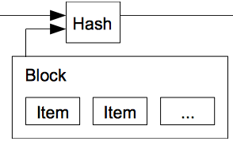
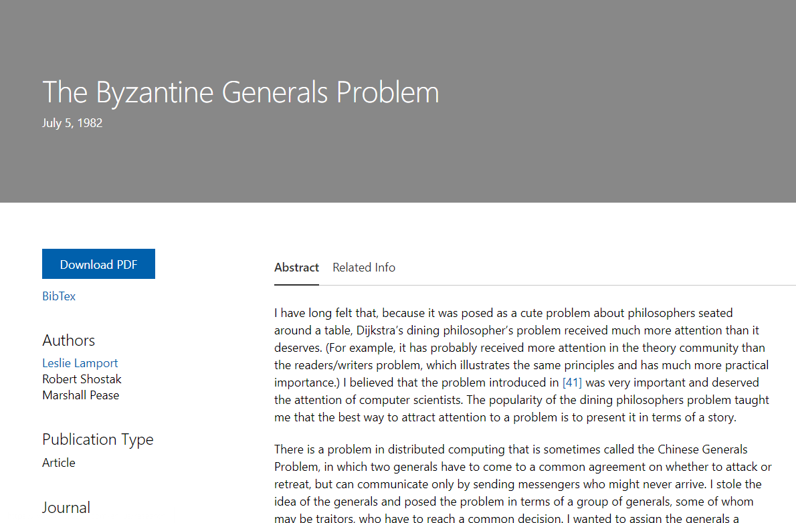
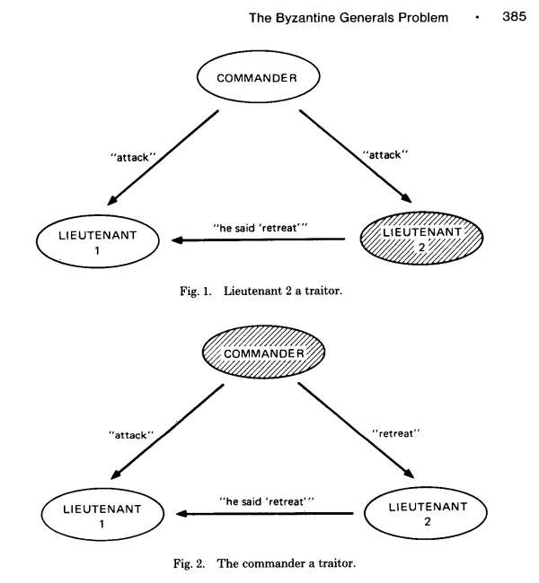
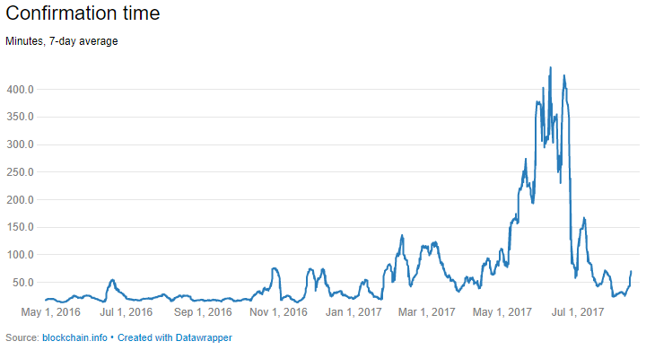
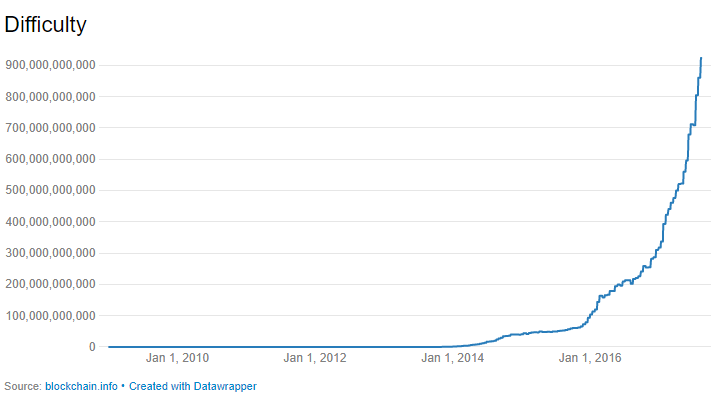

# Satoshi's paper

# Bitcoin Mining
Bitcoin mining is the process by which transactions are verified and added to the public ledger, known as the block chain, and also the means through which new bitcoin are released. Anyone with access to the internet and suitable hardware can participate in mining. The mining process involves compiling recent transactions into blocks and trying to solve a computationally difficult puzzle. The participant who first solves the puzzle gets to place the next block on the block chain and claim the rewards. The rewards, which incentivize mining, are both the transaction fees associated with the transactions compiled in the block as well as newly released bitcoin.

## Block hash
Block contains all transactions. Now this block includes the hash value in its header for all transactions inside it.

{width=45%}

## Block chain
The next block contains the previous block's hash

{width=45%}

In blockchain, once a block is made, the hash header of this block is passed on to the next block as an input. Linked blocks
 Since this hash is an input to the next block, the hash of the next block also changes and so on. Thus all the blocks, subsequent to the changed block will be corrupted and this is easily verifiable by others.
There is still a possibility of all future block hashes also reconstructed by a bad element.

# Merkle tree

{width=45%}

The transactions are at the leaf level. Hash of two transactions (Tx0 and Tx1) are again hashed and a non-leaf node of Hash01 is formed. Similarly Hash23, Hash45 etc are formed. A tree is formed and at the top of the tree is the Top Hash or the Root Hash.
In bitcoin the Block header contains this Root as Merkle Root.

{width=45%}

With this design, they have greatly reduced the size of the blocks that are required for a transaction user.

# Merkle tree storage
As mentioned in the paper - “A block header with no transactions would be about 80 bytes. If we suppose blocks are generated every 10 minutes, 80 bytes * 6 * 24 * 365 = 4.2MB per year. With computer systems typically selling with 2GB of RAM as of 2008, and Moore’s Law predicting current growth of 1.2GB per year, storage should not be a problem even if the block headers must be kept in memory.”

# Verification is easily

To verify that a transaction is part of a block )or a hash tree), one needs the specific transaction details and just the hash values of the higher level non branches.
To verify that Tx0 is in the block, one needs the details of
- Tx0
- Hash1 and
- Hash23

{width=45%}

More illustrative example.
https://media.consensys.net/ever-wonder-how-merkle-trees-work-c2f8b7100ed3

{width=45%}

{width=45%}

The Merkle root of block #482819 is e045b18e7a3d708d686717b4f44db2099aabcad9bebf968de5f7271b458f71c8. The root is combined with other information (the software version, the previous block's hash, the timestamp, the difficulty target and the nonce) and then run through a hash function to produce the block's unique hash: 000000000000000000bfc767ef8bf28c42cbd4bdbafd9aa1b5c3c33c2b089594 in the case of block #482819. This hash is not actually included in the relevant block, but the next one; it is distinct from the Merkle root. (See also, How Bitcoin Works.)

{width=45%}

For example, say that you wanted to verify that transaction TD is included in the block in the diagram above. If you have the root hash (HABCDEFGH), the process is like a game of sudoku: you query the network about HD, and it returns HC, HAB and HEFGH. The Merkle tree allows you to verify that everything is accounted for with three hashes: given HAB, HC, HEFGH and the root HABCDEFGH, HD (the only missing hash) has to be present in the data.

# Byzantine Generals Problem

{width=45%}

“The Byzantine Generals Problem is with a group of generals, each commanding a portion of the Byzantine army, encircle a city. These generals wish to formulate a plan for attacking the city. In its simplest form, the generals must only decide whether to attack or retreat. Some generals may prefer to attack, while others prefer to retreat. The important thing is that every general agrees on a common decision, for a halfhearted attack by a few generals would become a rout and be worse than a coordinated attack or a coordinated retreat.”

{width=45%}

The problem is complicated by the presence of traitorous generals who may not only cast a vote for a suboptimal strategy, they may do so selectively. For instance, if nine generals are voting, four of whom support attacking while four others are in favor of retreat, the ninth general may send a vote of retreat to those generals in favor of retreat, and a vote of attack to the rest. Those who received a retreat vote from the ninth general will retreat, while the rest will attack (which may not go well for the attackers). The problem is complicated further by the generals being physically separated and having to send their votes via messengers who may fail to deliver votes or may forge false votes.”

{width=45%}

The typical mapping of this story onto blockchain is that the network nodes are the generals and their digital communication system links are the messengers.

In the paper referred above, several solutions have been proposed.

# Consensus
Consensus is the process of building agreement among a group of mutually distrusting participants.
There are many different algorithms for building consensus based on requirements related to performance, scalability, consistency, threat model, and failure model.
While most distributed ledgers operate with an assumption of Byzantine failures (malicious attacker), other properties are largely determined by application requirements.
For example, ledgers used to record financial transactions often require high transaction rates with relatively few participants and immediate finality of commitment. Consumer markets, in contrast, require substantial aggregate throughput across a large number of participants; however, short-term finality is less important.

Two general approaches have been proposed.
The first, often referred to as “Nakamoto consensus”, elects a leader through some form of “lottery”. The leader then proposes a block that can be added to a chain of previously committed blocks.
In Bitcoin, the first participant to successfully solve a cryptographic puzzle wins the leader-election lottery.
The elected leader broadcasts the new block to the rest of the participants who *implicitly* vote to accept the block by adding the block to a chain of accepted blocks and proposing subsequent transaction blocks that build on that chain.

The second approach is based on traditional Byzantine Fault Tolerance (BFT) algorithms and uses multiple rounds of explicit votes to achieve consensus. Ripple and Stellar developed consensus protocols that extend traditional BFT for open participation.

# Proof of Work or Proof of Stake
The proof of stake was created as an alternative to the proof of work (PoW), to tackle inherent issues in the latter. When a transaction is initiated, the transaction data is fitted into a block with a maximum capacity of 1 megabyte, and then duplicated across multiple computers or nodes on the network. The nodes are the administrative body of the blockchain and verify the legitimacy of the transactions in each block. To carry out the verification step, the nodes or miners would need to solve a computational puzzle, known as the proof of work problem. The first miner to decrypt each block transaction problem gets rewarded with coin. Once a block of transactions has been verified, it is added to the blockchain, a public transparent ledger.

With a PoS, the attacker would need to obtain 51% of the cryptocurrency to carry out a 51% attack. The proof of stake avoids this ‘tragedy’ by making it disadvantageous for a miner with a 51% stake in a cryptocurrency to attack the network. Although it would be difficult and expensive to accumulate 51% of a reputable digital coin, a miner with 51% stake in the coin would not have it in his best interest to attack a network which he holds a majority share. If the value of the cryptocurrency falls, this means that the value of his holdings would also fall, and so the majority stake owner would be more incentivized to maintain a secure network.

# Tragedy of Commons
Bitcoin uses a PoW system and as such is susceptible to a potential Tragedy of Commons. The Tragedy of Commons refers to a future point in time when there will be fewer bitcoin miners available due to little to no block reward from mining. The only fees that will be earned will come from transaction fees which will also diminish over time as users opt to pay lower fees for their transactions. With fewer miners than required mining for coins, the network becomes more vulnerable to a 51% attack. A 51% attack is when a miner or mining pool controls 51% of the computational power of the network and creates fraudulent blocks of transactions for himself, while invalidating the transactions of others in the network.

# Mining
Bitcoin has successfully overcome the BFT problem by using “Proof-of-Work” or “mining”.
Proof-of-Work involves scanning for a value (nonce) that when hashed, the (block) hash begins with a specific number of zero bits.
Assuming Proof-of-work needs that the resultant hash must start with 0000. We now need to find a nonce value that would satisfy this condition. After trying many combinations, we find that a nonce value of “67068” makes the hash value of the block start with “0000”.
This process of finding the nonce value is “mining” and the first miner gets rewarded with bitcoins.
However, this process consumes enormous power for just finding a random number!

{width=45%}

{width=45%}

# 51% Attack

DEFINITION of '51% Attack'

Read more: 51% Attack | Investopedia http://www.investopedia.com/terms/1/51-attack.asp#ixzz4w9WzpEMX 

# Smart Contract

Smart contracts were first proposed in 1994 by Nick Szabo, an American computer scientist who invented a virtual currency called "Bit Gold" in 1998, fully 10 years before the invention of Bitcoin. In fact, Szabo is often rumoured to be the real Satoshi Nakamoto, the anonymous inventor of Bitcoin, which he has denied.

Szabo defined smart contracts as computerized transaction protocols that execute terms of a contract.
He wanted to extend the functionality of electronic transaction methods, such as POS (point of sale), to the digital realm. 

In his paper, Szabo also proposed the execution of a contract for synthetic assets, such as derivatives and bonds.
“These new securities are formed by combining securities (such as bonds) and derivatives (options and futures) in a wide variety of ways. Very complex term structures for payments can now be built into standardized contracts and traded with low transaction costs, due to computerized analysis of these complex term structures,” he wrote. In simple words, he was referring to the sale and purchase of derivatives with complex terms. 

Read more: Smart Contracts Definition | Investopedia http://www.investopedia.com/terms/s/smart-contracts.asp#ixzz4w9WNqQO4 

# Smart Contract 2

Read more: Are Smart Contracts the Best of Blockchain? | Investopedia http://www.investopedia.com/news/are-smart-contracts-best-blockchain/#ixzz4w9VNTv2M 

Every day presents a fresh opportunity to uncover a new application for blockchain technology. After successfully forming the backbone for a revolutionary cryptocurrency, the blockchain is bringing forth strategic evolutions across industries including logistics, web security, and even trade finance. However, nowhere is this advance more evident than its growing function as an innovative payment solution. One of the key pillars driving this rapid adoption is the embrace of smart contracts.

Simply stated, smart contracts are a form of automated contracts that use pre-defined rules to facilitate the exchange of nearly any good or service.
The overarching principle is to increase the transparency of the transaction while reducing fees and allaying the potential for conflict over nonperformance. However, unlike traditional contracts, these contracts have no room for interpretation because all terms are predetermined and automatically enforced by the contract itself. (See also: Understanding Smart Contracts.)

A simple analogy for understanding the purpose would be pizza delivery. In this example, a pizzeria promises 30-minute delivery for a pie or money back guaranteed. The pizzeria would then create a smart contract with a customer ordering a pie. The customer could put the funds in escrow, and if the pizza is delivered within 30 minutes, the funds are released from escrow to the pizzeria. If the pizzeria fails to deliver on time, the money held in escrow is returned to the customer. While overgeneralized, this example readily illustrates how smart contracts can be applied across nearly any activity that requires some sort of contract to establish trust and security between parties.

Smart contracts are simply that – smart. They are very carefully designed to carry out specially designed functions and tasks without the intervention of either of the parties which could result in the breach of said contract. In the event of a breach, the contract is optimized to ensure that the other party is not damaged by the violation.

The Automation Effect
Ultimately, the embrace of smart contracts may very well owe its success to two of its key pillars: automation and the cost savings it brings. Foremost, transferring funds within a digital environment is much faster than traditional bank transfers, which can be time-consuming and costly. If digital wallets on either side of a transaction can be verified, it creates an atmosphere of trust that enables both parties to collaborate without fear of loss or the need to build confidence.

# Python

    from hashlib import sha256 as sha

    def chunks(l, n):
        """Yield successive n-sized chunks from l."""
        for i in range(0, len(l), n):
            yield l[i:i + n]

    def m_tree(transactions):
      """Takes an array of transactions and computes a Merkle root"""
        sub_t = []
        for i in chunks(transactions,2):
            if len(i) == 2:
                hash = sha(str(i[0]+i[1])).hexdigest()
            else:
                hash = sha(str(i[0]+i[0])).hexdigest()
            sub_t.append(hash)
        print sub_t
        if len(sub_t) == 1:
          return sub_t[0]
        else:
          return m_tree(sub_t)
          

# Consensus algorithm.
- Elect a leader randomly
- Ensure leadership is propagated, properly challenged and continued

Bitcoin, a digital currency that can be transmitted across the Internet, has attracted a lot of attention lately. The Bitcoin system can be thought of as a ledger that keeps track of who owns which bitcoins, and allows them to be transferred from one person to another. The revolutionary feature of Bitcoin is there's no central machine or authority keeping track of things. Instead, the "blockchain" is stored across thousands of machines on the Internet, and the system works with nobody in charge.

To ensure everyone agrees on which transactions are valid, Bitcoin uses a process called mining—about every 10 minutes a block of outstanding transactions is mined, which makes the block "official". Bitcoin mining is designed to take an insanely huge amount of computational effort to mine a block, so nobody can take over the mining process. Miners compete against each other, generating trillions and trillions of "hashes" until someone finds a lucky one that succeeds in mining a block. It's hard to visualize just how difficult the hashing process is: finding a valid hash is less likely than finding a single grain of sand out of all the sand on Earth.

The diagram above shows what actually goes into a block that is mined. The yellow part is the block header (which gets hashed), and it is followed by the transactions that go into the block. Each block contains the hash of the previous block, causing all the blocks to be linked together forming the blockchain. You can see that for the block above, the hash is successful because it starts with lots of zeros: 0000000000000000e067a478024addfecdc93628978aa52d91fabd4292982a50. The "Merkle root" is a hash of all the transactions that go into the block; this ensures that none of the mined transactions can be changed. The nonce is an arbitrary number; each attempt at mining the block changes the nonce.

To summarize the mining process: you collect new Bitcoin transactions and create a header (as in the diagram above). You do the cryptographic hash of the block. If by some incredible chance the result starts with 17 zeros you send the block into the Bitcoin network and "win" $30,000 in bitcoin. Otherwise, you change the nonce and try again. Probably none of the nonce values will work, so you change something else in the header and start over. If someone else succeeds in mining the block, you start over with the new previous block hash and new transactions.

# Transaction of Bitcoin

The transaction contains a tiny computer program in the Bitcoin Script language, and this program is executed to determine if the bitcoins can be spent.
Normally the program requires a public key and signature in order to spend the bitcoins.
The program checks that the public key matches the address you sent the bitcoins to, and the signature is valid, proving the spender of the bitcoins has the private key.
If everything matches, the bitcoins can be spent. 

Bitcoin addresses are 34 characters long, so it is possible to put something interesting in the text address, although there are limitations. 

# Bitcoin mechanism

# Cryptography

# Double-spending prevention

# Hash
A hash takes a chunk of data as input and shrinks it down into a smaller hash value (in this case 256 bits). With a cryptographic hash, there's no way to get a hash value you want without trying a whole lot of inputs. But once you find an input that gives the value you want, it's easy for anyone to verify the hash. Thus, cryptographic hashing becomes a good way to implement the Bitcoin "proof-of-work". 

# Mining

# Mining with Python
import hashlib, struct
 
ver = 2
prev_block = "000000000000000117c80378b8da0e33559b5997f2ad55e2f7d18ec1975b9717"
mrkl_root = "871714dcbae6c8193a2bb9b2a69fe1c0440399f38d94b3a0f1b447275a29978a"
time_ = 0x53058b35 # 2014-02-20 04:57:25
bits = 0x19015f53
 
# https://en.bitcoin.it/wiki/Difficulty
exp = bits >> 24
mant = bits & 0xffffff
target_hexstr = '%064x' % (mant * (1<<(8*(exp - 3))))
target_str = target_hexstr.decode('hex')
 
nonce = 0
while nonce < 0x100000000:
    header = ( struct.pack("<L", ver) + prev_block.decode('hex')[::-1] +
          mrkl_root.decode('hex')[::-1] + struct.pack("<LLL", time_, bits, nonce))
    hash = hashlib.sha256(hashlib.sha256(header).digest()).digest()
    print nonce, hash[::-1].encode('hex')
    if hash[::-1] < target_str:
        print 'success'
        break
    nonce += 1

0	5c56c2883435b38aeba0e69fb2e0e3db3b22448d3e17b903d774dd5650796f76
1	28902a23a194dee94141d1b70102accd85fc2c1ead0901ba0e41ade90d38a08e
2	729577af82250aaf9e44f70a72814cf56c16d430a878bf52fdaceeb7b4bd37f4
3	8491452381016cf80562ff489e492e00331de3553178c73c5169574000f1ed1c
39	03fd5ff1048668cd3cde4f3fb5bde1ff306d26a4630f420c78df1e504e24f3c7
990	0001e3a4583f4c6d81251e8d9901dbe0df74d7144300d7c03cab15eca04bd4bb
52117	0000642411733cd63264d3bedc046a5364ff3c77d2b37ca298ad8f1b5a9f05ba
1813152	00000c94a85b5c06c9b06ace1ba7c7f759e795715f399c9c1b1b7f5d387a319f
19745650	000000cdccf49f13f5c3f14a2c12a56ae60e900c5e65bfe1cc24f038f0668a6c
243989801	0000000ce99e2a00633ca958a16e17f30085a54f04667a5492db49bcae15d190
856192328	0000000000000000e067a478024addfecdc93628978aa52d91fabd4292982a50

# Mining cost

The difficulty of mining a block is astounding. At the current difficulty, the chance of a hash succeeding is a bit less than one in 1019. Finding a successful hash is harder than finding a particular grain of sand from all the grains of sand on Earth. To find a hash every ten minutes, the Bitcoin hash rate needs to be insanely large. Currently, the miners on the Bitcoin network are doing about 25 million gigahashes per second. That is, every second about 25,000,000,000,000,000 blocks gets hashed. I estimate (very roughly) that the total hardware used for Bitcoin mining cost tens of millions of dollars and uses as much power as the country of Cambodia.[6]

# Cryptocurrencies and consensus
● With gold, everyone must agree that gold is money; use physics to determine allocation
● With p2p currency, allocation must be agreed upon.
● If people agree that you don’t have gold, you may still have gold
● If the network agrees you don’t have bitcoins, you don’t have bitcoins

# What's essential about blockchain

# Blockchain Model of Computations
❖ A Total Order | Some kind of distributed consensus
❖ A Peer to Peer network
❖ Private and Public Computation Channels

# 
A transaction, once committed to a block, cannot be reversed
without doing enough work to rewrite the block (and all its
descendants).

• Transactions update a global blockchain state.
• Consensus rules decide which transactions are valid in a given state.
• Miners compete to sequence transactions.
Blockchain programs let users build smart contracts by providing controls for which transactions are valid.

# Shortfalls of Blockchain
Y Promise to revolutionize Fintech
Y Trustless auditability
Y Innovative use-cases
✗ Scalability and performance barriers

# 
Bitcoin provides two incentives for miners: block rewards
and transaction fees. There has been an implicit belief that whether
miners are paid by block rewards or transaction fees does
not affect the security of the block chain.

Our key insight is that with only transaction fees, the variance of the block reward is
very high due to the exponentially distributed block arrival
time, and it becomes attractive to fork a “wealthy” block
to “steal” the rewards therein.

How bitcoin solved the problem deccentralization problem?

+ Double spending prevented by the blockchain, a distributed ledger of all transactions
+ Transactions are aggregated into blocks and chained together to form the blockchain
+ The majority decision is represented bythe longest chain, which has the greatest computation invested in it
+ The system remains secure if the majority of computational power remains controlled by honest participants

Bitcoin is a protocol

Step 3: Introduction to Bitcoin
Let's go through Bitcoin in an interactive way, starting by answering questions.
Why is Bitcoin interesting?
To motivate the ideas behind Bitcoin, let's start with physical cash.

Physical cash. Suppose that Alice gives Bob a $1 bill. Then Alice no longer has that $1 bill and Bob does have it. Moreover, both Alice and Bob know that the bill has been transferred from Alice to Bob. This is such an intrinsic property of physical cash that we take it for granted - namely, that only one person can possess a particular dollar bill at a time.

Naive digital cash. As a next step, suppose that Alice wants to send Bob $1 over the internet. An extremely simple way of doing this would be for Alice to look at the bill, find the unique serial number, and then email that number to Bob. If Bob tries to treat this number itself as cash, a problem arises: Alice still has a copy of the number. Bob cannot know for sure that Alice has deleted her serial number. Alice can, if she so chooses, attempt to double spend the bill.

Centralized digital cash. This double spending problem is the key issue for digital cash. The only way to solve it before Bitcoin was by interposing trusted third parties - banks - between Alice and Bob. Even if Alice and Bob don't know or trust each other, if they both trust Charlie at Wells Fargo, then the transfer of $1 from Alice to Bob can occur as follows:

Alice tells Charlie that she wants to pay Bob $1
Charlie debits Alice's account by $1
Charlie credits Bob's account by $1

Charlie maintains the ledger of who has what money. The fact that Alice and Bob both trust Charlie to hand out credits and debits - to validate transactions by updating a ledger - is the way that scarcity can be re-introduced into the digital realm. This is the way the double spend problem is typically handled today. The problem, of course, is that Charlie must be trusted with immense power: the power over Alice and Bob's bank accounts. It would be elegant to remove the need for this power while preserving the ability to transfer cash digitally.

Decentralized digital cash. And that's where Bitcoin comes in. It solves the double spend problem in a different way: with a decentralized network of transaction processors called miners. Transaction validation in Bitcoin happens not by introducing trust, but by (partially and temporarily) removing privacy. That is, suppose that:

Alice and Bob took the pseudonyms 1F2gspw7 and 3MVBBzaD
1F2gspw7 then broadcast to the entire Internet (not just Charlie) that it was paying 1 BTC (1 bitcoin) to 3MVBBzaD
A miner listening to the network hears that transaction, ensures 1F2gspw7 owns at least 1 BTC, and adds a record to  a database (the Blockchain) such that 1F2gspw7's account is debited by 1 BTC and 3MVBBzaD is credited by 1 BTC
The miner then in turn broadcasts this database update to all other miners, such that their transaction databases are now in sync

That is roughly how Bitcoin works. By removing the taken-for-granted concept that only the trusted intermediary Charlie knows that Alice is paying Bob, it allows anyone with an internet connection to listen for the transaction between 1F2gspw7 and 3MVBBzad and then process that transaction if they have sufficient computational power to mine it. Processed (mined) transactions are stored in the Bitcoin Blockchain, the database of every Bitcoin transaction that has ever happened, which every node in the Bitcoin system validates and stores locally.

There's another wrinkle: in return for spending the compute power to mine Bitcoin transactions, a miner will periodically get the chance to earn a "block subsidy" with a chunk of new bitcoin. This "block subsidy" is the means by which new bitcoins are introduced into the system, and it successively decreases over time such that only approximately 21 million Bitcoin will ever be mined.

We'll get into some of the details of how mining works, but just think about that for a second: the decentralized network of Bitcoin miners - people running computers around the world - replaces the need for banks. That's pretty amazing! This is the problem Bitcoin is intended to solve: decentralized digital cash without the need for a trusted third party intermediary.
What is Bitcoin?
Now we have some sense of why Bitcoin was invented: to solve the double spend problem, to create a true decentralized digital cash. But what is Bitcoin in practice? That is, going beyond the headlines and news articles, how is it actually implemented? Here's the simple way to think about the guts of Bitcoin:

There is a C++ codebase at github.com/bitcoin/bitcoin that is the "standard" implementation of the Bitcoin protocol.
This is called "Bitcoin Core" and it's available for download at bitcoin.org
You can download and run that software on any Mac, Windows, or Linux computer with an internet connection
This software provides:

the ability to discover and connect to peer nodes running the Bitcoin software
the ability to download, validate, and propagate blocks from peers. These blocks are updates of the blockchain, the distributed database of all Bitcoin transactions.
the ability to update the blockchain by processing transactions via Bitcoin mining
the ability to create, sign, and send transactions to the Bitcoin network, via a wallet that holds the private keys (like passwords) for each of your public bitcoin addresses (like disposable email addresses you can send money to)

There are many qualifications one can append to this simple description:

Beyond the C++ codebase, there are now several other good implementations of the protocol, including BitcoinJ (in Java), btcd (in Go), and libbitcoin (in C)
While the code is functional, the Bitcoin Core client isn't anywhere near capable of mining blocks anymore on a typical computer, as Bitcoin mining (transaction processing) now requires very fast custom hardware
Many of the services bundled into the Bitcoin Core client have been split up and distributed into individual pieces of software - wallets, full nodes, miners, and the like all now abound as specialized pieces of software

But this overview of Bitcoin Core (the C++ codebase developed at github.com/bitcoin/bitcoin and downloadable at bitcoin.org) gives you a good sense of how the Bitcoin protocol is actually implemented in practice.
What is Bitcoin useful for?
Depending on how you measure, as of early 2016 there are a few million Bitcoin holders. Daily use in the sense of transaction volume has been ticking up, but right now there is arguably only one legal killer app for Bitcoin: buy Bitcoin and hope the price of Bitcoin increases. This was actually an excellent application in most recent years (2010, 2011, 2012, 2013, and 2015) other than 2014.

However, when thinking about future applications, Bitcoin has the potential to be good for transactions that are:

very large
very small
very fast
very international
and/or very automated

To understand this in more detail:

very large: you can send $1M or more easily with Bitcoin (see here for Wences’ demo)
very small: you can also send fractions of a cent (feasible with payment channels)
very fast: you can send money and settle it such that the other party has full custody and can spend it within 60 minutes (much faster than typical SWIFT times, especially for international transfers)
very international: you can send money across borders between any two parties with an internet connection 
very automated: you can easily programmatically send money without setting up a bank account

If you are dealing with a use case in which 2-3 or more of these aspects are in play at the same time, you start to have something which would be difficult or impossible to do within the confines of the legacy financial system. For example, suppose that you were running an international crowdfunding site that took in micropayments from any country. You'd need to collect very small payments from people in many nations, and collect them fast enough to keep the counter increasing at a good clip. That uses the “very small, very international, and very fast”.
What is the Bitcoin Blockchain?
One word that keeps coming up above is the blockchain (and you've probably heard this in the popular press as well). In the context of Bitcoin, the blockchain is the database of all past Bitcoin transactions. It's updated on average roughly every 10 minutes by Bitcoin miners, who add on a new block of transactions to the "chain" of all past "blocks".

A good way of thinking about the Bitcoin blockchain is that it's the replayable, auditable history of the entire Bitcoin economy, stored in a single downloadable database. Anyone can download it from the internet, and indeed you have a recent copy of it on your Bitcoin Computer in the ~/.bitcoin/blocks directory.

The Blockchain is like an accounting ledger on steroids. As we'll see, because the blockchain is based on cryptographic hashing and is broadcast/replicated worldwide, even a tiny difference of 1 thousandth of a cent in this ledger is detectable by anyone on the Bitcoin network.

What does it mean when people talk about blockchains outside of Bitcoin? Frankly, the concept is still somewhat inchoate, but it essentially means a database that has support for blockchain-like data structures but can be updated within a trusted community without the so-called Bitcoin mining process. Over time this may lead to an intranet/internet-like division, where organizations set up trusted intranets/blockchains within a (potentially large) circle of trusted peers, and then periodically spend BTC to broadcast their transactions to the Bitcoin Blockchain.
What is Bitcoin Mining (and why mine?)
Mining is the part of Bitcoin that is perhaps the most different from the existing financial system and hardest to understand. Gold mining might be the closest analog, as gold miners compete over a relatively fixed supply of gold. But the key is to understand the problem that mining is intended to solve: to distribute the power of processing Bitcoin transactions so that no one party can block/reverse transactions (thereby freezing accounts/seizing funds) or reward themselves large amounts of bitcoin out of nowhere (print money).

To do this you need:

some way for an arbitrary party to onboard as a transaction processor without anyone else's approval (no licensing)
but also some way to limit their power and make it expensive for a new party to just waltz in and process a transaction that awards themselves a billion dollars (tamper resistance)
And, if you do make it expensive in this way, some incentive for legitimate miners to take on this expensive business of transaction approval

Bitcoin mining solves these three interrelated issues by marrying transaction processing with seignorage (money printing). Anyone who runs Bitcoin mining software, listens to the network for pending transactions, and successfully processes a block of transactions gains the ability to award themselves a so-called block subsidy of 25 BTC [as of early 2016]. At $400/BTC, this is worth about $10k per block, representing a fairly good incentive to mine.

Mining thus allows anyone in the world with sufficient computational power to immediately onboard and start validating transactions, without pre-approval from anyone else in the Bitcoin network.
What is a Bitcoin transaction?
Recall when we spoke above about Alice (1F2gspw7) broadcasting her intent to send 1 BTC to Bob (3MvBBzad) to the network of miners. How does that actually work? The answer is as follows:

Alice learns about Bob's public Bitcoin address 3MvBBzad, in the same way she might learn Bob's public email address
Alice then creates a datastructure called a transaction that expresses her intent to transfer 1 BTC from one of her so-called "Bitcoin addresses" (in this case 1F2gspw7) to one of Bob's Bitcoin addresses (in this case 3MvBBzad)
Alice signs this transaction with her so-called private key, which is like a password for her public 1F2gspw7 Bitcoin address
Alice sends this transaction out to the Bitcoin network
A miner processes the transaction, confirming that Alice's signature is valid and that her private key does indeed give her the authority to transfer the 1 BTC from the 1F2gspw7 Bitcoin address to Bob
Everyone else in Bitcoin has an opportunity to check the miner's work.  If the miner did the work correctly, the miner is allowed by others in the Bitcoin Network to spend the 25 BTC block subsidy.

Note that Alice essentially needs to use a password (a private key) to prove to the Bitcoin network (as represented by the miners doing transaction processing) that she owns the 1 BTC that she is trying to transfer to Bob.

While the relationship between a private key and a public Bitcoin address is similar to the relationship between a private password and a public email address, there is one crucial difference: the private key/public Bitcoin address relationship is a mathematical one in the sense that the private key completely determines the public Bitcoin address, while the private password/public email address relationship is an arbitrary one in that you pick the password and username separately and join them on the server side database.

Understanding the full details of how public and private keys work is outside the scope of this class, but go and read here about public key cryptography in the context of Bitcoin.
What is a Bitcoin wallet? What does it mean to "have bitcoin"?
A Bitcoin wallet is a container for the above mentioned private keys. Each wallet contains multiple private keys corresponding to multiple Bitcoin addresses, kind of like you can have multiple bank accounts as a customer at the same bank.

Because Bitcoin is a digital currency, it's not immediately obvious what it means to say that you "have 10 BTC". In practice, if you (and only you) have custody of the private key for the public Bitcoin address that contains a 10 BTC balance, you have possession of those 10 bitcoin. It's analogous to email in that you "have the foobar Gmail account" if you have the private password for the public email address foobar@gmail.com.

Typically miners start with a nonce of zero and iterate up to its maximum value, 0xffffffff. If none of those values work and it took them more than a second to search all possible nonces, they can simply update the time field to the new current time. If they were able to search all the fields in less than a second, they can change one of the transactions in the block to get a different merkle root. After either change, they can start searching nonces again.

    Here’s my definition: cryptocurrencies are a new asset class that enable decentralized applications.
    - Adam Ludwin, Chain
    <https://blog.chain.com/a-letter-to-jamie-dimon-de89d417cb80>
    "A Letter to Jamie Dimon - And anyone else still struggling to understand cryptocurrencies"

    "Cryptocurrencies are Non-Financial Collective Equity"
    <https://www.pragcap.com/cryptocurrencies-are-non-financial-collective-equity/>
