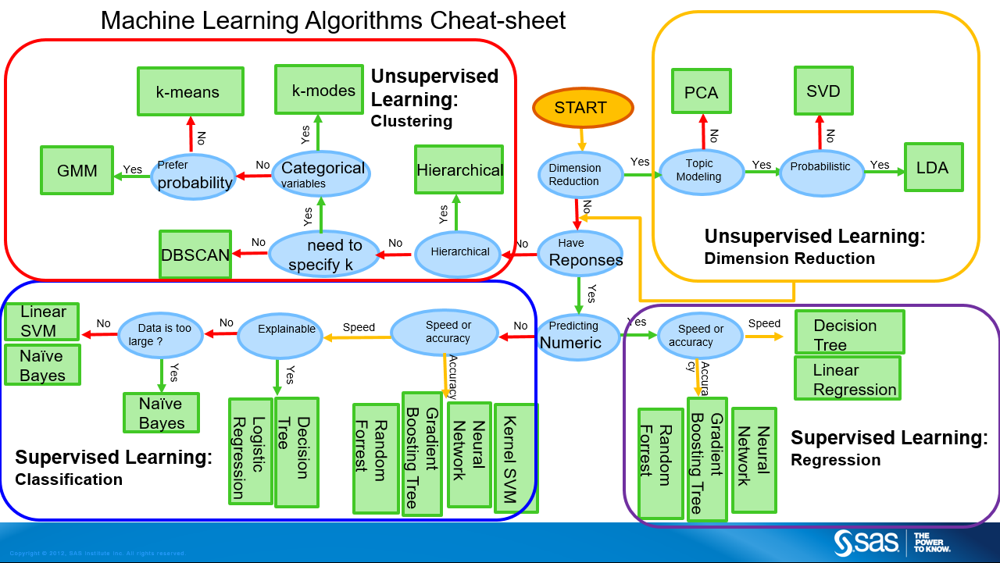

```{r setup, include=FALSE}
library(fOptions)
library(tidyverse)
library(lubridate)
library(bizdays)
library(ggplot2)
library(ggthemes)
library(gridExtra)
library(maps)
library(knitr)
library(tidyquant)

# Following line is added according to
# pg.3
# https://haozhu233.github.io/kableExtra/awesome_table_in_pdf.pdf
options(kableExtra.latex.load_packages = FALSE)
library(kableExtra)

knitr::opts_chunk$set(echo = FALSE, fig.align="center", collapse = TRUE, cache = TRUE)
chunk <- "```"
inline <- function(x = "") paste0("`` `r ", x, "` ``")
bank <- read.csv("https://goo.gl/PBQnBt", sep = ";")
token_qd <- 'JyeshGuNBGDbbaYoNURG'
token_av <- 'QWM66H05ENYFRDPO'
options("getSymbols.warning4.0"=FALSE)
```

<style type="text/css">
code.r{ /* Code block */
    font-size: 23px;
}
pre { /* Code block - determines code spacing between lines */
    font-size: 19px;
}
</style>

# Lecture 10: Building Financial Applications

# Starter

```{r echo = TRUE, results = "hide"}
# biorhythm.R

library(dplyr)
library(tidyr)
library(ggplot2)

biorhythm <- function(dob, target = Sys.Date()) {
  dob <- as.Date(dob)
  target <- as.Date(target)
  t <- round(as.numeric(difftime(target, dob)))
  days <- (t - 14) : (t + 14)
  period <- tibble(Date = seq.Date(from = target - 15, by = 1, length.out = 29),
                       Physical = sin (2 * pi * days / 23) * 100, 
                       Emotional = sin (2 * pi * days / 28) * 100, 
                       Intellectual = sin (2 * pi * days / 33) * 100)
  period <- gather(period, key = "Biorhythm", value = "Percentage", -Date)
  ggplot(period, aes(x = Date, y = Percentage, col = Biorhythm)) +
    geom_line() +  
    ggtitle(paste("DoB:", format(dob, "%d %B %Y"))) + 
    geom_vline(xintercept = as.numeric(target)) +
    theme(legend.position = "bottom")
}
```

# Starter - Result

```{r, echo = FALSE, fig.width=10}
source("../example/biorhythm.R")
```

```{r, echo = TRUE, fig.width=10}
# I took four people's birthdays. Hope they are in good mood today.
g1 <- biorhythm("1964-01-12", Sys.Date())
g2 <- biorhythm("1971-06-28", Sys.Date())
g3 <- biorhythm("1971-10-29", Sys.Date())
g4 <- biorhythm("1957-08-11", Sys.Date())
grid.arrange(g1, g2, g3, g4, ncol = 2, nrow = 2)
```

# Main course

- We need following packages as a start. Use c() to install multiple packages.

```{r eval=FALSE, include=TRUE, echo = TRUE}
install.packages(c("tidyquant", "Quandl", "fOptions", "fExoticOptions", "dygraph", "forecast"))
```

- `tidyquant` is also a collection of packages: `xts`, `quantmod`.

- Please validate option pricing code.
    + For example, I found Asian Option `TurnbullWakemanAsianApproxOption()` in `fExoticOptions` is strangely implemented. Maybe I am wrong.

# tidyquant or Quandl?
Determining factors:

- `tidyquant/quantmod` can connect to various services: ~google~, yahoo (still active), av (AlphaAdvantage).
- Quandl only connects to Quandl
- It's subjected to where you can find the data.
    - US ETF/Stocks on Quandl is a premium service.
    - ETF in Google/AlphaAdvantage is free.

# tidyquant or Quandl?

Technical details:

- quantmod returns `xts` object. Quandl returns data frame or `xts`
- xts object is can `collapse` to daily, weekly, monthly price.

# Tidyquant/quantmod

```{r, echo = TRUE}
# library(tidyquant)

# use Google
getSymbols('SPY', src = 'yahoo', adjusted = TRUE, output.size = 'full')
str(SPY)

# Sign up with AlphaAdvantage to get a token
# getSymbols('SPY', src = 'av', output.size = 'full', api.key = token_av)
# str(SPY)
```

# Tidyquant/quantmod
```{r, echo = TRUE}
# What's get returned?
head(SPY)
tail(SPY)

symbols <- c("MSFT", "AAPL")
getSymbols(symbols, src = 'yahoo', adjusted = TRUE, from = "2016-01-01")

```

# `xts` object
- xts is a wide format. In contrast, ggplot/tidy uses long format.
- We have gather/spread to convert between long/wide format.
- Create xts object:
    + Put index aside, which is usually date
    + Store prices in columns.

```{r eval=FALSE, include=TRUE, echo = TRUE}
library(xts)

# if df is a data frame.
# Date | V | GS
xts1 <- xts(x=df[, -1, drop = F], order.by = df[1])

# coredata: returns a matrix from xts objects
core_data <- coredata(xts2)

# index: vector of any Date, POSIXct, chron, yearmon, yearqtr, or DateTime classes
index(xts1)
```

# Get data from `xts` object

```{r, echo = TRUE}
# What price history is stored here.
str(SPY)
```

```{r, echo = TRUE, results = "hide"}
SPY2003 <- SPY["2003"]
SPY2 <- SPY["2003/2007"]
SPY3 <- SPY["2003-03-01/2007-07-01"]
SPY4 <- SPY["/2007-07-01"] # till 
SPY5 <- SPY["2007-07-01/"] # from
SPY6 <- SPY["2007-07-01/", "SPY.High"]
SPY7 <- SPY["2007-07-01/", c("SPY.High", "SPY.Close")]
```

# Quandl
```{r, echo = TRUE}
library(Quandl)
library(tidyverse)

# Sign up with Quandl to get a token
# token_qd <- "xxxx"
Quandl.api_key(token_qd)
## You don't get SPY: SPDR 500 ETF from Quandl from free service.
## rates <- Quandl(c("EOD/SPY"), start_date="2000-01-01", end_date="2013-06-07")
## You don't get EOD US Stocks for free from Quandl from 2019
## rates <- Quandl(c("EOD/V"), start_date="2000-01-01", end_date="2013-06-07" )
```

# Quandl
```{r, echo = T, fig.width = 8, fig.height = 3}
library(Quandl)					# Quandl package
library(ggplot2)				# Package for plotting
library(tidyverse)				# Package for reshaping data

Quandl.api_key(token_qd)				# Authenticate your token
# Build vector of currencies
rates <- Quandl(c("FRED/DEXUSAL", "FRED/DEXBZUS", "FRED/DEXUSUK", "FRED/DEXCHUS"),
                start_date="2000-01-01",
                end_date = "2018-11-28")
colnames(rates) <- c("Date", "AUD/USD", "USD/BRL", "GBP/USD", "USD/CNY")
meltdf <- gather(rates, key = "CCY", value = "Rate", -Date)

ggplot(meltdf, aes(x = Date, y = Rate, colour = CCY, group = CCY)) +
  geom_line() +
  scale_colour_manual(values=1:22)+
  ggtitle("Major Currency Exchange Rates in USD") +
  theme_minimal()
```

# Quandl and forecast

```{r, echo = TRUE, eval = FALSE}
# 52-quandl-forecast.R
# Quandl and Forecast
# Forecast using state space models and automatic ARIMA modelling.

library(Quandl)
library(dplyr)
library(xts)
library(lubridate)
library(forecast)
library(dygraphs)

# Start with daily data. Note that "type = raw" will download a data frame.
oil_daily <- Quandl("FRED/DCOILWTICO", type = "raw", collapse = "daily",  
                    start_date="2006-01-01", end_date=Sys.Date())
# Now weekely and let's use xts as the type.
oil_weekly <- Quandl("FRED/DCOILWTICO", type = "xts", collapse = "weekly",
                     start_date="2006-01-01", end_date = Sys.Date())
oil_monthly <- Quandl("FRED/DCOILWTICO", type = "xts", collapse = "monthly",
                      start_date="2006-01-01", end_date = Sys.Date())

# Have a quick look at our three  objects. 
str(oil_daily)
str(oil_weekly)
str(oil_monthly)

cat(paste0("daily: ", paste0(range(oil_daily$Date), collapse = ", "), "\n"))
cat(paste0("weekly: ", paste0(range(index(oil_weekly)), collapse = ", "), "\n"))
cat(paste0("monthly: ", paste0(range(index(oil_monthly)), collapse = ", "), "\n"))

# Change index from month to day
head(index(oil_monthly))
index(oil_monthly) <- seq(mdy('01/01/2006'), Sys.Date(), by = 'months')[1:length(oil_monthly)]
# index(oil_monthly) <- seq(mdy('01/01/2006'), (Sys.Date() - 365 * 2), by = 'months')
str(oil_monthly)
head(index(oil_monthly))

dygraph(oil_monthly, main = "Monthly oil Prices")

forebase1 <- oil_weekly[paste0("/", Sys.Date() - 365 * 2)]
forecast1 <- forecast(forebase1, h = 4 * 24)

plot(forecast1, main = "Oil Forecast1")

oil_forecast_data1 <- data.frame(date = seq(last(index(forebase1)), 
                                           by = 'week', length.out = 4 * 24 + 1)[-1],
                                Forecast = forecast1$mean,
                                Hi_95 = forecast1$upper[,2],
                                Lo_95 = forecast1$lower[,2])

oil_forecast_xts1 <- xts(oil_forecast_data1[,-1], order.by = oil_forecast_data1[,1])

forebase2 <- oil_weekly[paste0("/", Sys.Date() - 30)]
forecast2 <- forecast(forebase2, h = 4 * 3)

plot(forecast2, main = "Oil Forecast2")

oil_forecast_data2 <- data.frame(date = seq(last(index(forebase2)), 
                                            by = 'week', length.out = 4 * 3 + 1)[-1],
                                 Forecast2 = forecast2$mean,
                                 Hi_95_2 = forecast2$upper[,2],
                                 Lo_95_2 = forecast2$lower[,2])

oil_forecast_xts2 <- xts(oil_forecast_data2[,-1], order.by = oil_forecast_data2[,1])

# Combine the xts objects with cbind.
oil_combined_xts <- merge(oil_weekly, oil_forecast_xts1, oil_forecast_xts2)

# Add a nicer name for the first column.
colnames(oil_combined_xts)[1] <- "Actual"

dygraph(oil_combined_xts, main = "Oil Prices: Historical and Forecast") %>%
  dySeries("Actual", label = "Actual") %>%
  dySeries(c("Lo_95", "Forecast", "Hi_95")) %>%
  dySeries(c("Lo_95_2", "Forecast2", "Hi_95_2"))
```

# dygraph

dygraph for xts
<https://rstudio.github.io/dygraphs/shiny.html>

```{r, echo = TRUE, eval = FALSE}
dygraphOutput("dygraph")

dygraph(oil_combined_xts, main = "Oil Prices: Historical and Forecast") %>%
  # Add the actual series
  dySeries("Actual", label = "Actual") %>%
  # Add the three forecasted series
  dySeries(c("Lo_95", "Forecast", "Hi_95"))
```

# Quandl/Shiny/dygraph

```{r, echo = TRUE, eval = FALSE}
# shiny-51-quandl.R

library(shiny)

library(tidyverse) 
library(Quandl)
library(xts)
library(dygraphs)

goldChoice <- "CHRIS/CME_GC1.1" # gold data from CME

dataChoices <- c("WTI oil" = "FRED/DCOILWTICO", #oil data from Fred
                 "Copper" = "ODA/PCOPP_USD", # copper data from ODA
                 "Gold" = "CHRIS/CME_GC1.1",
                 "Silver" = "LBMA/SILVER.1",
                 "Copper" = "CHRIS/CME_HG1.1",
                 "Iron Ore" = "ODA/PIORECR_USD",
                 "Platinum" = "LPPM/PLAT.1",
                 "Palladium" = "LPPM/PALL.1",
                 "Bitcoin" = "BCHARTS/WEXUSD.1")

frequencyChoices <- c("days" = "daily",
                      "weeks" = "weekly", 
                      "months" = "monthly")

ui <- fluidPage(
  titlePanel("Commodity"),
  
  sidebarLayout(
    sidebarPanel(
      selectInput("dataSet",
                  "Commodity",
                  choices = dataChoices, #Freddie mac
                  selected = "WTI oil"),
      
      selectInput("frequency",
                  "freq",
                  choices = frequencyChoices, 
                  selected = "months"),

      dateRangeInput("dateRange",
                     "Date range",
                     start = "1980-01-01",
                     end   = Sys.Date())
    ),
    mainPanel(
      dygraphOutput("commodity"),
      dygraphOutput("commodity_gold")
    )
  )
)

server <- function(input, output, session) {
  Quandl.api_key("d9EidiiDWoFESfdk5nPy")
  
  gold <- reactive({
    gold <- Quandl(goldChoice,
                   start_date = format(input$dateRange[1]),
                   end_date = format(input$dateRange[2]),
                   order = "asc",
                   type = "xts",
                   collapse = as.character(input$frequency)
    )
  })  
  
  commodity <- reactive({
    commodity <- Quandl(input$dataSet,
                        start_date = format(input$dateRange[1]),
                        end_date = format(input$dateRange[2]),
                        order = "asc",
                        type = "xts",
                        collapse = as.character(input$frequency)
    )
  })
  
  output$commodity <- renderDygraph({
    dd <- merge(gold(), commodity())
    dd$ratio <- dd[,1]/dd[,2]
    dd <- dd[, -1, drop = F]
    colnames(dd) <- c(names(dataChoices)[dataChoices == isolate(input$dataSet)],
                      "Gold ratio")
    
    dygraph(dd, 
            main = paste("Price history of",
                         names(dataChoices[dataChoices==input$dataSet]), 
                         sep = " "),
            group = "gold group") %>%
      dyAxis("y", label = "$") %>%
      dySeries("Gold ratio", axis = 'y2') %>%
      dyOptions(axisLineWidth = 1.5, fillGraph = TRUE, drawGrid = TRUE,
                colors = RColorBrewer::brewer.pal(3, "Set1")) %>%
      dyRangeSelector()
  })
  
  output$commodity_gold <- renderDygraph({
    dygraph(gold(), 
            main = paste0("Ratio history of ",
                          names(dataChoices[dataChoices==input$dataSet]),
                                "/Gold"),
            group = "gold group") %>%
      dyAxis("y", label = "$") %>%
      dyOptions(axisLineWidth = 1.5, fillGraph = TRUE, drawGrid = TRUE) %>%
      dyRangeSelector()
  })
}

shinyApp(ui, server)
```

# Lecture 11: Building Predictive Model

# Machine Learning Algorithms

```{r, echo = FALSE, out.width = "80%"}

```

# Supervised v.s. Unsupervised
- Supervised learning: It is based on example input-output pairs. It infers a function from labeled training data consisting of a set of training examples
- Unsupervised learning: It is a type of self-organized learning that helps find previously unknown patterns in data set without pre-existing labels. It is also known as self-organization and allows modeling probability densities of given inputs.
- Reinforcement learning: ...

# Machine Learning Algorithms

- Regression
- Classification
- Ensemble
- Neutral network
  - Deep learning: multiple hidden layers.

# Regression and Classification

Regression and classification are two main categories of machine learning algorithms under supervised learning.

```{r, echo = FALSE, out.width = "80%"}
knitr::include_graphics("../new2019/class_reg.png")
```

# Regression

We used many linear regression methods.

```{r}
iris

ggplot(iris, aes(x = Sepal.Length, y = Petal.Width, color = Species)) +
  geom_smooth(method = "lm") +
  geom_point()

ggplot(iris, aes(x = Petal.Length, y = Petal.Width, color = Species)) +
  geom_smooth(method = "lm") +
  geom_point()

ggplot(iris, aes(x = Sepal.Length, y = Sepal.Width, color = Species)) +
  geom_smooth(method = "lm") +
  geom_point()

ggplot(iris, aes(x = Petal.Length, y = Sepal.Width, color = Species)) +
  geom_smooth(method = "lm") +
  geom_point()

```

# Caret
links to 200 over (238 as of this version)

https://topepo.github.io/caret/available-models.html


```{r}
library(caret)

trainIndex <- createDataPartition(iris$Species, p = .8,
 list = FALSE,
 times = 1)

train <- iris[ trainIndex,]
test  <- iris[-trainIndex,]

train_x <- select(train, -Species)
train_y <- train$Species

test_x <- select(test, -Species)
test_y <- test$Species

# Cross validation
fitControl <- trainControl(
 method = "repeatedcv",
 number = 10,
 repeats = 5)

# first run may need to do package installation. Caret
# install.packages("e1071")
dt.fit <- train(Species ~ ., data = train,
 method = "rpart",
 trControl = fitControl,
 preProcess=c("center", "scale"))

dt.fit
plot(dt.fit)

predictions <- predict(dt.fit, test)

confusionMatrix(predictions, test$Species)

rf_fit <- train(Species ~ .,
                data = train,
                method = "ranger")

rf_fit
plot(rf_fit)

predictions <- predict(rf_fit, test)
confusionMatrix(predictions, test$Species)
which(y_test != predictions)
y_test[which(y_test != predictions)]

```

```{r}
# install.packages("xgboost")
library(xgboost)

X_train <- xgb.DMatrix(as.matrix(train %>% select(-Species)))
y_train <- train$Species
X_test <- xgb.DMatrix(as.matrix(test %>% select(-Species)))
y_test <- test$Species

# Specify cross-validation method and number of folds. Also enable parallel computation

xgb_trcontrol = trainControl(
  method = "cv",
  number = 5,  
  allowParallel = TRUE,
  verboseIter = FALSE,
  returnData = FALSE
)

# This is the grid space to search for the best hyperparameters

xgbGrid <- expand.grid(nrounds = c(100,200),  # this is n_estimators in the python code above
                       max_depth = c(10, 15, 20, 25),
                       colsample_bytree = seq(0.5, 0.9, length.out = 5),
                       ## The values below are default values in the sklearn-api. 
                       eta = 0.1,
                       gamma=0,
                       min_child_weight = 1,
                       subsample = 1
                      )

# Finally, train your model

set.seed(0) 
xgb_model <- train(
  X_train, y_train,  
  trControl = xgb_trcontrol,
  tuneGrid = xgbGrid,
  method = "xgbTree"
)

# Best values for hyperparameters
xgb_model$bestTune

predictions <- predict(xgb_model, X_test)
confusionMatrix(predictions, y_test)
which(y_test != predictions)
y_test[which(y_test != predictions)]

```

One-hot encoding

Linear regression

```{r}
bank <- read.csv("https://goo.gl/PBQnBt", sep = ";")
bank_fit <- bank %>% select(y,
                loan,
                default,
                housing,
                poutcome,
                job,
                marital) %>%
  mutate_if(is.factor, as.character) %>%
  mutate(y = factor(y == "yes")) %>%
  as.data.frame() %>%
  mutate(nn = 1:n())

```

```{r, echo = FALSE}
deco_prefix <- function(df_in, prefix) {
  nn_nn <- which(colnames(df_in) == "nn")
  nn_max <- length(colnames(df_in))
  names_df <- colnames(df_in)
  colnames(df_in) <- c(names_df[1:nn_nn], paste0(prefix, names_df[(nn_nn+1):nn_max]))
  df_in %>% select(-nn) %>% mutate(nn = 1:n())
}

bank_new <- bank_fit %>%
  spread(job, job, fill = "0") %>% 
  deco_prefix("job.") %>%
  spread(marital, marital, fill = "0") %>%
  deco_prefix("marital.") %>%
  mutate_at(vars(starts_with("job.")), function(x) { ifelse(x == "0", 0, 1) }) %>%
  mutate_at(vars(starts_with("marital.")), function(x) { ifelse(x == "0", 0, 1) }) %>%
  mutate(loan = ifelse(loan == "yes", 1, 0),
         default = ifelse(default == "yes", 1, 0),
         housing = ifelse(housing == "yes", 1, 0),
         poutcome = ifelse(poutcome == "yes", 1, 0),
         y = ifelse(y == "yes", 1, 0)) %>%
  select(-nn)
# bank_new <- bank_new %>% mutate(y = factor(y))
```

```{r}
str(bank_fit)

dummies <- dummyVars(" ~ loan + default + housing + poutcome + job + marital", data = bank_fit, fullRank = TRUE)

bank_new <- data.frame(predict(dummies, newdata = bank_fit))
bank_new <- bind_cols(bank_fit["y"], bank_new)

# library(caret)
set.seed(123)
trainIndex <- createDataPartition(bank_new$y, p = .8,
 list = FALSE,
 times = 1)

train <- bank_new[ trainIndex,]
test  <- bank_new[-trainIndex,]

mod_fit <- train(y ~ .,  data=train, method="glm")

predictions <- predict(mod_fit, test)
confusionMatrix(predictions, test$y)
# which(test$y != predictions)

# Recursive Partitioning and Regression Trees
model_rpart <- train(y ~ ., data=train, method='rpart')

predictions <- predict(model_rpart, test)
confusionMatrix(predictions, test$y)

```

```{r}
# Load the packages - you won't know in the beginning.
# Slowly add this list up.


library(rattle)# normVarNames().
library(readr)# Efficient reading of CSV data.
library(dplyr)# Data wrangling, glimpse() and tbl_df().
library(tidyr)# Prepare a tidy dataset, gather().
library(magrittr)# Pipes %>% and %T>% and equals().
library(glue)# Format strings.
library(lubridate)# Dates and time.
library(FSelector)# Feature selection, information.gain().
library(stringi)# String concat operator %s+%.
library(stringr)# String operations.
library(randomForest)# Impute missing values with na.roughfix().
library(ggplot2)# Visualise data.

library(magrittr)

# dfpath <- "http://rattle.togaware.com/weatherAUS.csv"
dfpath <- "https://www.dropbox.com/s/dknnj9fbjhm33iw/weatherAUS.csv?dl=1"

dfpath <- "http://bit.ly/fe8828_weatherAUS2"

# load the original data
weatherAUS <- read_csv(file=dfpath)

# add more details and load again
weatherAUS <- read_csv(file=dfpath,
                       col_types = list(
                         .default = col_double(),
                         Date = col_date(format = ""),
                         Location = col_character(),
                         Evaporation = col_double(),
                         Sunshine = col_double(),
                         WindGustDir = col_character(),
                         WindDir9am = col_character(),
                         WindDir3pm = col_character(),
                         RainToday = col_character(),
                         RainTomorrow = col_character()))

glimpse(weatherAUS)

# a copy of original data
df <- weatherAUS

# colnames
names(df)

# change all names to small cases
names(df) <- tolower(names(df))

# Find all character fields
charc <- df %>% select_if(is.character, function(x) {x}) %>% colnames
charc

df[charc] %>% sapply(unique)

df$location %>% unique() %>% length()
df$location %>% table()

# change all character fields to factor
df %>% mutate_if(is.character, function(x) factor(x))

# Wind direction
df %>% select(contains("dir")) %>% sapply(table)

# Find all wind directions
compass <- df %>% select(contains("dir")) %>% gather(type, value) %>% .$value %>% unique %>% sort
compass

# Rain
df %>% select_at(vars("raintoday", "raintomorrow")) %>% sapply(table)

# convert to logic type
df <- df %>% mutate(raintoday = raintoday == "Yes",
                    raintomorrow = raintomorrow=="Yes")

df %>%
  select(raintoday, raintomorrow) %>% 
  summary()

# With some knowledge of the data we observe risk_mm captures the amount of rain recorded
# tomorrow. We refer to this as a risk variable, being a measure of the impact or risk of the target
# we are predicting (rain tomorrow). The risk is an output variable and should not be used as
# an input to the modelling—it is not an independent variable. In other circumstances it might
# actually be treated as the target variable.

# If not rains
df %>% filter(!raintomorrow) %>% select(risk_mm) %>% summary()

# If rains
df %>% filter(raintomorrow) %>% select(risk_mm) %>% summary()

# all variables/columns
vars <- names(df)

risk <- "risk_mm"

# find all numeric fields
num1 <- df %>% select_if(is.numeric) %>% colnames

# Given a date and a location we have an observation of the remaining
# variables. Thus we note that these two variables are so-called identifiers.
# Identifiers would not usually be used as independent variables for building predictive analytics models.

id<-c("date", "location")

# count per location/date
df[id] %>%
  group_by(location) %>% 
  count() %>%
  rename(days=n) %>%
  mutate(years=round(days/365)) %>% 
  as.data.frame() %>% 
  sample_n(10)

df[id] %>%
  group_by(location) %>% 
  count() %>%
  rename(days=n) %>%
  mutate(years=round(days/365)) %>%
  ungroup() %>%
  select(years) %>%
  summary()

ignore <- union(id, risk)
ignore

# We might also check for any variable that has a unique value for every observation
ids <- df[vars] %>%
  sapply(function(x) x %>% unique() %>% length()) %>% 
  equals(nrow(df)) %>%
  which() %>%
  names()

ids

# Fortunately, nothing
ignore <- union(ignore, ids)

# Ignore missing
missing <- df[vars] %>% 
  sapply(function(x) x %>% is.na %>% sum) %>%
  equals(nrow(df)) %>%
  which() %>%
  names()
missing

# Or mostly missing
missing.threshold <- 0.7

mostly <- df[vars] %>%
  sapply(function(x) x %>% is.na() %>% sum() / length(x))

mostly %>%
  '>'(missing.threshold) %>%
  which() %>%
  names() %T>%
  print()

ignore <- union(ignore, missing) %>% union(mostly)
ignore

# ignore excessive level variables
levels.threshold <- 20

# Identify variables that have too many levels.
too.many <- df[vars] %>%
  select_if(is.character) %>%
  names() %>%
  sapply(function(x) df %>% extract2(x) %>% unique %>% length()) %>%
  '>='(levels.threshold) %>%
  which() %>%
  names() %T>%
  print()

ignore <- union(ignore, too.many)
ignore

# ignore constants
constants <- df[vars] %>%
  sapply(function(x) all(x==x[1L])) %>% 
  which() %>% 
  names()
constants

ignore <- union(ignore, constants)

# Eliminate highly correlated
numc <- vars %>% 
  setdiff(ignore) %>%
  extract(df, .) %>% 
  select_if(is.numeric) %>% 
  colnames()
numc

df[numc] %>%
  cor(use="complete.obs") %>% 
  ifelse(upper.tri(.,diag=TRUE),NA, .) %>%
  abs %>%
  data.frame %>%
  tbl_df %>%
  set_colnames(numc) %>%
  mutate(var1=numc) %>%
  gather(var2, cor,-var1) %>%
  na.omit %>%
  arrange(-abs(cor))

correlated<-c("temp3pm","pressure3pm","temp9am")

ignore <- union(ignore, correlated)
ignore

# Use caret package
library(caret)
correlationMatrix <- cor(df[,numc], use="complete.obs")
highlyCorrelated <- findCorrelation(correlationMatrix, cutoff=0.8)
highlyCorrelated

# Just keep one variable for temperature
correlated <- numc[highlyCorrelated]
correlated <- correlated[-1]
correlated

# Final list of variable to build the model
vars <- setdiff(vars, ignore)
length(vars)

vars

# put raintomorrow first
target <- "raintomorrow"
vars <- c(target, vars) %>% unique()

# Use correlation search to identify key variables.
cfs(form, df[vars])

# Use information gain to identify variable importance.
information.gain(form, df[vars])

missing.target <- df %>% extract2(target) %>% is.na()
sum(missing.target)

library(purrr)

nrow(df)

df <- df %>% filter_at(vars(target), compose(not, is.na))
nrow(df)

df <- mutate_if(df, is.character, factor)

# omit na or fix
df_omit <- df %>% filter_at(vars(vars), compose(not, is.na))
nrow(df_omit)

# convert all character to levels
df_nafix <- df
df_nafix[vars] <- df_nafix[vars] %>% randomForest::na.roughfix()

nrow(df_nafix)

df_nafix %>%
  ggplot(aes_string(x=target)) +
  geom_bar(width=0.2,fill="grey") +
  theme(text=element_text(size=14))

df_omit %>%
  ggplot(aes_string(x=target)) +
  geom_bar(width=0.2,fill="grey") +
  theme(text=element_text(size=14))

inputs <- setdiff(vars, target)
inputs
df

set.seed(7465)
getwd()

df_sel <- df_omit
# df_sel <- df_nafix

# Other tools
# Cluster the numeric data per location.
NCLUST <- 5

add_cluster <- function(df_sel) {
  NCLUST <- 5
  
  cluster <- df_sel[c("location", numc)] %>%
    group_by(location) %>%
    summarise_all(funs(mean(., na.rm=TRUE))) %T>%
    {locations <<- .$location} %>% # Store locations for later.
    select(-location) %>%
    sapply(function(x) ifelse(is.nan(x), 0, x)) %>%
    as.data.frame() %>%
    sapply(scale) %>%
    kmeans(NCLUST) %T>%
    print() %>%
    extract2("cluster")
  
  cluster
  
  ## K-means clustering with 5 clusters of sizes 4, 22, 10, 8, 5
  ##
  ## Cluster means:
  ## min_temp max_temp rainfall evaporation sunshine
  ## 1 -0.6271436 -0.5345409 0.061972675 -1.2699891 -1.21861982
  ## 2 -0.3411683 -0.5272989 -0.007762188 0.1137179 0.09919753
  head(cluster)
  ## [1] 3 2 2 3 4 2
  
  # Index the cluster vector by the appropriate locations.
  names(cluster) <- locations
  # Add the cluster to the dataset.
  df_sel %<>% mutate(cluster="area" %>%
                       paste0(cluster[df_sel$location]) %>%
                       as.factor)
  # Check clusters.
  df_sel %>% select(location, cluster) %>% sample_n(10)

  print(cluster[levels(df_sel$location)] %>% sort())
  df_sel
}

df_omit <- add_cluster(df_omit)
df_nafix <- add_cluster(df_nafix)

# add cluster to vars
vars <- c(vars, "cluster") %>% unique
vars

save(list = c("df_nafix", "df_omit", "vars", "inputs", "target"),
     file = "E:/Dropbox/Docs/MFE/FE8828/2019/notes-2019/new2019/data_model.Rda")

```

```{r}
vv <- load(file = "E:/Dropbox/Docs/MFE/FE8828/2019/notes-2019/new2019/data_model.Rda")
vv

df_sel <- df_omit

# Preparing for data modeling

form <- df[vars] %>%
  formula() %>%
  print()
form

seed <- 42
set.seed(seed)

nobs <- 10000
df   <- df_sel[sample(nobs),]

train <- nobs %>% sample(0.70*nobs)
validate <- nobs %>% seq_len() %>% setdiff(train) %>% sample(0.15*nobs)
test <- nobs %>% seq_len() %>% setdiff(union(train, validate))
  
# Cache the various actual values for target and risk.
tr_target <- df[train,][[target]]
tr_risk <- df[train,][[risk]]
va_target <- df[validate,][[target]] 
va_risk <- df[validate,][[risk]]

te_target <- df[test,][[target]]
te_risk <- df[test,][[risk]]

library(rpart)        # Model: decision tree.

# modeling
# Train a decision tree model.
m_rp <- rpart(form, df[train, vars])

model_rpart <- train(y.TRUE ~., data=train, method='rpart')
```
