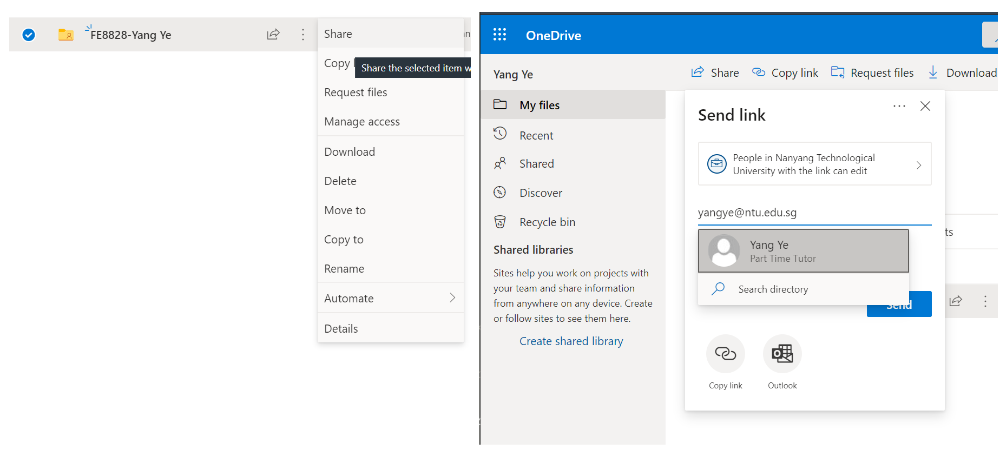
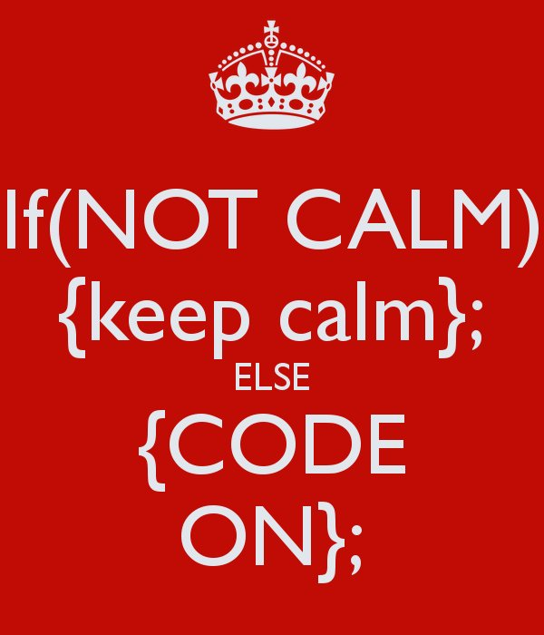
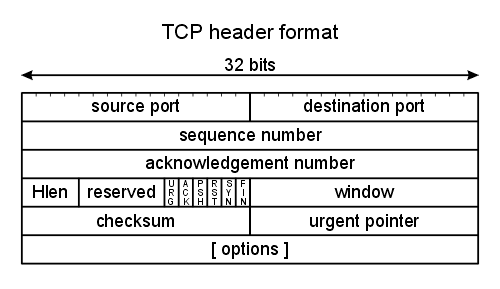
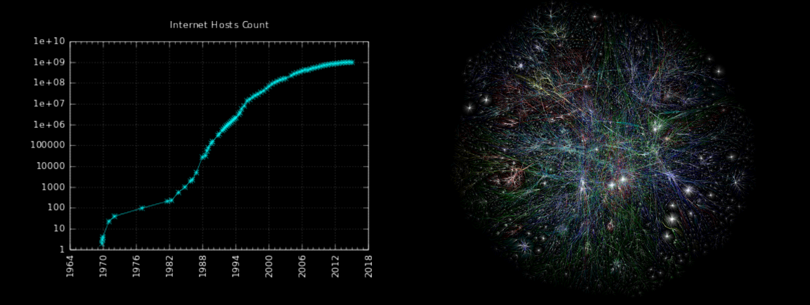

```{r setup, include=FALSE}
library(conflicted)
library(tidyverse)
library(shiny)
library(lubridate)
library(bizdays)
library(fOptions)
library(ggplot2)
conflict_prefer("filter", "dplyr")
knitr::opts_chunk$set(echo = FALSE, fig.align="center", collapse = TRUE)
inline <- function(x = "") paste0("`` `r ", x, "` ``")
chunk <- "```"
```

<style type="text/css">

code.r{ /* Code block */
    font-size: 23px;
}

pre { /* Code block - determines code spacing between lines */
    font-size: 18px;
}

</style>

# 0. Introduction to FE8828

## Introduction

- With FE8828, I hope to bridge the theory and practice.

- Often, when we study, teachers feed us many theories. We learnt the "result" (and forgot most of them) but not the "process".

- We learn about the "process" in this course.

- The "process" leads us to think how to apply theory, how theory work and how it doesn't work. And better memory of the theory.

- Because finance is an empirical science. All theories come from observation and need to be validated by the real world.


## Finance: a workflow point of view

- We go through such process with finance applications.

\centering
Data -> ( Model <-> Appplication ) -> Result

+ Application is usually composed of
  - Input
  - Computing Engine for Valuation/Risk/Trading
  - Output

+ Result is
  - Value
  - Risk
  - Trading signal
  - And ultimately, translate to profit and loss ("PnL", "P&L"), or cost (i.e. different value and risk costs differently in capital lending rate).


## Data science workflow

\centering
Data -> Model -> Application

```{r, echo = FALSE, out.width = "60%"}
knitr::include_graphics("imgs/data-science-explore.png")
```

- It resembles with the "Data Science" (DS) flow. Quants and DS share commonalities of working on data and model.
- That's why "Quants" are pre-historical Data Scientist and DS are "modern quants in large".


## Programming/Internet is so powerful today!

- Programming practice has grown that there are tools for each step/stage of the workflow.
- With Internet/Web, data and computing power is also available at our fingers.

```{r, echo = FALSE, out.width = "90%"}
knitr::include_graphics("new/tidyverse.png")
```


## Learn the "process"

- It was difficult to do these in the past (see my later example on CAPM and Fama-French).
By mastering the tools at different steps, we know the "process". Basically, we know how to get things done!
- It is not going to be too easy, too. Everyone (in the profession) has the tool. We also need to be rooted in theory and a domain application to excel.


## Example: How Fama-French 3-factor model expanded CAPM?

- CAPM (1961-1966):

$$R_a = R_{rf} + \beta_a * \left(R_m - R_{rf}\right)$$

- Fama-French 3-Factor Model (1993):

$$R_{it} - R_{ft} = \alpha_{it} + \beta_1 ( R_{Mt} - R_{ft} ) + \beta_2SMB_t + \beta_3HML_t + \epsilon_{it}$$
SMB stands for "Small [market capitalization] Minus Big" and HML for "High [book-to-market ratio] Minus Low"; they measure the historic excess returns of small caps over big caps and of value stocks over growth stocks.

### Question
+ What step/stage do we need for implementing Fama-French 3-Factor Model?


## There are more endeavours to do!

+ Descriptive data analysis
+ EDA: exploratory data analysis
+ Data cleaning
+ ...
+ Supply/demand analysis
+ Option pricing and trading strategy
+ Algorithmic trading
+ Asset allocation
+ Risk analytics
+ Sentiment analysis
+ Machine learning
+ Deep learning
+ ...


## Our course: in detail

* Real-world finance application, asset allocation, trading strategy and derivatives valuation.
  - We will learn Programming/data science/finance in the context of Internet
  - We will build on from beginner R to intermeidate R
* You will have ample exercise in this course - learn for your own achivement.


## Our course: Tidyverse with a finance flavor

```{r, echo = FALSE, out.width = "70%"}
knitr::include_graphics("new/tidy2.png")
```

## What does it take?

* Pick up a habit of good analyst:
  + Use reproducible research, well-organized.
  + Have a mind for data exploration
  + Have a mind for analysis: answer is not fixed but open-ended. You need to draw conclusion and make suggestion.
  + Have a mind for strategy thinking

## Course Outline: Week 1-3

- Week 1:
    * What's Internet? What's Web?
    * (Optional) Launch into the Cloud: AWS
    * R Markdown and R Shiny/1: layout
    * R Programming/1
- Week 2:
    * R Programming/2
    * R Shiny/2: Building a web app
    * dplyr/1: Data Manipulation
- Week 3:
    * dplyr/2: EDA
    * Building Financial Applications/1

## Course Outline: Week 4-6

- Week 4
    * ggplot2: Data Visualization and EDA
    * R Shiny/3: Reactive
- Week 5
    * Building Financial Applications/2
    * Building Predictive Model
- Week 6:
    * Blockchain

### Keep it Flexiable
- I hope to cover some ad-hoc pratical topics if feasible.


## Assingment

<!--
- Assignment 1: A static website: a front page, an about page and some description pages. (due by week 2)
- Assignment 2: Shiny web application. (due by week 3)
- Assignment 3: Data analysis (due by week 4)
- Assignment 4: Data visualization (due by week 5)
- Assignment 5: Group project (due the Sunday after exam, I need to submit scores by Monday)
-->

- 4-5 individual assignments + 1 group assignment. No exam.

- Organization
    - Name your directory as FE8828-Your Name.
    - Organize your assignments into directories, e.g. Assignment 1, Assignment 2, ...

```{r, echo = FALSE, out.width = "70%"}
knitr::include_graphics("new/assignment-org.png")
```


## Submission by sharing

  - Share the directory with *yy@runchee.com* on Google drive, or *yangye@ntu.edu.sg* with NTU One Drive.
    
```{r, echo = FALSE, out.width = "70%"}

```

## Keep calm and code on

```{r, echo = FALSE, out.width = "30%"}

```

### Questions?

# Lecture 1: What's Internet? What's Web?

Let's pick up the jargons!

- Network
- Internet
- HTTP/HTML/Web

```{r, echo = FALSE, out.width = "40%"}
knitr::include_graphics("imgs/Internet_map_1024.jpg")
```

## Network is to connect the dots/devices

```{r, echo = FALSE, out.width = "40%", fig.show='hold', fig.align='center'}
knitr::include_graphics(c("imgs/dot-to-dot-connect-the-dots.jpg", "imgs/network_connect_dots.jpg"))
```

## Building network

* There are many ways to connect the devices: Network topology
* Different network topology takes different way of communications.
* Fully-connected network is the most costly and robust. Ring is the cheapest but vulnerable.

```{r, echo = FALSE, out.width = "40%"}
knitr::include_graphics("imgs/Common-network-topologies.png")
```

### Which network topology is our home Wi-Fi?

## What runs inside the cables?
  
```{r, echo = FALSE, out.width = "62%"}
knitr::include_graphics("imgs/cables.jpg")
```

## Network talks with Network Protocol

1. Information turns to *packet* according to protocol speicification.
2. *Protocol* specifies the creation, transmission and receiving of *packet*.
3. Hardware infrastructure *routes* the *packets* to the destination.

## Packet

1. Information turns to packet

```{r, echo = FALSE, out.width = "60%"}

```

## Protocol

2. Protocol designs the packet and process

TCP Session

```{r, echo = FALSE, out.width = "25%"}
knitr::include_graphics("imgs/375px-TCP_CLOSE.svg.png")
```

DHCP Session

```{r, echo = FALSE, out.width = "22%"}
knitr::include_graphics("imgs/DHCP_session.svg.png")
```

## Routing/Gateway

3. Infrastructure helps to *route* the packets to the destination.

```{r, echo = FALSE, out.width = "70%"}
knitr::include_graphics("imgs/wireshark-packets.jpg")
```

## TCP/IP and Internet

- What we learnt just now was implemented in large-scale in ARPANET in the 1970s by the Defense Advanced Research Projects Agency (DARPA)
- It's called the *TCP/IP* model that went on to build the Internet.


## What does TCP/IP gives?

A family of protocols but what's most famous/"fundamental" is IP and TCP.

1. IP (Internet Protocol): You shall heard of "IP address", like `192.168.1.100`.
    
2. TCP (Transmission Control Protocol) / UDP (User Datagram Protocol)
    - TCP provides reliable, ordered, and error-checked delivery of a stream
    - UDP provides real-time transmission which can accept failure.


## TCP/IP

3. Four Layers

```{r, echo = FALSE, out.width = "37%"}
knitr::include_graphics("imgs/640px-UDP_encapsulation.svg.png")
```

4. Application layer runs many protocols

```{r, echo = FALSE, out.width = "35%"}
knitr::include_graphics("imgs/tcp-ip.png")
```

## Why Internet growed in size?

- A family of expandable network protocols: easy join, allows failure. That's also what we want to learn to do.

```{r, echo = FALSE, out.width = "54%"}

```

- IETF (Internet Engineering Task Force) maintains and still gets new protocol approved.

```{r, echo = FALSE, out.width = "25%"}

```

## What happens after plugging cable, or turning on Wi-Fi, turn on the 5G phone?

* New network device sends a join request.
* Network gateway receives the message, allocate an IP address for the new device.
* Device accepts the IP address and uses it to label for itself. Router also knows where to send the packet.
* This auto-configure process is carried out by *Dynamic Host Configuration Protocol* (DHCP) protocol.

## When it wants to visit someone on the network? DNS

- DNS is the directory service for internet.
  - We don't use *123.456.789.012* but *www.google.com*.
  - One kind of attack to Internet is to hijack/brings down Root Domain Servers for Global (8 of them) or a country's root DNS.
  - (Demo with nslookup.)

```{r, echo = FALSE, out.width = "14%"}

```

## When it wants to visit someone on the network? HTTP/HTML

- Now we shall have an idea of how Internet works, let's move on to Web ("World Wide Web")
- Initiated by Tim Berners-Lee at CERN (where big collison happens in "The Large Hadron Collider") in 1989.
  - Is he supposed to be a nuclear physicist?
- Tim initiated/invented both the HTTP (protocol) and HTML (content).

## HTTP Request/Response

* Request

\footnotesize

    GET /index.html HTTP/1.1
    Host: www.example.com

\normalsize
* Response

\footnotesize

    HTTP/1.1 200 OK
    Date: Mon, 23 May 2005 22:38:34 GMT
    Content-Type: text/html; charset=UTF-8
    Content-Encoding: UTF-8
    Content-Length: 138
    Last-Modified: Wed, 08 Jan 2003 23:11:55 GMT
    Server: Apache/1.3.3.7 (Unix) (Red-Hat/Linux)
    ETag: "3f80f-1b6-3e1cb03b"
    Accept-Ranges: bytes
    Connection: close
    <html>
      <head>
      <title>An Example Page</title>
      </head>
      <body>
      Hello World, this is a very simple HTML document.
    </body>
    </html>
  

## HTTP/HTTPS/HTML

- Hypertext Transfer Protocol (HTTP) but obviously, it does file, music, anything else now.
- It's a clear text protocol. That's why we need to use HTTPS (HTTP on SSL) to secure the communication.
- In browser, you can see the green lock in address bar. This is about digital certificate, associated with crytography and authentication. Another topic.


```{r, echo = FALSE, out.width = "50%"}
knitr::include_graphics("imgs/Wikimedia_donation_page_with_extended_validation_certificate_in_firefox.png")
```

## Web

When you have HTML and URL (Uniform Resource Locator), Web is born.

- Website: https://en.wikipedia.org/
  - Document: https://en.wikipedia.org/wiki/World_Wide_Web
- Resource: https://en.wikipedia.org/wiki/World_Wide_Web#/media/File:Web_Index.svg

How this resource (URL) is used in document (HTML).

\footnotesize

    <div class="thumbinner" style="width:302px;">
      <a href="/wiki/File:Web_Index.svg" class="image">
      
      </a>
      </div>

\normalsize

## Web Browser

First generation (1993)

```{r, echo = FALSE, out.width = "75%"}
knitr::include_graphics("imgs/mosaic-browser.jpg")
```

## Web application

- Static v.s. Dynamic
- Dynamic website display content based on user input.
- Supported by HTML/CSS/JavaScript. HTML 5, CSS 3 and JavaScript 7 .
- App also uses HTML/CSS/JS.

```{r, echo = FALSE, out.width = "55%"}
knitr::include_graphics("imgs/HTML5_CSS_JavaScript.png")
```

## Web application

+ Why it is important? Needless to say. It is not 1995 anymore.
  - Easy to deploy: no copy needed
  - Runs fast: every browser is optimized
  - Easy to develop: less effort than Mobile App and cross-platform.

```{r, echo = FALSE, out.width = "25%"}
knitr::include_graphics("imgs/heisencat.png")
```

## What would we like to do?

### Now comes the final part

- With the Internet infrastructure, we can get finance data (price, economic indicators) easily
- We can use the tools to process them, pass them through model and computing engine
- AS the result, we will have an application.
- We don't need to write HTML/CSS/JavaScript. We will write R and it assembly HTML/CSS/JavaScript for us.

## Take-home

### Why the Internet has succeeded?

- Information flows by packet.
- Protocol enables easy join, allows failure.
  - Local device just needs to send the packet
  - Nework routers/gateways does the route/transmission to the destination.
  - Scalable and Efficient

### Why Web has succeeded?

- Web helps to locate universal resource.
- Web helps to organize them in one place.

## Take-home

### Finance application

- Any finance application is a data application.
- Internet gave us the access to data and computing power.

### Inspiration
- Internet is a recent invention that's just 30-something years old.
- Quant finance is also young: (Bachelier 1900s), Markowitz 50s, CAPM 60s, APT/Black-Scholes 70s, Quant finance 80s, Factor research 90s, High-Frequency trading 00s, GFC/QE 08, Robo-invest/ML/DL 10s, post-COVID 20s (hope not too long) ...
- Both are journeies of inventions and mavericks that inspire you to live to the future of quant research.
- We are learning/using recent inventions and have the opportunities to brings them forward.


# Lecture 2: Launch into the Cloud: Amazon Web Services

- Sign-up for AWS Account
- Setup AWS for EC2
- Launch EC2
- Running R

Disclaimer:

1. I am not owning Amazon shares directly or indirectly.
2. I don't plan to long AMZN during the course of this course.
3. I am not working for Amazon and I don't get paid by doing this except receiving AWS educate credit.


# Lecture 3: R Markdown and R Shiny/1: layout

## Introduction

- `Markdown` is a format that is easy to read and can be converted to other formats, HTML, PDF, Word, Slides.
- R Studio extends it further to create R notebook, interactive document and web application, which is `R Markdown`.
- *Shiny* is a web programming framework in R. We use it extensively in this course. We begin with the layout part.

## Markup and Markdown

- Document stores information.
- Web is a superset of interlinked documents.
- HTML is a markup language, built for machines.
- Markdown is for humans to write doc, with minimal added to decorate it, created by John Gruber in collaboration with Aaron Swartz in 2004.

### 
      
    A Markdown-formatted document should be publishable as-is,
    as plain text, without looking like it's been marked up
    with tags or formatting instructions.
                                                - John Gruber

```{r, echo = FALSE, out.width = "15%"}
knitr::include_graphics("imgs/Markdown-mark.svg.png")
```

## Markdown example

\footnotesize
```{r echo = FALSE, comment = ""}
cat(htmltools::includeText("example/markdown-example.md"))
```

## Markdown output example

```{r, echo = FALSE, out.width = "47%"}
knitr::include_graphics("imgs/markdown-doc-preview.png")
```

## Markdown: Header and Code

### Headers

More hashtag, deeper level.

```{r echo = FALSE, comment = ""}
cat("# Header1\n## Header2\n### Header3\n")
```

### Code

Give four spaces before it

```{r echo = FALSE, comment = ""}
cat("    if (a > 0) {\n      print(a)\n    }\n")
```

## Markdown: List

    * First paragraph.
    Continued.

    * Second paragraph. With a code block, which must be indented
    eight spaces:

            { code }

```{r, echo = FALSE, out.width = "9%"}
knitr::include_graphics("imgs/professortocat.png")
```

* First paragraph.
Continued.

* Second paragraph. With a code block, which must be indented eight spaces:

## Markdown: Multi-level list

Put four more spaces for each level.

    * fruits
        + apples
            - macintosh
            - red delicious
        + pears
    * vegetables
        + broccoli

* fruits
    + apples
        - macintosh
        - red delicious
    + pears
* vegetables
    + broccoli

## Markdown: Ordered List

Put 4 more spaces for each level.

    #. Chapter 1
        #. Section 1.1
        #. Section 1.2
    #. Chapter 2
    #. Chapter 3

```{r, echo = FALSE, out.width = "9%"}
knitr::include_graphics("imgs/gangnamtocat.png")
```

#. Chapter 1
    #. Section 1.1
    #. Section 1.2
#. Chapter 2
#. Chapter 3

## Table

    | Tables        | Are           | Cool  |
    | ------------- |:-------------:| -----:|
    | col 3 is      | right-aligned | $1600 |
    | col 2 is      | centered      |   $12 |
    | zebra stripes | are neat      |    $1 |

```{r, echo = FALSE, out.width = "12%"}
knitr::include_graphics("imgs/ironocto.png")
```

| Tables        | Are           | Cool  |
| ------------- |:-------------:| -----:|
| col 3 is      | right-aligned | $1600 |
| col 2 is      | centered      |   $12 |
| zebra stripes | are neat      |    $1 |

## Markdown: Inline formatting

### Emphasis

To emphasize some text, surround it with *s or _, like this:

    This text is \_emphasized with underscores\_, and this
    is \*emphasized with asterisks\*.
    Double * or _ produces strong emphasis:

    This is \*\*strong emphasis\*\* and \_\_with underscores\_\_.

```{r, echo = FALSE, out.width = "7%"}
knitr::include_graphics("imgs/megacat-2.png")
```

This text is _emphasized with underscores_, and this is *emphasized with asterisks*.
Double * or _ produces strong emphasis.

This is **strong emphasis** and __with underscores__.
A * or _ character surrounded by spaces, or backslash-escaped, will not trigger emphasis.

### Strikthrough

This \~\~is deleted text.\~\~

This ~~is deleted text.~~


## Markdown: formatting

### Superscripts and subscripts

H\~2\~O is a liquid.  2\^10\^ is 1024.

H~2~O is a liquid.  2^10^ is 1024.

### Verbatim. inline code

Use backtick \` (the key to the left of 1)

What is the difference between \`a = 1\` and \`a <- 1\`?

What is the difference between `a = 1` and `a <- 1`?

Note:

* If the verbatim text includes a backtick, use two backticks.
* Use \\\\ to turn off \\

### Links

    <http://google.com>

```{r, echo = FALSE, out.width = "9%"}

```

<http://google.com>

## Markdown: Images

A link immediately preceded by a ! will be treated as an image. The link text will be used as the image's alt text:

    

```{r, echo = FALSE, out.width = "9%"}
knitr::include_graphics("imgs/ski-octo.png")
```

{width=40%}


## Markdown: Formula

MathJax. Use LaTex syntax. There are many online references.

- Inline with text, `$x = {-b \pm \sqrt{b^2-4ac} \over 2a}$`, $x = {-b \pm \sqrt{b^2-4ac} \over 2a}$
  
- Or, Centered, `$$\sum_{i=1}^n X_i$$`

$$\sum_{i=1}^n X_i$$
    
## Markdown Support in R Studio
    
- `R Markdown` is a extension to Markdown that you can execute code among the code.
- It's with suffix __.Rmd__. R Studio has good support for it.
- Reference
  - R Markdown Cheat Sheet: `Help > Cheatsheets > R Markdown Cheat Sheet`,
  - R Markdown Reference Guide: `Help > Cheatsheets > R Markdown Reference Guide`.
- Create via `File > New File > R Markdown`.

## R Markdown Document example

\footnotesize
```{r echo = FALSE, comment = ""}
cat(htmltools::includeText("example/rmd-example-doc.Rmd"))
```

## R Markdown Document Output

In the header, you can change the output to other types:

- html_document
- pdf_document
- word_document

After all, press `Ctrl+Shift+K` or Click `Knitr`

## Code block for R Markdown

- Embed code (R, Python, etc.) in R Markdown
* R code can be inline. For example, to generate a random number everytime, include this `r inline("runif(1, 0, 1)")`, `r runif(1, 0, 1)`.
- R code can exist as block, run and show its results. `Calculate_7` is the chunk name. It's optional to give a chunk name. If included, each code chunk needs a distinct name. It's usually best to give each code chunk a name, for easier debug.

Code chunk example:

    `r chunk`{r Calculate_7}
    a <- 3
    b <- 4
    print(a + b)
    `r chunk`

Result

```{r Calculate_7}
a <- 3
b <- 4
print(a + b)
```


## Chunk options
  
* _echo_ is to decide whether to display code, default is `FALSE`.
* _results_ is to decide whether to display result, default is "markup", set to "hide" to hide.
* _include_ is to hide both code and result, default is `FALSE`.

\footnotesize

      `r chunk`{r cars, echo = TRUE}
      a <- runif(100, 0, 1)
      `r chunk`
      
```{r runif, echo = TRUE}
a <- runif(100, 0, 1)
```


      `r chunk`{r plot}
      plot(a)
      `r chunk`

```{r plot, out.width = "50%"}
plot(a)
```

## R Markdown: Table

\footnotesize

    `r chunk`{r kable}
    knitr::kable(
      mtcars[1:5, ], 
      caption = "A knitr kable."
    )
    `r chunk`

```{r kable}
knitr::kable(
  mtcars[1:5, ], 
  caption = "A knitr kable."
)
```

## R Markdown example: Plot

\footnotesize

    `r chunk`{r plot1, echo = FALSE}
    a <- filter(cars, speed > 4)
    plot(a)
    `r chunk`

```{r plot1, echo = FALSE, out.width = "60%"}
a <- filter(cars, speed > 4)
plot(a)
```

## R Shiny

- To start, use R Studio.
- File > New File > Shiny Web App...
- Choose single file
- Give a name and folder 
- Ctrl+Shift+S or “Run App”

## UI First

I removed everything in functions `server` and `ui`. This is the minimal Shiny. (shiny-1-empty.R)

\footnotesize
```{r echo = FALSE, comment = ""}
cat(htmltools::includeText("example/shiny-1-empty.R"))
```

## Sidebar Layout

Let's add a minimal sidebarLayout (shiny-2-sidebar.R)

\footnotesize
```{r echo = FALSE, comment = ""}
cat(htmltools::includeText("example/shiny-2-sidebar.R"))
```


## `fluidPage`

- fluidPage means to place the controls from left-right, top-down order.
- `fluidPage` function can take any number of input parameters.


        fluidPage(sidebarLayout(
            sidebarPanel(),
            mainPanel()
        ))
        

## Add some tags

- `titlePanel("Hello Shiny!")`, `h1("Introduction to Layout")`, `h2("Sidebar Layout")` (shiny-3-sidebar-min.R)

\scriptsize
```{r echo = FALSE, comment = ""}
cat(htmltools::includeText("example/shiny-3-sidebar-min.R"))
```

## Sidebar layout with bar on the right

    fluidPage(
        sidebarLayout(position = "right",
        sidebarPanel(),
        mainPanel()
        )
    )

## More tags: Sidebar with more tags (shiny-3-sidebar.R)

\tiny
```{r echo = FALSE, comment = ""}
cat(htmltools::includeText("example/shiny-3-sidebar.R"))
```

## Each tag is a function.

\footnotesize

    h1("A header")
    p("some text as a paragraph")
    a("A link to Google", href="http://www.google.com")
    img(src = "p19-Hero-Image-796x398.jpg", width = "100%")
    tags$ul("title", tags$li("Item 1"), tags$li("Item 2"))
    tags$ol("Step", tags$li("Item 1"), tags$li("Item 2"))

Note:

* For image, you need to create a sub-directory `www` together with the R source file. Place the file under it.
* tags is a list of functions. To avoid name conflict, I prefer to use `tags$img()`, even `img()` is available to use.

## Panels

`titlePanel()` and `wellPanel()` (shiny-4-wellPanel.R)

\scriptsize
```{r echo = FALSE, comment = ""}
cat(htmltools::includeText("example/shiny-4-wellPanel.R"))
```

## Navlist panel (shiny-5-navPanel.R)

\scriptsize
```{r echo = FALSE, comment = ""} 
cat(htmltools::includeText("example/shiny-5-navPanel.R"))
```


## tabPanel (shiny-6-tabPanel.R)

\footnotesize
```{r echo = FALSE, comment = ""}
cat(htmltools::includeText("example/shiny-6-tabPanel.R"))
```

## navBar (shiny-7-navbar.R)

\footnotesize
```{r echo = FALSE, comment = ""}
cat(htmltools::includeText("example/shiny-7-navbar.R"))
```

## Column-based layout (shiny-8-column.R)

- Caveat: There is fluidRow, but no fluidColumn.
- Column counts always add up to 12 = 4 + 6 + 2; otherwise, it will appear in the next line.

\tiny
```{r echo = FALSE, comment = ""}
cat(htmltools::includeText("example/shiny-8-column.R"))
```

## Composition layout: Top and Down (shiny-10-composite.R)

\tiny
```{r echo = FALSE, comment = ""}
cat(htmltools::includeText("example/shiny-10-composite.R"))
```

## R Markdown can also contain Shiny (shiny-mfe-example.Rmd)

\footnotesize
```{r echo = FALSE, comment = ""}
cat(htmltools::includeText("example/shiny-mfe-example.Rmd"))
```

<!--
```{r, echo = FALSE}
wellPanel("Inputs",
          numericInput("fav_num", "What's your favorite number?", 3))
```

This is interactive document.
-->

## Take-home

- Markdown is a simplified way to write formatted documents.
- R Markdown can embed code and results. It can mix code and documentation, speed up research progress.
- R Shiny is a web framework. One tag is one function. Easy to compose web page.

## Assignment
- Create a website (perhaps a single *.R* file) with Shiny using one of the layouts
    - You are starting a company to offer.
    - Decide what you want to do
    - Create three pages. Name the pages depending on what you want to do. e.g. Product, About Us and Contact Us
    - Use different layouts for the pages: sideBar, column-based layout, Navlist.
    - Be creative!

## Demo website with navBar style.

```{r, echo = FALSE, out.width = "75%"}
knitr::include_graphics("imgs/runchee.png")
```

# Lecture 4: R Programming

## R programming

Let's review some R basics and progress to intermediate level. We have following topics:

- Vector/Matrix/String/Date/Time
- Data Frame
- List
- Load/Save
- Anonymous function
...

```{r, echo = FALSE, out.width = "12%"}
knitr::include_graphics("imgs/Rlogo.png")
```

## R: Vector

```{r, echo = TRUE}
# Create a vector from number
v <- c(1, 3)
v[1] <- 3
v
```

```{r, echo = TRUE}
# repeat 100 for 10 times.
rep(100, 10)
```

## R: Matrix

```{r, echo = TRUE}
# create matrix of 3x4
mat <- matrix(2, 3, 4)
mat
# set first row to 4
mat[1, ] <- 4
# set element (2, 2) to 6
mat[2, 2] <- 6
```

## Find element(s) in Vector

- `which()`
- `match()`
- `%in%`

```{r, echo = TRUE}
data <- 10:1
match(c(1, 3), data)
data[match(c(1, 3), data)]
# Equivalently, ...
which(1 == data | 3 == data)
data[which(1 == data | 3 == data)]
```

## Check whether element exists

- `FALSE` case when element doesn't exist

```{r, echo = TRUE}
match(c(11, 31), 10:1)
which(11 == 10:1 | 31 == 10:1)
length(which(11 == 10:1 | 31 == 10:1)) # When length(result) == 0, it means not found.
```

- `any()` and `all()`

```{r, echo = TRUE}
if (all(c(1, 33) %in% 1:3)) {
  cat("Found all\n")
}

if (any(c(1, 33) %in% 1:3)) {
  cat("Found one/some.\n")
}
```

## Random

```{r, echo = TRUE}
# Normal distribution random number
rnorm(3, mean = 10, sd = 3)
```

```{r, echo = TRUE}
# Uniform distribution random number
runif(3)
```

```{r, echo = TRUE}
# Sample
sample(1:10, 10, replace = FALSE)
# To Be/Not to Be
sample(c(T, F), 10, replace = TRUE)
# Throw a dice
sample(1:6, 10, replace = TRUE)
```

## Print

- There is `print()` but I use most `cat(paste0(..., "\n"))`.
- `"\n"` is appended to the end to create a line break.
- `paste0()/paste()` can use to create new strings from any data types.
- `paste0()` combines any thing without space. `paste()` uses space, by default. 
- `paste0()/paste()` with `collapse` helps with vector to print them in one line.
- `paste0()/paste()` works with all types of data.

```{r, echo = TRUE}
x <- c(Sys.Date(), Sys.Date(), Sys.Date())
cat(paste0("Current dates is ", x, ".\n"))
cat(paste0("Current dates is ", paste0(x, collapse = ", "), ".\n"))
```

## String

```{r, echo = TRUE}
# sub-string
# substr(x, start, stop) 
substr("The fox jumps.", 6, 6 + 5 - 1)
```

```{r, echo = TRUE}
# paste0/paste to concatenate string/convert to string
new_string <- paste0("This is ", "cat")
new_string <- paste0("This is ", "cat", sep = "a")
new_string <- paste0(1:3, sep = "a")
```

```{r, echo = TRUE}
# toupper/tolower
toupper("big")
tolower("LOWER")
```

## Find/Replace in String

```{r, echo = TRUE}
# grepl: Find, returns T or F
grepl("A", "ABC", fixed = TRUE)
grepl("D", "ABC", fixed = TRUE)
```

```{r, echo = TRUE}
# sub: replace for one time
# sub(pattern, replace, string,...)
# fixed = TRUE means use fixed string. Not regular expression
sub("D", "ABC", "DDD", fixed = TRUE)
# gsub: replace for all
gsub("D", "ABC", "DDD", fixed = TRUE)
```

## Find/Replace String with Regular Expression (RE)

If you start to use *regular expression*, sub/grepl becomes super powerful. They are default with RE turned on with default value for `fixed = FALSE`.

```{r, echo = TRUE}
# If we need to find `Start` appearing the beginning of the string
grepl("^Start", "Start with me")
grepl("^Start", "me Start")
```

```{r, echo = TRUE}
# To find something in the end
sub("X$", "Z", "XYZ ends with X")
```

## Match with Regular Expression (RE)

```{r, echo = TRUE}
sub("[^\\_]+\\_.*", "", "USDCNY_M1")
```
- `[^\\_]`: Character not containing `_`. Because _ is a special character, we quote it with two backslashes.
- `+`: One or more 
- `.`: Any character
- `*`: none or more.

## Extraction with Regular Expression (RE)

```{r, echo = TRUE}
# Rough cut
sub("([^\\_]+)\\_.*", "\\1", "USDCNY_M1")
```

```{r, echo = TRUE}
# Nice cut
sub("([^\\_]+)\\_(.*)", "\\1 \\2", "USDCNY_M1")
```

\footnotesize
```{r, echo = TRUE}
# Wonderful cut
sub("([^\\_]+)\\_([[:alpha:]])([[:digit:]])", "\\1 \\2 \\3", "USDCNY_M1")
```

\normalsize
Regular Expression's Cheatsheat <https://www.rstudio.com/resources/cheatsheets/>

## Date

```{r, echo = TRUE}
# Create date
dt1 <- as.Date("2021-11-03")
dt1
dt2 <- Sys.Date()
dt2
```

```{r, echo = TRUE, results = "hide"}
library(lubridate)
```

\footnotesize
```{r, echo = TRUE}
# Date is such a central role in finance.
# More function about date can be found in package `lubridate`
# Create date with lubridate, a package which provides lots of date functions.
ymd(20210910)
ymd("20210910")
```

## Date: format code
We can use codes for convert date from/to string.

- %Y/%y: four-digit year/two-digit year
- %m: month in number
- %b/%B: month in abbreviation/full, i.e. Jan/January.
- %d: day

\footnotesize
```{r, echo = TRUE}
format(Sys.Date(), format = "%Y/%m/%d")
```

\footnotesize
```{r, echo = TRUE}
as.Date("2021-11-03", format = "%Y-%m-%d") # %m for number month
as.Date("2021-Nov-03", format = "%Y-%b-%d") # %b for the 3-letter month
as.Date("03Nov2021", format = "%d%b%Y")
```

## Other functions from `lubridate`

```{r, echo = TRUE}
library(lubridate)
# Change a date
x <- as.Date("2021-10-10")
month(x) <- 1
x
```

```{r, echo = TRUE}
# Set to the end of the month
day(x) <- days_in_month(x)
```

## Business days
Use package `bizdays`

```{r, echo = TRUE, results = "hide"}
# install.packages("bizdays")
library(bizdays)
```

\footnotesize
```{r, echo = TRUE}
# 'weekends' is a calendar of weekdays
bizdays("2021-10-01", "2021-10-31", "weekends")

# add bizdays
add.bizdays("2021-10-01", 5, "weekends")

# Generate all business days between two dates.
# You will find this useful for financial application.
bizseq("2021-10-01", "2021-10-31", cal = "weekends")
# bizdays excludes starting day, so one day less than bizseq.
length(bizseq("2021-10-01", "2021-10-31", cal = "weekends"))
```

## Calendar

If not provided, `start.date` is by default the first holiday and `end.date` is the last holiday, 
so we provide them here.

\footnotesize
```{r, echo = TRUE}
# Create a holiday calendar for this mini term.
create.calendar(name="MFE_Mini_2", holidays = c(as.Date("2021-10-28")),
                start.date = as.Date("2021-09-10"), end.date = as.Date("2021-10-31"),
                weekdays = c("saturday", "sunday"))

bizdays("2021-10-01", "2021-10-31", cal = "weekends")
# One day less
bizdays("2021-10-01", "2021-10-31", cal = "MFE_Mini_2")
```

## Time
Convert time to character/string

- %H: hour
- %M: minute
- %S: second

```{r, echo = TRUE}
format(Sys.time(), format = "%H%M")
format(Sys.time(), format = "%H:%M:%S")
format(Sys.time(), format = "%H:%M:%S")
library(lubridate)
ymd_hms("2021-12-31 12:59:59")
```

## Time
Change time, lubridate provides `hour`, `minute`

```{r, echo = TRUE}
x <- Sys.time()
x
hour(x) <- 12
x
minute(x) <- 3
x
minute(x) <- 123 # what will happen?
x
```

## List - Basic

\footnotesize
```{r, echo = TRUE}
# Create a list with list() function
# Nameless list
# list[_n_] => item by order
a <- list(3, 4)
a[[1]]
a[[2]]

# Named list, you can use $ and [ operators
# list[[]]: gives back a value
# list$name => list[["name"]]
a <- list(a = 3, b = 4)
a[[1]]
a[[2]]
a[["a"]]
a$a
```

## List - Create

```{r, echo = TRUE}
# When you want to use a number as key, use backtick
list_of_strikes <- list()
list_of_strikes$`65` <- 3
list_of_strikes$`60` <- 4

# if a name doesn't exist in the list
a$c
# Use `is.null()` to check
if (is.null(a$c)) {
  cat("c doesn't exist in list a\n")
}
```

## List - Create

\footnotesize
```{r, echo = TRUE, results="hide"}
ll <- list(elem = 1, c1 = "a", c2 = "b")

# access the list
ll[[1]]
ll$elem
```

```{r, echo = TRUE}
# add new member to the list
ll$new_elem <- 3
# update member in the list
ll$c1 <- 3

# set c1 to NULL would delete c1 from the list
ll$c1 <- NULL

ll
```

## List - Usage 1

\footnotesize
```{r, echo = TRUE}
# List - Basic
# Map
basket <- sample(c("Apple", "Orange", "Pear"), 100, replace = TRUE)
fruit_count <- list()
for (b in basket) {
  if (is.null(fruit_count[[b]])) {
    fruit_count[[b]] <- 1
  } else {
    fruit_count[[b]] <- fruit_count[[b]] + 1
  }
}
fruit_count
```

## List - Usage 2

\footnotesize
```{r, echo = TRUE}
# Let's write a generic function to do this
add_to_map <- function(map, key, value) {
  if (is.null(map[[key]])) {
    map[[key]] <- value
  } else {
    map[[key]] <- map[[key]] + value
  }
  map
}

# You may copy function add_to_map to every file that you want to use this kind of dictionary
fruit_count <- add_to_map(fruit_count, "Pomelo", 12)
fruit_count
```

## List - Usage 3

\footnotesize
```{r, echo = TRUE}
# Use case 1: Use list to pass data in or out.
# pass in
do_lots_of_work <- function(lst) {
  lst$a + lst$b
}
# pass out
ret_lots_of_work <- function() {
  return(list(a = a, b = b))
}

res <- ret_lots_of_work()
res$a
res$b
```

## List - Usage 4

\footnotesize
```{r, echo = TRUE}
# Case 2: configuration
app_config <- list(MAX = 10, MIN = 10, DISPLAY_RESULT = TRUE)

do_lots_of_work <- function(app_config) {
  app_config$MAX
}
```

## R: data frame
Common functions for data frame

```{r eval=FALSE, include=TRUE, echo = TRUE}
View()
head()
tail()
str()
nrow()
ncol()
dim() # returns both nrow and ncol
colnames()/rownames()
```

## R: data frame

The basic structure of a data frame:

- There is one observation per row and
- Each column represents a variable, a measure, feature, or characteristic of that observation. 
- In summary, **2D table**

\footnotesize
```{r, echo = TRUE, results = "hide"}
df <- tibble(
  date = seq(as.Date("2021-01-01"), as.Date("2021-01-10"), by = "day"),
  stock = replicate(10, paste0(sample(LETTERS, 3, replace = TRUE), collapse = "")),
  quantity = round(runif(10) * 10000 ,0))
# df["date"]: gives a data frame
# df[["date"]]: gives value
# df$date: same as [["date"]]

# Get three rows
df[c(3, 6, 9), , drop = F]
```

## Data frame extraction with `drop = TRUE` or `drop = FALSE`

```{r, echo = TRUE, results = "hide"}
# Get three columns
df[, 1, drop = FALSE]
# This would return a vector
df[, 1, drop = TRUE]

# Use column names
df[, c("date", "quantity"), drop = FALSE]
```

## Functions

Input parameters

\footnotesize
```{r, echo = TRUE, results = "hide"}
func1 <- function() { }

func2 <- function(input1, input2) { }

# Param input1 is default to 1
func3 <- function(input1 = 1, input2) { }

func4 <- function(input1, input_type = c("int", "char")) {
  # This would check whether input_type is set to one of the pre-set values.
  input_type = match.arg(input_type) 
}

func5 <- function(in1, in2) {
  if (in1 < 0) {
    return(0)
  } else {
    return(in1 + in2)
  }
}
```

## Functions

\footnotesize
```{r, echo = TRUE, results = "hide"}
# The last value before function finishes will be returned automatically.
# No need to use return.
func5 <- function(in1, in2) {
  if (in1 < 0) {
    0         # return this
  } else {
    in1 + in2 # or, return this
  }
}

# Unless there is extra steps before
func6 <- function(in1, in2) {
  if (in1 < 0) {
    return(0) # explicit-force return.
  } else {
    res <- in1 + in2
  }

  res <- res * 3
  res # res is the last value to be returned.
}
```

```{r echo = FALSE, eval = FALSE}
is.leap.year <- function(in_year) {
  (in_year %% 400 == 0) | (in_year %% 100 != 0 & in_year %% 4 == 0)
}

is.leap.year <- function(in_year) {
  if (in_year %% 100) {
    in_year %% 400 == 0
  } else {
    in_year %% 4 == 0
  }
}
```

## Anonymous Function

\footnotesize
```{r, echo = TRUE}
# Function that's defined in-place, which doesnt' need to have a name.
(function(x) { print(x) }) (3)
# if there is only one line, you can skip { }
(function(x) print(x)) (3)

# For longer functions, you can make it multi-lines.
(function(x) {
  if (x > 3) {
    print(x)
  } else {
    print(x - 3)
  }
})(3)
```

## `purrr::map` and `sapply()` Function - 1

\footnotesize
```{r, echo = TRUE}
library(purrr) # if not installed, run this line: install.packages("purrr").

# These two are equivalent.
res1 <- purrr::map(1:10, function(x) { rnorm(x, n = 10) })
# function(x) func(x) can be simplied as func.
res2 <- purrr::map(1:10, rnorm, n = 10)
head(res1, n = 1)
# purrr:map returns a list()
```

## `purrr::map` and `sapply()` Function - 2

\footnotesize
```{r, echo = TRUE}
# This is what we really want to do.
# Generate ten normal distribution and get their mean.
# rnorm(n, mean = 0, sd = 1). Where does the input go to?
res <- purrr::map(1:10, rnorm, n = 1000)
map_dbl(res, mean)

# sapply() achieves the same as purrr::map(), a bit slower.
# Package purrr succeeds original R base.
sapply(1:10, function(x) x ^ 2 )
sapply(1:10, function(x) `^` (x, 2) )
sapply(1:10, function(x) `^` (2, x) )
```

## Exercise

Write functions to do

- Determine leap year?
- Print the list of month names in abbreviation or full
- Write a function to count how many working days in a year, given 1) the year 2) list of holidays?
