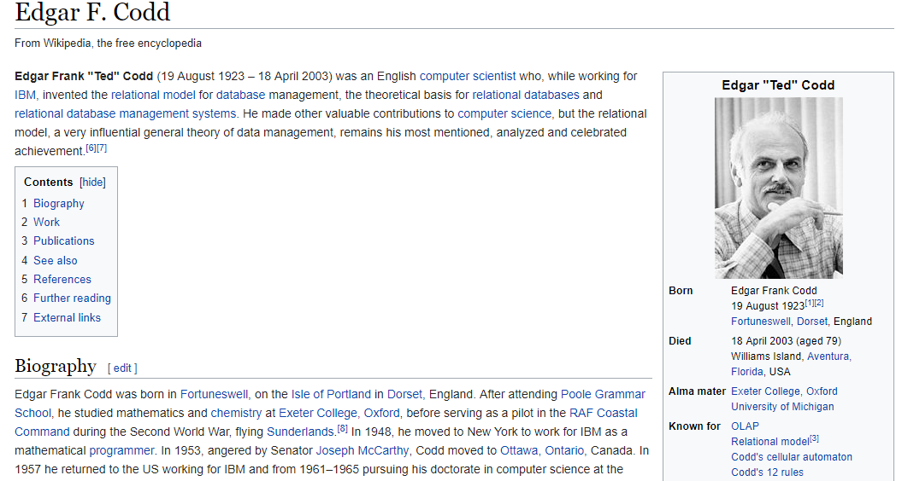
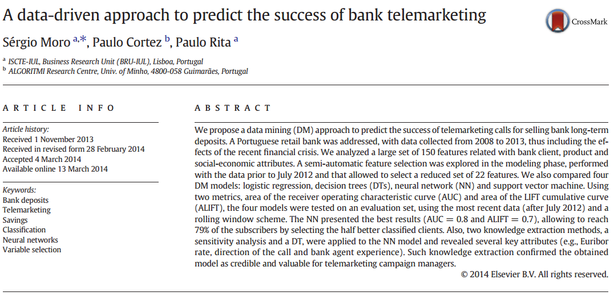

<style type="text/css">

code.r{ /* Code block */
    font-size: 23px;
}

pre { /* Code block - determines code spacing between lines */
    font-size: 14px;
}

</style>

```{r setup, include=FALSE}
# Annual revision: review the year from 2017 to 2019
library(conflicted)
library(tidyverse)
library(shiny)
library(lubridate)
library(bizdays)
library(fOptions)
library(ggplot2)
conflict_prefer("filter", "dplyr")
conflict_prefer("lag", "dplyr")
knitr::opts_chunk$set(echo = FALSE, fig.align="center", collapse = TRUE, cache = TRUE)
chunk <- "```"
inline <- function(x = "") paste0("`` `r ", x, "` ``")
```


## Object

S3 Object System in R

```{r, echo = TRUE}
# Object
# Define class with attributes.
vanilla_option <- setClass("vanilla_option",
                           slots = c(type = "character",
                                     strike = "numeric",
                                     underlying = "numeric"))

# Create object, either way
opt1 <- new("vanilla_option", type = "c", strike = 100, underlying = 100)
opt2 <- vanilla_option(type = "c", strike = 100, underlying = 100)

# Use @ to visit member. or,
opt1@type
slot(opt1, "strike")
```

## Work with objects

```{r, echo = T, cache = T}
# Generate a vector of options
opts <- sapply(1:10000, function(x) { 
                          vanilla_option(type = sample(c("c", "p"), 1),
                                         strike = round(runif(1) * 100, 0),
                                         underlying = round(runif(1) * 100, 0)) })

# install.packages("fOptions")
library(fOptions)

start <- Sys.time()
# GBSOption also returns an object. We just need its price attribute.
res1 <- sapply(opts, function(o) {
  obj <- GBSOption(o@type, o@underlying, o@strike, Time = 1,
             r = 0.01, b = 0, sigma = 0.3)
  obj@price
})
cat(as.numeric(Sys.time() - start))
head(res1, n = 4)

# Alternatively to sapply, we can use map* functions from purrr package
# map is a generic function that returns a list
# map_dbl is for result of double, it would return a vector
library(purrr)

res2 <- purrr::map_dbl(opts, function(o) {
  (GBSOption(o@type, o@underlying, o@strike, Time = 1,
             r = 0.01, b = 0, sigma = 0.3))@price
})
head(res2, n = 4)
```

## Read/Write data

```{r eval = FALSE, include = TRUE, echo = TRUE}
# set working directory
setwd("C:/TEMP")
# Save this_is_var1 to a file
saveRDS(this_is_var1, file = "C:/TEMP/DATA/data.Rds")
# Load a variable from a file. `new_loaded` is the name given to it.
new_loaded <- readRDS(file = "C:/TEMP/DATA/data.Rds")
```

- On Windows, use double slashes `\\` or single backslash `/`. e.g. `C:\\TEMP\\DATA`, `C:/TEMP/DATA`
- On Mac, use backslash `/Users/.../`

## Exercise 1: Fastest Fish Problem

We have ten fishes releases in a very long lane at fixed time interval. They swim at different speed. The fish surpassing the previous fish would eat it. How many fishes would survive on average?

```{r, echo = FALSE, cache = TRUE}
N <- 10

survi <- function() {
  queue <- sample(1:N, N, replace = FALSE)
  qori <- queue
  fastest <- queue[1]
  for (n in 2:N) {
    if (queue[n] > fastest) {
      queue[n] <- NA
    } else {
      fastest <- queue[n]
    }
  }
  list(qori = qori,
       queue = queue)
}

# plot((survi())$queue, 1:10, col = "skyblue2", pch = "\u2653", cex = 2)

plot(1:10, 1:10, type="n")
res <- survi()
for (i in 1:10) {
  if (is.na(res$queue[i])) {
    text(res$qori[i], i, paste0("\u2653 ",i), col = "grey", cex = 1.4) 
  } else {
    text(res$queue[i], i, paste0("\u2653 ",i), col = "skyblue3", cex = 1.8)
  }
}

```

## Histogram of Fishes Alive

```{r, echo = FALSE, cache = TRUE}

sim_sample <- replicate(10000, length(na.omit({ survi()$queue })))
res_sim <- mean(sim_sample)

survi.prob <- function() {
  sum <- 0
  for (n in 1:N) {
    sum <- sum + 1/n
  }
  sum
}
res_ana <- survi.prob()

cat(paste("res_sim:", res_sim, "\n"))
cat(paste("res_ana:", res_ana, "\n"))
hist(sim_sample)
```

## Exercise 2: How far to make a choice?

- Secretary Problem (https://en.wikipedia.org/wiki/Secretary_problem)
- If we have 100 secretaries ranked from best to worst, coming to interview at random order, what's the probability that our picked is the best in the group?
- Our selection strategy, use a small group to establish our selection criteria, for the subsequent ones, we pick the first that's better than our selection criteria. What's the split?

Step 1: make_choice <- function(N, split_number)

1. Generate a list `input_list` of `N` long with integer 1 to N at random position
2. Split the list `input_list` into two: evaluation group and selection group.
3. Remember the best number from evaluaton group and match the first number in selection group, >= than best. Return it.

Run this function for a few (hundred) times and find the probability of getting N.

Step 2: find_optimal(), calls Step 1 a few (hundred) times for each of the split number from 1 to N/2. So we can find the optimal value for the split for the N.

Hint: Find the solution for N = 3, and N = 10, then move on to N = 100.

# Lecture 5: Shiny/2: R Web Framework

## Minimalist
    
```{r eval=FALSE, include=TRUE, echo = TRUE}
library(shiny)
ui <- fluidPage("Hello World")
server <- function(input, output, session) { }
shinyApp(ui = ui, server = server)
```

## Think around Input and Outputs

```{r eval=FALSE, include=TRUE, echo = TRUE}
ui <- fluidPage(
  titlePanel("Hello World with a Histogram"),
  # Input() functions
  numericInput("num", "Number of Sample", value = 30),
  # Output() functions
  plotOutput("hist")
)
```

## Input

All input function follow such function signature except for input-specific parameters.

```{r eval=FALSE, include=TRUE, echo = TRUE}
inputXXX(inputId = "input name", label = "label to display", ...)
```

- `numericInput`
- `textInput`
- `passwordInput`
- `slideInput`
- `selectInput`
- `dateInput`

Reference: https://shiny.rstudio.com/reference/shiny/1.1.0/

## Output

All output functions follow such pattern.

```{r eval=FALSE, include=TRUE, echo = TRUE}
yyyOutput(outputId = "output name")
```

- `textOutput("text")`
- `verbatimTextOutput("text_orignal")`
- `tableOutput("t1")`
- `dataTableOutput("t2")`
- `plotOutput(outputId = "hist", width = "400px", height = "400px")`
- `uiOutput("uiX")`

For plotOutput, I suggest to set width and height to fixed size so we need extra parameters.
For other kinds of outputs, only `outputId` is good enough.

## Server

Sever is to fill the content of output

```{r eval=FALSE, include=TRUE, echo = TRUE}
server <- function(input, output, session) {
  # Enable either one of two
  output$hist <- renderPlot({ hist(rnorm(100)) })
  
  if (FALSE) {
    output$hist <- renderPlot({
      title("a normal random number histogram")
      hist(rnorm(input$num))
    })
  }
}
```

## shinyApp = UI + Server

- UI and Server combine to be a ShinyApp.
- UI is to run the same for each browser/client.
- Server is separate between different users.

```{r eval=FALSE, include=TRUE, echo = TRUE}
shinyApp(ui, server)
```

## Reactivity Kicks In

- Reactivity: `input$num ------> output$p1`
- Reactivity links input to the output like a data flow.

Reactive values work together with reactive functions.

1. Reactive function responds. `input$x => output$y`
2. Reactive value notifies. `input$x => expression() => output$y`

## Reactivity - 1

Reactivity is enabled by placing input `inputXXX` inside `renderXXX` function. (shiny-21.R)

```{r echo = FALSE, comment = ""}
cat(htmltools::includeText("example/shiny-21.R"))
```

## Reactivity - 2

- Button represents a manual trigger of the action.
- We use `observeEvent` to observe button action, and `isolate` to cut down the link of `inputXXX` in `renderXXX`, so button can work.
- If we remove `isolate`? (shiny-22.R)

```{r echo = FALSE, comment = ""}
cat(htmltools::includeText("example/shiny-22.R"))
```

## Reactivity - 3

We can add a reactiveValue with `eventReactive`. (shiny-23.R)

```{r echo = FALSE, comment = ""}
cat(htmltools::includeText("example/shiny-23.R"))
```

## Output

For tableOutput

```{r eval=FALSE, include=TRUE, echo = TRUE}
output$t1 <- renderTable(iris)

output$t1 <- renderTable({
  some input..
  output is a data frame.
})
```

For dataTableOutput (Dynamic table)

```{r eval=FALSE, include=TRUE, echo = TRUE}
output$t2 <- renderDataTable(iris)
```

For plotOutput

```{r eval=FALSE, include=TRUE, echo = TRUE}
output$p2 <- renderPlot({ plot(runif(1000), runif(1000)) })
```

For textOutput and verbatimTextOutput

```{r eval=FALSE, include=TRUE, echo = TRUE}
output$t3 <- renderText({ "foo" })
output$t4 <- renderPrint({
  print("foo")
  print("bar")
})
```

## Example: (Shiny-24.R)

```{r echo = FALSE, comment = ""}
cat(htmltools::includeText("example/shiny-24.R"))
```

## Debug Shiny

- Debug in R Studio
- Clear all variable to run Shiny in R Studio
- debugSource, if you use other source code

## Shiny Summary

- Reactive is about wiring input and output
- Connect from receiver: plot/tabulate for data
- Connect from trigger: button, isolate to create a Chinese wall

## Shiny Assignment

1. For Shiny-24.R, add a selectInput for different color names, returned from `colors()`.

```{r eval=FALSE, include=TRUE, echo = TRUE}
plot(1:10, pch = 19, cex = 1, col = "skyblue1")
```

2. Create a Bond Schedule
  + Inputs: start date, tenor, coupon rate, coupon frequency, and yield to maturity.
  + Output: coupon schedule (ignore public holidays), amount in table and plot.
            NPV
  
$NPV = \frac{Cashflow 1}{(1 + yield)^1} + \frac{Cashflow 2}{(1 + yield)^2} + ... + \frac{Last Cashflow}{(1 + yield)^n}$

For a Bond with fixed coupon
$Bond Price = Coupon * \frac{1 - (\frac{1}{(1 + yield)^n})}{yield} + \Big[MaturityValue * \frac{1}{(1 + yield)^n}\Big]$

# Lecture 6: Data Manipulation and EDA (Exploratory Data Analysis)/1

## Tidyverse

install.packages("tidyverse")

```{r, echo = FALSE, out.width = "55%"}
knitr::include_graphics("imgs/tidyverse.png")
```

## SQL

- It was invented by Edgar Codd
- It first appeared in 1974, which is `r lubridate::year(Sys.time()) - 1974` years ago.

```{r, echo = FALSE, out.width = "60%"}

```

## CRUD: Create | Read | Update | Delete

Data engineering was born around 70s with SQL.

```{r, echo = FALSE, out.width = "45%"}
knitr::include_graphics("imgs/CRUD.png")
```

## SQL does CRUD

```
# Select everything from Shops.
SELECT * FROM Shops;

# Select with a filter
SELECT * FROM Shops WHERE size = "Big";

# Select with a filter and order
SELECT * FROM Shops WHERE size = "Big" ORDER BY Name;

# Select with a filter, order, group and summary function `sum`
SELECT Region, sum(Sales) FROM Shops WHERE size = "Medium" GROUP BY Region;

# Insert a new record to Shops.
INSERT into Shops (Name, Region, Sales) VALUES ("Costco", "North", 123456, ...);

# Update a field
UPDATE Shops SET Sales = Sales + 1000 WHERE Name = "Costco";

# Delete from Shops with a filter
DELETE from Shops WHERE Sales < 1000
```

## Data frame does CRUD

```{r, echo = TRUE, results = "hide"}
df <- data.frame(a = 1:10, b = 10:1)
# Select (aka Filter)
df[which(df$a == 3 | df$b == 3), , drop = T] 
df[match(3, df$a), , drop = T]
df[, match("b", colnames(df)), drop = T] 

# Insert
rbind(df, df)

# Delete
df[-(which(df$a == 3 | df$b == 3)), , drop = T]

# Update
df[which(df$a == 3 | df$b == 3), 2] <- 3
```

## dplyr

dplyr package from tidyverse is a high-performance package to manipulate data in data frame.

```{r, echo = TRUE}
# tidyverse is a bundle of packages.
# I usually load them all with library(tidyverse, instead of library(dplyr) individually.
library(tidyverse)
# -- Attaching packages --------------------------------------- tidyverse 1.2.1 --
# v ggplot2 3.2.1     v purrr   0.3.2
# v tibble  2.1.3     v dplyr   0.8.3
# v tidyr   0.8.3     v stringr 1.4.0
# v readr   1.3.1     v forcats 0.4.0
# -- Conflicts ------------------------------------------ tidyverse_conflicts() --
# x dplyr::filter() masks stats::filter()
# x dplyr::lag()    masks stats::lag()
```

Use dplyr::lag and dplyr::filter when it doesn't work.

## How dplyr works

`dplyr` provides functions in "verbs", which is functions that does one thing only. We will learn to use the following.

+ Key
    - select: return a subset of the columns of a data frame
    - filter: extract a subset of rows based on logical conditions
    - arrange: reorder rows
    - rename: rename variables
    - mutate: add new variables/columns or transform existing variables

+ Group
    - group_by / rowwise / ungroup: stratify the data
    - summarise / summarize: generate summary statistics of different variables in the data frame, possibly within strata
    - do: process data within the strata

+ Combine
    - left_join / right_join / anti_join / full_join
    - bind_rows / bind_cols

+ Helpers
    - %>%: the “pipe” operator is used to connect multiple verb actions together into a pipeline
    - ifelse / case_when
    - lag/distinct
    - n


## Sample dataset

    A data-driven approach to predict the success of telemarketing
    Author: Sérgio Moroa; Paulo Cortezb; Paulo Ritaa
    <http://dx.doi.org/10.1016/j.dss.2014.03.001>

I chose this data set of a Portuguese retail bank clients profile.

- Real data collected from a Portuguese retailbank, from May 2008 to June 2013, in a total of 52,944 phone contacts.

```{r, echo = FALSE, out.width = "45%"}

```


## Sample dataset columns (also called variable, field or feature)

- Personal profile

* 1 - age (numeric)
* 2 - job : type of job (categorical: "admin.","unknown","unemployed","management","housemaid","entrepreneur","student",
                                    "blue-collar","self-employed","retired","technician","services") 
* 3 - marital : marital status (categorical: "married","divorced","single"; note: "divorced" means divorced or widowed)
* 4 - education (categorical: "unknown","secondary","primary","tertiary")
* 5 - default: has credit in default? (binary: "yes","no")
* 6 - balance: average yearly balance, in euros (numeric) 
* 7 - housing: has housing loan? (binary: "yes","no")
* 8 - loan: has personal loan? (binary: "yes","no")

- Related with the last contact of the current campaign:

* 9 - contact: contact communication type (categorical: "unknown","telephone","cellular") 
* 10 - day: last contact day of the month (numeric)
* 11 - month: last contact month of year (categorical: "jan", "feb", "mar", ..., "nov", "dec")
* 12 - duration: last contact duration, in seconds (numeric)

- Other attributes:

* 13 - campaign: number of contacts performed during this campaign and for this client (numeric, includes last contact)
* 14 - pdays: number of days that passed by after the client was last contacted from a previous campaign (numeric, -1 means client was not previously contacted)
* 15 - previous: number of contacts performed before this campaign and for this client (numeric)
* 16 - poutcome: outcome of the previous marketing campaign (categorical: "unknown","other","failure","success")

- Output variable (desired target):
* 17 - y - has the client subscribed a term deposit? (binary: "yes","no")

## Read data

Use RStudio's File -> Import Dataset, you may choose either "From Text (base)" or "From Text (readr)". Either way loads the data.

`base` comes with R. `readr` is a package from tidyverse that provides more options and functionality.
Copy the generated code to your script file.

I place it at <https://goo.gl/PBQnBt> (for direct use), <https://goo.gl/fFQAAm> (for Download).

You may download it and save it to local.

```{r, echo = TRUE}
# Use base
bank <- read.csv("example/data-bank/bank.csv", sep=";") # or,
bank <- read.csv("https://goo.gl/PBQnBt", sep = ";")

# use readr
library(readr)
bank <- read_delim("example/data-bank/bank.csv", 
                    ";", escape_double = FALSE, trim_ws = TRUE)
```

```{r eval=FALSE, include=TRUE, echo = TRUE}
View(bank)
```

## `select`

`select(df, ...)`, ... can be

- variable name
- numeric to indicate nth column (`-` means exclude)
- a range
- a function

## `select` - Examples

```{r, echo = TRUE}
subset <- select(bank, marital)
subset <- select(bank, 1)
subset <- select(bank, -1)
subset <- select(bank, -job)
subset <- select(bank, -(job:education))
subset <- select(bank, starts_with("p"))
subset <- select(bank, ends_with("p"))
subset <- select(bank, contains("p"))
```

## `select` as a re-arrangement of columns.

```{r, echo = TRUE, results = "hide"}
job_first <- select(bank, job, everything())
```

## `filter`

```{r, echo = TRUE}
colnames(bank)

young <- dplyr::filter(bank, age < 40)
another_young <- dplyr::filter(bank, age < 20 & marital == "married")
just_young <- dplyr::filter(bank, age < 20 & marital == "single")

young2 <- dplyr::filter(bank, age >= 20 & age < 30)
another_young2 <- dplyr::filter(bank, age >= 20 & age < 30 & marital == "married")
just_young2 <- dplyr::filter(bank, age >= 20 & age < 30 & marital == "single")
```

## `filter` - logic operators

```{r, echo = FALSE, out.width = "75%"}
knitr::include_graphics("imgs/transform-logical.png")
```

## `filter` - string operations

```{r, echo = TRUE}
# %in% to match multiple
second_upper <- dplyr::filter(bank, education %in% c("tertiary", "secondary"))

# filter out NA value.
no_na <- dplyr::filter(bank, !is.na(balance) & balance > 0)
```

## Exercise

- How many bank client have a loan while doesn't have a housing?
- How many bank client have a job between 20 to 40?

## `rename`

```{r, echo = TRUE}
# rename(new name = old)
# Use tick to quote special strings.
df <- rename(bank, young_age = age) 
df <- rename(bank, `Age in Bank` = age)
```

## `arrange`
```{r, echo = TRUE, results = "hide"}
# arrange is sort
arrange(bank, job)
arrange(bank, default, job)

# descending for day
arrange(bank, desc(day))
arrange(bank, desc(as.Date(day, format="%d", origin = Sys.Date())))
```
NB: Missing values are always sorted at the end.

## Exercise

- How could you use arrange() to sort all missing values to the start? (Hint: use `is.na()`).

```{r eval=FALSE, include=TRUE, echo = TRUE}
arrange(bank, !is.na(a), a)
```

- Find the longest duration?
- Find the eldest?

## `mutate`

```{r, echo = TRUE}
# Replace existing
# ifelse is to check condition.
df1 <- mutate(bank, y = ifelse(y == "yes", T, F))

# Add a new column.
df2 <- mutate(bank, duration_diff = duration - mean(duration, na.rm = TRUE))

# case_when is a function to deal multiple choices.
df2_age_group <- mutate(bank, age_group = case_when(
  age < 20 ~ "youth",
  age < 40 ~ "middle-age",
  age < 50 ~ "senior",
  TRUE ~ "happy"
))

df2_age_group_res <-
  group_by(df2_age_group, age_group) %>%
  summarise(mean_age = mean(age)) %>%
  transmute(mean_age_diff = mean_age - lag(mean_age))
```

## `mutate` 2

```{r, echo = TRUE}
firstup <- function(x) {
  substr(x, 1, 1) <- toupper(substr(x, 1, 1))
  x
}

# month.abb is a built-in array of month names.
df3 <- mutate(bank, month_name = factor(firstup(as.character(month)), levels = month.abb))

# transmute would remove all other columns after mutation, only keeping the new variable.
df5 <- transmute(bank, 
                  duration_trend = duration - mean(duration, na.rm = TRUE),
                  balance_trend = balance - mean(balance, na.rm = TRUE))
```

## What you can do with `mutate`

* +, -, *, /: ordinary arithmetic operator
* %/% (integer division) and %% (remainder), where x == y * (x %/% y) + (x %% y)
* x / sum(x): compute the proportion of all things
* y - mean(y): computes the difference from the mean.
* log2(), log(), log10(): 
* lead(), lag(): compute running differences (e.g. x - lag(x)) or find when values change (x != lag(x)
* rolling sum, prod, min, max: cumsum(), cumprod(), cummin(), cummax(); and dplyr provides cummean()
* row_number()/min_rank()/ntile(,n)

```{r, echo = TRUE}
y <- c(1, 2, 2, NA, 3, 4)
row_number(y)
min_rank(y)
ntile(y, 2)
```

## Summary

- We learned the key "verbs" from dplyr. Let's pick up the rest next week.

## Pipe: %>%

We may write such code.

```{r eval=FALSE, include=TRUE, echo = TRUE}
df <- select(df, x)
df <- mutate(df, a = 1)
df <- rename(df, a = b)
df <- arrange(df, x)

# This is effectively,
arrange(rename(mutate(select(df, x), a = 1), a = b), x)

third(second(first(x)))
```

How about this?

```{r eval=FALSE, include=TRUE, echo = TRUE}
df %>% select %>% mutate %>% rename %>% arrange
```

## %>% Benefits

`%>%` operator allows you to transform the flow from nesting to left-to-right fashion, i.e.

```{r eval=FALSE, include=TRUE, echo = TRUE}
first(x) %>% second() %>% third()

x %>% first() %>% second() %>% third() # this could also do.

x %>% first(.) %>% second(.) %>% third(.) # . represents the input
```

What's the output of below?

```{r, echo = TRUE }
c(1, 3, 7, 9) %>% {
  print(.)
  mean(.)
} %>% { . * 3 } %>% {
  print(.)
  sample(round(., 0))
}
```

## Work with Pipe

%>% ... %>%

```{r eval=FALSE, include=TRUE, echo = TRUE}
# Feed the data for multiple processing
{
  v <- .
  cn <- colnames(v)

  v <- select(v, u, z)
  colnames(v) <- cn[1:3]
  v
} 

# How to return multiple value

%>% {
  assign("new_data", filter(., group == "1"), envir = parent.env(environment()) )
  filter(., group == "2")
} %>% {
  select(., z < 0.4) # on group 2
  select(new_data, z > 0.4) # on group 1
}

# or, we use list
%>% {
  a <- filter(., group == "1")
  b <- filter(., group == "2")
  list(a, b)
}  %>% {
  v <- .
  v$a
  v$b
}
```

## Code pattern with Pipe

```{r eval=FALSE, include=TRUE, echo = TRUE}
df %>%
... %>%
... %>%
... %>%
{
  v <- .
  ggplot(data = v) + 
    # full data is used here
    geom_line(data = v) +
    # partial data needs to be hightlighted.
    geom_line(data = filter(., some condition), color = "red")
}
```

## Use of Caution for Pipe (%>%)

Pros:

- We don't need to keep intermediate result, sames memory and also variable names.

Cons:

- Difficult to debug, to find something in the middle of the chain.
- Use `{ print(.); filter(., ...) }` to print intermediate resuls.
- Separate the long pipes into shorter pipes, adding more intermediate variables.

- Your pipes are longer than (say) ten steps. In that case, create intermediate objects with meaningful names. That will make debugging easier, because you can more easily check the intermediate results, and it makes it easier to understand your code, because the variable names can help communicate intent.
- You have multiple inputs or outputs. If two or more objects being combined together, don't use the pipe.
- Pipes are fundamentally linear and expressing complex relationships with them will typically yield confusing code.

## Environment

Environment is where your data resides. Use `local()` to isolate.

```{r, echo = TRUE}
# local stores the data wihtin the boundary of {}
x <- 3
local({
  print(x)
  x <- 1
  print(x)
})
print(x)
```

```{r, echo = TRUE}
# local stores the nearest environment
x <- 3
{
  print(x)
  x <- 1
  print(x)
}
x
```

```{r, echo = TRUE}
get_sum <- function(i) {
  v <- 0
  for (i in 1:10) {
    v <- v + i
  }
  v
}

get_sum(10)

# Error with line below: object 'v' not found
# v
```

## Environment

Use `assign()` to do space-jump.

```{r, echo = TRUE}
# assign data to global environment
x <- 1
pass_out_global <- function() {
  assign("x", 3, envir = .GlobalEnv)  
}

# assign data to just one level up 
pass_out <- function(env) {
  print(env)
  assign("x", 2, envir = env)
}
```

```{r, echo = TRUE}
x <- 1
pass_out(environment())
x

# assign data to pass it out of function
extra_layer <- function(env) {
  pass_out(env)
}

x <- 1
extra_layer(env = environment())
x

extra_layer_g <- function() {
  pass_out_global()
}

x <- 1
extra_layer_g()
x
```
