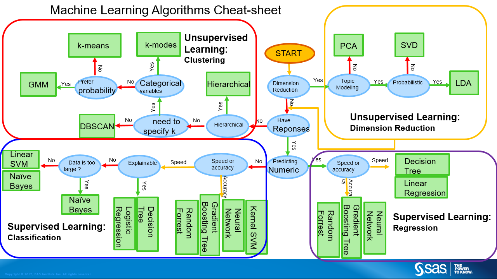

```{r setup, include=FALSE}
library(fOptions)
library(tidyverse)
library(lubridate)
library(bizdays)
library(ggplot2)
library(ggthemes)
library(gridExtra)
library(maps)
library(knitr)
library(tidyquant)

# Following line is added according to
# pg.3
# https://haozhu233.github.io/kableExtra/awesome_table_in_pdf.pdf
options(kableExtra.latex.load_packages = FALSE)
library(kableExtra)

knitr::opts_chunk$set(echo = FALSE, fig.align="center", collapse = TRUE, cache = TRUE)
chunk <- "```"
inline <- function(x = "") paste0("`` `r ", x, "` ``")
bank <- read.csv("https://goo.gl/PBQnBt", sep = ";")
token_qd <- 'JyeshGuNBGDbbaYoNURG'
token_av <- 'QWM66H05ENYFRDPO'
options("getSymbols.warning4.0"=FALSE)
```

<style type="text/css">
code.r{ /* Code block */
    font-size: 23px;
}
pre { /* Code block - determines code spacing between lines */
    font-size: 19px;
}
</style>

# Lecture 10: Building Financial Applications

## Starter

```{r echo = TRUE, results = "hide"}
# biorhythm.R

library(dplyr)
library(tidyr)
library(ggplot2)

biorhythm <- function(dob, target = Sys.Date()) {
  dob <- as.Date(dob)
  target <- as.Date(target)
  t <- round(as.numeric(difftime(target, dob)))
  days <- (t - 14) : (t + 14)
  period <- tibble(Date = seq.Date(from = target - 15, by = 1, length.out = 29),
                       Physical = sin (2 * pi * days / 23) * 100, 
                       Emotional = sin (2 * pi * days / 28) * 100, 
                       Intellectual = sin (2 * pi * days / 33) * 100)
  period <- gather(period, key = "Biorhythm", value = "Percentage", -Date)
  ggplot(period, aes(x = Date, y = Percentage, col = Biorhythm)) +
    geom_line() +  
    ggtitle(paste("DoB:", format(dob, "%d %B %Y"))) + 
    geom_vline(xintercept = as.numeric(target)) +
    theme(legend.position = "bottom")
}
```

## Starter - Result

```{r, echo = FALSE, fig.width=10}
source("example/week5/biorhythm.R")
```

```{r, echo = TRUE, fig.width=10}
# I took four people's birthdays. Hope they are in good mood today.
g1 <- biorhythm("1964-01-12", Sys.Date())
g2 <- biorhythm("1971-06-28", Sys.Date())
g3 <- biorhythm("1971-10-29", Sys.Date())
g4 <- biorhythm("1957-08-11", Sys.Date())
grid.arrange(g1, g2, g3, g4, ncol = 2, nrow = 2)
```

## Main course

- We need following packages as a start. Use c() to install multiple packages.

```{r eval=FALSE, include=TRUE, echo = TRUE}
install.packages(c("tidyquant", "Quandl", "fOptions", "fExoticOptions", "dygraph", "forecast"))
```

- `tidyquant` is also a collection of packages: `xts`, `quantmod`.

- Please validate option pricing code.
    + For example, I found Asian Option `TurnbullWakemanAsianApproxOption()` in `fExoticOptions` is strangely implemented. Maybe I am wrong.

## tidyquant or Quandl?
Determining factors:

- `tidyquant/quantmod` can connect to various services: ~google~, yahoo (still active), av (AlphaAdvantage).
- Quandl only connects to Quandl
- It's subjected to where you can find the data.
    - US ETF/Stocks on Quandl is a premium service.
    - ETF in Google/AlphaAdvantage is free.

## tidyquant or Quandl?

Technical details:

- quantmod returns `xts` object. Quandl returns data frame or `xts`
- xts object is can `collapse` to daily, weekly, monthly price.

## Tidyquant/quantmod

```{r, echo = TRUE}
# library(tidyquant)

# use Google
getSymbols('SPY', src = 'yahoo', adjusted = TRUE, output.size = 'full')
str(SPY)

# Sign up with AlphaAdvantage to get a token
# getSymbols('SPY', src = 'av', output.size = 'full', api.key = token_av)
# str(SPY)
```

## Tidyquant/quantmod
```{r, echo = TRUE}
# What's get returned?
head(SPY)
tail(SPY)

symbols <- c("MSFT", "AAPL")
getSymbols(symbols, src = 'yahoo', adjusted = TRUE, from = "2016-01-01")

```

## `xts` object
- xts is a wide format. In contrast, ggplot/tidy uses long format.
- We have gather/spread to convert between long/wide format.
- Create xts object:
    + Put index aside, which is usually date
    + Store prices in columns.

```{r eval=FALSE, include=TRUE, echo = TRUE}
library(xts)

# if df is a data frame.
# Date | V | GS
xts1 <- xts(x=df[, -1, drop = F], order.by = df[1])

# coredata: returns a matrix from xts objects
core_data <- coredata(xts2)

# index: vector of any Date, POSIXct, chron, yearmon, yearqtr, or DateTime classes
index(xts1)
```

## Get data from `xts` object

```{r, echo = TRUE}
# What price history is stored here.
str(SPY)
```

```{r, echo = TRUE, results = "hide"}
SPY2003 <- SPY["2003"]
SPY2 <- SPY["2003/2007"]
SPY3 <- SPY["2003-03-01/2007-07-01"]
SPY4 <- SPY["/2007-07-01"] # till 
SPY5 <- SPY["2007-07-01/"] # from
SPY6 <- SPY["2007-07-01/", "SPY.High"]
SPY7 <- SPY["2007-07-01/", c("SPY.High", "SPY.Close")]
```

## Quandl
```{r, echo = TRUE}
library(Quandl)
library(tidyverse)

# Sign up with Quandl to get a token
# token_qd <- "xxxx"
Quandl.api_key(token_qd)
## You don't get SPY: SPDR 500 ETF from Quandl from free service.
## rates <- Quandl(c("EOD/SPY"), start_date="2000-01-01", end_date="2013-06-07")
## You don't get EOD US Stocks for free from Quandl from 2019
## rates <- Quandl(c("EOD/V"), start_date="2000-01-01", end_date="2013-06-07" )
```

## Quandl
```{r, echo = T, fig.width = 8, fig.height = 3}
library(Quandl)					# Quandl package
library(ggplot2)				# Package for plotting
library(tidyverse)				# Package for reshaping data

Quandl.api_key(token_qd)				# Authenticate your token
# Build vector of currencies
rates <- Quandl(c("FRED/DEXUSAL", "FRED/DEXBZUS", "FRED/DEXUSUK", "FRED/DEXCHUS"),
                start_date="2000-01-01",
                end_date = "2018-11-28")
colnames(rates) <- c("Date", "AUD/USD", "USD/BRL", "GBP/USD", "USD/CNY")
meltdf <- gather(rates, key = "CCY", value = "Rate", -Date)

ggplot(meltdf, aes(x = Date, y = Rate, colour = CCY, group = CCY)) +
  geom_line() +
  scale_colour_manual(values=1:22)+
  ggtitle("Major Currency Exchange Rates in USD") +
  theme_minimal()
```

## Quandl and forecast

```{r, echo = TRUE, eval = FALSE}
cat(htmltools::includeText("example/week5/52-quandl-forecast.R"))
```

# dygraph

dygraph for xts
<https://rstudio.github.io/dygraphs/shiny.html>

```{r, echo = TRUE, eval = FALSE}
dygraphOutput("dygraph")

dygraph(oil_combined_xts, main = "Oil Prices: Historical and Forecast") %>%
  # Add the actual series
  dySeries("Actual", label = "Actual") %>%
  # Add the three forecasted series
  dySeries(c("Lo_95", "Forecast", "Hi_95"))
```

# Quandl/Shiny/dygraph

```{r, echo = TRUE, eval = FALSE}
# shiny-51-quandl.R
cat(htmltools::includeText("example/week5/51-quandl.R"))
```

# Lecture 11: Building Predictive Model

## Machine Learning

```{r, echo = FALSE, out.width = "80%"}

```

## Statistics and Machine Learning

```{r, echo = FALSE, out.width = "40%"}
knitr::include_graphics("imgs/2019/comic-stat-vs-ml.jpg")
```

## Statistics and Machine Learning

- Statistics is a age-old year subject, with many developed theory.
- Machine learning is an algorithm that can learn from data without relying on rules-based.
- ML uses many statistical theories in application.
- ML emphasizes optimization and performance (accuracy) over inference (conclusion based on reasons and evidence) which is what statistics is concerned about.

    | ML professional: "The model is 85% accurate in predicting Y, given a, b and c."
    | Statistician: “The model is 85% accurate in predicting Y, given a, b and c; and I am 90% certain that you will obtain the same result.” 

## Supervised v.s. Unsupervised

- Supervised learning: It is based on example input-output pairs. It infers a function from labeled training data consisting of a set of training examples
- Unsupervised learning: It is a type of self-organized learning that helps find previously unknown patterns in data set without pre-existing labels. It is also known as self-organization and allows modeling probability densities of given inputs.
- Reinforcement learning: ...

## Machine Learning

- Regression
- Classification
- Ensemble
  - hetreogenous ensembles
  - homogenous ensembles
  - metalmodelling
- Neutral network
  - Deep learning: multiple hidden layers.

## Model Error

  model error = variance + bias + noise
  
  - variance-bias trade-off: increase variance and more bias


## Regression and Classification

Regression and classification are two main categories of machine learning algorithms under supervised learning.

```{r, echo = FALSE, out.width = "60%"}
knitr::include_graphics("imgs/2019/class_reg.png")
```

## Regression

We can use many linear regression methods.

```{r echo=TRUE}
p1 <- ggplot(iris, aes(x = Sepal.Length, y = Petal.Width, color = Species)) +
  geom_smooth(method = "lm") +
  geom_point() +
  labs(title = "Petal.Width ~ Sepal.Length")

p2 <- ggplot(iris, aes(x = Petal.Length, y = Petal.Width, color = Species)) +
  geom_smooth(method = "lm") +
  geom_point() +
  labs(title = "Petal.Width ~ Petal.Length")

p3 <- ggplot(iris, aes(x = Sepal.Length, y = Sepal.Width, color = Species)) +
  geom_smooth(method = "lm") +
  geom_point() +
  labs(title = "Sepal.Width ~ Sepal.Length")

p4 <- ggplot(iris, aes(x = Petal.Length, y = Sepal.Width, color = Species)) +
  geom_smooth(method = "lm") +
  geom_point() +
  labs(title = "Sepal.Width ~ Petal.Length")
```

## Regression

```{r echo=FALSE, out.width="100%"}
grid.arrange(p1, p2, p3, p4, nrow = 2)
```

## Classification

Decision Tree

```{r}
library(rpart)
iris_rp <- rpart(Species ~ ., iris)
```

```{r, eval = FALSE, include=TRUE}
# try below statment
summary(iris_rp)
rattle::ggVarImp(iris_rp)
rattle::fancyRpartPlot(iris_rp)
```

```{r echo=FALSE, out.width="70%"}
rattle::fancyRpartPlot(iris_rp)
```

```{r echo=TRUE}
predictions <- predict(iris_rp, iris, type = "class")
which(iris$Species != predictions)
# caret::confusionMatrix(predictions, iris$Species)
```

## Ensemble
- Bagging: reducing bias and keep variance in control
- AdaBoost: wrong result will get more weight
- GradientBoost: reduce on residue
- Random forest: random selection of features and component tree to be flexible, no pruning.
    - "bumping" is to use the most effective tree "dtree" will use it.
- Stacking/Subsemble/SuperLearner


## Confusion Matrix
- Shows how model performs

      Actual Target |          0        |  1  |
      Model Output  |                   |     |
                 0  |         90        | 10  |
                 1  |         10        | 90  |


## Machine Learning workflow

1. Setting
2. Exploratory Data Analysis
3. Feature Engineering
4. Data Preparation
5. Modelling
6. Conclusion

## Machine Learning

- Data preparation:

Split into different groups. For simple data, we may split using 75/25 or 80/20. For complex data, we need to ensure selected 75 has coverage for different kinds, to avoid bias. For example, we are to predict a infrequent event (occuring 20%), shall our selected sample contain 20% or 50% or 75%?

- Modeling:

Choose a few models and tune the hyperparametes. Tuning of hyperparameters is model-specific. You shall learn it in-depth with each model.

Measure the performacne and optimize it.
Confusion matrix, AUC/ROC, model-specific output...

## `Caret` Package

Caret is short for _C_lassification _A_nd _RE_gression _T_raining.

```{r, echo = FALSE, out.width = "50%"}

```

Main author is Max Kuhn. He has a book "Applied Predictive Modeling", By Max Kuhn and Kjell Johnson.

Max is now in RStudio, working on _parsnip_ in tidymodel.

```{r, echo = FALSE, out.width = "30%"}
knitr::include_graphics("imgs/2019/applied-predictive-modeling-book-cover.png")
```

## `Caret` Package

Links to 200 over (238 as of this version)
https://topepo.github.io/caret/available-models.html

```{r, echo = FALSE}
library(caret)
modelnames <- paste(names(getModelInfo()), collapse=',  ')
modelnames
```

## Project Iris

Use the petal/sepal width/length to determine which species it is.

```{r echo=TRUE, eval = FALSE}
library(caret)

set.seed(123)
trainIndex <- createDataPartition(iris$Species, p = .8,
 list = FALSE,
 times = 1)

train <- iris[ trainIndex,]
test  <- iris[-trainIndex,]

train_x <- select(train, -Species)
train_y <- train$Species

test_x <- select(test, -Species)
test_y <- test$Species

# Cross validation
fitControl <- trainControl(
 method = "repeatedcv",
 number = 10,
 repeats = 5)

# first run may need to do package installation. Caret
# install.packages("e1071")
# recursive partition = decision tree
dt_fit <- train(Species ~ ., data = train,
 method = "rpart",
 trControl = fitControl,
 preProcess=c("center", "scale"))

dt_fit
plot(dt_fit)

predictions <- predict(dt_fit, test)
confusionMatrix(predictions, test$Species)

# random Forests
rf_fit <- train(Species ~ .,
                data = train,
                method = "ranger")

rf_fit
plot(rf_fit)

predictions <- predict(rf_fit, test)
confusionMatrix(predictions, test$Species)
which(y_test != predictions)
y_test[which(y_test != predictions)]
```


```{r, eval = FALSE, include = FALSE}
# install.packages("xgboost")
library(xgboost)

X_train <- xgb.DMatrix(as.matrix(train %>% select(-Species)))
y_train <- train$Species
X_test <- xgb.DMatrix(as.matrix(test %>% select(-Species)))
y_test <- test$Species

# Specify cross-validation method and number of folds. Also enable parallel computation

xgb_trcontrol = trainControl(
  method = "cv",
  number = 5,  
  allowParallel = TRUE,
  verboseIter = FALSE,
  returnData = FALSE
)

# This is the grid space to search for the best hyperparameters

xgbGrid <- expand.grid(nrounds = c(100,200),  # this is n_estimators in the python code above
                       max_depth = c(10, 15, 20, 25),
                       colsample_bytree = seq(0.5, 0.9, length.out = 5),
                       ## The values below are default values in the sklearn-api. 
                       eta = 0.1,
                       gamma=0,
                       min_child_weight = 1,
                       subsample = 1
                      )

# Finally, train your model

set.seed(0) 
xgb_model <- train(
  X_train, y_train,  
  trControl = xgb_trcontrol,
  tuneGrid = xgbGrid,
  method = "xgbTree"
)

# Best values for hyperparameters
xgb_model$bestTune

predictions <- predict(xgb_model, X_test)
confusionMatrix(predictions, y_test)
which(y_test != predictions)
y_test[which(y_test != predictions)]

```

## Project Bank

We previous whether our telemarketing is successful.

The output is binary - classification for binary output is very common.

For model simplicity, we use logistic regression. For logistic regression, we need to use one-hot encoding.

One-hot Encoding is implemented with dummy variables in R.

If one column contains more-than-one value, e.g. "admin", "engineer", "manager", we replace it with 2 = 3 - 1 columns

      | job      |        | job_admin | job_engineer |
      | admin    |   ==>  |     1     |       0      |
      | engineer |        |     0     |       1      |
      | manager  |        |     0     |       0      |


```{r eval=FALSE, include=FALSE}
# Manual dummy variable creation, skip.
deco_prefix <- function(df_in, prefix) {
  nn_nn <- which(colnames(df_in) == "nn")
  nn_max <- length(colnames(df_in))
  names_df <- colnames(df_in)
  colnames(df_in) <- c(names_df[1:nn_nn], paste0(prefix, names_df[(nn_nn+1):nn_max]))
  df_in %>% select(-nn) %>% mutate(nn = 1:n())
}

bank_new <- bank_fit %>%
  mutate(nn = 1:n())
  spread(job, job, fill = "0") %>% 
  deco_prefix("job.") %>%
  spread(marital, marital, fill = "0") %>%
  deco_prefix("marital.") %>%
  mutate_at(vars(starts_with("job.")), function(x) { ifelse(x == "0", 0, 1) }) %>%
  mutate_at(vars(starts_with("marital.")), function(x) { ifelse(x == "0", 0, 1) }) %>%
  mutate(loan = ifelse(loan == "yes", 1, 0),
         default = ifelse(default == "yes", 1, 0),
         housing = ifelse(housing == "yes", 1, 0),
         poutcome = ifelse(poutcome == "yes", 1, 0),
         y = ifelse(y == "yes", "y", "n")) %>%
  select(-nn)
# bank_new <- bank_new %>% mutate(y = factor(y))
```

## Project Bank - Load

```{r echo=TRUE, eval = FALSE}
bank <- read.csv("https://goo.gl/PBQnBt", sep = ";")
# We only work on following fields.
bank_fit <- bank %>% select(y,
                loan,
                default,
                housing,
                poutcome,
                job,
                marital) %>%
  mutate_if(is.factor, as.character) %>%
  mutate(y = ifelse(y == "yes", "y", "n"))

str(bank_fit)
```

## Project Bank - Dummy Variables

```{r echo=TRUE, eval = FALSE}
# create dummy variables
dummies <- dummyVars("y ~ loan + default + housing + poutcome + job + marital",
                     data = bank_fit, fullRank = TRUE)
# generate data frame of dummy variables
bank_new <- data.frame(predict(dummies, newdata = bank_fit))
# add back y variable to data
bank_new <- bind_cols(bank_fit["y"], bank_new) %>% mutate(y = factor(y))

summary(bank_new)
```

## Project Bank - Train/Test Data

```{r echo=TRUE, eval = FALSE}
# library(caret)
set.seed(1234)
trainIndex <- createDataPartition(bank_new$y, p = .8,
 list = FALSE,
 times = 1)

bank_train <- bank_new[ trainIndex,]
bank_test  <- bank_new[-trainIndex,]

featurePlot(x = bank_new[-1],
            y = bank_new$y,
            plot = "box",
            strip=strip.custom(par.strip.text=list(cex=.7)),
            scales = list(x = list(relation="free"), 
                          y = list(relation="free")))
```

## Project Bank - Feature Plot

```{r echo=TRUE, eval = FALSE}
featurePlot(x = bank_new[-1],
            y = bank_new$y,
            plot = "density",
            strip=strip.custom(par.strip.text=list(cex=.7)),
            scales = list(x = list(relation="free"), 
                          y = list(relation="free")))
```

## Project Bank - Train

```{r echo=TRUE, eval = FALSE}
train_control <- trainControl(
    method = 'repeatedcv',                   # k-fold cross validation
    number = 5,                      # number of folds
    savePredictions = 'final',       # saves predictions for optimal tuning parameter
    classProbs = TRUE,                  # should class probabilities be returned
)

if (FALSE) {
  # Running time is too long. Skip running.
  adaboost_fit <- train(y ~ .,
                    data = bank_train,
                   method='adaboost',
                   tuneLength=2,
                   trControl = train_control)
  adaboost_fit
  
  predictions <- predict(adaboost_fit, newdata = bank_train)
  confusionMatrix(predictions, bank_train$y)
  
  predictions <- predict(adaboost_fit, bank_test)
  confusionMatrix(predictions, bank_test$y)
}

# Logistic regression
log_fit <- train(y ~ .,
                 data = bank_train,
                 method = "glm",
                 family = binomial,
                 trControl = train_control)

predictions <- predict(log_fit, newdata = bank_train)
confusionMatrix(predictions, bank_train$y)

predictions <- predict(log_fit, bank_test)
confusionMatrix(predictions, bank_test$y)
# which(test$y != predictions)
```

## Project Bank - Train with Decision Tree

```{r echo=TRUE, eval = FALSE}
# Recursive Partitioning and Regression Trees
rpart_fit <- train(y ~ .,
                   data = bank_train,
                   method="rpart",
                   trControl = train_control)
predictions <- predict(rpart_fit, bank_train)
confusionMatrix(predictions, bank_train$y)

predictions <- predict(rpart_fit, bank_test)
confusionMatrix(predictions, bank_test$y)
```

```{r echo=TRUE, eval = FALSE}
rattle::ggVarImp(rpart_fit$finalModel, log=TRUE)
rattle::fancyRpartPlot(rpart_fit$finalModel)
```

## Project Bank - Model comparison

```{r echo=TRUE, eval = FALSE}
models_compare <- resamples(list(RP = rpart_fit, GLM = log_fit))
                            
# Summary of the models performances
summary(models_compare)
```

# Project Australia Weather

- A complete project with some feature engineering.

<https://www.dropbox.com/s/p73mdxcrx05mbwb/aus_weather_predict.Rmd?dl=1>

