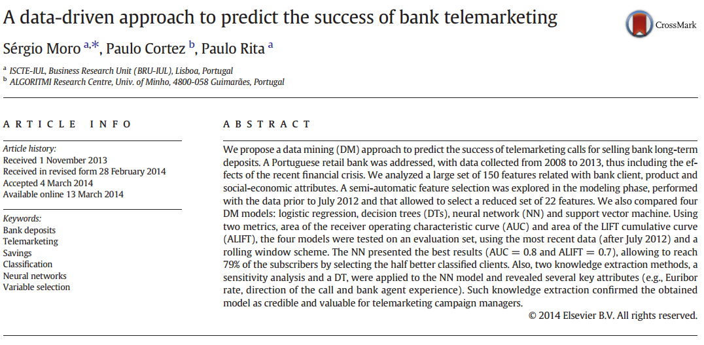

<style type="text/css">

code.r{ /* Code block */
    font-size: 23px;
}

pre { /* Code block - determines code spacing between lines */
    font-size: 14px;
}

</style>

```{r setup, include=FALSE}
library(knitr)
library(conflicted)
library(tidyverse)
library(shiny)
library(lubridate)
library(bizdays)
library(fOptions)
library(ggplot2)
conflict_prefer("filter", "dplyr")
conflict_prefer("lag", "dplyr")
knitr::opts_chunk$set(echo = FALSE, fig.align="center", collapse = TRUE, cache = TRUE)
chunk <- "```"
inline <- function(x = "") paste0("`` `r ", x, "` ``")
```

# Lecture 5: R Programming/2

## Object - S3 Object System in R

\footnotesize
```{r echo = TRUE}
# Object
# Define class with attributes.
vanilla_option <- setClass("vanilla_option",
                           slots = c(type = "character",
                                     strike = "numeric",
                                     underlying = "numeric"))

# Create object, either way
opt1 <- new("vanilla_option", type = "c", strike = 100, underlying = 100)
opt2 <- vanilla_option(type = "c", strike = 100, underlying = 100)

# Use @ to visit member. or,
opt1@type
slot(opt1, "strike")
```

## Work with objects

\footnotesize
```{r echo = TRUE, fig.height=2, fig.width=3}
set.seed(1234)
# Generate a vector of option objects
opts <- sapply(1:1000,
                function(x) { 
                  vanilla_option(type = sample(c("c", "p"), 1),
                                 strike = round(runif(1) * 100, 0),
                                 underlying = round(runif(1) * 100, 0)) })

# install.packages("fOptions")
library(fOptions)

start <- Sys.time()
# GBSOption also returns an object. We just need its price attribute.
res1 <- sapply(opts, function(o) {
  obj <- GBSOption(o@type, o@underlying, o@strike,
            Time = 1, r = 0.01, b = 0, sigma = 0.3)
  obj@price
})
cat(paste0("Time used: ", as.numeric(Sys.time() - start)))
```
## Objects or Data Frame?

We can re-write above example using a data frame. We can notice a few differences but largely the same.

Note: `tibble` is to create data frame in Tidyverse.

\footnotesize
```{r echo = TRUE, fig.height=2, fig.width=3}
set.seed(1234)
# Generate a vector of options
df_opts <- tibble(type = sample(c("c", "p"), 1000, replace = TRUE),
                  strike = round(runif(1000) * 100, 0),
                  underlying = round(runif(1000) * 100, 0))

# install.packages("fOptions")
library(fOptions)

start <- Sys.time()
# GBSOption also returns an object. We just need its price attribute.
res2 <- by(df_opts, 1:nrow(df_opts), function(r) {
  obj <- GBSOption(r$type, r$underlying, r$strike,
            Time = 1, r = 0.01, b = 0, sigma = 0.3)
  obj@price
}, simplify = TRUE)
cat(paste0("Time used: ", as.numeric(Sys.time() - start)))
```

## Objects or Data Frame? - My take

- Arising from data science, most calculations is around data frame(s). Does it make object obsolete?
- No. Please consider object to be used as "data in transition" which individual attention is needed, frequent internal status change, upgrade, transform, etc.
- Data frame is to process "data in finish". We will apply group-based action and study the data inside to gain insights.

- Consider both data frame-oriented programming and object-oriented programming.
- Data frame requires us to know what's inside, the name and data types. Object has a definition that helps us to store data in one format.
- Besides, object can be used to organize functions, etc.

<!--
Not included

```{r include = FALSE}
# Alternatively to sapply, we can use map* functions from purrr package
# map is a generic function that returns a list
# map_dbl is for result of double, it would return a vector
library(purrr)

res2 <- purrr::map_dbl(opts, function(o) {
  (GBSOption(o@type, o@underlying, o@strike, Time = 1,
             r = 0.01, b = 0, sigma = 0.3))@price
})
head(res2, n = 4)
```
-->

## Read/Write data

```{r eval = FALSE, include = TRUE, echo = TRUE}
# set working directory
setwd("C:/TEMP")

# Save this_is_var1 to a file
this_is_var1 <- 112131
saveRDS(this_is_var1, file = "C:/TEMP/DATA/data.Rds")
# Load data from a file into a new variable `new_var`
new_var <- readRDS(file = "C:/TEMP/DATA/data.Rds")
print(new_var) # gives 112131
```

- On Windows, use double slashes `\\` or single backslash `/`. e.g. `C:\\TEMP\\DATA`, `C:/TEMP/DATA`
- On Mac, use backslash `/Users/.../`

## Question: Fastest Fish Problem

We have ten fishes releases in a very long lane at fixed time interval but random order. They swim at different speed. The fast fish would eat the slow fish. On average, How many fishes would survive?

```{r echo = FALSE, fig.height=3, fig.width=4}
N <- 10

survi <- function() {
  queue <- sample(1:N, N, replace = FALSE)
  qori <- queue
  fastest <- queue[1]
  for (n in 2:N) {
    if (queue[n] > fastest) {
      queue[n] <- NA
    } else {
      fastest <- queue[n]
    }
  }
  list(qori = qori,
       queue = queue)
}

# plot((survi())$queue, 1:10, col = "skyblue2", pch = "\u2653", cex = 2)

plot(1:10, 1:10, type="n")
res <- survi()
for (i in 1:10) {
  if (is.na(res$queue[i])) {
    text(res$qori[i], i, paste0(i,"S"), col = "grey", cex = 0.8) 
  } else {
    text(res$queue[i], i, paste0(i,"V"), col = "skyblue3", cex = 1.0)
  }
}
```

## Histogram of Number of Survived Fishes

```{r echo = FALSE, fig.height=3, fig.width=4}

sim_sample <- replicate(10000, length(na.omit({ survi()$queue })))
res_sim <- mean(sim_sample)

survi.prob <- function() {
  sum <- 0
  for (n in 1:N) {
    sum <- sum + 1/n
  }
  sum
}
res_ana <- survi.prob()
```

- Result from simulation: `r res_sim`
- Result from analytics: `r res_ana`


```{r echo = FALSE, fig.height=3, fig.width=4}
hist(sim_sample)
```

## Assignment: How far to make a choice?

- Secretary Problem <https://en.wikipedia.org/wiki/Secretary_problem>
  - If we have 100 secretaries ranked from best to worst, coming to interview at random order.
  - Our selection strategy, use a small group to establish our selection criteria, for the subsequent ones, we pick the first that's better than our selection criteria.
  - What's the size of the split so that the probabiliy of our picked is the best is maximized? What's the probabiliy that we can pick the best?

- Hint: use simulation method
  - Step 1: create function `make_choice <- function(N, split_number)`
    #. Generate a list `input_list` of `N` long with integer 1 to N at random position
    #. Split the list `input_list` into two: evaluation group and selection group.
    #. Remember the best number from evaluaton group and match the first number in selection group, >= than best. Return it.
    #. Run this function for a few (hundred) times and find the probability of getting `N`.
  - Step 2: create function `find_optimal()`, calls `make_choice` for each of the split number from `1` to `N/2`. So we can find the optimal value for the split for the `N`.
  - Step 3: Find the solution for `N = 3`, then, `N = 10`, then move on to `N = 100`.

## Take-home

- How many data types have you remembered? Have you used?
  - Use more vector, list in ordinary programming.
  - Use matrix, data frame for data programming.
  - Use as.Date()/as.character() to convert date. Use lubridate/bizdays packages
- Write anonymous functions.
- Use apply()/purrr:map() function.
- Try to use object when appropriate to organize code (reduce copy and duplicates).

## Take-Home: Ideas to write better R code

- When writing loop, think whether you can use one of following:
  + vectorized operations
  + use apply or purrr
- Structure & modularize your code, aka write functions.
- Introduce conditional executions.
- Debug & Document (add comments, or use Rmd)
- Test


# Lecture 6: R Shiny/2: Building a Web App

## Start with minimalism

In Shiny/1, we worked on `ui`, now we move on to `server`. Recall, this was our mimimal Shiny.

```{r eval=FALSE, include=TRUE, echo = TRUE}
library(shiny)
ui <- fluidPage("Hello World")
server <- function(input, output, session) { }
shinyApp(ui = ui, server = server)
```

The default `server` function created by R Studio has two inputs only, add `session` as 3rd input.

## Think around Input and Outputs

```{r eval=FALSE, include=TRUE, echo = TRUE}
ui <- fluidPage(
  # Description
  titlePanel("Hello World with a Histogram"),
  # Input controls
  numericInput("num", "Number of Sample", value = 30),
  # Output controls
  plotOutput("hist")
)
```

## Input controls

Input controls follow such function signature except for input-specific parameters.

Note: UI elements (User-Interface) for user interactin (edit or display content) is called "control", or widgets.

```{r eval=FALSE, include=TRUE, echo = TRUE}
inputXXX(inputId = "input name", label = "label to display", ...)
```

More types of controls. You can now use layout containers to place them in the Shiny App.

- `numericInput`
- `textInput`
- `passwordInput`
- `slideInput`
- `selectInput`
- `dateInput`

Reference: <https://shiny.rstudio.com/reference/shiny/1.5.0/>

## Output controls

Output controls follow such pattern.

```{r eval=FALSE, include=TRUE, echo = TRUE}
yyyOutput(outputId = "output name")
```

- `textOutput("text")`
- `verbatimTextOutput("text_orignal")`
- `tableOutput("t1")`
- `dataTableOutput("t2")`
- `plotOutput(outputId = "hist", width = "400px", height = "400px")`
- `uiOutput("uiX")`

For plotOutput, I suggest to set width and height to fixed size, though they are optional input to the function.
For other kinds of outputs, only `outputId` is good enough (usually).

## Server

`server` function is to add dynamic action.

```{r eval=FALSE, include=TRUE, echo = TRUE}
server <- function(input, output, session) {
  # Enable either one from below.
  output$hist <- renderPlot({ hist(rnorm(100)) })
  
  output$hist <- renderPlot({
    title("a normal random number histogram")
    hist(rnorm(input$num))
  })
}
```

## shinyApp = UI + Server

- UI and Server combine to be a ShinyApp.
- UI is to run the same for each browser/client.
- Server is separate between different users.

```{r eval=FALSE, include=TRUE, echo = TRUE}
shinyApp(ui, server)
```

## Reactivity Kicks In

- Reactivity links input to the output like a data flow.
- Reactivity: `input$num ------> output$p1`

Reactive values work together with reactive functions.

1. Reactive function responds. `input$x => output$y`
2. Reactive value notifies. `input$x => expression() => output$y`

## Reactivity - 1

Reactivity is enabled by placing input `inputXXX` inside `renderXXX` function. (shiny-21.R)

This is an automatic way to add the reactive linkage.

\footnotesize
```{r echo = FALSE, comment = ""}
cat(htmltools::includeText("../example/week2/shiny-21.R"))
```

## Reactivity - 2

- Button represents a manual trigger of the action.
- We use `observeEvent` to observe button action, and `isolate` to cut down the link of `inputXXX` in `renderXXX`, so button can work.
- If we remove `isolate`? (shiny-22.R)

\footnotesize
```{r echo = FALSE, comment = ""}
cat(htmltools::includeText("../example/week2/shiny-22.R"))
```

## Reactivity - 3

We can add a reactiveValue with `eventReactive`. (shiny-23.R) This would make reactive link for "1 - N".

\footnotesize
```{r echo = FALSE, comment = ""}
cat(htmltools::includeText("../example/week2/shiny-23.R"))
```

## Reactivity - 4

We can add a reactiveValue with `reactiveValue`. (shiny-24.R) This would make reactive link for "N - 1", or "N - N".

\scriptsize
```{r echo = FALSE, comment = ""}
cat(htmltools::includeText("../example/week2/shiny-24.R"))
```

## Output

For tableOutput

\footnotesize
```{r eval=FALSE, include=TRUE, echo = TRUE}
output$t1 <- renderTable(iris)

output$t1 <- renderTable({
  some input..
  output is a data frame.
})
```

For dataTableOutput (Dynamic table)

\footnotesize
```{r eval=FALSE, include=TRUE, echo = TRUE}
output$t2 <- renderDataTable(iris)
```

For plotOutput

\footnotesize
```{r eval=FALSE, include=TRUE, echo = TRUE}
output$p2 <- renderPlot({ plot(runif(1000), runif(1000)) })
```

For textOutput and verbatimTextOutput

\footnotesize
```{r eval=FALSE, include=TRUE, echo = TRUE}
output$t3 <- renderText({ "foo" })
output$t4 <- renderPrint({
  print("foo")
  print("bar")
})
```

## Example: (Shiny-25.R)

\tiny
```{r echo = FALSE, comment = ""}
cat(htmltools::includeText("../example/week2/shiny-25.R"))
```


## Debug Shiny

- Use print to check certain code has been run.
- Clear environment to run Shiny in R Studio, so you can check whether your App has all the data it can load.
- Use stop point


## Shiny: Take-home

- Reactive is about linkage: wiring input(s) and output(s)
- Connect from receiver: plot/tabulate for data
- Connect from trigger: button, isolate to create a Chinese wall


## Shiny Assignment - 1

1. Create a Bond Schedule
  + Inputs: start date, tenor, coupon rate, coupon frequency (Annual, Q, Semi-Annual), and yield to maturity.
  + Output:
    - A table of coupon schedule (date, ignoring public holidays) and payment amount
    - A plot of payment vs schedule

NPV
  
$NPV = \frac{Cashflow 1}{(1 + yield)^1} + \frac{Cashflow 2}{(1 + yield)^2} + ... + \frac{Last Cashflow}{(1 + yield)^n}$

For a Bond with fixed coupon
$Bond Price = Coupon * \frac{1 - (\frac{1}{(1 + yield)^n})}{yield} + \Big[MaturityValue * \frac{1}{(1 + yield)^n}\Big]$

## Shiny Assignment - 2

2. Create a data downloader
  + Register at <https://www.alphavantage.co/support/#api-key>
  + Install R package `alphavantager`
  + Write an App to let user input a US stock ticker, save it in RDS format and plot it.
  + Help:
    - Sample code to download data.  
    - <https://www.alphavantage.co/documentation/>
    - <https://cran.r-project.org/web/packages/alphavantager/alphavantager.pdf>


## Shiny Assignment - 2 - alphavantager sample

\footnotesize

    library(alphavantager)
    av_api_key("Your Key")
  
    # To speed up download, we use compact to download recent 100 days.
    # outputsize is default to "compact"
    df_res <- av_get("MSFT",av_fun = "TIME_SERIES_DAILY_ADJUSTED",outputsize="compact")
    
    # Below code can return NA if bad code is passed.
    df_res <- tryCatch({
      df_res <- av_get("BadStockCode", av_fun = "TIME_SERIES_DAILY_ADJUSTED")
      df_res
      }, error = function(e) {
        NA
      })
    is.na(df_res) # TRUE

    # plots
    plot(df_res$timestamp, df_res$adjusted_close)
    lines(df_res$timestamp, df_res$adjusted_close)


# Lecture 7: dplyr/1: Data Manipulation

## Tidyverse

install.packages("tidyverse")

```{r echo = FALSE, out.width = "65%"}
knitr::include_graphics("imgs/2017/tidyverse.png")
```

## SQL

- It was invented by Edgar Codd
- It first appeared in 1974, which is `r lubridate::year(Sys.time()) - 1974` years ago.

```{r echo = FALSE, out.width = "65%"}
knitr::include_graphics("imgs/2017/edgar-codd.png")
```

## CRUD: Create | Read | Update | Delete

- The combination of these operations can create complete programs.
- Data engineering was born around 70s with SQL.
- Nowadays, `dplyr` inherites the thoughts to do data manipulation with **verbs** not SQL.

```{r echo = FALSE, out.width = "57%"}
knitr::include_graphics("imgs/2017/CRUD.png")
```

## Data frame does CRUD

```{r echo = TRUE, results = "hide"}
df <- tibble(a = 1:10, b = 10:1)

# Select (aka Filter)
df[which(df$a == 3 | df$b == 3), , drop = T] 
df[match(3, df$a), , drop = T]
df[, match("b", colnames(df)), drop = T] 

# Insert
rbind(df, df)

# Delete
df[-(which(df$a == 3 | df$b == 3)), , drop = T]

# Update
df[which(df$a == 3 | df$b == 3), 2] <- 3
```

## dplyr

dplyr package from tidyverse is a high-performance package to manipulate data in data frame.

\scriptsize
```{r echo = TRUE}
# tidyverse is a bundle of packages.
# I usually load them all with library(tidyverse, instead of library(dplyr) individually.
library(conflicted) # help to resolve name conflicts
library(tidyverse)
# -- Attaching packages --------------------------------------- tidyverse 1.2.1 --
# v ggplot2 3.2.1     v purrr   0.3.2
# v tibble  2.1.3     v dplyr   0.8.3
# v tidyr   0.8.3     v stringr 1.4.0
# v readr   1.3.1     v forcats 0.4.0
# -- Conflicts ------------------------------------------ tidyverse_conflicts() --
# x dplyr::filter() masks stats::filter()
# x dplyr::lag()    masks stats::lag()
# There are other filter() or lag() functions in packages.
# Following code prefer the ones from dplyr pacakge.
conflict_prefer("filter", "dplyr")
conflict_prefer("lag", "dplyr")
# Alternative, use dplyr::lag and dplyr::filter with their package names
```

## How dplyr works

`dplyr` provides functions in "verbs", which is functions that does one thing only. We will learn to use the following.

\scriptsize
+ Key
    - select: return a subset of the columns of a data frame
    - filter: extract a subset of rows based on logical conditions
    - arrange: reorder rows
    - rename: rename variables
    - mutate: add new variables/columns or transform existing variables
+ Group
    - group_by / rowwise / ungroup: stratify the data
    - summarise / summarize: generate summary statistics of different variables in the data frame, possibly within strata
    - do: process data within the strata
+ Combine
    - left_join / right_join / anti_join / full_join
    - bind_rows / bind_cols
+ Helpers
    - %>%: the “pipe” operator is used to connect multiple verb actions together into a pipeline
    - ifelse / case_when
    - lag/distinct
    - n


## Sample dataset

    A data-driven approach to predict the success of telemarketing
    Author: Sérgio Moroa; Paulo Cortezb; Paulo Ritaa
    <http://dx.doi.org/10.1016/j.dss.2014.03.001>

I chose this data set of a Portuguese retail bank clients profile.

- Real data collected from a Portuguese retailbank, from May 2008 to June 2013, in a total of 52,944 phone contacts.

```{r echo = FALSE, out.width = "60%"}

```


## Sample dataset columns (also called variable, field or feature)

- Personal profile
  1. age (numeric)
  2. job : type of job (categorical: "admin.","unknown","unemployed","management","housemaid","entrepreneur","student", "blue-collar","self-employed","retired","technician","services") 
  3. marital : marital status (categorical: "married","divorced","single"; note: "divorced" means divorced or widowed)
  4. education (categorical: "unknown","secondary","primary","tertiary")
  5. default: has credit in default? (binary: "yes","no")
  6. balance: average yearly balance, in euros (numeric) 
  7. housing: has housing loan? (binary: "yes","no")
  8. loan: has personal loan? (binary: "yes","no")
  
- Related with the last contact of the current campaign:
  9. contact: contact communication type (categorical: "unknown","telephone","cellular") 
  10. day: last contact day of the month (numeric)
  11. month: last contact month of year (categorical: "jan", "feb", "mar", ..., "nov", "dec")
  12. duration: last contact duration, in seconds (numeric)

## Sample dataset columns - 2

- Other attributes:
  13. campaign: number of contacts performed during this campaign and for this client (numeric, includes last contact)
  14. pdays: number of days that passed by after the client was last contacted from a previous campaign (numeric, -1 means client was not previously contacted)
  15. previous: number of contacts performed before this campaign and for this client (numeric)
  16. poutcome: outcome of the previous marketing campaign (categorical: "unknown","other","failure","success")

- Output variable (desired target):
  17. y - has the client subscribed a term deposit? (binary: "yes","no")

## Read data

I place it at <https://goo.gl/PBQnBt> (for direct use), <https://goo.gl/fFQAAm> (for Download).

Use RStudio's `File -> Import Dataset`, you may choose either "From Text (base)" or "From Text (readr)". Either way loads the data.

`base` comes with R. `readr` is a package from tidyverse that provides more options and functionality.
Copy the generated code to your script file.

You may download it and save it to local.

\tiny
```{r echo = TRUE}
# Use base
bank <- read.csv("example/data-bank/bank.csv", sep=";") # or,
bank <- read.csv("https://goo.gl/PBQnBt", sep = ";")

# use readr
library(readr)
bank <- read_delim("example/data-bank/bank.csv", 
                   ";", escape_double = FALSE, trim_ws = TRUE)
```

```{r eval=FALSE, include=TRUE, echo = TRUE}
View(bank)
```

## `select`

`select(df, ...)`, ... can be

- variable name
- numeric to indicate nth column (`-` means exclude)
- a range
- a function

## `select` - Examples

```{r echo = TRUE}
subset <- select(bank, marital)
subset <- select(bank, 1)
subset <- select(bank, -1)
subset <- select(bank, -job)
subset <- select(bank, -(job:education))
subset <- select(bank, starts_with("p"))
subset <- select(bank, ends_with("p"))
subset <- select(bank, contains("p"))
```

## `select` as a re-arrangement of columns.

```{r echo = TRUE, results = "hide"}
job_first <- select(bank, job, everything())
```

## `filter`

\footnotesize
```{r echo = TRUE}
colnames(bank)

young <- dplyr::filter(bank, age < 40)
another_young <- dplyr::filter(bank, age < 20 & marital == "married")
just_young <- dplyr::filter(bank, age < 20 & marital == "single")

young2 <- dplyr::filter(bank, age >= 20 & age < 30)
another_young2 <- dplyr::filter(bank, age >= 20 & age < 30 & marital == "married")
just_young2 <- dplyr::filter(bank, age >= 20 & age < 30 & marital == "single")
```

## `filter` - logic operators

```{r echo = FALSE, out.width = "75%"}
knitr::include_graphics("imgs/2017/transform-logical.png")
```

## `filter` - string operations

\footnotesize
```{r echo = TRUE}
# %in% to match multiple
second_upper <- dplyr::filter(bank, education %in% c("tertiary", "secondary"))

# filter out NA value.
no_na <- dplyr::filter(bank, !is.na(balance) & balance > 0)
```

### Question

- How many bank client have a loan while doesn't have a housing?
- How many bank client have a job between 20 to 40?

## `rename`

```{r echo = TRUE}
# rename(new name = old)
# Use tick to quote special strings.
df <- rename(bank, young_age = age) 
df <- rename(bank, `Age in Bank` = age)
```


## `arrange`

\footnotesize
```{r echo = TRUE, results = "hide"}
# arrange is sort
arrange(bank, job)
arrange(bank, default, job)

# descending for day
arrange(bank, desc(day))
arrange(bank, desc(as.Date(day, format="%d", origin = Sys.Date())))
```
NB: Missing values are always sorted at the end.

### Question

- How could you use arrange() to sort all missing values to the start? (Hint: use `is.na()`).

```{r eval=FALSE, include=TRUE, echo = TRUE}
arrange(bank, !is.na(a), a)
```

- Find the longest duration?
- Find the eldest?

## `mutate`

\footnotesize
```{r echo = TRUE}
# Replace existing
# ifelse is to check condition.
df1 <- mutate(bank, y = ifelse(y == "yes", T, F))

# Add a new column.
df2 <- mutate(bank, duration_diff = duration - mean(duration, na.rm = TRUE))

# case_when is a function to deal multiple choices.
df2_age_group <- mutate(bank, age_group = case_when(
  age < 20 ~ "youth",
  age < 40 ~ "middle-age",
  age < 50 ~ "senior",
  TRUE ~ "happy"
))

df2_age_group_res <-
  group_by(df2_age_group, age_group) %>%
  summarise(mean_age = mean(age)) %>%
  transmute(mean_age_diff = mean_age - lag(mean_age))
```

## `mutate` - 2

\scriptsize
```{r echo = TRUE}
firstup <- function(x) {
  substr(x, 1, 1) <- toupper(substr(x, 1, 1))
  x
}

# month.abb is a built-in array of month names.
df3 <- mutate(bank, month_name = factor(firstup(as.character(month)), levels = month.abb))

# transmute would remove all other columns after mutation, only keeping the new variable.
df5 <- transmute(bank, 
                  duration_trend = duration - mean(duration, na.rm = TRUE),
                  balance_trend = balance - mean(balance, na.rm = TRUE))
```

## What you can do with `mutate`

* +, -, *, /: ordinary arithmetic operator
* %/% (integer division) and %% (remainder), where x == y * (x %/% y) + (x %% y)
* x / sum(x): compute the proportion of all things
* y - mean(y): computes the difference from the mean.
* log2(), log(), log10(): 
* lead(), lag(): compute running differences (e.g. x - lag(x)) or find when values change (x != lag(x)
* cumulative sum, prod, min, max: cumsum(), cumprod(), cummin(), cummax(); and dplyr provides cummean()
* rolling sum: 
* row_number()/min_rank()/ntile(,n)

```{r eval=FALSE, include=TRUE, echo=FALSE}
# cumsum
df_1 <- tibble(a = 1:10)
df_2 <- mutate(df_1, b = cumsum(a))
mutate(df_2, c = b - lag(b,6))
```

```{r echo = TRUE}
y <- c(1, 2, 2, NA, 3, 4)
row_number(y)
min_rank(y)
ntile(y, 2)
```

## Take-Home

- We learned the key "verbs" from dplyr. Review them and try to remember each.
- select, filter, rename, arrange, mutate, etc.
- Let's pick up the rest next week.


## Special Topic: Environment

Environment is where your data resides. Use `local()` to isolate.

\footnotesize
```{r echo = TRUE}
# Access the nearest environment
x <- 3
{
  print(x)
  x <- 1
  print(x)
}
x
```

\footnotesize
```{r echo = TRUE}
# local stores the data wihtin the boundary of {}
x <- 3
local({
  print(x)
  x <- 1
  print(x)
})
print(x)
```

## Environment - Isolation from outside

```{r echo = TRUE}
get_sum <- function(i) {
  v <- 0
  for (i in 1:10) {
    v <- v + i
  }
  v
}

get_sum(10)

# Error with line below: object 'v' not found
# v
```

## Environment

Use `assign()` to do cross-environment-jump.

\footnotesize
```{r echo = TRUE}
# assign data to global environment
x <- 1
pass_out_global <- function() {
  assign("x", 3, envir = .GlobalEnv)  
}

# assign data to just one level up 
pass_out <- function(env) {
  print(env)
  assign("x", 2, envir = env)
}
```

## Environment

Usage of `pass_out()/pass_out_global()`

\scriptsize
```{r echo = TRUE}
x <- 1
pass_out(environment())
x

# assign data to pass it out of function
extra_layer <- function(env) {
  pass_out(env)
}

x <- 1
extra_layer(env = environment())
x

extra_layer_g <- function() {
  pass_out_global()
}

x <- 1
extra_layer_g()
x
```


## Special Topic: Pipe `%>%`

We may write such code.

```{r eval=FALSE, include=TRUE, echo = TRUE}
df <- select(df, x)
df <- mutate(df, a = 1)
df <- rename(df, a = b)
df <- arrange(df, x)

# This is effectively,
arrange(rename(mutate(select(df, x), a = 1), a = b), x)

third(second(first(x)))
```

How about this?
  
```{r eval=FALSE, include=TRUE, echo = TRUE}
df %>% select %>% mutate %>% rename %>% arrange
```

## %>% Benefits

`%>%` operator allows you to transform the flow from nesting to left-to-right fashion.

\footnotesize
```{r eval=FALSE, include=TRUE, echo = TRUE}
first(x) %>% second() %>% third()

x %>% first() %>% second() %>% third() # this could also do.

x %>% first(.) %>% second(.) %>% third(.) # . represents the input
```

What's the output of below?

\footnotesize
```{r echo = TRUE }
c(1, 3, 7, 9) %>% {
  print(.)
  mean(.)
} %>% { . * 3 } %>% {
  print(.)
  sample(round(., 0))
}
```

## Work with Pipe - Techniques

Feed the data for a bit complicatd processing 

\footnotesize
```{r eval=FALSE, include=TRUE, echo = TRUE}
%>% {
  v <- .
  cn <- colnames(v)

  v <- select(v, u, z)
  colnames(v) <- cn[1:3]
  v
} %>%
```

## Work with Pipe - Techniques

How to return multiple value

\footnotesize
```{r eval=FALSE, include=TRUE, echo = TRUE}
%>% {
  assign("new_data", filter(., group == "1"),
         envir = parent.env(environment()) )
  filter(., group == "2")
} %>% {
  select(., z < 0.4) # on group 2
  select(new_data, z > 0.4) # on group 1
}

# or, we use list
%>% {
  a <- filter(., group == "1")
  b <- filter(., group == "2")
  list(a, b)
}  %>% {
  v <- .
  v$a
  v$b
}
```

## Code pattern with Pipe

\footnotesize
```{r eval=FALSE, include=TRUE, echo = TRUE}
df %>%
... %>%
... %>%
... %>%
{
  v <- .
  ggplot(data = v) + 
    # full data is used here
    geom_line(data = v) +
    # partial data needs to be hightlighted.
    geom_line(data = filter(., some condition), color = "red")
}
```

## Use of Caution for Pipe (%>%)

Pros:

- We don't need to keep intermediate result, sames memory and also variable names.

Cons:
  
- Difficult to debug, to find something in the middle of the chain.
- Use `{ print(.); filter(., ...) }` to print intermediate resuls.
- Pipes are fundamentally linear and expressing complex relationships with them will typically yield confusing code.
- Separate the long pipes into shorter pipes, adding more intermediate variables. Because you can more easily check the intermediate results, and it makes it easier to understand your code.

