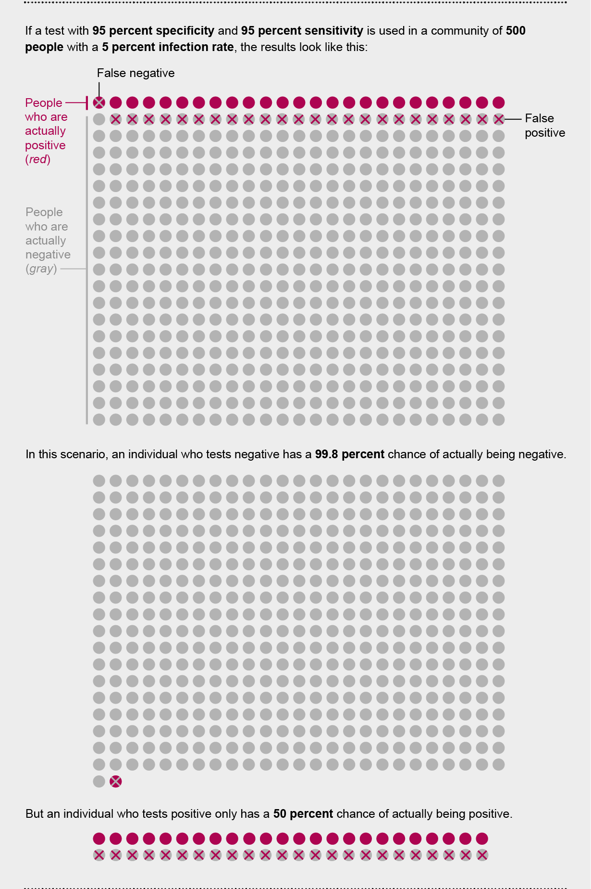

```{r setup, include=FALSE}
library(knitr)
library(conflicted)
library(fOptions)
library(tidyverse)
library(lubridate)
library(bizdays)
library(ggplot2)
library(ggthemes)
library(gridExtra)
library(maps)
library(knitr)
library(kableExtra)  
library(shiny)
conflict_prefer("filter", "dplyr")
conflict_prefer("lag", "dplyr")
knitr::opts_chunk$set(echo = FALSE, fig.align="center", collapse = TRUE, cache = TRUE)
chunk <- "```"
inline <- function(x = "") paste0("`` `r ", x, "` ``")
bank <- read.csv("https://goo.gl/PBQnBt", sep = ";")
options(dplyr.summarise.inform = FALSE)
```

<style type="text/css">
code.r{ /* Code block */
    font-size: 23px;
}
pre { /* Code block - determines code spacing between lines */
    font-size: 23px;
}
</style>

# Lecture 9: Data Visualization and EDA

## Why do we need ggplot?

\large
Visualizations is part of the data exploration.

```{r echo = FALSE, out.width = "75%"}
knitr::include_graphics("imgs/2017/main-qimg-bf859b506013fd60589a28be4c3f9e47.png")
```

## ggplot2

- `library(ggplot2)`, author Hadley Wickham. First release on June 10, 2007.
- gg stands for "Grammar of Graphics"

```{r echo = FALSE, out.width = "75%"}
knitr::include_graphics("imgs/2018/ggplot2-examples.png")
```

## ggplot2 in news

<https://qz.com/1007328/all-hail-ggplot2-the-code-powering-all-those-excellent-charts-is-10-years-old/>

```{r echo = FALSE, out.width = "68%"}
knitr::include_graphics("imgs/2017/ggplot2-10.png")
```

## Programming ggplot2

\scriptsize
```{r echo = TRUE, fig.width = 3, fig.height = 2, cache=TRUE}
# library(ggplot2)
ggplot(airquality, aes(Temp, Ozone)) + 
        geom_point() + 
        geom_smooth(method = "loess", se = FALSE)
```

## Syntax of ggplot

- Definition of data + Definitions of layers.

```{r echo = TRUE, eval=FALSE}
# For Single-layer
ggplot(the-data, aes(variable-to-plot)) +
  geom_type-of-graph()
  
# Or, for multi-layer
ggplot(data = <DATA>, ...) + 
  <GEOM_FUNCTION1>(mapping = aes(<MAPPINGS>)) +
  <GEOM_FUNCTION2>(mapping = aes(<MAPPINGS>)) +
  ... +
  other formatting functions.
```

## Syntax of ggplot: Points to Note

- Put the + sign in the end of the line, not the beginning of the line.

\footnotesize
```{r echo = TRUE, eval=FALSE}
# Below would result in error
ggplot(data = <DATA>, ...)
+ <GEOM_FUNCTION>(mapping = aes(<MAPPINGS>))
```

- The definition of data will pass down through the layers. But each layer can have its own data.

\footnotesize
```{r echo = TRUE, eval=FALSE}
ggplot(data = d1, ...) +
  geom_point() + # this would get data = d1
  geom_point(data = d2, ...) # this would get data = d2
```

- `geom_point()` is for points, `geom_line()` is for line, `geom_smooth()` for smoothed line... There are many `geom`-etry.


## Simple plot: `x` and `y`

```{r echo = TRUE, eval=FALSE}
ggplot(bank, aes(age, balance)) + geom_point()
```

```{r echo = FALSE, fig.width=2.5, fig.height=2.5, cache=TRUE}
ggplot(bank, aes(age, balance)) + geom_point()
```

## Learning Points for ggplot

- Viz for non-numeric data
- Adjustment
- A few tactics
  - Multiple geoms
  - Pass aes down or not
  - aes and aes_string
- Layers
- Differentiate groups
- Viz for numeric data

## For non-numeric data: default and age

\footnotesize
```{r echo = TRUE, eval=FALSE}
ggplot(bank, aes(default, age)) + geom_point()
ggplot(bank, aes(age, default)) + geom_point()
ggplot(bank, aes(job, age)) + geom_point()
```

```{r echo = TRUE, fig.height=2.5, fig.width=4, cache=TRUE}
ggplot(bank, aes(default, age)) + geom_point()
```

## For non-numeric data: age and default (make it landscape)

```{r echo = TRUE, fig.height=2.2, fig.width=4, cache=TRUE}
ggplot(bank, aes(age, default)) + geom_point()
```

## For non-numeric data: job and age

\footnotesize
```{r echo = TRUE, fig.height=2.2, fig.width=4, cache=TRUE}
ggplot(bank, aes(job, age)) + geom_point() +
  theme(text = element_text(size=8),
        axis.text.x = element_text(angle=90, hjust=1))
```

## Add text

\footnotesize
```{r echo = TRUE, fig.height=2.0, fig.width=4, cache=TRUE}
ggplot(bank, aes(job, age)) + geom_point() +
  theme(text = element_text(size=8),
        axis.text.x = element_text(angle=90, hjust=1)) +
   geom_text(aes(label = rownames(bank)),
             check_overlap = TRUE,
             size = 2,
             vjust = -1)
```
## Add Annotation

\footnotesize
```{r echo = TRUE, fig.height=2.0, fig.width=4, cache=TRUE}
ggplot(bank, aes(job, age)) + geom_point() +
  theme(text = element_text(size=8),
        axis.text.x = element_text(angle=90, hjust=1)) +
  annotate("text",
    x = 10,
    y = 90,
    label = "This is from bank dataset",
    size = 3
  )
```

## Adjustment: legend bottom

\footnotesize
```{r echo = TRUE, fig.height=2.2, fig.width=4, cache=TRUE}
# adjust legend position
ggplot(bank, aes(x = age, y = duration, color = job)) +
geom_point() +
theme(legend.position="bottom", text = element_text(size=8))
```

## Adjustment: legend left

\footnotesize
```{r echo = TRUE, fig.height=2.2, fig.width=4, cache=TRUE}
# legend to the left
ggplot(bank, aes(x = age, y = duration, color = job)) +
geom_point() +
theme(legend.position="left", text = element_text(size=8))
```

## Adjustment: coordinate flip

\footnotesize
```{r echo = TRUE, fig.height=2.2, fig.width=4, cache=TRUE}
# Flip the x and y axis
# Different feeling?
ggplot(bank, aes(x = age, y = duration, color = job)) +
geom_point() +
theme(legend.position="left", text = element_text(size=8)) + 
coord_flip()
```

## Adjustment: log scale

\footnotesize
```{r echo = TRUE, fig.height=2.2, fig.width=4, cache=TRUE}
# Make y as log scaled.
# Note that before flip, x is y, so we use scale_y_log10()
ggplot(bank, aes(x = age, y = duration, color = job)) +
geom_point() +
theme(legend.position="left", text = element_text(size=8)) + 
coord_flip() +
scale_y_log10()
```

## Add 2nd geometry

\footnotesize
```{r echo = TRUE, eval = FALSE}
ggplot(bank, aes(age, balance)) + geom_point() + geom_smooth()
ggplot(bank, aes(age, balance, color = job)) + geom_point() + geom_smooth()
```

## Add 2nd geometry - Plot

\footnotesize
```{r echo = FALSE, cache=TRUE, fig.width=5, fig.height=3}
suppressWarnings({
  p1 <- ggplot(bank, aes(age, balance)) + geom_point() + geom_smooth() + theme(text = element_text(size=8))
  p2 <- ggplot(bank, aes(age, balance, color = job)) + geom_point() + geom_smooth() + theme(text = element_text(size=8))
  grid.arrange(p1, p2, ncol = 2, widths = c(1.35,2))
})
```

## Multiple geoms: Pass `aes` down

`geom_*` functions has a default parameter of `inherit.aes = TRUE`.

\footnotesize
```{r echo = TRUE, eval=FALSE}
ggplot(bank, aes(x = age, y = duration)) +
geom_smooth() + # same as geom_smooth(aes(x = age, y = duration))
geom_point() # same as geom_point(aes(x = age, y = duration))
```

\footnotesize
```{r echo = TRUE, eval=FALSE}
# This is equivalent to below. But this is a bit repeating.
ggplot(bank) +
geom_point(aes(x = age, y = duration)) +
geom_smooth(aes(x = age, y = duration))
```

## Pass `aes` down or not: Case of Not

Some cases, we do need to have different data and aes on layers for different `geom_*` functions.

\footnotesize
```{r echo = TRUE, eval = FALSE}

ggplot(bank) +
geom_point(aes(x = age, y = duration)) +
geom_smooth(data = filter(bank, job == "entrepreneur"),
            aes(x = age, y = duration), color = "green") +
geom_smooth(data = filter(bank, job == "blue-collar"),
            aes(x = age, y = duration), color = "blue") +
geom_smooth(data = filter(bank, job != "entrepreneur"),
            aes(x = age, y = duration), color = "orange") +
  
```

## Pass `aes` down or not: Case of Not - Result
I added `theme(text = element_text(size=8))` to many ggplot statement. This is to fit to the slide size. You may NOT need it in a R Markdown.

\footnotesize
```{r echo = FALSE, fig.height=2.2, fig.width=2.5, cache=TRUE}

ggplot(bank) +
geom_point(aes(x = age, y = duration)) +
geom_smooth(data = filter(bank, job == "entrepreneur"),
            aes(x = age, y = duration), color = "green") +
geom_smooth(data = filter(bank, job == "blue-collar"),
            aes(x = age, y = duration), color = "blue") +
geom_smooth(data = filter(bank, job != "entrepreneur"),
            aes(x = age, y = duration), color = "orange") +
theme(text = element_text(size=8))
```

## Each `+` is a layer

\footnotesize
```{r echo=TRUE, eval=FALSE}
# Nearly empty chart.
g <- ggplot(bank, aes(x = age, y = duration))
# This is almost empty
g <- ggplot(bank)
# This is really empty.
g <- ggplot()
```

\footnotesize
```{r echo = FALSE, fig.height=2.2, fig.width=4.5, cache=TRUE}
# Nearly empty chart.
g1 <- ggplot(bank, aes(x = age, y = duration))
g2 <- ggplot(bank)
g3 <- ggplot()
grid.arrange(g1, g2, g3, ncol = 3)
```

## Combine `g` with layers

\footnotesize
```{r echo=TRUE, eval=FALSE}
ggplot(bank, aes(x = age, y = duration)) + theme(text = element_text(size=8)) +
  geom_point() + geom_smooth()
```

\footnotesize
```{r echo = TRUE, fig.height=2.1, fig.width=4, cache=TRUE}
# This is equivalent to above
g <- ggplot(bank, aes(x = age, y = duration)) + theme(text = element_text(size=8))
g + geom_point()
g + geom_line()
```

## `g` can be re-used

- `g` can be re-used. It's good to be used when we want to explorer data and try to plot many figures.
- Fixed a few variables in `g <- ggplot(data, aes(job, balance))`.
- Use `g + geom_XXX()` to find the best representation for the relationship between variables.

\footnotesize
```{r echo=TRUE, eval=FALSE}
g <- ggplot(bank, aes(job, balance))
g + geom_point()
g + ()
```

## `g`: mix and match: which figure?

\footnotesize
```{r echo=TRUE, eval=FALSE}
1. g + geom_point() + geom_smooth(method = "lm") + facet_grid(. ~ job)
2. g + geom_point(color = "steelblue", size = 4, alpha = 1/2)
3. g + geom_point(aes(color = job), size = 4, alpha = 1/2)
4. g + geom_point() + geom_point(aes(color = job), size = 4, alpha = 1/2) 
```

\footnotesize
```{r echo = FALSE, fig.height=2.5, fig.width=4, cache=TRUE}
g + geom_point(aes(color = job), size = 4, alpha = 1/2)
```

## `g`: mix and match: which figure?

\footnotesize
```{r echo=TRUE, eval=FALSE}
1. g + geom_point() + geom_smooth(method = "lm") + facet_grid(. ~ job)
2. g + geom_point(color = "steelblue", size = 4, alpha = 1/2)
3. g + geom_point(aes(color = job), size = 4, alpha = 1/2)
4. g + geom_point() + geom_point(aes(color = job), size = 4, alpha = 1/2) 
```

\footnotesize
```{r echo = FALSE, fig.height=2.5, fig.width=4, cache=TRUE}
g + geom_point() + geom_point(aes(color = job), size = 4, alpha = 1/2) 
```

## `g`: mix and match: which figure?

\footnotesize
```{r echo=TRUE, eval=FALSE}
1. g + geom_point() + geom_smooth(method = "lm") + facet_grid(. ~ job)
2. g + geom_point(color = "steelblue", size = 4, alpha = 1/2)
3. g + geom_point(aes(color = job), size = 4, alpha = 1/2)
4. g + geom_point() + geom_point(aes(color = job), size = 4, alpha = 1/2) 
```

\footnotesize
```{r echo = FALSE, fig.height=2.5, fig.width=4, cache=TRUE}
g + geom_point(color = "steelblue", size = 4, alpha = 1/2)
```

## `g`: mix and match: which figure?

\footnotesize
```{r echo=TRUE, eval=FALSE}
1. g + geom_point() + geom_smooth(method = "lm") + facet_grid(. ~ job)
2. g + geom_point(color = "steelblue", size = 4, alpha = 1/2)
3. g + geom_point(aes(color = job), size = 4, alpha = 1/2)
4. g + geom_point() + geom_point(aes(color = job), size = 4, alpha = 1/2)
```

\footnotesize
```{r echo = FALSE, fig.height=2.2, fig.width=4, cache=TRUE}
g + geom_point() + geom_smooth(method = "lm") + facet_grid(. ~ job)
```

## `aes` and `aes_string`

- `aes` needs to have fixed column names. use `aes_string` to pass variable name as string.

\footnotesize
```{r echo = TRUE, eval = FALSE}
ggplot(bank, aes_string("age", "balance", color = "job")) + geom_point()
```

Example of `aes_string`

\footnotesize
```{r echo = TRUE, fig.width=3, fig.height=2.1, cache=TRUE}
# Instead of, ggplot(bank, aes(age, balance)) + geom_point()
plot_bank <- function(x, y) {
  ggplot(bank, aes_string(x, y)) + geom_point() + theme(text = element_text(size=8))
}
plot_bank("age", "duration")
```

## Example for `aes_string`

You may use `aes_string` in Shiny app to get user's input.

```{r eval = FALSE, include = TRUE, echo = TRUE}
# in a Shiny app
# in ui
selectInput("column", "col", choices = c("balance", "duration"))
# in server
plot_bank("age", input$col)
```

## Differentiate groups

- shape
- color
- size
- alpha

## Differentiate groups - `shape`

\footnotesize
```{r echo = TRUE, fig.height=2.2, fig.width=4, cache=TRUE}
# Use shape
ggplot(bank) +
  geom_point(aes(age, duration, shape = contact))
```

## Differentiate groups - `color`

\footnotesize
```{r echo = TRUE, fig.height=2.2, fig.width=4, cache=TRUE}
# Use color
ggplot(bank) +
  geom_point(aes(age, duration, color = contact))
```

## Differentiate groups - `size`

\footnotesize
```{r echo = TRUE, fig.height=2.2, fig.width=4, cache=TRUE}
# Use size
ggplot(bank) +
  geom_point(aes(age, duration, size = contact))
```

## Differentiate groups - `alpha`

\footnotesize
```{r echo = TRUE, fig.height=2.2, fig.width=4, cache=TRUE}
# Use alpha - transparency
ggplot(bank) +
  geom_point(aes(age, duration, alpha = contact))
```

## Enforce color, put things outside `aes`

\footnotesize
```{r echo = TRUE, fig.height=2.2, fig.width=4, cache=TRUE}
## you can also enforce color, put things outside aes
ggplot(bank) +
  geom_point(aes(age, duration),
             color = "blue", size = 6, alpha = 0.4)
```

## What's inside bank's clients? Things to consider - 1

- Which variables in data are categorical?

- Which variables are continuous?

- Bio:
    + age
    + job
    + marital
    + education
- Financial
    + default
    + balance
    + housing
    + loan

## What's inside bank's clients? Things to consider - 2
    
- Communication
    + contact: celluar v.s. telephone v.s. unknown
    + day/month: maybe good to ignore?
    + duration:
    + campaign:
    + pdays:
    + previous:
    + poutcome:

## Categorical/Continuous variable

- numeric -> continuous data
- string -> discrete data

For different type of variables, the scale is also different

- To reverse a categorical (discrete) variable, we use `scale_y_discrete(limit = rev(levels(factor(...))))`.
- To reverse a continuous numerical variable, we use `scale_x_reverse()`.

## Exercise

1. What does this figure mean?

\footnotesize
```{r echo = TRUE, fig.height=2.5, fig.width=4}
ggplot(bank, aes(age, job)) +
geom_point() +
scale_y_discrete(limit = rev(levels(factor(bank$job))))
```

## Exercise

\footnotesize
```{r echo = TRUE, fig.height=2.5, fig.width=4}
# y labels without sort.
ggplot(bank, aes(age, job)) + geom_point()
```

## Exercise

2. I tried to plot between job, loan and age. Any better idea? 
```{r echo = TRUE, fig.height=2.5, fig.width=4}
suppressWarnings(
  ggplot(bank, aes(age, job, color = loan)) + geom_point()
)
```

```{r echo = FALSE, fig.show = "hide", fig.height=2.5, fig.width=4}
ggplot(bank, aes(age, job, color = loan, size = loan)) + geom_point()
```

## Other geoms

- geom_boxplot()
- geom_density()
- geom_histogram()
- geom_bar()

## Boxplot: job and duration

\footnotesize
```{r echo = TRUE, fig.height=2.2, fig.width=4, cache=TRUE}
ggplot(bank, aes(job, duration)) + geom_boxplot() +
  theme(text = element_text(size=8),
        axis.text.x = element_text(angle = 45, hjust = 1))
```

## Boxplot: job and age

\footnotesize
```{r echo = TRUE, fig.height=2.2, fig.width=4, cache=TRUE}
ggplot(bank, aes(job, age)) + geom_boxplot() +
  theme(text = element_text(size=8),
        axis.text.x = element_text(angle = 45, hjust = 1))
```

## Density: balance and job with color

\footnotesize
```{r echo = TRUE, fig.height=2.2, fig.width=4, cache=TRUE}
ggplot(bank, aes(balance, color = job)) + geom_density() +
  theme(text = element_text(size=8),
        axis.text.x = element_text(angle = 45, hjust = 1))
```

## Density: balance and job with fill

\footnotesize
```{r echo = TRUE, fig.height=2.2, fig.width=4, cache=TRUE}
ggplot(bank, aes(duration, fill = job)) + geom_density() +
  theme(text = element_text(size=8))
```

## Density: age and job with color and alpha

\footnotesize
```{r echo = TRUE, fig.height=2.2, fig.width=4, cache=TRUE}
ggplot(bank, aes(age, color = job, alpha = 0.3)) + geom_density() +
  theme(text = element_text(size=8))
```

## Density: age and job with fill and color and alpha

\footnotesize
```{r echo = TRUE, fig.height=2.2, fig.width=4, cache=TRUE}
# Which is better?
ggplot(bank, aes(age, color = job, fill = job, alpha = 0.3)) +
  geom_density() + theme(text = element_text(size=8))
```

## histogram: duration and job and `binwidth = 2`

\footnotesize
```{r echo = TRUE, fig.height=2.2, fig.width=4, cache=TRUE}
ggplot(data = bank, mapping = aes(x = duration, fill = job)) +
  geom_histogram(binwidth = 2) + theme(text = element_text(size=8))
```

## histogram: duration and job and `binwidth = 100`

\footnotesize
```{r echo = TRUE, fig.height=2.2, fig.width=4, cache=TRUE}
ggplot(data = bank, mapping = aes(x = duration, fill = job)) +
  geom_histogram(binwidth = 100) + theme(text = element_text(size=8))
```

## histogram: duration and job and `binwidth = 10`

\footnotesize
```{r echo = TRUE, fig.height=2.2, fig.width=4, cache=TRUE}
ggplot(data = bank, mapping = aes(x = age, fill = job)) +
  geom_histogram(binwidth = 10) + theme(text = element_text(size=8))
```

## histogram: age and job and colour

\footnotesize
```{r echo = TRUE, fig.height=2.2, fig.width=4, cache=TRUE}
ggplot(data = bank, mapping = aes(x = age, colour = job)) +
  geom_freqpoly(binwidth = 10) + theme(text = element_text(size=8))
```

## `geom_bar`
- `bar` is a statistical function: It counts.

\footnotesize
```{r echo = TRUE, eval = FALSE}
# First input parameter to geom_bar is mapping, so we can skip it.
ggplot(bank) + geom_bar(mapping = aes(x = age)) + 
  theme(text = element_text(size=8))
```

\footnotesize
```{r echo = TRUE, fig.height=2.1, fig.width=4, cache=TRUE}
# We can skip mapping
ggplot(bank) + geom_bar(aes(x = age)) +
  theme(text = element_text(size=8))
```

## `geom_bar` with fill: job

\footnotesize
```{r echo = TRUE, fig.height=2.5, fig.width=4, cache=TRUE}
# comparing to colour, for Bar, we better use fill
# ggplot(data = bank) + geom_bar(aes(x = age, colour = job))
ggplot(bank) + geom_bar(mapping = aes(x = age, fill = job)) +
  theme(text = element_text(size=8))
```

## geom_bar with fill: age

\footnotesize
```{r echo=TRUE, eval=FALSE}
ggplot(bank) +
  geom_bar(mapping = aes(x = job)) + 
  theme(text = element_text(size=8))
# Color doesn't work, because age is a continuous variable.
ggplot(bank) +
  geom_bar(mapping = aes(x = job, fill = age)) + 
  theme(text = element_text(size=8)) 
```

\footnotesize
```{r echo = FALSE, fig.height=2.2, fig.width=4, cache=TRUE}
p1 <- ggplot(bank) + geom_bar(mapping = aes(x = job)) +
      theme(text = element_text(size=8),
            axis.text.x = element_text(angle = 45, hjust = 1))
p2 <- ggplot(bank) + geom_bar(mapping = aes(x = job, fill = age)) +
      theme(text = element_text(size=8),
            axis.text.x = element_text(angle = 45, hjust = 1))
grid.arrange(p1, p2, ncol = 2, widths = c(2, 2))
```

## Position for bar

\footnotesize
```{r echo = TRUE, fig.height=2.5, fig.width=4, cache=TRUE}
ggplot(bank) + geom_bar(mapping = aes(x = age, fill = job)) + 
  theme(text = element_text(size=8))
```

## Position for bar: fill

\footnotesize
```{r echo = TRUE, fig.height=2.5, fig.width=4, cache=TRUE}
# fill to 100%. good to show relative change in different allocations.
ggplot(bank) + geom_bar(mapping = aes(x = age, fill = job),
                        position = "fill") +
  theme(text = element_text(size=8))
```

## Position for bar: dodge

\footnotesize
```{r echo = TRUE, fig.height=2.5, fig.width=4, cache=TRUE}
# dodge means "adaptive width of the bar".
ggplot(bank) + geom_bar(mapping = aes(x = age, fill = job),
                        position = "dodge") +
  theme(text = element_text(size=8))
```

## Variations: coord_flip

\footnotesize
```{r echo = TRUE, fig.height=2.3, fig.width=4, cache=TRUE}
# Switch x and y axis.
# Note any adjustment on x or y axis is effective on the original name.
ggplot(bank) +
geom_bar(mapping = aes(x = age, fill = job), position = "fill") +
coord_flip() + theme(text = element_text(size=8))
```

## Variations: coord_polar

\footnotesize
```{r echo = TRUE, fig.height=2.5, fig.width=4, cache=TRUE}
ggplot(bank) +
geom_bar(mapping = aes(x = age, fill = job), position = "fill") +
coord_polar() + theme(text = element_text(size=8))
```

## Variations: scale_x_reverse

\footnotesize
```{r echo = TRUE, fig.height=2.5, fig.width=4, cache=TRUE}
# scale_x_reverse works on continous variable (numeric, date, etc.). Make it big to small.
ggplot(bank) +
geom_bar(mapping = aes(x = age, fill = job), position = "fill") +
coord_flip() + scale_x_reverse() + theme(text = element_text(size=8))
```

## geom_bar: better serves for categorical data

\footnotesize
```{r echo = TRUE, fig.height=2.5, fig.width=4, cache=TRUE}
ggplot(data = bank, mapping = aes(x = job, fill = education)) +
  geom_bar() +
  theme(text = element_text(size=8),
        axis.text.x = element_text(angle = 45, hjust = 1))
```

## geom_bar: coord_flip

\footnotesize
```{r echo = TRUE, fig.height=2.5, fig.width=4, cache=TRUE}
ggplot(data = bank, mapping = aes(x = job, fill = education)) +
  geom_bar() + coord_flip() + theme(text = element_text(size=8))
```

## geom_bar: sort job by mean age

\footnotesize
```{r echo = TRUE, fig.height=2.5, fig.width=4, cache=TRUE}
ggplot(data = bank, mapping = aes(x = reorder(job, age, FUN = mean),
       fill = education)) + geom_bar() +
  coord_flip() + theme(text = element_text(size=8))
```

## geom_bar: sort job by alphabetical order

\footnotesize
```{r echo = TRUE, fig.height=2.2, fig.width=4, cache=TRUE}
# If we want to order job according to alphabetical order.
# use rev(levels(factor(bank$job)))
ggplot(data = bank, mapping = aes(x = reorder(job, age, FUN = median),
       fill = education)) + geom_bar() +
  scale_x_discrete(limit = rev(levels(factor(bank$job)))) +
  coord_flip() + theme(text = element_text(size=8))
```

## Bar with composite data

\footnotesize
```{r echo = TRUE, fig.show = "hide"}
ggplot(data = bank, mapping = aes(x = reorder(job, age, FUN = median),
       fill = education)) +
  # layer 1
  geom_bar() +
  # If we want to sort the job acccording to median age
  scale_x_discrete(limit =
    rev(levels(reorder(bank$job, bank$age, FUN = median)))) +
  # And also add age range and median age.
  geom_line(aes(x = job, y = age)) +
  geom_point(data = group_by(bank, job) %>%
               summarize(age = median(age)) %>% ungroup,
            aes(x = job, y = age), inherit.aes = FALSE) +
  xlab("Job sorted according to\nMedian age\n(Top - younger)") +
  coord_flip() + theme(text = element_text(size=8))
```

## Bar with composite data: plot

\footnotesize
```{r echo = FALSE, fig.height=3, fig.width=4.2, cache=TRUE}
ggplot(data = bank, mapping = aes(x = reorder(job, age, FUN = median), fill = education)) +
  geom_bar() +
  # If we want to sort the job acccording to median age
  scale_x_discrete(limit = rev(levels(reorder(bank$job, bank$age, FUN = median)))) +
  geom_line(aes(x = job, y = age)) +
  # And also add age range and median age.
  geom_point(data = group_by(bank, job) %>% summarize(age = median(age)) %>% ungroup,
            aes(x = job, y = age), inherit.aes = FALSE) +
  xlab("Job sorted according to\nMedian age\n(Top - younger)") +
  coord_flip() + theme(text = element_text(size=8))
```

## Data with statistical

\scriptsize
```{r echo = TRUE, fig.height=2.2, fig.width=4, cache=TRUE}
suppressWarnings({
  ggplot(data = bank) + 
  stat_summary(
    mapping = aes(x = age, y = balance),
    fun.ymin = min,
    fun.ymax = max,
    fun.y = median
  ) + theme(text = element_text(size=8))
})
```

## Facets

- Create invidual figures.
- `facet_grid`: basic
- `facet_wrap`: you can control number of rows and cols

\footnotesize
```{r echo = TRUE, fig.height=2.3, fig.width=4, cache=TRUE}
ggplot(data = bank) + 
  geom_point(mapping = aes(x = age, y = duration)) + 
  facet_grid( ~ education) + theme(text = element_text(size=8))
```

## Facets - `facet_wrap`

\footnotesize
```{r echo = TRUE, fig.height=2.3, fig.width=4, cache=TRUE}
ggplot(data = bank) + 
  geom_point(mapping = aes(x = age, y = duration)) + 
  facet_wrap(~ education, nrow = 2) +
  theme(text = element_text(size=8))
```

## Facets - `facet_wrap` multi-dimension

\footnotesize
```{r echo = TRUE, fig.height=2.3, fig.width=4.5, cache=TRUE}
ggplot(data = bank) + 
  geom_point(mapping = aes(x = age, y = duration)) + 
  facet_wrap(loan ~ education ~ housing, nrow = 2) +
  theme(text = element_text(size=5))
  # or we can use, facet_grid(loan ~ education ~ housing)
```

## With facets or without facets? Case 1

\footnotesize
```{r echo = TRUE, fig.height=2.5, fig.width=4.5, cache=TRUE}
ggplot(bank, aes(previous)) + geom_histogram() + facet_grid(. ~ job) +
  theme(text = element_text(size=5))
```

## With facets or without facets? Case 1
- facets with color

\footnotesize
```{r echo = TRUE, fig.height=2.5, fig.width=4.5, cache=TRUE}
ggplot(bank, aes(previous)) + geom_histogram(aes(fill = job)) +
  facet_grid(. ~ job) + theme(text = element_text(size=5))
```

## With facets or without facets?
- Use density/color on one figure

\footnotesize
```{r echo = TRUE, fig.height=2.5, fig.width=4.5, cache=TRUE}
ggplot(bank, aes(previous)) + geom_density(aes(fill = job)) +
  theme(text = element_text(size=8))
```

## With facets or without facets: Case 2

\footnotesize
```{r echo = TRUE, fig.height=2.5, fig.width=4.5, cache=TRUE}
ggplot(bank, aes(previous)) + geom_histogram() +
  facet_grid(. ~ marital) + theme(text = element_text(size=8))
```

## With facets or without facets: `geom_density` and `fill`

\footnotesize
```{r echo = TRUE, fig.height=2.5, fig.width=4, cache=TRUE}
ggplot(bank, aes(previous)) + geom_density(aes(fill = marital)) +
  theme(text = element_text(size=8))
```

## With facets or without facets: `xlim` to zoom in

\footnotesize
```{r echo = TRUE, fig.height=2.5, fig.width=4, cache=TRUE}
ggplot(bank, aes(previous)) +
  geom_density(aes(fill = marital), alpha = 0.7) +
  xlim(1, 10) + theme(text = element_text(size=8))
```

## Add theme

The default theme is theme_gray()

\footnotesize
```{r echo=TRUE, eval=FALSE}
g <- ggplot(bank, aes(x = age, y = log10(duration)))
g + geom_point(aes(color = job), size = 4, alpha = 1/2) + theme_bw()
g + geom_point(aes(color = job), size = 4, alpha = 1/2) + theme_void()

g + geom_point(aes(color = job), size = 4, alpha = 1/2) + theme_minimal() +
    labs(title = "Duration is longer with age",
        subtitle = "some random plot",
        caption = "from MFE") +
    labs(x = "age", y = expression("log " * Duration))
```


## Add theme: result

\footnotesize
```{r echo = FALSE, fig.height=2.5, fig.width=4.4, cache=TRUE}
g <- ggplot(bank, aes(x = age, y = log10(duration)))
p1 <- g + geom_point(aes(color = job), size = 1.4, alpha = 1/2) + theme_bw() + theme(text = element_text(size=5)) 
p2 <- g + geom_point(aes(color = job), size = 1.4, alpha = 1/2) + theme_void() + theme(text = element_text(size=5))
p3 <- g + geom_point(aes(color = job), size = 1.4, alpha = 1/2) + theme_minimal() +
    labs(title = "Duration is longer with age",
        subtitle = "some random plot",
        caption = "from MFE") +
    labs(x = "age", y = expression("log " * Duration)) + theme(text = element_text(size=5))
grid.arrange(p1,p2,p3,ncol=3)
```

## ggthemes

- package `ggthemes` provides many other themes.

\footnotesize
```{r echo = TRUE, fig.height=2.5, fig.width=4, cache=TRUE}
library(ggthemes)
## [1] "theme_base" "theme_calc"
## [3] "theme_economist" "theme_economist_white"
## [5] "theme_excel" "theme_few"
## [7] "theme_fivethirtyeight" "theme_foundation"
## [9] "theme_gdocs" "theme_hc"
## [11] "theme_igray" "theme_map"
## [13] "theme_pander" "theme_par"
## [15] "theme_solarized" "theme_solarized_2"
## [17] "theme_solid" "theme_stata"
## [19] "theme_tufte" "theme_wsj"
```

## Take-home: ggplot summary

```{r echo=TRUE, eval=FALSE}
ggplot(data = <DATA>) + 
  <GEOM_FUNCTION>(
     mapping = aes(<MAPPINGS>),
     stat = <STAT>, 
     position = <POSITION>
  ) +
  <COORDINATE_FUNCTION> +
  <FACET_FUNCTION>
```

## Assignment - 1
- In an R Markdown document, produce 6 data insights for bank dataset with figures.
    + Each with a figure and a data story.
    + You can re-use up-to-3 existing examples.

- "Coronavirus Antibody Tests Have a Mathematical Pitfall", title "False Positive Alarm" in Scientific American 323, 1, 12-13 (July 2020).
    + <https://www.scientificamerican.com/article/coronavirus-antibody-tests-have-a-mathematical-pitfall/>
    + Create a Shiny App that reproduces the infographic with input of infection rate.
    + Test specificity and sensitivity are fixed at 95%.
    
## Assignment - 2

```{r echo = FALSE, out.height = "80%"}

```

## Assignment - 2

Below code to help start with.

\footnotesize
```{r echo = TRUE, eval = FALSE}
df_sensi <- full_join(
  tibble(x = 1:25, color = 'Actual Neg'),
  tibble(y = 1:20, color = 'Actual Neg'),    
  by = 'color')

# At 5% infection rate,
# Positive 500 * 5% = 25 = Actual Pos (24 at 95%) + False Neg (1 at 5%)
# Negative 500 * 95% = 475 = Actual Neg (451 at 95%) + False Pos (24 at 5%)
df_sensi['color'] <- c(rep('False Neg', 1),
                       rep('Actual Pos', 24),
                       rep('False Pos', 24),
                       rep('Actual Neg', 500 - 1 - 24 - 24))

ggplot(df_sensi) +  
  geom_point(aes(x, y,colour = color), 
             size =  4, shape="circle") +
  theme_bw() +
  theme(axis.title.x=element_blank(), axis.title.y=element_blank(),
        axis.line=element_blank(),axis.text.x=element_blank(),
        axis.text.y=element_blank(),axis.ticks=element_blank())
```

## Assginment - 2

```{r echo = FALSE, eval = TRUE, fig.width=4.5, fig.height=3}
df_sensi <- full_join(
  tibble(x = 1:25, color = 'Actual Neg'),
  tibble(y = 1:20, color = 'Actual Neg'),    
  by = 'color')

# At 5% infection rate,
# Positive 500 * 5% = 25 = Actual Pos (24 at 95%) + False Neg (1 at 5%)
# Negative 500 * 95% = 475 = Actual Neg (451 at 95%) + False Pos (24 at 5%)
df_sensi['color'] <- c(rep('False Neg', 1),
                       rep('Actual Pos', 24),
                       rep('False Pos', 24),
                       rep('Actual Neg', 500 - 1 - 24 - 24))

ggplot(df_sensi) +  
  geom_point(aes(x, y,colour = color), 
             size =  4, shape="circle") +
  theme_bw() +
  theme(axis.title.x=element_blank(), axis.title.y=element_blank(),
        axis.line=element_blank(),axis.text.x=element_blank(),
        axis.text.y=element_blank(),axis.ticks=element_blank())
```


## Assignment - 3 / 1

- Pick four stocks/ETFs + SPY (S&P 500 ETF) in US market. You may get the list of symbols here <https://en.wikipedia.org/wiki/List_of_S%26P_500_companies>
  + Download recent 100 day's price. E.g. `df <- av_get("MSFT", av_fun = "TIME_SERIES_DAILY_ADJUSTED")`
  + Save them into `/data` directory under `/Assignment 4`.
  + With $1mio cash, invest with equal-weighted (long only) in the four stocks/ETF on the 1st day with adjusted_close.
  + Take cash reserve of about 10% (about 90% are investiable). Make sure invest in integer number of shares.
  + We only use adjusted_close for buying/selling price and valuation.

## Assignment - 3 / 2

- Suppose you are to report this investment to client. Do below in a R Markdown document
  + Load the data.
  + Decide the allocation $n_i$ per stock. Calculate daily valuation of the portfolio, $\textit{Value} = \Sigma {n_i*price_i}$, return of the portfolio, $R_p = \frac{Value_{d+1}}{Value_{d}} - 1$
  + Calculate the Sharpe ratio for this portfolio and S&P: $\textit{Sharpe Ratio} = \frac{R_p(mean) - R_f}{\sigma_p}$ with $R_f = 0.01 / 250$, $\sigma_p = \textit{Stdev}(R_p)$
  + Plot a histogram of daily return.
  + Plot relative valuation for the different allocations in stocks and cash for your investment portfolio.
    - Hint: similar output as geom_bar(aes(...), position = 'full'). geom_bar is for discrete variable. geom_area(aes(x,y,color),position='full') is for continuous/numeric variable.
  + Plot total valuation, and relativity return v.s time for your investment portfolio and S&P.
    + The total valuations and relative return for S&P is as if you would have invested $1mio cash into SPY instead (still with 10% cash and integer number of shares)
  