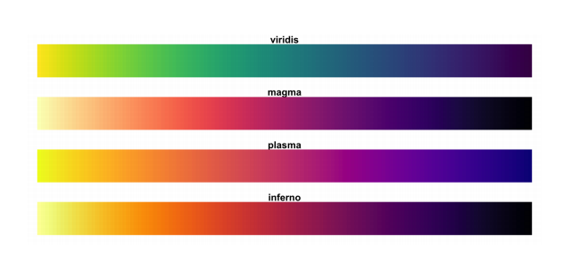

```{r setup, include=FALSE}
library(knitr)
library(conflicted)
library(fOptions)
library(tidyverse)
library(lubridate)
library(bizdays)
library(ggplot2)
library(ggthemes)
library(gridExtra)
library(patchwork)
library(maps)
library(knitr)
library(tidyquant)
library(shiny)
conflict_prefer("filter", "dplyr")
conflict_prefer("lag", "dplyr")

# Following line is added according to
# pg.3
# https://haozhu233.github.io/kableExtra/awesome_table_in_pdf.pdf
options(kableExtra.latex.load_packages = FALSE)
library(kableExtra)

knitr::opts_chunk$set(echo = FALSE, fig.align="center", collapse = TRUE, cache = TRUE)
chunk <- "```"
inline <- function(x = "") paste0("`` `r ", x, "` ``")
bank <- read.csv("https://goo.gl/PBQnBt", sep = ";")
token_qd <- 'JyeshGuNBGDbbaYoNURG'
token_av <- 'QWM66H05ENYFRDPO'
options("getSymbols.warning4.0"=FALSE)
options(dplyr.summarise.inform = FALSE)
```

<style type="text/css">
code.r{ /* Code block */
    font-size: 23px;
}
pre { /* Code block - determines code spacing between lines */
    font-size: 19px;
}
</style>

# Lecture 10: Shiny/3: Advanced

## Review:
- `ui`: Run once per session.
- `server`: Run once per session.
- Session: simply, new session with each browser tab open.
- Different tab, *Different session*, even in the same browser, on the same machine.
- Code inside a reactive function runs with every input change.

## Review: Reactivity

- `render*`: Allow binding of one output to one/multiple inputs

```{r echo = TRUE, eval = FALSE}
# builds reactivity from input$data => output$hist
output$hist <- renderPlot({
  hist(input$data)
})

output$stat <- renderPlot({
  summary(input$data)
})
```

## Review: `observeEvent`

- Allow binding of multiple outputs to one inputs.

```{r echo = TRUE, eval = FALSE}
actionButton(inputId = "go", label = "Click me")

observeEvent(input$go, {
  # Use of isolate to *peek* the value not to react to it.
  num_input <- input$num_input

  output$plot1 <- renderPlot({ 
    # if we use input$num_input here, we build a direct reactive link
    # between output$plot1 and input$num_input. This is not what we designed.
    plot(1:number_input, runif(num_input))
  })

  output$table1 <- renderTable({ ... })
})
```

```{r echo = FALSE, eval = FALSE}
# additional notes. ignore
observe() function
observe({ print(input$go) }) reacts to whatever are changed in the code block.

eventReactive() delay reactions
mono-action to data binding
data <- eventReactive(input$go, { rnorm(input$num) })
button -> data -> renderPlot
button -> renderPlot (direct is not very good)

reactiveValues
allow multiple binding of data to different input
rv <- reactiveValues(data = rnorm(100))
button -> change the data -> renderPlot
```

## Review: `reactive()`

- reactiveVal(): create reactive value.
- reactive(): build reactivity.

```{r echo = TRUE}
# Build a reactive value a
a <- reactiveVal(0)

# This builds a reactivity from a to b.
# Once a changes, b is changed.
b <- reactive({ a() + 1 })

# Update the value of a
a(3)
# Use isolate() to extract the value
# b is updated
print(isolate(a()))
print(isolate(b()))
```

```{r echo = FALSE, eval = FALSE}
# addtional notes.
a <- reactiveVal(0)
b <- reactiveVal(0)
c <- eventReactive(a(), { print(b() + 1) })
d <- eventReactive(b(), { print(b() + 2) })
a(3)
b(3)
isolate(c())
isolate(d())
```

## Review: Output with `render*()` functions

- `output$hist <- render*({...})`
  + It contains code used to create output
  + It re-runs the code with every change in the input

* Static table from df, mat, etc.s
    + renderTable()/tableOutput()
* Interactive table from data frame, matrix or other table-like structure
    + renderDataTable()/dataTableOutput() 
* Plot
    + renderPlot()/plotOutput()

## New topics today for Shiny
- renderText/renderPrint: print out plain running result.
- `update***Input` functions: You can also update input with new content.
- Dynamic UI to create inputs and outputs dynamically.
- Graphics output: gridExtra / patchwork
- Table output: kableExtra

## New render/output pair

* Get print result
    + renderText() with verbatimTextOutput() or textOutput()
* Get continous output
    + renderPrint() with verbatimTextOutput() or textOutput()
* Customized UI elements
    + uiOutput()/renderUI()

## renderText()/renderPrint() example

\footnotesize
```{r echo = FALSE, comment = ""}
cat(htmltools::includeText("../example/week5/shiny-51-renderPrint.R"))
```

## `update***Input`
- Update various input values
    - updateSelectionInput(...)
    - updateNumericInput(...)

## `update***Input` Example

\footnotesize
```{r echo = FALSE, comment = ""}
cat(htmltools::includeText("../example/week5/shiny-52-update-min.R"))
```

## `update***Input` and output
- Update various input values
    - updateSelectionInput(...)
    - updateNumericInput(...)

## `update***Input` and output: example

\scriptsize
```{r echo = FALSE, comment = ""}
cat(htmltools::includeText("../example/week5/shiny-52-update.R"))
```

## `renderUI`/`uiOutput`

- Dynamically creation of UI (user interface) with input and outputs.
  - Append new items to `tagList()`

## Create dynamic output `tagList()`

\scriptsize
```{r echo = FALSE, comment = ""}
cat(htmltools::includeText("../example/week5/shiny-53-renderUI.R"))
```

## Create dynamic output 2
You can use newly created UI immediately

\scriptsize
```{r echo = FALSE, comment = ""}
cat(htmltools::includeText("../example/week5/shiny-54-renderUI-min.R"))
```

## Dynamic output: output doesn't work?

\scriptsize
```{r echo = FALSE, comment = ""}
cat(htmltools::includeText("../example/week5/shiny-54-renderUI-output-not-working.R"))
```

## Dynamic output: fixed

\scriptsize
```{r echo = FALSE, comment = ""}
cat(htmltools::includeText("../example/week5/shiny-54-renderUI-output-fixed.R"))
```

## Dynamic output: fixed and improved

\scriptsize
```{r echo = FALSE, comment = ""}
cat(htmltools::includeText("../example/week5/shiny-54-renderUI-output-improved.R"))
```

## Very dynamic

\scriptsize
```{r echo = FALSE, comment = ""}
cat(htmltools::includeText("../example/week5/shiny-57-createDynamic.R"))
```

## ggplot/gridExtra

If we need to generate multiple plots. ggplot has a companion package to arrange plots.

`SxS`: side by side

\footnotesize
```{r echo = TRUE, fig.show="hide"}
library(gridExtra)
g <- ggplot(bank) + coord_polar() + theme(text = element_text(size=6))
p1 <- g+geom_bar(mapping = aes(x = age, fill = job),position = "fill") 
p2 <- g+geom_bar(mapping = aes(x = age, fill = education),position = "fill")
```
 
## ggplot/gridExtra: example 1

```{r echo = TRUE, fig.height = 3, fig.width=4.5}
grid.arrange(p1, p2, ncol=2, nrow=1)
```

## ggplot/gridExtra: example 2

```{r echo = TRUE, fig.height = 3, fig.width=4.5}
grid.arrange(p1, p2, ncol=2, nrow=1, widths = c(4,3))
```

## ggplot/gridExtra: example 3

```{r echo = TRUE, fig.height = 3, fig.width=4.5}
grid.arrange(p1, p2, ncol=1, nrow=2, heights = c(2,4))
```

## ggplot/patchwork

A new package `patchwork` simplifies gridExtra.

```{r echo = TRUE, include=FALSE}
library(patchwork)
p1 + p2
p1 / p2
p1 + p2 + plot_layout(ncol = 2)
p1 + p2 + plot_layout(widths = c(2, 1))
p1 / p2 + plot_layout(heights = c(2, 1))
p1 + p1 / p2
( p1 + p2 ) / p2
```

## ggplot/gridExtra

\footnotesize
```{r echo = TRUE, fig.show = "hide"}
library(tibble)
library(ggplot2)
library(gridExtra)

df <- tibble(x = rnorm(1000), y = rnorm(1000))

hist_top <- ggplot(df, aes(x = x)) + geom_density()

empty <-
  ggplot()+geom_point(aes(1,1), colour="white")+
  theme(axis.ticks=element_blank(), 
        panel.background=element_blank(), 
        axis.text.x=element_blank(), axis.text.y=element_blank(),
        axis.title.x=element_blank(), axis.title.y=element_blank())

scatter <- ggplot(df, aes(x = x, y = y)) + geom_point()

hist_right <- ggplot(df, aes(x = y)) + geom_density() + coord_flip()

grid.arrange(hist_top, empty, scatter, hist_right,
             ncol=2, nrow=2,
             widths=c(3.5, 0.7), heights=c(1, 4))
```


## ggplot/patchwork - 2

With similar arguments, patchwork simplifies what grid.arrange syntax.

```{r echo = TRUE, eval=FALSE}
hist_top + empty + scatter + hist_right + plot_layout(ncol=2, nrow=2, widths = c(3.5, 0.7), heights = c(1, 4))
```

## ggplot/gridExtra: result

```{r echo = FALSE, fig.height = 3, fig.width = 4.2}
library(tibble)
library(ggplot2)
library(gridExtra)

df <- tibble(x = rnorm(1000), y = rnorm(1000))

hist_top <- ggplot(df, aes(x = x)) + geom_density() + theme(text = element_text(size=6))

empty <-
  ggplot()+geom_point(aes(1,1), colour="white")+
  theme(axis.ticks=element_blank(), 
        panel.background=element_blank(), 
        axis.text.x=element_blank(), axis.text.y=element_blank(),
        axis.title.x=element_blank(), axis.title.y=element_blank(),
        text = element_text(size=6))

scatter <- ggplot(df, aes(x = x, y = y)) + geom_point() + theme(text = element_text(size=6))

hist_right <- ggplot(df, aes(x = y)) + geom_density() + coord_flip() + theme(text = element_text(size=6))

grid.arrange(hist_top, empty, scatter, hist_right,
             ncol=2, nrow=2,
             widths=c(3.5, 0.7), heights=c(1, 4))
```

## knitr/kableExtra

kable is provided by `knitr` package. `kableExtra` enhance it with more functions. So we load both packages.

    `r chunk`{r shiny_block}
    library(knitr)
    library(kableExtra)
    
    # This is HTML output
    kable(df, format = "html")
    
    # Use function() { } to output html
    output$p1 <- function() {
      kable(df, format = "html")
    }
    `r chunk`

## kable_styling

- Get all styles from here
https://cran.r-project.org/web/packages/kableExtra/vignettes/awesome_table_in_html.html

- style

\footnotesize
```{r echo = TRUE, eval = FALSE}
mtcars[1:10, , drop = FALSE] %>%
  kbl() %>%
  kable_styling(bootstrap_options = c("striped", "hover", "condensed"),
              font_size = 12,
              full_width = F, # True for left-to-right width
              position = "left") # if full_width == F
```

```{r echo = FALSE, eval = TRUE}
mtcars[1:10, , drop = FALSE] %>%
  kbl() %>%
  kable_styling(latex_options =c("striped", "scale_down"),
                bootstrap_options = c("striped", "hover", "condensed","scale_down"),
                font_size = 12,
                full_width = F, # True for left-to-right width
                position = "left") # if full_width == F
```

## kable_styling: column_spec

\footnotesize
```{r echo = TRUE, eval = FALSE}
mtcars[1:10, , drop = FALSE] %>%
  kbl() %>%
  kable_styling(bootstrap_options = c("striped", "hover", "condensed"),
                font_size = 12,
                full_width = F, # True for left-to-right width
                position = "left") %>% # if full_width == FALSE
    column_spec(1, bold = TRUE, border_right = TRUE) %>%
    column_spec(2, width = "30em", background = "yellow")
```

```{r echo = FALSE, eval = TRUE}
mtcars[1:10, , drop = FALSE] %>%
  kbl() %>%
  kable_styling(latex_options =c("striped", "scale_down"),
                bootstrap_options = c("striped", "hover", "condensed"),
                font_size = 12,
                full_width = F, # True for left-to-right width
                position = "left") %>% # if full_width == FALSE
    column_spec(1, bold = TRUE, border_right = TRUE) %>%
    column_spec(2, width = "30em", background = "yellow")
```


## kable_styling: row_spec

\footnotesize
```{r echo = TRUE, eval = FALSE}
mtcars[1:10, , drop = FALSE] %>%
  kbl() %>%
  kable_styling(bootstrap_options = c("striped", "hover", "condensed"),
                font_size = 12,
                full_width = F, # True for left-to-right width
                position = "left") %>% # if full_width == F
    column_spec(5:7, bold = TRUE) %>%
    row_spec(3:5, bold = T, color = "white", background = "#D7261E")    
```

\footnotesize
```{r echo = FALSE, eval = TRUE}
mtcars[1:10, , drop = FALSE] %>%
  kbl() %>%
  kable_styling(latex_options =c("striped", "scale_down"),
                bootstrap_options = c("striped", "hover", "condensed"),
                font_size = 12,
                full_width = F, # True for left-to-right width
                position = "left") %>% # if full_width == F
    column_spec(5:7, bold = TRUE) %>%
    row_spec(3:5, bold = T, color = "white", background = "#D7261E")    
```

<!--
## kable_styling: cell_spec

```{r echo = FALSE, out.width = "45%"}

```
# latex_options =c("striped", "scale_down"),

```{r echo = FALSE}
vol_surface <- tibble(tenor = c("1M", "2M", "3M", "6M"),
                      `0.1` = c(0.472, 0.435, 0.391, 0.29),
                      `0.25` = c(0.431, 0.41, 0.337, 0.28),
                      `0.5` = c(0.398, 0.30, 0.251, 0.2),
                      `0.75` = c(0.428, 0.336, 0.307, 0.249),
                      `0.9` = c(0.457, 0.411, 0.391, 0.278))

# Coloring for volatility surface:
# Include all cells for colors, using gather, cell_spec, then spread
library(knitr)
library(kableExtra)

gather(vol_surface, key = "delta", value = "vol", -tenor) %>%

  # cell_spec takes column vol. spec_color also takes column vol values into consideration.
# We take half of the spectrurm - yellow to red.
# Color specturm: "magma" (or "A"), "inferno" (or "B"),
# "plasma" (or "C"), and "viridis" (or "D", the default option).
  
mutate(vol = cell_spec(
  vol, "html", color = "black", bold = T,
  background = spec_color(vol, begin = 0.5, end = 1,
                          option = "A", direction = -1))) %>%
spread(key = "delta", value = "vol") %>%
  kbl(escape = FALSE, align = "c") %>%
  kable_styling("striped", full_width = FALSE)
```
-->

# Lecture 11: Building Financial Applications

## Starter

\scriptsize
```{r echo = TRUE, results = "hide"}
# biorhythm.R
suppressWarnings({library(conflicted); library(tidyverse);
conflict_prefer('lag', 'dplyr'); conflict_prefer('filter', 'dplyr')})

biorhythm <- function(dob, target = Sys.Date()) {
  dob <- as.Date(dob)
  target <- as.Date(target)
  t <- round(as.numeric(difftime(target, dob)))
  days <- (t - 14) : (t + 14)
  period <- tibble(Date = seq.Date(from = target - 15, by = 1, length.out = 29),
                       Physical = sin (2 * pi * days / 23) * 100, 
                       Emotional = sin (2 * pi * days / 28) * 100, 
                       Intellectual = sin (2 * pi * days / 33) * 100)
  period <- pivot_longer(period, cols = Physical:Intellectual, names_to = "Biorhythm", values_to = "Percentage")
  ggplot(period, aes(x = Date, y = Percentage, col = Biorhythm)) + geom_line() +  
    ggtitle(paste("DoB:", format(dob, "%d %B %Y"))) + 
    geom_vline(xintercept = as.numeric(target)) +
    theme(legend.position = "bottom")
}
```

## Starter - Result

```{r echo = FALSE}
source("example/week5/biorhythm.R")
```

\footnotesize
```{r echo = TRUE, fig.width=4.5, fig.height=2.5}
# I took four people's birthdays. Hope they are in good mood today.
g1 <- biorhythm("1964-01-12", Sys.Date()) + theme(text = element_text(size=6))
g2 <- biorhythm("1971-06-28", Sys.Date()) + theme(text = element_text(size=6))
g3 <- biorhythm("1971-10-29", Sys.Date()) + theme(text = element_text(size=6))
g4 <- biorhythm("1957-08-11", Sys.Date()) + theme(text = element_text(size=6))
grid.arrange(g1, g2, g3, g4, ncol = 2, nrow = 2)
```

## Main course

- We need following packages as a start. Use c() to install multiple packages.

\footnotesize
```{r eval=FALSE, include=TRUE, echo = TRUE}
install.packages(c("tidyquant", "Quandl","rvest",
                   "dygraphs", "forecast","testit"))
```

\normalsize
- `tidyquant` includes packages: `xts` (time-series data format, like data frame), `quantmod` (download prices).

## tidyquant or Quandl or alphavantage?
- They can access to different data sources and different data.
- Determining factors:
  + `tidyquant/quantmod` can connect to various free services: ~google~ (unstable), yahoo (still active), mostly on stock prices.
  + `alphavantager`: stocks + FX, limit: daily 500 requests, max 5 requests per min.
  + `Quandl`: free data set is limited. Macro economic data from FRED database still available.
      * US ETF/Stocks on Quandl is a premium service.
      * ETF in Google/AlphaAdvantage is free.

## tidyquant or Quandl?

Technical details:

- quantmod returns `xts` object. alphavantager/Quandl returns data frame or `xts`
- xts object is can `collapse` to daily, weekly, monthly price.

## Tidyquant/quantmod

\footnotesize
```{r echo = TRUE}
library(conflicted)
# library(tidyquant)
# conflict_prefer("filter", "dplyr")
# conflict_prefer("lag", "dplyr")

# use Google
getSymbols('SPY', src = 'yahoo', adjusted = TRUE, output.size = 'full')
str(SPY)

# Sign up with AlphaAdvantage to get a token
# getSymbols('SPY', src = 'av', output.size = 'full', api.key = token_av)
# str(SPY)
```

## Tidyquant/quantmod

\footnotesize
```{r echo = TRUE}
# What's get returned?
head(SPY)
tail(SPY)

symbols <- c("MSFT", "AAPL")
getSymbols(symbols, src = 'yahoo', adjusted = TRUE, from = "2016-01-01")
```

## `xts` object
- xts is a wide format. In contrast, dplyr/ggplot prefers long format.
- We have pivot_longer/pivot_wider to convert between long/wide format.
- Create xts object:
    + Put index aside, which is usually date
    + Store prices in columns.

\footnotesize
```{r eval=FALSE, include=TRUE, echo = TRUE}
library(xts)

# if df is a data frame/tibble.
# Date | V | GS
# To convert from tibble to xts obj
xobj <- xts(x=df[, -1, drop = FALSE], order.by = df[1])

# coredata(): returns a matrix from xts objects
core_data <- coredata(xobj)

# index: vector of Date/Time
index(xobj)
# Converts from xts to tibble
tibble(Time = index(xobj), as_tibble(coredata(xobj)))
xts2tb <- function(x) {
  tibble(Time = index(x), as_tibble(coredata(x)))
}
```

## Get data from `xts` object
- `xts` has built-in support to filter date/time.

\footnotesize
```{r echo = TRUE}
# What price history is stored here.
str(SPY)
```

```{r echo = FALSE}
xts2tb <- function(x) {
  tibble(Time = index(x), as_tibble(coredata(x)))
}
```

\footnotesize
```{r echo = TRUE, results = "hide"}
SPY2003 <- SPY["2003"]
SPY2 <- SPY["2003/2007"]
SPY3 <- SPY["2003-03-01/2007-07-01"]
SPY4 <- SPY["/2007-07-01"] # till 
SPY5 <- SPY["2007-07-01/"] # from
SPY6 <- SPY["2007-07-01/", "SPY.High"]
SPY7 <- SPY["2007-07-01/", c("SPY.High", "SPY.Close")]
xts2tb(SPY7)
```

## How to extract all components from S&P 500

We can use `rvest` package to crawl the wiki page.

\footnotesize
```{r echo = TRUE, eval = FALSE}
library(rvest)

wikispx <- read_html('https://en.wikipedia.org/wiki/List_of_S%26P_500_companies')
currentconstituents <- wikispx %>%
  html_node('#constituents') %>%
  html_table(header = TRUE)

currentconstituents
```

## S&P Changes

S&P 500 takes the 500 largest market cap companies. The list is updated periodically. Following code also extracts changes over the year.
To have the list of constituents in the past, you can restore manually. (This was an exercise in Prep course).

\footnotesize
```{r echo = TRUE, eval = FALSE}
spxchanges <- wikispx %>%
  html_node('#changes') %>%
  html_table(header = FALSE, fill = TRUE) %>%
  filter(row_number() > 2) %>% # First two rows are headers
  `colnames<-`(c('Date','AddTicker','AddName','RemovedTicker',
                 'RemovedName','Reason')) %>%
  mutate(Date = as.Date(Date, format = '%B %d, %Y'),
         year = year(Date),
         month = month(Date))
```

## Quandl

\footnotesize
```{r echo = TRUE}
library(Quandl)
library(tidyverse)

# Sign up with Quandl to get a token
# token_qd <- "xxxx"
Quandl.api_key(token_qd)
## You don't get SPY: SPDR 500 ETF from Quandl from free service.
## rates <- Quandl(c("EOD/SPY"), start_date="2000-01-01", end_date="2013-06-07")
## You don't get EOD US Stocks for free from Quandl from 2019
## rates <- Quandl(c("EOD/V"), start_date="2000-01-01", end_date="2013-06-07" )
```

## Quandl

\footnotesize
```{r echo = TRUE, fig.width = 4.3, fig.height = 2.4}
library(Quandl)					# Quandl package
library(ggplot2)				# Package for plotting
library(tidyverse)				# Package for reshaping data

Quandl.api_key(token_qd)				# Authenticate your token
# Build vector of currencies
rates <- Quandl(c("FRED/DEXUSAL", "FRED/DEXBZUS", "FRED/DEXUSUK", "FRED/DEXCHUS"),
                start_date="2010-01-01",
                end_date = "2020-09-28")
colnames(rates) <- c("Date", "AUD/USD", "USD/BRL", "GBP/USD", "USD/CNY")
meltdf <- pivot_longer(rates, -Date, names_to = "CCY", values_to = "Rate")
```

## Quandl - Result

\footnotesize
```{r echo = TRUE, fig.width = 4.3, fig.height = 2.4}
ggplot(meltdf, aes(x = Date, y = Rate, colour = CCY, group = CCY)) +
  geom_line() +
  scale_colour_manual(values=1:22)+
  ggtitle("Major Currency Exchange Rates in USD") +
  theme_minimal() + theme(text = element_text(size=6))
```

## dygraphs

dygraphs for xts
<https://rstudio.github.io/dygraphs/shiny.html>

\footnotesize
```{r echo = TRUE, eval = FALSE}
dygraphOutput("dygraph")
dygraph(oil_combined_xts, main = "Oil Prices: Historical and Forecast") %>%
  # Add the actual series
  dySeries("Actual", label = "Actual") %>%
  # Add the three forecasted series
  dySeries(c("Lo_95", "Forecast", "Hi_95"))
```

## Quandl/Shiny/dygraph
- 51-quandl.R

\footnotesize
```{r echo = FALSE, eval = FALSE}
cat(htmltools::includeText("../example/week5/51-quandl.R"))
```

## Trading Game

- See 'oil_lm.Rmd' as reference
- Open a blank Rmd and let do it together.


