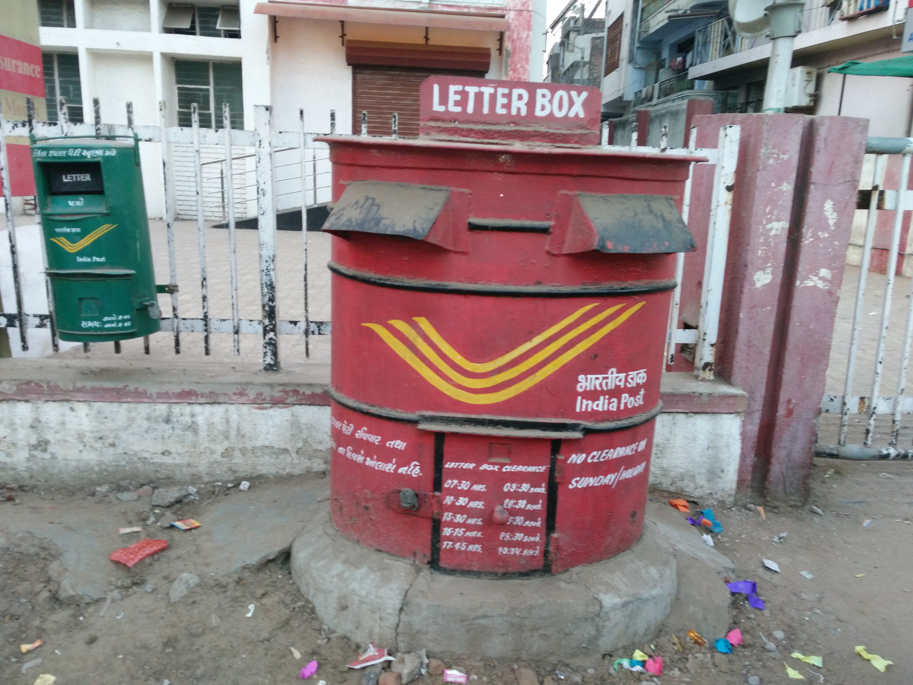

## Objective
1. Know the way of Internet: the network, the cloud and the application.
2. Use data manipulation and data visualization to do exploratory data analysis.
3. To do option valuation, and trading strategy performance analysis.
4. Build real-world data-driven reports and dashboard, data visualization and ~predictive model~.
5. Latest technology in cryptocurrency and payment system based on Bitcoin and Blockchain.

* Programming is our tool
- R is a system that has been designed to process data.
- Intermidiate-to-Advanced level R
- Use R in other MFE courses
- A complete suite for data science.

## When it wants to visit someone on the network? 2/2
* Then, your device creates and send the packet "request". Wait for response.
* Router and gateway will relay the packets to the receiver.

```{r, echo = FALSE, out.width = "50%"}

```


# Time

Convert time to date, be aware of timezone. Use the current timezone, "+08"
```{r, echo = TRUE}
Sys.time()
[1] "2017-10-30 22:50:22 +08"

> as.Date(Sys.time(), tz = "NZ")
"2017-10-31"

> as.Date(Sys.time(), tz = "UTC")
"2017-10-30"
```

# Call function with the name of the function

new_option <- function(strike, call_put, quantity, underlying)
{
  params <- as.list(match.call())[-1]
  do.call("list", params)
}

do.call("function name", ...)

