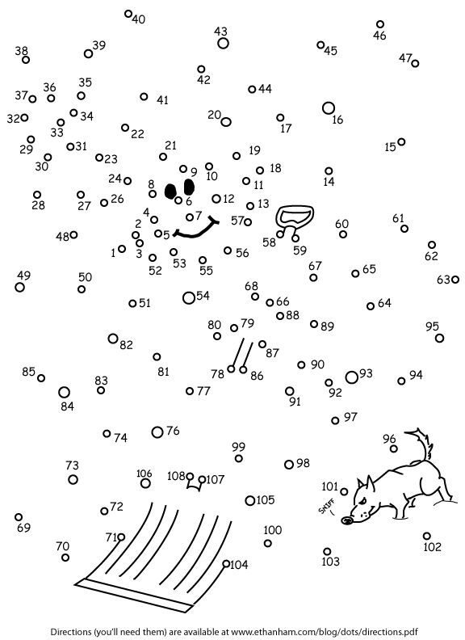
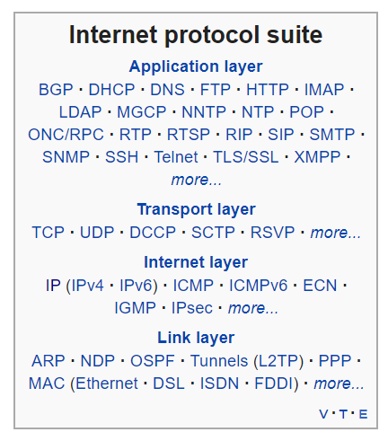
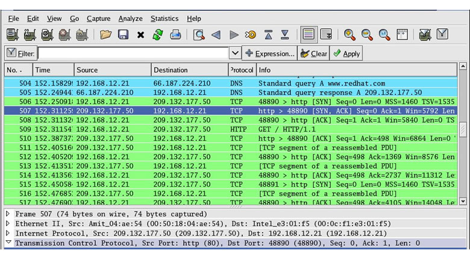

```{r setup, include=FALSE}
library(tidyverse)
knitr::opts_chunk$set(echo = FALSE, fig.align="center")
```

# Introduction to this course

## Topics: Week 1-3

- Week 1:
    #. What's Internet? What's Web?
    #. Launch into the Cloud: AWS
    #. R catch-up: R Markdown and Shiny layout
- Week 2:
    #. Data manipulation with dplyr 1/2
    #. Data visualization with ggplot 1/2
    #. Interactive Web application with Shiny 1/2
- Week 3:
    #. Data manipulation with dplyr 2/2
    #. Data visualization with ggplot 2/2
    #. Interactive Web application with Shiny 2/2

# Introduction to this course

## Topics: Week 4-6

- Week 4:
    #. Finance application basics
    #. Finance application cases
- Week 5:
    #. Bitcoin and Blockchain
- Week 6:
    #. Further topics of Blockchain
    #. Presentation of Assignment: Web applicaiton.

# Introduction to this course
## Assingments

- Week 1: A static website. A front page, a about page and a description page in the cloud. (due on Week 2)
- Week 2: A dynamic website that can do CRUD. (due on Week 3)
- Week 3: A data-driven website that does data analytics.  (due on Week 4)
- Week 4: A finance-data application website. (due on Week 6)
- Week 5: Reading on Blockchain. (due on Week 7) Working on web assignment. (due on Week 6)
- Week 6: Reading of Blockchain. (due on Week 7)

# Introduction to this course
## Objective
1. Know the way of Internet: the network, the cloud and the application. 
2. Build real-world data-driven reports and dashboard, data visualization.
3. Latest Internet technology in cryptocurrency and payment system like Bitcoin and Blockchain.

Spectrum.
Data ->  Model -> Application

<center>{width=45%}</center>


# Lecture 01: What's Internet? What's Web?

#
<center>{width=75%}</center>

# Introduction

    A network is to connet the dots.

<center>{width=75%}</center>

    Internet is a super network of the world.

<center>{width=75%}</center>

# What happens to a computer network?

We need to talk to each other.

Layout: Star v.s. inter-connected.

* In a fully inter-connected network, 

1. Information turns to Packet

<center>{width=75%}</center>

2. Protocol designs the packet
TCP/IP Protocol - Internet protocol suite

<center>{width=75%}</center>

Why the Internet succeeded?

What does TCP/IP gives?

The Defense Advanced Research Projects Agency (DARPA), the research branch of the U.S. Department of Defense, created the TCP/IP model in the 1970s for use in ARPANET, a wide area network that preceded the internet.

Four layer approach:
<center>{width=75%}</center>

3. Infrastructure is to route the packets to the destination.

<center>{width=75%}</center>

Locally efficient but not very smart. Tries to be very smart.
leaves space for improvement. Every equipment manufacturer can improve.
Scalable.

# Layered structure:

Low level address

What happens after the cable is plugged in?
<center>{width=75%}</center>

* Every network device has a hardware address
* 
When a computer connects to the network, the DHCP client, generally a component of the operating system sends out a DHCP request and recieves an offer from a DHCP server. The offer generally contains:

An IP Address
A subnet mask for that IP address

A gateway that should be used for off-network requests (like those going via the internet)
One or more DNS server addresses so the computer knows where to send DNS requests.
Connecting to a Router

When you plug your computer into a router or associate your wireless adapter with an access point, the computer will usually receive a DHCP response directly from the router, which may itself have requested an IP from the ISP for the interface the modem uses. it will then route traffic from the computer via it's interface connected to the modem where appropriate.

# Image of network plug/wireless network/fibre/underwater fiber.

# DHCP/DNS/Gateway
Home networking guide.

# HTTP(S) protocols

# HTML and WWW

_www._ used be a popular prefix to the website. E.g. www.yahoo.com. Together with _ftp._, _gopher._. It means the domain is serving different services. www for Web, ftp for FTP, gopher for Gopher (you don't what it is).
However, that era is gone. Now it is abbreviated, google.com, facebook.com, uber.com. Not www.....

XML grew out of the document markup world. 

# URL

# To recap
Browser down to HTML/CSS/JavaScript => HTTP => TCP => IP => Network physical.

# Web application
- Why?
- Needless to say. this is not 1995 anymore.

- Easy to develop, no need to compile like C++
- Easy to use, to deployment
- Cross-platform.
- Mobile phone. native app v.s. html.


3.	Development Tools

4.	Amazon Web Services:
4.1.	How to setup S3 for storage, EC2 for virtual machine, Route 53 for DNS.
Reading: TBC
Assignment:
+ Setup a website with AWS.
+ Write a markdown document and publish it website.
+ Use JavaScript to manipulate web page parts

Use programming language to process and present data	Know how to program R and JavaScript for data-driven interactive applications

+ Logic thinking of data processing technical.
+ Clarity in data visualization
+ Dealing the complexity of handling user-interaction.


# Lecture 02: AWS

AWS ways of signing up
* Sign-up with an AWS acccount
* Sign-up AWS Educate acccount
* Apply credit from AWS Educate
* Claim credit from AWS

1. With their own AWS account
Students will need to either create a new AWS account or use one that they've already created. Their AWS account needs to be fully activated by completing phone verification steps and adding a valid credit card. They will need to select the AWS Account option and enter their 12 digit AWS Account ID number when they apply to AWS Educate.
Upon approval, they will be sent a Welcome email with a credit code and important information about their AWS Educate benefits. They can redeem the credit code from the Welcome email to their AWS account. Once the credit has been redeemed to their AWS account, it will automatically be applied to any charges incurred by eligible services they launch as part of your course instructions, until the credit balance has been exhausted or expires. Students will receive a renewal code every 12 months that they are eligible for the program; they will not need to reapply.

2. AWS Educate Starter Account:
A valid credit card is not required for this option. The Starter Account is created for the student and managed by a 3rd party, qwikLABS. The credit is included on the Starter account, and the account will shut down automatically once the credit balance has been exhausted.
Upon approval, students will be sent a Welcome email with a link to set up their password and a second link to bookmark for future logins. Once logged in, they will need to follow the steps in the Starter Account Overview [attached to this case] to access their Starter account and use AWS resources.

Disclaimer:
1. I am not working for Amazon and I don't get paid by this.
2. I am not owning Amazon shares directly and indirectly.
3. I don't plan to long AMZN during the course of this course.
4. I will do a demo for Google Cloud.

Use FBI....
Warning:
You may be charged for using AWS EC2.
Free Tier applies to t1.micro.

# Lecture 03: R catch-up and Markdown, RMarkdown

2.	Languages
2.1.	HTML/CSS
2.2.	JavaScript
2.3.	Markdown: the language for static and interactive documents.
2.4.	R refresh

## R catch-up

## R Markdown

HTML is a markup language. It means it "adds" something to the text to decorate it. 

> markup
/ˈmɑːkʌp/
noun
> 1. the amount added to the cost price of goods to cover overheads and profit.
> "a mark-up of 50 per cent"
> 2. the process or result of correcting text in preparation for printing.

Markdown is a language is that it adds minimal to the text to decorate it.
> A Markdown-formatted document should be publishable as-is, as plain text, without looking like it's been marked up with tags or formatting instructions. - John Gruber

# Markdown
## Header

    # Header1
    ## Header2
    ### Header3

## Block quote

    > /ˈmɑːkʌp/
    > noun
    > > 1. the amount added to the cost price of goods to cover overheads and profit.
    > > "a mark-up of 50 per cent"
    > > 2. the process or result of correcting text in preparation for printing.

## Line blocks

|
|
|

    | a
    | b
    | c


## List

Lists
Bullet lists

* First paragraph.

Continued.

* Second paragraph. With a code block, which must be indented
eight spaces:

    { code }


    * First paragraph.

        Continued.

    * Second paragraph. With a code block, which must be indented
        eight spaces:

        { code }

# Multi-level lists

* fruits
    + apples
        - macintosh
        - red delicious
    + pears
    + peaches
* vegetables
    + broccoli
    + chard

# Ordered Lists

    #.
    #.


# Horizontal rules

    ---------------

---------------
---------------

# Tables

  Right     Left     Center     Default
-------     ------ ----------   -------
     12     12        12            12
    123     123       123          123
      1     1          1             1


# Inline formatting

Emphasis
To emphasize some text, surround it with *s or _, like this:

This text is _emphasized with underscores_, and this
is *emphasized with asterisks*.
Double * or _ produces strong emphasis:

This is **strong emphasis** and __with underscores__.
A * or _ character surrounded by spaces, or backslash-escaped, will not trigger emphasis:

This is * not emphasized *, and \*neither is this\*.
Extension: intraword_underscores

Because _ is sometimes used inside words and identifiers, pandoc does not interpret a _ surrounded by alphanumeric characters as an emphasis marker. If you want to emphasize just part of a word, use *:

feas*ible*, not feas*able*.
Strikeout
Extension: strikeout

To strikeout a section of text with a horizontal line, begin and end it with ~~. Thus, for example,

This ~~is deleted text.~~
Superscripts and subscripts
Extension: superscript, subscript

Superscripts may be written by surrounding the superscripted text by ^ characters; subscripts may be written by surrounding the subscripted text by ~ characters. Thus, for example,

H~2~O is a liquid.  2^10^ is 1024.
If the superscripted or subscripted text contains spaces, these spaces must be escaped with backslashes. (This is to prevent accidental superscripting and subscripting through the ordinary use of ~ and ^.) Thus, if you want the letter P with ‘a cat’ in subscripts, use P~a\ cat~, not P~a cat~.

Verbatim
To make a short span of text verbatim, put it inside backticks:

What is the difference between `>>=` and `>>`?
If the verbatim text includes a backtick, use double backticks:

Here is a literal backtick `` ` ``.

# Links

Markdown allows links to be specified in several ways.

Automatic links
If you enclose a URL or email address in pointy brackets, it will become a link:

<http://google.com>
<sam@green.eggs.ham>
Inline links
An inline link consists of the link text in square brackets, followed by the URL in parentheses. (Optionally, the URL can be followed by a link title, in quotes.)

This is an [inline link](/url), and here's [one with
a title](http://fsf.org "click here for a good time!").

# images

A link immediately preceded by a ! will be treated as an image. The link text will be used as the image’s alt text:

    

    ![movie reel]

    [movie reel]: movie.gif

An image occurring by itself in a paragraph will be rendered as a figure with a caption.4 (In LaTeX, a figure environment will be used; in HTML, the image will be placed in a div with class figure, together with a caption in a p with class caption.) The image’s alt text will be used as the caption.

    

# Verbatim (Code) block

    if (a > 3) {
      moveShip(5 * gravity, DOWN);
    }

## Code block for R Markdown
R Markdown is a extension to Markdown that you can execute code among the code. (Not only R, but Python, etc.)
If you name the file as .Rmd and _knit_ in R Studio.

    ```{r chunk_name}
    ```
The name is optional; if included, each code chunk needs a distinct name.
It’s usually best to give each code chunk a name.

The advantage of giving each chunk a name is that it will be easier to understand where to look for errors, should they occur.
Also, any figures that are created will be given names based on the name of the code chunk that produced them.

# chunk options

    ```{r cars, echo = TRUE}
    a <- runif(100, 0, 1)
    ```

    ```{r plot}
    plot(a)
    ```

+ _echo_ is to decide whether to display code, default is FALSE.
+ _result_ is to decide whether to display result, default is show, set to "hide" to hide.
+ _include_ is to hide both code and result, default is FALSE.

# R Shiny
Just about layout and some R Syntax


# HTML UI

# add static content
tags$h1()
tags$a()

tagList()

# HTML layout

ui <- fluidPage(
  fluidRow(column(3),
           column(5)),
  fluidRow(column(4), offset = 8)
  )

# Panel

wellPanel(input)

tabPanel("tab 1")

tabsetPanel(
  tabPanel("tab1"),
  tabPanel("tab2"),
  tabPanel("tab3")
)

navlistPanel(
  tabPanel("tab1", "contents"),
  tabPanel("tab2", "contents"),
  tabPanel("tab3", "contents")


# prepacked layout

      ```{r, echo = TRUE}

      
fluidPage(sidebarLayout(
  sidebarPanel(),
  mainPanel()
))

fixedPage(
  fixedRow(
    column(5, # etc)
  )
)

navbarPage(title = "title",
  tabPanel("tab 1", "content"),
  tabPanel("tab 2", "content"),
  navbarMenu(title = "title",
    tabPanel("tab 3", "content"),
    tabPanel("tab 3", "content")
  )
)


## Slide with R Output

```{r, echo = TRUE}
summary(cars)
a <- filter(cars, speed > 4)
a
```

## Slide with Plot

```{r}
plot(a)
```

\

\\[ x = {-b \pm \sqrt{b^2-4ac} \over 2a} \\]
