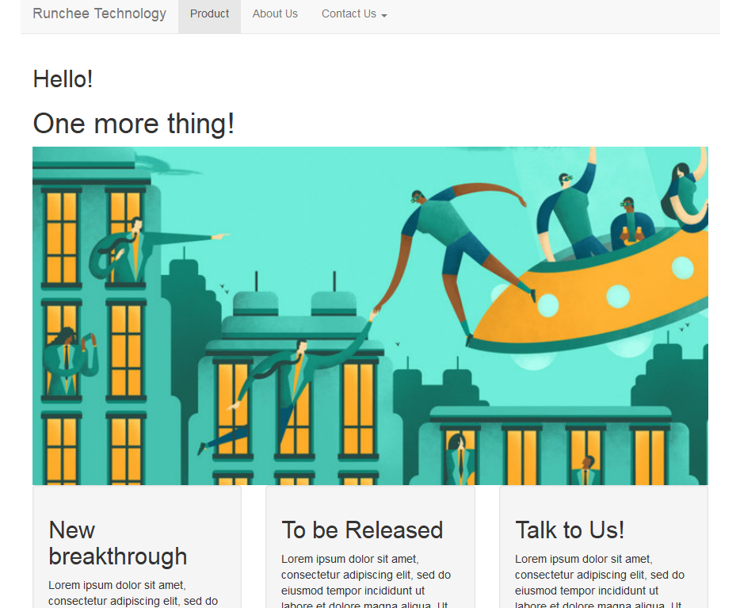

```{r setup, include=FALSE}
library(tidyverse)
library(shiny)
knitr::opts_chunk$set(echo = FALSE, fig.align="center", collapse = TRUE)
chunk <- "```"
inline <- function(x = "") paste0("`` `r ", x, "` ``")
```

# Introduction: Topics for Week 1-3
- Week 1:
    * What's Internet? What's Web?
    * Launch into the Cloud: AWS
    * R catch-up: R Markdown and Shiny layout
- Week 2:
    * Data, visualization, and web: part 1/2
- Week 3:
    * Data, visualization, and web: part 2/2

# Introduction: Topics for Week 4-6
- Week 4:
    * Finance applications
- Week 5:
    * Bitcoin and Blockchain
- Week 6:
    * Further topics of Blockchain
    * Presentation of Assignment: Web applicaiton.
- Week 7:
    * Presentation of Assignment: Blockchain.

# Introduction: Assingments
- Week 1: A static website. A front page, a about page and a description page. (due by Week 2)
- Week 2: A dynamic website that can do CRUD. (due by Week 3)
- Week 3: A data-driven website that does data analytics.  (due by Week 4)
- Week 4: A finance-data application website. (due by Week 6)
- Week 5: Reading on Blockchain. (due by Week 7) Working on web assignment. (due by Week 6)
- Week 6: Reading on Blockchain. (due by Week 7)

# Introduction: Objective
1. Know the way of Internet: the network, the cloud and the application. 
2. Build real-world data-driven reports and dashboard, data visualization.
3. Latest Internet technology in cryptocurrency and payment system like Bitcoin and Blockchain.

# Where does this course stands on?
* It's about "Data science"
Data -> Model -> Application

```{r, echo = FALSE, out.width = "75%"}
knitr::include_graphics("imgs/data-science-explore.png")
```

* We deep dive into R.
    - R is a system that has been designed to process data. Later in career you will expose Python, Julia, Hadoop.
    - The principle will be the same.

# Keep calm and code on
```{r, echo = FALSE, out.width = "40%"}
knitr::include_graphics("imgs/keep-calm-code-on.jpg")
```

# Lecture 01: What's Internet? What's Web?
- Network
- Internet
- HTTP/HTML/Web

# Network
```{r, echo = FALSE, out.width = "50%"}
knitr::include_graphics("imgs/Internet_map_1024.jpg")
```

# Network is to connect the dots
```{r, echo = FALSE, out.width = "40%"}
knitr::include_graphics("imgs/dot-to-dot-connect-the-dots.jpg")
```

# Network is to connect the ~~dots~~ devices
<center>{width=55%}</center>

# Building network
* There are many ways to connect the devices: Network topology

```{r, echo = FALSE, out.width = "55%"}
knitr::include_graphics("imgs/Common-network-topologies.png")
```

* Which network topology is our home Wi-Fi?

# Building network
- Different network topology takes different way of communications.
- Fully-connected network is the most costly and robust. Ring is the cheapest but vulnerable.

# Network talks
After laying down the wires, what runs inside?

```{r, echo = FALSE, out.width = "62%"}
knitr::include_graphics("imgs/cables.jpg")
```

# Network talks
1. Information turns to *packet*
2. Protocol designs the packet and process
3. Infrastructure is to route the packets to the destination.

# Packet
1. Information turns to packet
<center>{width=75%}</center>

# Protocol
2. Protocol designs the packet and process

TCP Session

```{r, echo = FALSE, out.width = "20%"}
knitr::include_graphics("imgs/375px-TCP_CLOSE.svg.png")
```

DHCP Session

```{r, echo = FALSE, out.width = "18%"}
knitr::include_graphics("imgs/DHCP_session.svg.png")
```

# Routing/Gateway
3. Infrastructure helps to transmit and route the packets to the destination.
<center>{width=85%}</center>

# TCP/IP and Internet
The Defense Advanced Research Projects Agency (DARPA) created the TCP/IP model in the 1970s to build ARPANET.
ARPANET is a wide area network that preceded the internet.

# What does TCP/IP gives?
1. IP (Internet Protocol, IP address)
```{r, echo = FALSE, out.height = "30%"}
knitr::include_graphics("imgs/internet-partial.png")
```
2. TCP (Transmission Control Protocol) 
TCP provides reliable, ordered, and error-checked delivery of a stream

# TCP/IP
* Four Layers

<center>{width=32%}</center>

* Application layer runs many protocols

<center>{width=20%}</center>

# This is why and how Internet growed in size
```{r, echo = FALSE, out.width = "85%"}

```

# What happens after ~~plugging cable~~, turning on Wi-Fi?
* Every network device has a hardware address
* DHCP client, a component of the operating system sends out a DHCP request and recieves an offer from a DHCP server running on the router.
* Device accepts the IP address and use it to label for itself. Router also knows where to send the packet.

# When it wants to visit someone on the network? 1/2
* Domain Name System:
    - We don't use 123.456.789.012 but www.google.com.
    - DNS is the directory service for internet.
    - Your device also receives One or more DNS server addresses so the computer knows where to send DNS requests.

```{r, echo = FALSE, out.width = "20%"}
knitr::include_graphics("imgs/jediocto.jpg")
```
Demo with nslookup.

# When it wants to visit someone on the network? 2/2
* Then, your device creates and send the packet "request". Wait for response.
* Router and gateway will relay the packets to the receiver.
```{r, echo = FALSE, out.width = "62%"}
knitr::include_graphics("imgs/India_Post_Letter_Box.jpg")
```

# HTTP/HTML
- Initiated by Tim Berners-Lee at CERN in 1989.
- HTML was also invented by Tim, "HTML tags"

# HTTP Request/Response

* Request

        GET /index.html HTTP/1.1
        Host: www.example.com

* Response

        HTTP/1.1 200 OK
        Date: Mon, 23 May 2005 22:38:34 GMT
        Content-Type: text/html; charset=UTF-8
        Content-Encoding: UTF-8
        Content-Length: 138
        Last-Modified: Wed, 08 Jan 2003 23:11:55 GMT
        Server: Apache/1.3.3.7 (Unix) (Red-Hat/Linux)
        ETag: "3f80f-1b6-3e1cb03b"
        Accept-Ranges: bytes
        Connection: close

        <html>
        <head>
            <title>An Example Page</title>
        </head>
        <body>
            Hello World, this is a very simple HTML document.
        </body>
        </html>

# HTTP/HTML
- Hypertext Transfer Protocol (HTTP) but obviously, it does file, music, anything now.
- It's a clear text protocol. That's why we need to use HTTPS (HTTP on SSL) to secure the communication.

```{r, echo = FALSE, out.width = "42%"}

```
In browser, you can see the green lock in address bar. App doesn't show it, we just trust that they are using HTTPS.

# Web
When you have HTML and URL (Uniform Resource Locator), Web is born.

- Website: https://en.wikipedia.org/
- Document: https://en.wikipedia.org/wiki/World_Wide_Web
- Resource: https://en.wikipedia.org/wiki/World_Wide_Web#/media/File:Web_Index.svg

How this resource is used in the document.

        <div class="thumbinner" style="width:302px;">
            <a href="/wiki/File:Web_Index.svg" class="image">
            
            </a>
        </div>

# Web Browser
First generation

```{r, echo = FALSE, out.width = "75%"}
knitr::include_graphics("imgs/mosaic-browser.jpg")
```

# Web application
- Static v.s. Dynamic
- Dynamic website display content based on user input.
- Supported by HTML/CSS/JavaScript. HTML 5, CSS 3 and JavaScript 7 .
- App also uses HTML/CSS/JS.
```{r, echo = FALSE, out.width = "55%"}
knitr::include_graphics("imgs/HTML5_CSS_JavaScript.png")
```

# Web application
- Why it is important?

```{r, echo = FALSE, out.width = "25%"}
knitr::include_graphics("imgs/heisencat.png")
```

- Needless to say. It is not 1995 anymore.
- Easy to develop
- Easy to deploy
- Runs fast

# To recap
## Why the Internet succeeded?
- Information flows by packet.
    + IP protocol sets the address for the device
    + TCP protocol transmit the packet reliably
    + UDP, for real-time transmission which can accept failure.
- Local device just needs to send the packet
- Transmission is done by the network devices
- Efficient and scalable

# To recap
## Web application
- Browser => HTML/CSS/JavaScript => HTTP => TCP => IP => Network physical.

- We will write in R, which subsequently writes HTML/CSS/JavaScript.

# Lecture 03: R Markdown and Shiny (layout)
## Introduction
- *Markdown* is a format that is easy to read and can be converted to other formats, HTML, PDF, Word, Slides.
- R Studio extends it further to create R notebook, interactive document and web application, which is *R Markdown*.
- Shiny is a web programming framework in R. We use it extensively in this course. We begin with the layout part.

# Markup and Markdown
- Document stores information.
- Web is a superset of interlinked documents.
- HTML is a markup language, built for machines.
- Markdown is for humans to write doc, with minimal added to decorate it, created by John Gruber in collaboration with Aaron Swartz in 2004.


        A Markdown-formatted document should be publishable as-is, as plain text,
        without looking like it's been marked up with tags or formatting instructions. - John Gruber

```{r, echo = FALSE, out.width = "15%"}
knitr::include_graphics("imgs/Markdown-mark.svg.png")
```

# Markdown example

```{r echo = FALSE, comment = ""}
cat(htmltools::includeText("example/markdown-example.md"))
```

# Markdown doc example
```{r, echo = FALSE, out.width = "47%"}
knitr::include_graphics("imgs/markdown-doc-preview.png")
```

# Markdown: Header and Code

## Headers

More hashtag, deeper level.

```{r echo = FALSE, comment = ""}
cat("# Header1\n## Header2\n### Header3\n")
```

## Code

Give four spaces before it

```{r echo = FALSE, comment = ""}
cat("    if (a > 0) {\n      print(a)\n    }\n")
```

    if (a > 0) {
      print(a)
    }

# Markdown: List

    * First paragraph.
    Continued.

    * Second paragraph. With a code block, which must be indented
    eight spaces:

            { code }

```{r, echo = FALSE, out.width = "9%"}
knitr::include_graphics("imgs/professortocat.png")
```

* First paragraph.
Continued.

* Second paragraph. With a code block, which must be indented eight spaces:

# Markdown: Multi-level lists
Put four more spaces for each level.

    * fruits
        + apples
            - macintosh
            - red delicious
        + pears
    * vegetables
        + broccoli
        + chard

* fruits
    + apples
        - macintosh
        - red delicious
    + pears
* vegetables
    + broccoli
    + chard

# Markdown: Ordered Lists

Put 4 more spaces for each level.

    #. Chapter 1
        #. Section 1.1
        #. Section 1.2
    #. Chapter 2
    #. Chapter 3

```{r, echo = FALSE, out.width = "9%"}
knitr::include_graphics("imgs/professortocat.png")
```

#. Chapter 1
    #. Section 1.1
    #. Section 1.2
#. Chapter 2
#. Chapter 3

# Table

    | Tables        | Are           | Cool  |
    | ------------- |:-------------:| -----:|
    | col 3 is      | right-aligned | $1600 |
    | col 2 is      | centered      |   $12 |
    | zebra stripes | are neat      |    $1 |

```{r, echo = FALSE, out.width = "12%"}
knitr::include_graphics("imgs/professortocat.png")
```

| Tables        | Are           | Cool  |
| ------------- |:-------------:| -----:|
| col 3 is      | right-aligned | $1600 |
| col 2 is      | centered      |   $12 |
| zebra stripes | are neat      |    $1 |

# Markdown: Inline formatting

## Emphasis

To emphasize some text, surround it with *s or _, like this:

    This text is \_emphasized with underscores\_, and this
    is \*emphasized with asterisks\*.
    Double * or _ produces strong emphasis:

    This is \*\*strong emphasis\*\* and \_\_with underscores\_\_.

```{r, echo = FALSE, out.width = "7%"}
knitr::include_graphics("imgs/professortocat.png")
```

This text is _emphasized with underscores_, and this is *emphasized with asterisks*.
Double * or _ produces strong emphasis.

This is **strong emphasis** and __with underscores__.
A * or _ character surrounded by spaces, or backslash-escaped, will not trigger emphasis.

# Markdown: Inline formatting

## Strikthrough

This \~\~is deleted text.\~\~  This ~~is deleted text.~~

## Superscripts and subscripts

H\~2\~O is a liquid.  2\^10\^ is 1024. H~2~O is a liquid.  2^10^ is 1024.

## Verbatim. inline code

Use backtick \`. What is the difference between \`>>=\` and \`>>\`?  What is the difference between `>>=` and `>>`?

```{r, echo = FALSE, out.width = "9%"}
knitr::include_graphics("imgs/professortocat.png")
```

Note:

* If the verbatim text includes a backtick, use two backticks.
* Use \\ to turn off \\~~, \\^.

# Markdown: Links

    <http://google.com>

```{r, echo = FALSE, out.width = "9%"}
knitr::include_graphics("imgs/professortocat.png")
```

<http://google.com>

# Images

A link immediately preceded by a ! will be treated as an image. The link text will be used as the image’s alt text:

    

```{r, echo = FALSE, out.width = "9%"}
knitr::include_graphics("imgs/professortocat.png")
```

{width=40%}

# Formula
MathJax. Use laTex syntax. There are many online references.

## Inline with text

    $x = {-b \pm \sqrt{b^2-4ac} \over 2a}$

$x = {-b \pm \sqrt{b^2-4ac} \over 2a}$

## Centered

    $$\sum_{i=1}^n X_i$$

$$\sum_{i=1}^n X_i$$

# R Markdown

## Reference in R Studio

- R Markdown Cheat Sheet: Help > Cheatsheets > R Markdown Cheat Sheet,
- R Markdown Reference Guide: Help > Cheatsheets > R Markdown Reference Guide.

## Create it via File > New File > R Markdown.

- Document
- Presentation
- Shiny

# R Markdown Document example
```{r echo = FALSE, comment = ""}
cat(htmltools::includeText("example/rmd-example-doc.Rmd"))
```

# R Markdown Document Output
In the header, you can change the output to other types:

- html_document
- pdf_document
- word_document

- Ctrl+Shift+K or “Knitr”

# Code block for R Markdown
* R Markdown is a extension to Markdown that you can execute code among the code.
If you name the file as __.Rmd__ and _knit_ in R Studio.

        `r chunk`{r Calculate_7}
        a <- 3
        b <- 4
        print(a + b)
        `r chunk`

  ```{r chunk_name}
  a <- 3
  b <- 4
  print(a + b)
  ```

* Calculate_7 is the chunk name. It's optional to give a chunk name. If included, each code chunk needs a distinct name.
It’s usually best to give each code chunk a name, for easier debug.

* R code can also be inline. For example, to generate a random number everytime, include this \`runif(1, 0, 1)\`, `r runif(1, 0, 1)`.

# Chunk options

* _echo_ is to decide whether to display code, default is FALSE.
* _result_ is to decide whether to display result, default is show, set to "hide" to hide.
* _include_ is to hide both code and result, default is FALSE.

        `r chunk`{r cars, echo = TRUE}
        a <- runif(100, 0, 1)
        `r chunk`

        `r chunk`{r plot}
        plot(a)
        `r chunk`


```{r cars, echo = TRUE}
a <- runif(100, 0, 1)
```

```{r plot, echo = FALSE, out.width = "20%"}
plot(a)
```

# R Markdown example: Table

    `r chunk`{r kable}
    knitr::kable(
      mtcars[1:5, ], 
      caption = "A knitr kable."
    )
    `r chunk`

```{r kable}
knitr::kable(
  mtcars[1:5, ], 
  caption = "A knitr kable."
)
```

# R Markdown example: plot

    `r chunk`{r plot1, echo = FALSE}
    a <- filter(cars, speed > 4)
    plot(a)
    `r chunk`

```{r plot1, echo = FALSE, out.width = "40%"}
a <- filter(cars, speed > 4)
plot(a)
```

# R Shiny
- To start, use R Studio.
- File > New File > Shiny Web App...
- Choose single file
- Give a name and folder 
- Ctrl+Shift+S or “Run App”

# UI First
I removed everything in functions `server` and `ui`. This is the minimal Shiny.

```{r echo = FALSE, comment = ""}
cat(htmltools::includeText("example/shiny-1-empty.R"))
```

# Sidebar Layout
Let's add a minimal sidebarLayout

```{r echo = FALSE, comment = ""}
cat(htmltools::includeText("example/shiny-2-sidebar.R"))
```

# `fluidPage`
- fluidPage means to place the controls from left-right, top-down order.
- `fluidPage` function can take any number of input parameter.


        fluidPage(sidebarLayout(
            sidebarPanel(),
            mainPanel()
        ))

# Add some things
- `titlePanel("Hello Shiny!")`, `h1("Introduction to Layout")`, `h2("Sidebar Layout")`

```{r echo = FALSE, comment = ""}
cat(htmltools::includeText("example/shiny-3-sidebar.R"))
```

# Sidebar layout with bar on the right

    fluidPage(
        sidebarLayout(position = "right",
        sidebarPanel(),
        mainPanel()
        )
    )

# More tags
Each tag is a function.

    h1("A header")
    p("some text as a paragraph")
    a("A link to Google", href="http://www.google.com")
    img(src = "p19-Hero-Image-796x398.jpg", width = "100%")
    tags$ul("title", tags$li("Item 1"), tags$li("Item 2"))
    tags$ol("Step", tags$li("Item 1"), tags$li("Item 2"))

Note:

* For image, you need to create a sub-directory `www` together with the R source file. Place the file under it.
* tags is a list of functions. To avoid name conflict, I prefer to use `tags$img()`, even `img()` is available to use.

# Panels
`titlePanel()` and `wellPanel()`

```{r echo = FALSE, comment = ""}
cat(htmltools::includeText("example/shiny-4-wellPanel.R"))
```

# Navlist panel

```{r echo = FALSE, comment = ""}
cat(htmltools::includeText("example/shiny-5-navPanel.R"))
```

# tabPanel

```{r echo = FALSE, comment = ""}
cat(htmltools::includeText("example/shiny-6-tabPanel.R"))
```

# navBar

```{r echo = FALSE, comment = ""}
cat(htmltools::includeText("example/shiny-7-navbar.R"))
```

# Column-based layout
- Caveat: There is fluidRow, but no fluidColumn.
- Column counts always add up to 12 = 4 + 6 + 2; otherwise, it will appear in the next line.

```{r echo = FALSE, comment = ""}
cat(htmltools::includeText("example/shiny-8-column.R"))
```

# Composition layout: Top and Down

```{r echo = FALSE, comment = ""}
cat(htmltools::includeText("example/shiny-10-composite.R"))
```

# R Markdown can also contain Shiny

```{r echo = FALSE, comment = ""}
cat(htmltools::includeText("example/shiny-mfe-example.Rmd"))
```

```{r, echo = FALSE}
wellPanel("Inputs",
          numericInput("fav_num", "What's your favorite number?", 3))
```

This is interactive document.

# Assignments
- (Optional) Setup AWS and run EC2.
- Create a website with Shiny using navBar layout
    - You are starting a company to offer.
    - Decide what you want to do
    - Create three pages. Name the pages depending on what you want to do. e.g. Product, About Us and Contact Us
    - Use different layouts for the pages: sideBar, column-based layout, Navlist.
    - Be creative!
- Create a Dropbox directory and share with me at leafyoung@yahoo.com.

# 
```{r, echo = FALSE, out.width = "75%"}

```

