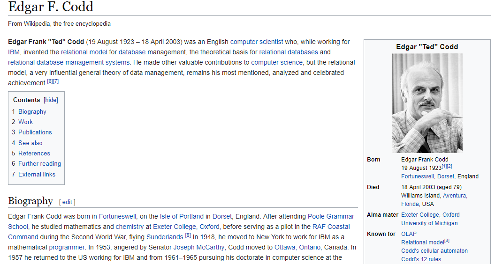

<style type="text/css">

code.r{ /* Code block */
    font-size: 17px;
}
pre { /* Code block - determines code spacing between lines */
    font-size: 14px;
}
</style>

```{r setup, include=FALSE}
library(tidyverse)
library(shiny)
library(lubridate)
library(bizdays)
library(fOptions)
library(ggplot2)
knitr::opts_chunk$set(echo = FALSE, fig.align="center", collapse = TRUE, cache = T)
chunk <- "```"
inline <- function(x = "") paste0("`` `r ", x, "` ``")
```

# Lecture 04: R catch-up
Let's review some R basics.

- Vector/Matrix/String/Date/Time
- Anonymous function
- List
- Environment
- Pipe
- Load/Save
- Data Frame

```{r, echo = FALSE, out.width = "12%"}
knitr::include_graphics("imgs/Rlogo.png")
```

# R: Vector
Vector/Matrix/List/Dataframe

```{r, echo = TRUE}
# Create a vector from number
v <- c(1, 3)
v[1] <- 3
v
```

```{r, echo = TRUE}
# repeat 100 for 10 times.
rep(100, 10)
```

# R: Matrix

```{r, echo = TRUE}
# create matrix of 10x10
mat <- matrix(2, 3, 4)
mat
# set first row to 4
mat[1,] <- 4
# set element (2, 2) to 6
mat[2, 2] <- 6
```

# Find element in Vector
- `which()`
- `match()`
- `%in%`

```{r, echo = TRUE}
data <- 10:1
match(c(1, 3), data)
data[match(c(1, 3), data)]
which(1 == data | 3 == data)
data[which(1== data | 3 == data)]
```

# Check whether element exists
- False case when element doesn't exist

```{r, echo = TRUE}
match(c(11, 31), 10:1)
which(11== 10:1 | 31 == 10:1)
```

```{r, echo = TRUE}
if (all(c(1, 33) %in% 1:3)) {
  cat("Found all\n")
}

if (any(c(1, 33) %in% 1:3)) {
  cat("Found one/some.\n")
}
```

# Random
```{r, echo = TRUE}
# Norm random number
rnorm(3, mean = 10, sd = 3)
```

```{r, echo = TRUE}
# Uniform random number
runif(3)
```

```{r, echo = TRUE}
# Sample
sample(1:10, 10, replace = F)
# To Be/Not to Be
sample(c(T, F), 10, replace = T)
# Throw a dice
sample(1:6, 10, replace = T)
```

# Print
- `cat(paste0(..., "\n"))` is what I used most.
- `"\n"` is appended to the end to create a line break.
- `paste0/paste` can use to create new strings from any data types.
- `paste0` combines any thing without space. `paste` uses space, by default. 
- `paste0/paste` with `collapse` helps with vector to print them in one line.
- `paste0/paste` works with all types of data.

```{r, echo = TRUE}
x <- c(Sys.Date(), Sys.Date(), Sys.Date())
cat(paste0("Current dates is ", x, ".\n"))
cat(paste0("Current dates is ", paste0(x, collapse = ", "), ".\n"))
```

# String

```{r, echo = TRUE}
# sub-string
# substr(x, start, stop) 
substr("The fox jumps.", 6, 6 + 5 - 1)
```

```{r, echo = TRUE}
# paste0/paste to concatenate string/convert to string
new_string <- paste0("This is ", "cat")
new_string <- paste0("This is ", "cat", sep = "a")
new_string <- paste0(1:3, sep = "a")
```

```{r, echo = TRUE}
# toupper/tolower
toupper("big")
tolower("LOWER")
```

# Find/Replace string in string

```{r, echo = TRUE}
# grepl: Find, returns T or F
grepl("A", "ABC", fixed = T)
grepl("D", "ABC", fixed = T)
```

```{r, echo = TRUE}
# sub: replace for one time
# sub(pattern, replace, string,...)
# fixed = T means use fixed string. Not regular expression
sub("D", "ABC", "DDD", fixed = T)
# gsub: replace for all
gsub("D", "ABC", "DDD", fixed = T)
```

# Find/Replace String with Regular Expression (RE)
If you start to use regular expression, sub/grepl becomes super powerful.
```{r, echo = TRUE}
# If we need to find `Start` appearing the beginning of the string
grepl("^Start", "Start with me")
grepl("^Start", "me Start")
```

```{r, echo = TRUE}
# To find something in the end
sub("X$", "Z", "XYZ ends with X")
```

# Match/Extraction with Regular Expression (RE)
## Match (RE)
```{r, echo = TRUE}
sub("[^\\_]+\\_.*", "", "USDCNY_M1")
```
- `[^\\_]`: Character not containing `_`. Because _ is a special character, we quote it with two backslashes.
- `+`: One or more 
- `.`: Any character
- `*`: none or more.

# Match/Extraction with Regular Expression (RE)
## Extraction (RE)
```{r, echo = TRUE}
# Rough cut
sub("([^\\_]+)\\_.*", "\\1", "USDCNY_M1")
```

```{r, echo = TRUE}
# Nice cut
sub("([^\\_]+)\\_(.*)", "\\1 \\2", "USDCNY_M1")
```

```{r, echo = TRUE}
# Wonderful cut
sub("([^\\_]+)\\_([[:alpha:]])([[:digit:]])", "\\1 \\2 \\3", "USDCNY_M1")
```

Cheatsheat is available at <https://www.rstudio.com/resources/cheatsheets/>

# Date

```{r, echo = TRUE}
# Create date
dt1 <- as.Date("2017-11-03")
dt1
dt2 <- Sys.Date()
dt2
```

```{r, echo = T, results = "hide"}
library(lubridate)
```

```{r, echo = TRUE}
# Date is such a central role in finance.
# More function about date can be found in package `lubridate`
# Create date with lubridate, a package which provides lots of date functions.
ymd(20171003)
ymd("20171003")
```

# Date: format code
We can use codes for convert date to/from string.

- %Y/%y: four-digit year/two-digit year
- %m: month in number
- %b/%B: month in abbreviation/full, i.e. Jan/January.
- %d: day

```{r, echo = TRUE}
format(Sys.Date(), format = "%Y/%m/%d")
```

```{r, echo = TRUE}
as.Date("2017-11-03", format = "%Y-%m-%d") # %m for number month
as.Date("2017-Nov-03", format = "%Y-%b-%d") # %b for the 3-letter month
as.Date("03Nov2017", format = "%d%b%Y")
```

# Other functions from `lubridate`

```{r, echo = TRUE}
library(lubridate)
# Change a date
x <- as.Date("2017-10-10")
month(x) <- 1
x
```

```{r, echo = TRUE}
# Set to the end of the month
day(x) <- days_in_month(x)
```

# Business days
Use package `bizdays`

```{r, echo = T, results = "hide"}
# install.packages("bizdays")
library(bizdays)
```

```{r, echo = TRUE}
# 'weekends' is a calendar of weekdays
bizdays("2017-10-16", "2017-10-30", "weekends")

# add bizdays
add.bizdays("2017-11-03", 5, "weekends")

# generate all business days between.
# You will find this useful for later financial application.
bizseq("2017-11-10", "2017-12-01", "weekends")
```

# Calendar

If not provided, start.date is by default the first holiday and end.date is the last holiday.
So we provide them here.

```{r, echo = TRUE}
create.calendar(name="Singapore", holidays = c(as.Date("2017-10-18")),
                start.date = as.Date("2017-01-01"), end.date = as.Date("2071-01-01"),
                weekdays = c("saturday", "sunday"))

bizdays("2017-10-13", "2017-10-30", "weekends")
# One day less
bizdays("2017-10-13", "2017-10-30", "Singapore")
```

# Write function
Input parameters

```{r, echo = T, results = "hide"}
func1 <- function() { }

func2 <- function(input1, input2) { }

# Param input1 is default to 1
func3 <- function(input1 = 1, input2) { }

func4 <- function(input1, input_type = c("int", "char"))
{
  # This would check wheher input_type is set to one of the pre-set values.
  input_type = match.arg(input_type) 
}

func5 <- function(in1, in2) {
  if (in1 < 0) {
    return(0)
  } else {
    return(in1 + in2)
  }
}
```

# Write function

```{r, echo = T, results = "hide"}

# The last value before function finishes will be returned automatically. No need to use return.
func5 <- function(in1, in2) {
  if (in1 < 0) {
    0
  } else {
    in1 + in2
  }
}

# Unless there is extra steps before
func6 <- function(in1, in2) {
  if (in1 < 0) {
    return(0) # if we have 0 here, it's not the last step before function exits.
  } else {
    res <- in1 + in2
  }

  res <- res * 3
  res
}
```

# Exercise
Write functions to do

- Determine leap year?
- Print the list of month names in abbreviation or full
- How many working days in Singapore in 2017?

# Time
Convert time to character/string

- %H: hour
- %M: minute
- %S: second

```{r, echo = TRUE}
format(Sys.time(), format = "%H%M")
format(Sys.time(), format = "%H:%M:%S")
format(Sys.time(), format = "%H:%M:%S")
library(lubridate)
ymd_hms("2011-12-31 12:59:59")
```

# Time
Change time, lubridate provides `hour`, `minute`

```{r, echo = TRUE}
x <- Sys.time()
x
hour(x) <- 12
x
minute(x) <- 3
x
minute(x) <- 123 # what will happen?
x
```

# List
```{r, echo = TRUE}
# Create list with list() function
# Nameless list
# list[_n_] => item by order
a <- list(3, 4)
a[[1]]
a[[2]]

# Named list, you can use $ and [ operators
# list[[]]: gives back a value
# list$name => list[["name"]]
a <- list(a = 3, b = 4)
a[[1]]
a[[2]]
a[["a"]]
a$a
```

# List

```{r, echo = TRUE}
# When you want to use a number as key, use backtick
list_of_strikes <- list()
list_of_strikes$`65` <- 3
list_of_strikes$`60` <- 4

# if a name doesn't exist in the list
a$c
# Use `is.null()` to check
if (is.null(a$c)) {
  cat("c doesn't exist in list a\n")
}
```

# List

```{r}
list <- list(elem = 1, c1 = "a", c2 = "b")

# access the list
list[[1]]
list$elem

# add new member to the list
list$new_elem <- 3
# update member in the list
list$c1 <- 3

# Delete c1 in the list
list$c1 <- NULL

# List's Usage - 1

```{r, echo = TRUE}
# List can be used as map/dictionary.
# Map
basket <- sample(c("Apple", "Orange", "Pear"), 100, replace = TRUE)
fruit_count <- list()
for (b in basket) {
  if (is.null(fruit_count[[b]])) {
    fruit_count[[b]] <- 1
  } else {
    fruit_count[[b]] <- fruit_count[[b]] + 1
  }
}
fruit_count
```

# List's Usage - 2

```{r, echo = TRUE}
# Let's write a generic function to do this
add_to_map <- function(map, key, value) {
  if (is.null(map[[key]])) {
    map[[key]] <- value
  } else {
    map[[key]] <- map[[key]] + value
  }
  map
}

# You may copy function add_to_map to every file that you want to use this kind of dictionary
fruit_count <- add_to_map(fruit_count, "Pomelo", 12)
fruit_count
```
# List's Usage

```{r, echo = TRUE}
# Use case 1: Use list to pass data in or out.
do_lots_of_work <- function(a, b, c) {
}
# pass in
do_lots_of_work <- function(lst) {
  lst$a + lst$b
}
# pass out
ret_lots_of_work <- function() {
  return(list(a = a, b = b))
}

res <- ret_lots_of_work()
res$a
res$b
```

```{r, echo = TRUE}
# Case 2: configuration
app_config <- list(MAX = 10, MIN = 10, DISPLAY_RESULT = T)

do_lots_of_work <- function(app_config) {
  app_config$MAX
}
```

# Object
```{r, echo = TRUE}
# Object
# Define class with attributes.
vanilla_option <- setClass("vanilla_option",
                           slots = c(type = "character",
                                     strike = "numeric",
                                     underlying = "numeric"))
# Create object, either way
opt1 <- new("vanilla_option", type = "c", strike = 100, underlying = 100)
opt2 <- vanilla_option(type = "c", strike = 100, underlying = 100)

# Use @ to visit member. or,
opt1@type
slot(opt1, "strike")
```

# Work with objects
```{r, echo = T, cache = T}
# Generate a vector of options
opts <- sapply(1:10000, function(x) { 
                       vanilla_option(type = sample(c("c", "p"), 1),
                                      strike = round(runif(1) * 100, 0),
                                      underlying = round(runif(1) * 100, 0)) } )

# install.packages("fOptions")
library(fOptions)

start <- Sys.time()
# GBSOption also returns an object. We just need its price attribute.
res1 <- sapply(opts, function(o) {
  (GBSOption(o@type, o@underlying, o@strike, Time = 1,
             r = 0.01, b = 0, sigma = 0.3))@price
})
cat(as.numeric(Sys.time() - start))
head(res1, n = 4)

# Alternatively to sapply, we can use map* functions from purrr package
# map is a generic function that returns a list
# map_dbl is for result of double, it would return a vector
res2 <- purrr::map_dbl(opts, function(o) {
  (GBSOption(o@type, o@underlying, o@strike, Time = 1,
             r = 0.01, b = 0, sigma = 0.3))@price
})
head(res2, n = 4)
```

# Anonymous Function

```{r, echo = TRUE}
# Function that's defined in-place, which doesnt' need to have a name.
(function(x) { print(x) }) (3)
# if there is only one line, you can skip { }
(function(x) print(x)) (3)

# For longer functions, you can make it multi-lines.
(function(x) {
  if (x > 3) {
    print(x)
  } else {
    print(x - 3)
  }
})(3)
```

# purrr::map and sapply Function
```{r, echo = TRUE}
# These two are equivalent.
res1 <- purrr::map(1:10, function(x) { rnorm(x, n = 10) })
# function(x) func(x) can be simplied as func.
res2 <- purrr::map(1:10, rnorm, n = 10)
head(res1, n = 1)
# purrr:map returns a list()
```
```{r, echo = TRUE}
# This is what we really want to do. Generate ten normal distribution and get their mean.
# rnorm(n, mean = 0, sd = 1). Where doesn't input go to?
res <- purrr::map(1:10, rnorm, n = 1000)
map_dbl(res, mean)

# sapply achieves the same as purrr::map, a bit slower.
# Package purrr succeeds original R base.
sapply(1:10, function(x) x ^ 2 )
sapply(1:10, function(x) `^`(x, 2) )
sapply(1:10, function(x) `^`(2, x) )
```

# Read/Write data

    # set working directory
    setwd("C:/TEMP")
    # Save this_is_var1 to a file
    saveRDS(this_is_var1, file = "C:/TEMP/DATA/data.Rds")
    # Load a variable from a file. `new_loaded` is the name given to it.
    new_loaded <- readRDS(file = "C:/TEMP/DATA/data.Rds")

- On Windows, use double slashes `\\` or single backslash `/`. e.g. `C:\\TEMP\\DATA`, `C:/TEMP/DATA`
- On Mac, use backslash `/Users/.../`

# R: data frame
The basic structure of a data frame:

- There is one observation per row and
- Each column represents a variable, a measure, feature, or characteristic of that observation. 
- In summary, **2D table**

```{r, echo = TRUE}
df <- data_frame(
  date = seq(as.Date("2017-01-01"), as.Date("2017-01-10"), by = "day"),
  stock = replicate(10, paste0(sample(LETTERS, 3, replace = T), collapse = "")),
  quantity = round(runif(10) * 10000 ,0))
# df["date"]: gives a data frame
# df[["date"]]: gives value
# df$date: same as [["date"]]

# Get three rows
df[c(3, 6, 9), , drop = F]
```

```{r, echo = TRUE}
# Get three columns
df[, 1, drop = F]
# This would return a vector
df[, 1, drop = T]

# Use column names
df[, c("date", "quantity"), drop = F]
```

# R: data frame
Common functions for data frame

    View()
    head()
    tail()
    str()
    nrow()
    ncol()
    dim() # returns both nrow and ncol
    colnames()/rownames()

# Birthday Problem
- With different weights to the month
- N simulation

```{r, echo = F, cache = TRUE}
sample_bday <- function(dummy) {
  a <- trunc(runif(365, min=1, max=13))
  bday <- rep(FALSE, 12)
  nn <- 0
  for (ii in a) {
    nn <- nn + 1
    if (!bday[ii]) bday[ii] <- TRUE
    if (sum(bday) == 12) break
  }
  nn
}
result <- sapply(seq(1:1000), sample_bday, simplify = TRUE)

print(min(result))
print(max(result))
print(mean(result))
hist(result, xlim=c(0,100), freq=3)
# 12 207 37.23126
```

# Fastest Fish Problem

```{r, echo = F, cache = T}

N <- 10

survi <- function() {
  queue <- sample(1:N, N, replace = F)
  qori <- queue
  fastest <- queue[1]
  for (n in 2:N) {
    if (queue[n] > fastest) {
      queue[n] <- NA
    } else {
      fastest <- queue[n]
    }
  }
  list(qori = qori,
       queue = queue)
}

# plot((survi())$queue, 1:10, col = "skyblue2", pch = "\u2653", cex = 2)

plot(1:10,1:10,type="n")
res <- survi()
for (i in 1:10) {
  if (is.na(res$queue[i])) {
    text(res$qori[i], i, paste0("\u2653 ",i), col = "grey", cex = 1.4) 
  } else {
    text(res$queue[i], i, paste0("\u2653 ",i), col = "skyblue3", cex = 1.8)
  }
}

sim_sample <- replicate(10000, length(na.omit({ survi()$queue })))
res_sim <- mean(sim_sample)

survi.prob <- function() {
  sum <- 0
  for (n in 1:N) {
    sum <- sum + 1/n
  }
  sum
}
res_ana <- survi.prob()

cat(paste("res_sim:", res_sim, "\n"))
cat(paste("res_ana:", res_ana, "\n"))
hist(sim_sample)
```

# Lecture 05: Shiny

# Minimalist
    
    library(shiny)
    ui <- fluidPage("Hello World")
    server <- function(input, output, session) { }
    shinyApp(ui = ui, server = server)

# Think around Input and Outputs

    ui <- fluidPage(
      titlePanel("Hello World with a Histogram"),
      # Input() functions
      numericInput("num", "Number of Sample", value = 30),
      # Output() functions
      plotOutput("hist")
    )

# Input

All input function follow such function signature except for input-specific parameters.

    inputXXX(inputId = "input name", label = "label to display", ...)

- numericInput
- textInput
- passwordInput
- slideInput
- selectInput
- dateInput

Reference: https://shiny.rstudio.com/reference/shiny/1.0.5/

# Output

All output function follow such pattern.

    yyyOutput(outputId = "output name")

- textOutput("text")
- verbatimTextOutput("text_orignal")
- tableOutput("t1")
- dataTableOutput("t2")
- plotOutput(outputId = "hist", width = "400px", height = "400px")
- uiOutput("uiX")

plotOutput: I suggest to set width and height to fixed size so we need extra parameters.
For others, outputId is good enough.

# Server
Sever is to fill the content of output

    server <- function(input, output, session) {
      # Enable either one of two
      output$hist <- renderPlot({ hist(rnorm(100)) })
      
      if (FALSE) {
        output$hist <- renderPlot({
          title("a normal random number histogram")
          hist(rnorm(input$num))
        })
      }
    }

## shinyApp = UI + Server
UI and Server combines to be a ShinyApp.
UI is to run the same for each browser/client.
Server is separate between different users.

    shinyApp(ui, server)

# Reactivity Kicks In
- Reactivity: `input$num ------> output$p1`
- Reactivity links input to the output like a data flow.

Reactive values work together with reactive functions.

1. Reactive function responds. `input$x => output$y`
2. Reactive value notifies. `input$x => expression() => output$y`

# Reactivity - 1
Reactivity is enabled by placing inputXXX in renderXXX function.

```{r echo = FALSE, comment = ""}
cat(htmltools::includeText("example/shiny-21.R"))
```

# Reactivity - 2
- We use `observeEvent` to observe button action, and `isolate` to cut down the link of `inputXXX` in `renderXXX`, so button can work.
- If we remove `isolate`?

```{r echo = FALSE, comment = ""}
cat(htmltools::includeText("example/shiny-22.R"))
```

# Reactivity - 3
We can add a reactiveValue with `eventReactive`

```{r echo = FALSE, comment = ""}
cat(htmltools::includeText("example/shiny-23.R"))
```

# Output

For tableOutput

    output$t1 <- renderTable(iris)
    
    output$t1 <- renderTable({
      some input..
      output is a data frame.
    })

For dataTableOutput (Dynamic table)

    output$t2 <- renderDataTable(iris)

For plotOutput
    
    output$p2 <- renderPlot({ plot(runif(1000), runif(1000)) })

For textOutput and verbatimTextOutput

    output$t3 <-  renderText({ "foo" })
    output$t4 <- renderPrint({
      print("foo")
      print("bar")
    })

# Example: Shiny-24

```{r echo = FALSE, comment = ""}
cat(htmltools::includeText("example/shiny-24.R"))
```

# Debug Shiny
- Debug in R Studio
- Clear all variable to run Shiny in R Studio
- debugSource, if you use other source code

# Shiny Summary
- Reactive is about wiring input and output
- Connect from receiver: plot/tabulate for data
- Connect from trigger: button, isolate to create a Chinese wall

# Shiny Assignment
1. Add a selectInput for different color names, returned from `colors()`.
    
    plot(1:10, pch = 19, cex = 1, col = "skyblue1")

2. Create a Bond Schedule
  + Inputs: start date, tenor, coupon rate, coupon frequency, and yield to maturity.
  + Output: coupon schedule (ignore public holidays), amount in table and plot.
            NPV
  
$NPV = \frac{Cashflow 1}{(1 + yield)^1} + \frac{Cashflow 2}{(1 + yield)^2} + ... + \frac{Last Cashflow}{(1 + yield)^n}$

For a Bond with fixed coupon
$Bond Price = Coupon * \frac{1 - (\frac{1}{(1 + yield)^n})}{yield} + \Big[MaturityValue * \frac{1}{(1 + yield)^n}\Big]$

# Lecture 06: Data

# Tidyverse

install.packages("tidyverse")

```{r, echo = FALSE, out.width = "55%"}

```

# SQL
Let's start from SQL, which first appeared in 1974; 43 years ago.

```{r, echo = FALSE, out.width = "75%"}

```

# CRUD: Create Read Update Delete
Data engineering was born around 70s with SQL.

<center>{width=45%}</center>

# SQL does CRUD

    # Select everything from Shops.
    SELECT * FROM Shops;

    # Select with a filter
    SELECT * FROM Shops WHERE size = "Big";

    # Select with a filter and order
    SELECT * FROM Shops WHERE size = "Big" ORDER BY Name;

    # Select with a filter, order, group and summary function `sum`
    SELECT Region, sum(Sales) FROM Shops WHERE size = "Medium" GROUP BY Region;

    # Insert a new record to Shops.
    INSERT into Shops (Name, Region, Sales) VALUES ("Costco", "North", 123456, ...);

    # Update a field
    UPDATE Shops SET Sales = Sales + 1000 WHERE Name = "Costco";

    # Delete from Shops with a filter
    DELETE from Shops WHERE Sales < 1000

# Data frame does CRUD

```{r, echo = TRUE}
df <- data.frame(a = 1:10, b = 10:1)
# Filter:
df[which(df$a == 3 | df$b == 3), , drop = T] 
df[match(3, df$a), , drop = T]
df[, match("b", colnames(df)), drop = T] 

# Insert
rbind(df, df)

# Delete
df[-(which(df$a == 3 | df$b == 3)), , drop = T]

# Update
df[which(df$a == 3 | df$b == 3), 2] <- 3
```

# dplyr
dplyr package from tidyverse is a high-performance package to deal with data frame.

```{r, echo = TRUE}
# tidyverse is a bundle of packages.
# I usually load them all with library(tidyverse, instead of library(dplyr) individually.
library(tidyverse)
# Loading tidyverse: ggplot2
# Loading tidyverse: tibble
# Loading tidyverse: tidyr
# Loading tidyverse: readr
# Loading tidyverse: purrr
# Loading tidyverse: dplyr

# Note:
# filter(): dplyr, stats
# lag():    dplyr, stats
# Use dplyr::lag and dplyr::filter when it doesn't work.
```

# How dplyr works
`dplyr` provides functions in "verbs", which is functions that does one thing only. We will learn to use the following.

+ Key
    - select: return a subset of the columns of a data frame
    - filter: extract a subset of rows based on logical conditions
    - arrange: reorder rows
    - rename: rename variables
    - mutate: add new variables/columns or transform existing variables

+ Group
    - group_by / rowwise / ungroup: stratify the data
    - summarise / summarize: generate summary statistics of different variables in the data frame, possibly within strata
    - do: process data within the strata

+ Combine
    - left_join / right_join / anti_join / full_join
    - bind_rows / bind_cols

+ Helpers
    - %>%: the “pipe” operator is used to connect multiple verb actions together into a pipeline
    - ifelse / case_when
    - lag/distinct
    - n

# Sample dataset

## A data-driven approach to predict the success of 
telemarketing
### Author: Sérgio Moroa; Paulo Cortezb; Paulo Ritaa
#### <http://dx.doi.org/10.1016/j.dss.2014.03.001>

I chose this data set of a Portuguese retail bank clients profile

<center>{width=45%}</center>

# Sample dataset columns
variable = column = field

### Personal profile
* 1 - age (numeric)
* 2 - job : type of job (categorical: "admin.","unknown","unemployed","management","housemaid","entrepreneur","student",
                                    "blue-collar","self-employed","retired","technician","services") 
* 3 - marital : marital status (categorical: "married","divorced","single"; note: "divorced" means divorced or widowed)
* 4 - education (categorical: "unknown","secondary","primary","tertiary")
* 5 - default: has credit in default? (binary: "yes","no")
* 6 - balance: average yearly balance, in euros (numeric) 
* 7 - housing: has housing loan? (binary: "yes","no")
* 8 - loan: has personal loan? (binary: "yes","no")

### Related with the last contact of the current campaign:
* 9 - contact: contact communication type (categorical: "unknown","telephone","cellular") 
* 10 - day: last contact day of the month (numeric)
* 11 - month: last contact month of year (categorical: "jan", "feb", "mar", ..., "nov", "dec")
* 12 - duration: last contact duration, in seconds (numeric)

### Other attributes:
* 13 - campaign: number of contacts performed during this campaign and for this client (numeric, includes last contact)
* 14 - pdays: number of days that passed by after the client was last contacted from a previous campaign (numeric, -1 means client was not previously contacted)
* 15 - previous: number of contacts performed before this campaign and for this client (numeric)
* 16 - poutcome: outcome of the previous marketing campaign (categorical: "unknown","other","failure","success")

### Output variable (desired target):
* 17 - y - has the client subscribed a term deposit? (binary: "yes","no")

# Read data
Use RStudio's File -> Import Dataset, you may choose either "From Text (base)" or "From Text (readr)". Either way loads the data.

`base` comes with R. `readr` is a package from tidyverse that provides more options and functionality.
Copy the generated code to your script file.

I place it at <https://goo.gl/fFQAAm> (for Download), <https://goo.gl/PBQnBt> (for direct use).

You may download it and save it to local.

```{r, echo = TRUE}
# Use base
bank <- read.csv("example/data-bank/bank.csv", sep=";") # or,
bank <- read.csv("https://goo.gl/PBQnBt", sep = ";")

# use readr
library(readr)
bank <- read_delim("example/data-bank/bank.csv", 
                    ";", escape_double = FALSE, trim_ws = TRUE)
```

    View(bank)

# `select`
`select(df, ...)`, ... can be

- variable name
- numeric to indicate nth column (`-` means exclude)
- a range
- a function

# `select` - Examples
```{r, echo = TRUE}
subset <- select(bank, marital)
subset <- select(bank, 1)
subset <- select(bank, -1)
subset <- select(bank, -job)
subset <- select(bank, -(job:education))
subset <- select(bank, starts_with("p"))
subset <- select(bank, ends_with("p"))
subset <- select(bank, contains("p"))
```

# `select` as a re-arrangement of columns.
```{r, echo = TRUE}
job_first <- select(bank, job, everything())
bank
```

# `filter`
```{r, echo = TRUE}
colnames(bank)

young <- dplyr::filter(bank, age < 40)
another_young <- dplyr::filter(bank, age < 20 & marital == "married")
just_young <- dplyr::filter(bank, age < 20 & marital == "single")

young2 <- dplyr::filter(bank, age >= 20 & age < 30)
another_young2 <- dplyr::filter(bank, age >= 20 & age < 30 & marital == "married")
just_young2 <- dplyr::filter(bank, age >= 20 & age < 30 & marital == "single")
```

# filter - logic operators

```{r, echo = FALSE, out.width = "75%"}
knitr::include_graphics("imgs/transform-logical.png")
```

# filter - string operations
```{r, echo = TRUE}
# %in% to match multiple
second_upper <- dplyr::filter(bank, education %in% c("tertiary", "secondary"))

# filter out NA value.
no_na <- dplyr::filter(bank, !is.na(balance) & balance > 0)
```

# Exercise
- How many bank client have a loan while doesn't have a housing?
- How many bank client have a job between 20 to 40?

# rename
```{r, echo = TRUE}
# rename(new name = old)
# Use tick to quote special strings.
df <- rename(bank, young_age = age) 
df <- rename(bank, `Age in Bank` = age)
```

# arrange
```{r, echo = TRUE}
# arrange is sort
arrange(bank, job)
arrange(bank, default, job)

# descending for day
arrange(bank, desc(day))
arrange(bank, desc(as.Date(day, format="%d", origin = Sys.Date())))
```
NB: Missing values are always sorted at the end.

# Exercise

- How could you use arrange() to sort all missing values to the start? (Hint: use is.na()).

    arrange(bank, !is.na(a), a)

- Find the longest duration?
- Find the eldest?

# mutate
```{r, echo = TRUE}
# Replace existing
# ifelse is to check condition.
df1 <- mutate(bank, y = ifelse(y == "yes", T, F))

# Add a new column.
df2 <- mutate(bank, duration_diff = duration - mean(duration, na.rm = TRUE))

# case_when is a function to deal multiple choices.
mutate(bank, age_group = case_when(
  age < 20 ~ "youth",
  age < 40 ~ "middle-age",
  age < 50 ~ "senior",
  TRUE ~ "happy"
))

firstup <- function(x) {
  substr(x, 1, 1) <- toupper(substr(x, 1, 1))
  x
}

# month.abb is a built-in array of month names.
df3 <- mutate(bank, month_name = factor(firstup(as.character(month)), levels = month.abb))

# transmute would remove all other columns after mutation, only keeping the new variable.
df5 <- transmute(bank, 
                  duration_trend = duration - mean(duration, na.rm = TRUE),
                  balance_trend = balance - mean(balance, na.rm = TRUE))
```

```{r}
group_by(df, age_group) %>%
  summarise(mean_age = mean(age)) %>%
  transmute(mean_age_diff = mean_age - lag(mean_age))
```

# What you can do with `mutate`
* +, -, *, /: ordinary arithmetic operator
* %/% (integer division) and %% (remainder), where x == y * (x %/% y) + (x %% y)
* x / sum(x): compute the proportion of all things
* y - mean(y): computes the difference from the mean.
* log2(), log(), log10(): 
* lead(), lag(): compute running differences (e.g. x - lag(x)) or find when values change (x != lag(x)
* rolling sum, prod, min, max: cumsum(), cumprod(), cummin(), cummax(); and dplyr provides cummean()
* row_number()/min_rank()/ntile(,n)

```{r, echo = TRUE}
y <- c(1, 2, 2, NA, 3, 4)
row_number(y)
min_rank(y)
ntile(y, 2)
```
# %>%
We may write such code.

    df <- select(df, x)
    df <- mutate(df, a = 1)
    df <- rename(df, a = b)
    df <- arrange(df, x)

    # This is effectively,
    arrange(rename(mutate(select(df, x), a = 1), a = b), x)

    third(second(first(x)))

How about this?

    df %>% select %>% mutate %>% rename %>% arrange

# %>% Benefits

`%>%` operator allows you to transform the flow from nesting to left-to-right fashion, i.e.

    first(x) %>% second() %>% third()

    x %>% first() %>% second() %>% third() # this could also do.
    
    x %>% first(.) %>% second(.) %>% third(.) # . represents the input

What's the output of below?

```{r, echo = TRUE }
c(1, 3, 7, 9) %>% {
  print(.)
  mean(.)
} %>% { . * 3 } %>% {
  print(.)
  sample(round(., 0))
}
```

# Work with Pipe

%>% ... %>%

    # Feed the data for multiple processing
    {
      v <- .
      cn <- colnames(v)

      v <- select(v, u, z)
      colnames(v) <- cn[1:3]
      v
    } 

    # How to return multiple value

    %>% {
      assign("data_name", data, envir = parent.env(environment()) )
    } %>% {
      select(., z < 0.4)
    }

    # or, we use list
    %>% {
      list(a, b)
    }  %>% {
      v <- .
      v$a
      v$b
    }

# Code pattern with Pipe

    df %>%
    ... %>%
    ... %>%
    ... %>%
    {
      v <- .
      ggplot(data = v) + 
        # full data is used here
        geom_line(data = v) +
        # partial data needs to be hightlighted.
        geom_line(data = filter(., some condition), color = "red")
    }

# Use of Caution

Pros:

- We don't need to keep intermediate result, sames memory and also variable names.

Cons:

- Difficult to debug, to find something in the middle of the chain.
- Use `{ print(.); filter(., ...) }` to print intermediate resuls.
- Separate the long pipes into shorter pipes, adding more intermediate variables.

- Your pipes are longer than (say) ten steps. In that case, create intermediate objects with meaningful names. That will make debugging easier, because you can more easily check the intermediate results, and it makes it easier to understand your code, because the variable names can help communicate intent.
- You have multiple inputs or outputs. If two or more objects being combined together, don’t use the pipe.
- Pipes are fundamentally linear and expressing complex relationships with them will typically yield confusing code.

# Environment
Environment is where your data resides. Use `local()` to isolate.

```{r, echo = TRUE}
# local stores the data wihtin the boundary of {}
x <- 3
local({
  print(x)
  x <- 1
  print(x)
})
print(x)
```

```{r, echo = TRUE}
# local stores the nearest environment
x <- 3
{
  print(x)
  x <- 1
  print(x)
}
x
```

```{r, echo = TRUE}
get_sum <- function(i) {
  v <- 0
  for (i in 1:10) {
    v <- v + i
  }
  v
}

get_sum(10)

# object 'v' not found
v
```

# Environment
Use `assign()` to do space-jump.

```{r, echo = TRUE}
# assign data to global environment
x <- 1
pass_out_global <- function() {
  assign("x", 3, envir = .GlobalEnv)  
}

# assign data to just one level up 
pass_out <- function(env) {
  print(env)
  assign("x", 2, envir = env)
}
```

```{r, echo = TRUE}
x <- 1
pass_out(environment())
x

# assign data to pass it out of function
extra_layer <- function() {
  pass_out()
}

x <- 1
extra_layer()
x

extra_layer_g <- function() {
  pass_out_global()
}

x <- 1
extra_layer_g()
x
```

# Summary
- We learned the key "verbs" from dplyr. Let's pick up the rest next week.