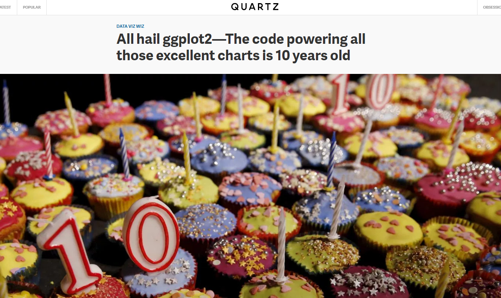

<style type="text/css">
code.r{ /* Code block */
    font-size: 22px;
}
pre { /* Code block - determines code spacing between lines */
    font-size: 18px;
}
</style>

```{r setup, include=FALSE}
library(fOptions)
library(tidyverse)
library(lubridate)
library(bizdays)
library(ggplot2)
library(ggthemes)
library(gridExtra)
library(maps)
library(knitr)
library(kableExtra)
knitr::opts_chunk$set(echo = FALSE, fig.align="center", collapse = TRUE, cache = T)
chunk <- "```"
inline <- function(x = "") paste0("`` `r ", x, "` ``")
bank <- read.csv("https://goo.gl/PBQnBt", sep = ";")
```

# Lecture 8: Viz

`library(ggplot)`, author Hadley Wickham. First release on June 10, 2007.

<https://qz.com/1007328/all-hail-ggplot2-the-code-powering-all-those-excellent-charts-is-10-years-old/>

```{r, echo = FALSE, out.width = "75%"}

```

# Why do we need ggplot?
It's part of the exploration of the data via visualization.

```{r, echo = FALSE, out.width = "75%"}
knitr::include_graphics("imgs/main-qimg-bf859b506013fd60589a28be4c3f9e47.png")
```

# ggplot system

```{r, echo = T}
library(ggplot2)
ggplot(airquality, aes(Temp, Ozone)) + 
        geom_point() + 
        geom_smooth(method = "loess", se = FALSE)
```

# Syntax of ggplot

- Definition of data + Definitions of layers

    ggplot(data = <DATA>, ...) + 
      <GEOM_FUNCTION>(mapping = aes(<MAPPINGS>))

- For example, geom_point() is for points, geom_line() is for line, geom_smooth() for smoothed line.
- The definition of data will pass down to the layers. But layers can have its own data.

    ggplot(data = d1, ...) +
      geom_point() + # this would get data = d1
      geom_point(data = d2, ...) # this would get data = d2

- Put the + sign in the end of the line, not the beginning of the line.

    # This would result in error
    ggplot(data = <DATA>, ...)
    + <GEOM_FUNCTION>(mapping = aes(<MAPPINGS>))

```{r, echo = FALSE, out.width = "53%"}
knitr::include_graphics("imgs/ggplot2-basics.png")
```

# Simply plot x and y

```{r, echo = T}
ggplot(bank, aes(age, balance)) + geom_point()
```

```{r, echo = T}
ggplot(bank, aes(age, balance, color = job)) + geom_point()
```

If you don't know the column name, use `aes_string` to pass variable name as string/character.

    ggplot(bank, aes_string("age", "balance", color = "job")) + geom_point()

# For non-numeric data
```{r, echo = T}
ggplot(bank, aes(default, age)) + geom_point()
```

```{r, echo = T}
ggplot(bank, aes(age, default)) + geom_point()
```

```{r, echo = T}
ggplot(bank, aes(job, age)) + geom_point()
```

# Add 2nd geometry 
```{r, echo = T}
ggplot(bank, aes(age, balance)) + geom_point() + geom_smooth()
```

```{r, echo = T}
ggplot(bank, aes(age, balance, color = job)) + geom_point() + geom_smooth()
```

# Pass `aes` down
```{r, echo = T}
ggplot(bank, aes(x = age, y = duration)) +
geom_smooth() +
geom_point()

# This is equivalent to below
ggplot(bank) +
geom_point(aes(x = age, y = duration)) +
geom_smooth(aes(x = age, y = duration))

# But we can do specify different data for two geom_smooth()
ggplot(bank) +
geom_point(aes(x = age, y = duration)) +
geom_smooth(data = filter(bank, age > median(age)), aes(x = age, y = duration), color = "green") +
geom_smooth(data = filter(bank, age <= median(age)), aes(x = age, y = duration), color = "red")
```

# Adjustment
```{r, echo = T}
# adjust legent position
ggplot(bank, aes(x = age, y = duration, color = job)) +
geom_point() +
theme(legend.position="bottom")

ggplot(bank, aes(x = age, y = duration, color = job)) +
geom_point() +
theme(legend.position="left")

# Different feeling?
ggplot(bank, aes(x = age, y = duration, color = job)) +
geom_point() +
theme(legend.position="left") + 
coord_flip()

# Make y as log scaled.
# Note that before flip, x is y, so we use scale_y_log10()
ggplot(bank, aes(x = age, y = duration, color = job)) +
geom_point() +
theme(legend.position="left") + 
coord_flip() +
scale_y_log10()
```

# Each `+` is a layer
```{r, echo = T}
# Nearly empty chart.
g <- ggplot(bank, aes(x = age, y = duration))
g

# This is almost empty
g <- ggplot(bank)
g

# This is really empty.
g <- ggplot()
g
```

# Combine `g` with layers

```{r, echo = T}
ggplot(bank, aes(x = age, y = duration)) + 
  geom_point() + geom_smooth()

# This is equivalent to above
g <- ggplot(bank, aes(x = age, y = duration))
g + geom_point() + geom_smooth()
```

```{r, echo = T, result = "hide"}
# g can be re-used. It's good to be used when we want to exploratory data. 
# Fixed a few variables in `g <- ggplot(data, aes(...))`.
# Use `g + geom_XXX()` to find the best representation for the relationship.
g + geom_point() + geom_smooth(method = "lm") + facet_grid(. ~ job)
g + geom_point(color = "steelblue", size = 4, alpha = 1/2)
g + geom_point(aes(color = job), size = 4, alpha = 1/2)
g + geom_point() + geom_point(aes(color = job), size = 4, alpha = 1/2) 
```

# Use `color/shape/size/alpha/group` to differentiate to different groups.

```{r, echo = T}
ggplot(bank) +
  geom_point(aes(age, duration, shape = contact))

ggplot(bank) +
  geom_point(aes(age, duration, color = contact))

ggplot(bank) +
  geom_point(aes(age, duration, size = contact))

ggplot(bank) +
  geom_point(aes(age, duration, alpha = contact))

ggplot(bank) +
  geom_point(aes(age, duration, group = contact))
```

```{r, echo = T}
## you can also enforce color, put things outside aes
ggplot(bank) +
  geom_point(aes(age, duration), color = "blue", size = 10)
```

# Things to consider:

- Which variables in data are categorical?
- Which variables are continuous?

- bio:
    + age
    + job
    + marital
    + education
- financial
    + default
    + balance
    + housing
    + loan
- communication
    + contact: celluar v.s. telephone v.s. unknown
    + day/month: maybe good to ignore?
    + duration:
    + campaign:
    + pdays:
    + previous:
    + poutcome:

# Exercise
```{r, echo = T}
ggplot(bank, aes(age, job)) + geom_point()

# Reverse a categorical variable, we use rev(levels(...)).
# Reverse a continous numerical variable, we use scale_x_reverse().
ggplot(bank, aes(age, job)) +
geom_point() +
scale_y_discrete(limit = rev(levels(bank$job)))
```

```{r, echo = F}
# I tried to plot between job, loan and age. Better idea?
ggplot(bank, aes(age, job, color = loan)) + geom_point()
```

```{r, echo = F, result = "hide" }
ggplot(bank, aes(age, job, color = loan, size = loan)) + geom_point()
```

# Other geoms
- geom_boxplot()
- geom_density()
- geom_histogram()
- geom_bar()

# Boxplot
```{r, echo = T}
ggplot(bank, aes(job, duration)) + geom_boxplot()
```

```{r, echo = T}
ggplot(bank, aes(job, age)) + geom_boxplot()
```

# Density
```{r, echo = T}
ggplot(bank, aes(balance, color = job)) + geom_density()
```

```{r, echo = T}
ggplot(bank, aes(duration, fill = job)) + geom_density()
```

```{r, echo = T}
ggplot(bank, aes(age, color = job, alpha = 0.3)) + geom_density()
```

```{r, echo = T}
# Which is better?
ggplot(bank, aes(age, color = job, fill = job, alpha = 0.3)) + geom_density()
```

# histogram
```{r, echo = T}
ggplot(data = bank, mapping = aes(x = duration, fill = job)) + geom_histogram(binwidth = 2)
ggplot(data = bank, mapping = aes(x = duration, fill = job)) + geom_histogram(binwidth = 100)
```

```{r, echo = T}
ggplot(data = bank, mapping = aes(x = age, fill = job)) + geom_histogram(binwidth = 10)
ggplot(data = bank, mapping = aes(x = age, colour = job)) + geom_freqpoly(binwidth = 10)
```

# geom_bar: bar is a statistical function: it counts.
```{r, echo = T}
# first input parameter to geom_bar is mapping, so we can skip it.
ggplot(bank) + geom_bar(mapping = aes(x = age))
# in short, we skip mapping
ggplot(bank) + geom_bar(aes(x = age))

# comparing to colour, for Bar, we better use fill
# ggplot(data = bank, ) + geom_bar(aes(x = age, colour = job))
ggplot(bank) + geom_bar(mapping = aes(x = age, fill = job))
```

```{r, echo = T}
ggplot(bank) +
  geom_bar(mapping = aes(x = job))
# Color doesn't work, because age is a continous variable.
ggplot(bank) +
  geom_bar(mapping = aes(x = job, fill = age)) 
```

# Position for bar
```{r, echo = T}
ggplot(bank) + geom_bar(mapping = aes(x = age, fill = job))
# fill to 100%
ggplot(bank) + geom_bar(mapping = aes(x = age, fill = job), position = "fill")
# dodge means "adaptive width of the bar"
ggplot(bank) + geom_bar(mapping = aes(x = age, fill = job), position = "dodge")
```

# Variations
```{r, echo = T}
ggplot(bank) +
geom_bar(mapping = aes(x = age, fill = job), position = "fill") +
coord_flip()
```

```{r, echo = T}
ggplot(bank) +
geom_bar(mapping = aes(x = age, fill = job), position = "fill") +
coord_flip() +
scale_x_reverse()
```

```{r, echo = T}
ggplot(bank) +
geom_bar(mapping = aes(x = age, fill = job), position = "fill") +
coord_polar()
```

# geom_bar: better serves for categorical data
```{r, echo = T}
ggplot(data = bank, mapping = aes(x = job, fill = education)) + geom_bar()
```

```{r, echo = T}
ggplot(data = bank, mapping = aes(x = job, fill = education)) + geom_bar() + coord_flip()
```

```{r, echo = T}
ggplot(data = bank, mapping = aes(x = reorder(job, age, FUN = mean), fill = education)) +
  geom_bar() +
  coord_flip()
```

```{r, echo = T}
ggplot(data = bank, mapping = aes(x = reorder(job, age, FUN = mean), fill = education)) +
    geom_bar() +
    coord_flip()
```

```{r, echo = T}
# If we just to order job according to alphabetical order.
# use rev(levels(...))
ggplot(data = bank, mapping = aes(x = reorder(job, age, FUN = median), fill = education)) +
  geom_bar() +
  scale_x_discrete(limit = rev(levels(bank$job))) +
  coord_flip()
```

# Bar with composite data

```{r, echo = T}
# If we want to sort the job acccording to median age
# And also add age range and median age.
ggplot(data = bank, mapping = aes(x = reorder(job, age, FUN = median), fill = education)) +
  geom_bar() +
  scale_x_discrete(limit = rev(levels(reorder(bank$job, bank$age, FUN = median)))) +
  geom_line(aes(x = job, y = age)) +
  geom_point(data = group_by(bank, job) %>% summarize(age = median(age)) %>% ungroup, aes(x = job, y = age), inherit.aes = FALSE) +
  xlab("Job sorted according to\nMedian age\n(Top - younger)") +
  coord_flip()
```

# Data with statistical
```{r, echo = T}
ggplot(data = bank) + 
  stat_summary(
    mapping = aes(x = age, y = balance),
    fun.ymin = min,
    fun.ymax = max,
    fun.y = median
  )
```

# Facets
```{r, echo = T}
# If just want to
ggplot(data = bank) + 
  geom_point(mapping = aes(x = age, y = duration)) + 
  facet_wrap(~ education, nrow = 2)
```

# Facets - finding the best
```{r, echo = T}
# doesn't look great because we have so many jobs.
ggplot(bank, aes(pdays)) + geom_histogram() + facet_grid(job ~ .)

# Not a good choice, neither
ggplot(bank, aes(pdays)) + geom_histogram() + facet_grid(. ~ job)

# Can we do better?
ggplot(bank, aes(campaign)) + geom_histogram() + facet_grid(. ~ job)

ggplot(bank, aes(duration)) + geom_histogram(aes(color = job)) + facet_grid(. ~ job)

# facet with points is good
ggplot(bank, aes(balance, age)) + geom_point() + facet_grid(. ~ job)
# do better
ggplot(bank, aes(balance, age)) + geom_point(aes(color = job)) + facet_grid(. ~ job)

# Can we apply points between age and balance?
ggplot(bank, aes(age, balance, color = job)) + geom_point() + geom_smooth() + facet_grid(. ~ job)

# Smooth line is mixed with points
ggplot(bank, aes(age, balance)) + geom_point(aes(color = job)) + geom_smooth() + facet_grid(. ~ job)
```

# With facets or without facets?
```{r, echo = T}
ggplot(bank, aes(previous)) + geom_histogram() + facet_grid(. ~ job)
# v.s.
ggplot(bank, aes(previous)) + geom_histogram(aes(fill = job)) + facet_grid(. ~ job)
# v.s.
ggplot(bank, aes(previous)) + geom_density(aes(fill = job))
```

# With facets or without facets - Case 2?
```{r, echo = T}
ggplot(bank, aes(previous)) + geom_histogram() + facet_grid(. ~ marital)
# v.s.
ggplot(bank, aes(previous)) + geom_density(aes(fill = marital))
# v.s.
ggplot(bank, aes(previous)) + geom_density(aes(fill = marital), alpha = 0.7) + xlim(1, 10)
```

# Facets in the full power.
```{r, echo = T}
# Levels gives more control to the layer and style.
cutpoints <- quantile(bank$age, seq(0, 1, length = 4), na.rm = TRUE)
# The age_group variable is now a categorical factor variable containing 3 levels, indicating the ranges of age.
bank$age_group <- cut(bank$age, cutpoints)
levels(bank$age_group)
# Use facet_wrap to specify nrow/ncol.
ggplot(bank, aes(age, duration)) +
  geom_point(alpha = 1/3) + 
  facet_wrap(job ~ age_group, nrow = 2) + # ncol = number of cuts 3 = length(levels(bank$age_group))
  geom_smooth(method="lm", se=FALSE, col="steelblue") + 
  theme_bw(base_size = 10) + 
  labs(x = "age", y = expression("log " * Duration)) + 
  scale_y_log10() +
  labs(title = "Bank Clients")  
```

# Add theme
default theme is theme_gray()

```{r, echo = T}
g <- ggplot(bank, aes(x = age, y = log10(duration)))
g + geom_point(aes(color = job), size = 4, alpha = 1/2) + theme_bw()
g + geom_point(aes(color = job), size = 4, alpha = 1/2) + theme_void()

g + geom_point(aes(color = job), size = 4, alpha = 1/2) + theme_minimal() +
    labs(title = "Duration is longer with age",
        subtitle = "some random plot",
        caption = "from MFE") +
    labs(x = "age", y = expression("log " * Duration))
```

# ggthemes
- package `ggthemes` provides many other themes.

```{r, echo = T}
library(ggthemes)
## [1] "theme_base" "theme_calc"
## [3] "theme_economist" "theme_economist_white"
## [5] "theme_excel" "theme_few"
## [7] "theme_fivethirtyeight" "theme_foundation"
## [9] "theme_gdocs" "theme_hc"
## [11] "theme_igray" "theme_map"
## [13] "theme_pander" "theme_par"
## [15] "theme_solarized" "theme_solarized_2"
## [17] "theme_solid" "theme_stata"
## [19] "theme_tufte" "theme_wsj"
```

# ggplot summary
ggplot(data = <DATA>) + 
  <GEOM_FUNCTION>(
     mapping = aes(<MAPPINGS>),
     stat = <STAT>, 
     position = <POSITION>
  ) +
  <COORDINATE_FUNCTION> +
  <FACET_FUNCTION>

# ggplot: one more thing.
```{r echo = FALSE}
# install.packages("maps")
library(maps)
nz <- map_data("nz")
ggplot(nz, aes(long, lat, group = group)) +
  geom_polygon(fill = "white", colour = "black") +
  coord_quickmap()

world <- map_data("world")
ggplot(world, aes(long, lat, group = group)) +
  geom_polygon(fill = "white", colour = "black") +
  coord_quickmap()
```

# Assignment
- In an R Markdown document (output: html), produce 10 data insights about 5.
    + Each with a figure and a data story.
    + You can write about existing examples, up to 5.

# Lecture 9: Shiny

# Display output with `render*()` functions

- `render*()` arguments are code used to build and rebuild object
- `render*()` function re-runs the code with every change in the input

* Static table from df, mat, etc.s
    + renderTable()/tableOutput()
* Interactive table from data frame, matrix or other table-like structure
    + renderDataTable()/dataTableOutput() 
* Plot generated on-the-fly
    + renderPlot()/plotOutput() #
* Get continous output
    renderPrint()/verbatimTextOutput() or textOutput()
* Get last result
    renderText()verbatimTextOutput() or textOutput()
* Customized UI elements
    + uiOutput()/renderUI()

# render*
- Allow binding of one output to multiple inputs

    output$hist <- renderPlot({
      hist(data())
    })

    output$stat <- renderPlot({
      summary(data())
    })

```{r, echo = F}
# reactive()
# data <- reactive({
# hist(rnorm(input$num))
# })
```

# observeEvent
- Allow binding of multiple outputs to multiple inputs.
- Use of `isolate` to *peek* the value not to react to its change every time.

    actionButton(inputId = "go", label = "Click me")

    observeEvent(input$go, {
      # Use of isolate to *peek* the value not to react to it.
      num_input <- isolate(input$num_input)

      output$plot1 <- renderPlot({ 
        # if we use input$num_input here, we build a direct reactive link
        # between output$plot1 and input$num_input. This is not what we designed.
        plot(1:number_input, runif(num_input))
      })

      output$table1 <- renderTable({ ... })
    })

```{r, echo = F}
# observe() function
# observe({ print(input$go) }) reacts to whatever are changed in the code block.

# eventReactive() delay reactions
# mono-action to data binding
# data <- eventReactive(input$go, { rnorm(input$num) })
# button -> data -> renderPlot
# button -> renderPlot (direct is not very good)

# reactiveValues
# allow multiple binding of data to different input
# rv <- reactiveValues(data = rnorm(100))
# button -> change the data -> renderPlot
```

# When codes gets to run.
- ui: client. run once per user per session.
- server: run once per session
- code inside a reactive function runs with every input change.

# `renderUI`
- Dynamicaly creation of UI (user interface) with input and outputs.
- Append new items to tagList()

# Create dynamic output
`tagList()`

```{r echo = FALSE, comment = ""}
cat(htmltools::includeText("example/shiny-34-renderUI.R"))
```

# Create dynamic output 2
You can use newly created UI immeidately

```{r echo = FALSE, comment = ""}
cat(htmltools::includeText("example/shiny-35-renderUI-2.R"))
```

# Create dynamic output 3

```{r echo = FALSE, comment = ""}
cat(htmltools::includeText("example/shiny-32-renderUI.R"))
```

# Dynamic input and `update***Input`
- Update various input values
    - updateSelectionInput(...)
    - updateNumericInput(...)

```{r echo = FALSE, comment = ""}
cat(htmltools::includeText("example/shiny-36-update.R"))
```

# ggplot/gridExtra
If we need to generate multiple plots. ggplot has a companion package to arrange plots. 

SxS: side by side
```{r, echo = T}
library(gridExtra)
p1 <- ggplot(bank) + geom_bar(mapping = aes(x = age, fill = job), position = "fill") + coord_polar()
p2 <- ggplot(bank) + geom_bar(mapping = aes(x = age, fill = education), position = "fill") + coord_polar()
grid.arrange(p1, p2, ncol=2, nrow=1)
grid.arrange(p1, p2, ncol=2, nrow=1, widths = c(4,2))
grid.arrange(p1, p2, ncol=1, nrow=2, heights = c(4,2))
```

# ggplot/gridExtra
a bit more complicated
```{r, echo = T}
library(tibble)
library(ggplot2)
library(gridExtra)

df <- tibble(x = rnorm(1000), y = rnorm(1000))

hist_top <- ggplot(df, aes(x = x)) + geom_density()

empty <-
  ggplot()+geom_point(aes(1,1), colour="white")+
  theme(axis.ticks=element_blank(), 
        panel.background=element_blank(), 
        axis.text.x=element_blank(), axis.text.y=element_blank(),
        axis.title.x=element_blank(), axis.title.y=element_blank())

scatter <- ggplot(df, aes(x = x, y = y)) + geom_point()

hist_right <- ggplot(df, aes(x = y)) + geom_density() + coord_flip()

grid.arrange(hist_top, empty, scatter, hist_right, ncol=2, nrow=2, widths=c(3.5, 0.7), heights=c(1, 4))
```

# knitr/kableExtra
kable is provided by `knitr` package. `kableExtra` enhance it with more functions. So we load both packages.

    `r chunk`{r shiny_block}
    library(knitr)
    library(kableExtra)
    
    # This is HTML output
    kable(df, format = "html")
    
    # Use function() { } to output html
    output$p1 <- function() {
      kable(df, format = "html")
    }
    `r chunk`

# kable_styling
- Get all styles from here
https://cran.r-project.org/web/packages/kableExtra/vignettes/awesome_table_in_html.html

- style

```{r, echo = T}
mtcars[1:10, , drop = F] %>%
kable("html") %>%
  kable_styling(bootstrap_options = c("striped", "hover", "condensed"),
                font_size = 12,
                full_width = F, # True for left-to-right width
                position = "left") # if full_width == F
```

- column_spec

```{r, echo = T}
mtcars[1:10, , drop = F] %>%
kable("html") %>%
  kable_styling(bootstrap_options = c("striped", "hover", "condensed"),
                font_size = 12,
                full_width = F, # True for left-to-right width
                position = "left") %>% # if full_width == F
    column_spec(1, bold = T, border_right = T) %>%
    column_spec(2, width = "30em", background = "yellow")
```

- row_spec
```{r, echo = T}
mtcars[1:10, , drop = F] %>%
kable("html") %>%
  kable_styling(bootstrap_options = c("striped", "hover", "condensed"),
                font_size = 12,
                full_width = F, # True for left-to-right width
                position = "left") %>% # if full_width == F
    column_spec(5:7, bold = T) %>%
    row_spec(3:5, bold = T, color = "white", background = "#D7261E")    
```


- cell_spec

```{r, echo = FALSE, out.width = "75%"}
knitr::include_graphics("imgs/virdis.png")
```

```{r, echo = T}
vol_surface <- tibble(tenor = c("1M", "2M", "3M", "6M"),
                      `0.1` = c(0.472, 0.435, 0.391, 0.29),
                      `0.25` = c(0.431, 0.41, 0.337, 0.28),
                      `0.5` = c(0.398, 0.30, 0.251, 0.2),
                      `0.75` = c(0.428, 0.336, 0.307, 0.249),
                      `0.9` = c(0.457, 0.411, 0.391, 0.278))

# Coloring for volatility surface:
# Include all cells for colors, using gather, cell_spec, then spread
library(knitr)
library(kableExtra)
gather(vol_surface, key = "delta", value = "vol", -tenor) %>%
# cell_spec takes column vol. spec_color also takes column vol values into consideration.
# We take half of the spectrurm - yellow to red.
# Color specturm: "magma" (or "A"), "inferno" (or "B"), "plasma" (or "C"), and "viridis" (or "D", the default option).
mutate(vol = cell_spec(
    vol, "html", color = "black", bold = T,
    background = spec_color(vol, begin = 0.5, end = 1, option = "A", direction = -1))) %>%
spread(key = "delta", value = "vol") %>%
  kable("html", escape = F, align = "c") %>%
  kable_styling("striped", full_width = F)
```