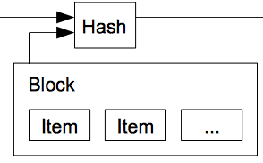
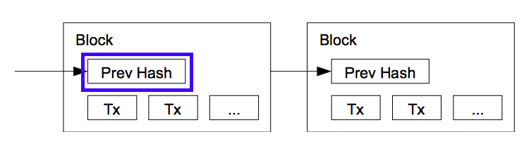
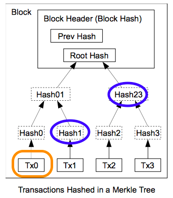
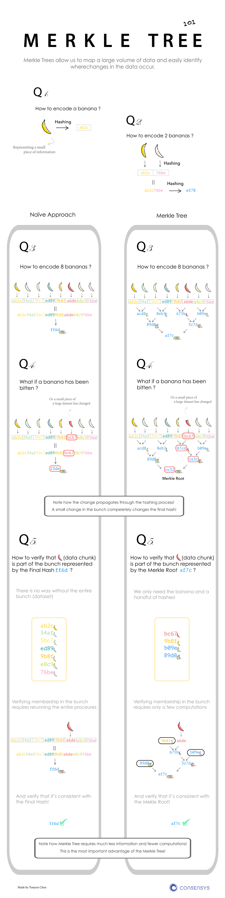
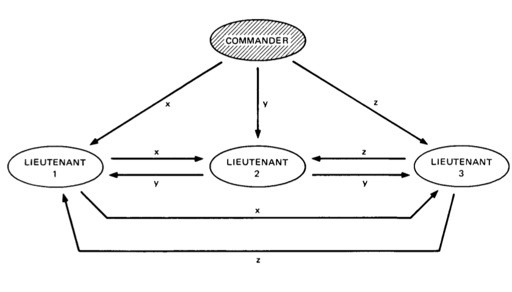

# Satoshi's paper

# Blockchain

The name “blockchain” is derived from the fact that new information can only be added to the file in blocks that refer to their predecessor in the chain.

BREAKING DOWN 'Blockchain'
A block is the ‘current’ part of a blockchain, which records some or all of the recent transactions. Once completed, a block goes into the blockchain as a permanent database. Each time a block gets completed, a new one is generated. There is a countless number of such blocks in the blockchain, connected to each other (like links in a chain) in proper linear, chronological order. Every block contains a hash of the previous block. The blockchain has complete information about different user addresses and their balances right from the genesis block to the most recently completed block.

The blockchain was designed so these transactions are immutable, meaning they cannot be deleted. The blocks are added through cryptography, ensuring that they remain meddle-proof: The data can be distributed, but not copied. However, the ever-growing size of the blockchain is considered by some to be a problem, creating issues of storage and synchronization.

## Block hash
Block contains all transactions. Now this block includes the hash value in its header for all transactions inside it.

{width=45%}

In a blockchain, the database is distributed and every participant has a copy of this block. They can easily verify if the hash of the transactions in a block matches with the header.

## Block chain
The next block contains the previous block's hash

{width=45%}

In blockchain, once a block is made, the hash header of this block is passed on to the next block as an input. Linked blocks
With this link, in a blockchain, if any transaction is altered or corrupted, then the hash of that block will change. Since this hash is an input to the next block, the hash of the next block also changes and so on. Thus all the blocks, subsequent to the changed block will be corrupted and this is easily verifiable by others.
There is still a possibility of all future block hashes also reconstructed by a bad element.

# Merkle tree

{width=45%}

The transactions are at the leaf level. Hash of two transactions (Tx0 and Tx1) are again hashed and a non-leaf node of Hash01 is formed. Similarly Hash23, Hash45 etc are formed. A tree is formed and at the top of the tree is the Top Hash or the Root Hash.
In bitcoin the Block header contains this Root as Merkle Root.

{width=45%}

With this design, they have greatly reduced the size of the blocks that are required for a transaction user.

# Merkle tree storage
As mentioned in the paper - “A block header with no transactions would be about 80 bytes. If we suppose blocks are generated every 10 minutes, 80 bytes * 6 * 24 * 365 = 4.2MB per year. With computer systems typically selling with 2GB of RAM as of 2008, and Moore’s Law predicting current growth of 1.2GB per year, storage should not be a problem even if the block headers must be kept in memory.”

# Verification is easily

To verify that a transaction is part of a block )or a hash tree), one needs the specific transaction details and just the hash values of the higher level non branches.
To verify that Tx0 is in the block, one needs the details of
- Tx0
- Hash1 and
- Hash23

{width=45%}

More illustrative example.
https://media.consensys.net/ever-wonder-how-merkle-trees-work-c2f8b7100ed3

{width=45%}

{width=45%}

The Merkle root of block #482819 is e045b18e7a3d708d686717b4f44db2099aabcad9bebf968de5f7271b458f71c8. The root is combined with other information (the software version, the previous block's hash, the timestamp, the difficulty target and the nonce) and then run through a hash function to produce the block's unique hash: 000000000000000000bfc767ef8bf28c42cbd4bdbafd9aa1b5c3c33c2b089594 in the case of block #482819. This hash is not actually included in the relevant block, but the next one; it is distinct from the Merkle root. (See also, How Bitcoin Works.)

{width=45%}

For example, say that you wanted to verify that transaction TD is included in the block in the diagram above. If you have the root hash (HABCDEFGH), the process is like a game of sudoku: you query the network about HD, and it returns HC, HAB and HEFGH. The Merkle tree allows you to verify that everything is accounted for with three hashes: given HAB, HC, HEFGH and the root HABCDEFGH, HD (the only missing hash) has to be present in the data.

# Byzantine Generals Problem

{width=45%}

“The Byzantine Generals Problem is with a group of generals, each commanding a portion of the Byzantine army, encircle a city. These generals wish to formulate a plan for attacking the city. In its simplest form, the generals must only decide whether to attack or retreat. Some generals may prefer to attack, while others prefer to retreat. The important thing is that every general agrees on a common decision, for a halfhearted attack by a few generals would become a rout and be worse than a coordinated attack or a coordinated retreat.”

{width=45%}

The problem is complicated by the presence of traitorous generals who may not only cast a vote for a suboptimal strategy, they may do so selectively. For instance, if nine generals are voting, four of whom support attacking while four others are in favor of retreat, the ninth general may send a vote of retreat to those generals in favor of retreat, and a vote of attack to the rest. Those who received a retreat vote from the ninth general will retreat, while the rest will attack (which may not go well for the attackers). The problem is complicated further by the generals being physically separated and having to send their votes via messengers who may fail to deliver votes or may forge false votes.”

{width=45%}

The typical mapping of this story onto blockchain is that the network nodes are the generals and their digital communication system links are the messengers.

In the paper referred above, several solutions have been proposed.

# Mining

Bitcoin has successfully overcome the BFT problem by using “Proof-of-Work” or “mining”.
Proof-of-Work involves scanning for a value (nonce) that when hashed, the (block) hash begins with a specific number of zero bits.
Assuming Proof-of-work needs that the resultant hash must start with 0000. We now need to find a nonce value that would satisfy this condition. After trying many combinations, we find that a nonce value of “67068” makes the hash value of the block start with “0000”.
This process of finding the nonce value is “mining” and the first miner gets rewarded with bitcoins.
However, this process consumes enormous power for just finding a random number!

{width=45%}

{width=45%}

# 51% Attack

DEFINITION of '51% Attack'
51% attack refers to an attack on a blockchain – usually bitcoin's, for which such an attack is still hypothetical – by a group of miners controlling more than 50% of the network's mining hashrate, or computing power. The attackers would be able to prevent new transactions from gaining confirmations, allowing them to halt payments between some or all users.

Read more: 51% Attack | Investopedia http://www.investopedia.com/terms/1/51-attack.asp#ixzz4w9WzpEMX 

# Smart Contract

Smart contracts were first proposed in 1994 by Nick Szabo, an American computer scientist who invented a virtual currency called "Bit Gold" in 1998, fully 10 years before the invention of Bitcoin. In fact, Szabo is often rumoured to be the real Satoshi Nakamoto, the anonymous inventor of Bitcoin, which he has denied.

Szabo defined smart contracts as computerized transaction protocols that execute terms of a contract. He wanted to extend the functionality of electronic transaction methods, such as POS (point of sale), to the digital realm. 

In his paper, Szabo also proposed the execution of a contract for synthetic assets, such as derivatives and bonds. “These new securities are formed by combining securities (such as bonds) and derivatives (options and futures) in a wide variety of ways. Very complex term structures for payments can now be built into standardized contracts and traded with low transaction costs, due to computerized analysis of these complex term structures,” he wrote. In simple words, he was referring to the sale and purchase of derivatives with complex terms. 

Read more: Smart Contracts Definition | Investopedia http://www.investopedia.com/terms/s/smart-contracts.asp#ixzz4w9WNqQO4 

# Smart Contract 2

Read more: Are Smart Contracts the Best of Blockchain? | Investopedia http://www.investopedia.com/news/are-smart-contracts-best-blockchain/#ixzz4w9VNTv2M 

Every day presents a fresh opportunity to uncover a new application for blockchain technology. After successfully forming the backbone for a revolutionary cryptocurrency, the blockchain is bringing forth strategic evolutions across industries including logistics, web security, and even trade finance. However, nowhere is this advance more evident than its growing function as an innovative payment solution. One of the key pillars driving this rapid adoption is the embrace of smart contracts.

Simply stated, smart contracts are a form of automated contracts that use pre-defined rules to facilitate the exchange of nearly any good or service. The overarching principle is to increase the transparency of the transaction while reducing fees and allaying the potential for conflict over nonperformance. However, unlike traditional contracts, these contracts have no room for interpretation because all terms are predetermined and automatically enforced by the contract itself. (See also: Understanding Smart Contracts.)

A simple analogy for understanding the purpose would be pizza delivery. In this example, a pizzeria promises 30-minute delivery for a pie or money back guaranteed. The pizzeria would then create a smart contract with a customer ordering a pie. The customer could put the funds in escrow, and if the pizza is delivered within 30 minutes, the funds are released from escrow to the pizzeria. If the pizzeria fails to deliver on time, the money held in escrow is returned to the customer. While overgeneralized, this example readily illustrates how smart contracts can be applied across nearly any activity that requires some sort of contract to establish trust and security between parties.

Smart contracts are simply that – smart. They are very carefully designed to carry out specially designed functions and tasks without the intervention of either of the parties which could result in the breach of said contract. In the event of a breach, the contract is optimized to ensure that the other party is not damaged by the violation.

The Automation Effect
Ultimately, the embrace of smart contracts may very well owe its success to two of its key pillars: automation and the cost savings it brings. Foremost, transferring funds within a digital environment is much faster than traditional bank transfers, which can be time-consuming and costly. If digital wallets on either side of a transaction can be verified, it creates an atmosphere of trust that enables both parties to collaborate without fear of loss or the need to build confidence.

# Python

    from hashlib import sha256 as sha

    def chunks(l, n):
        """Yield successive n-sized chunks from l."""
        for i in range(0, len(l), n):
            yield l[i:i + n]

    def m_tree(transactions):
      """Takes an array of transactions and computes a Merkle root"""
        sub_t = []
        for i in chunks(transactions,2):
            if len(i) == 2:
                hash = sha(str(i[0]+i[1])).hexdigest()
            else:
                hash = sha(str(i[0]+i[0])).hexdigest()
            sub_t.append(hash)
        print sub_t
        if len(sub_t) == 1:
          return sub_t[0]
        else:
          return m_tree(sub_t)
          